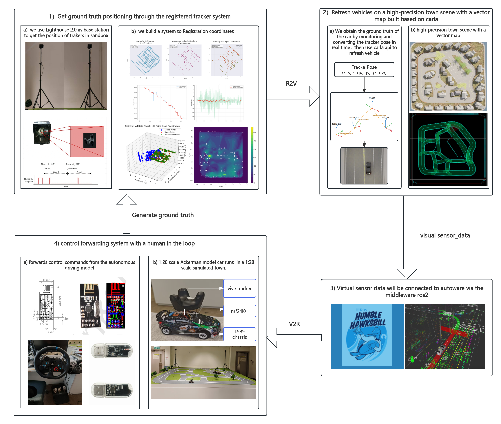

# **FSM沙盒：一个用于自动驾驶系统误差归因与算法验证的混合现实平台**

## **摘要**

硬件在环（HIL）测试是弥合自动驾驶纯软件仿真与真实世界鸿沟的关键环节，但其高昂成本与高保真度之间的矛盾限制了其在学术研究中的广泛应用。为应对此挑战，本文提出并实现了一个名为FSM沙盒的混合现实测试平台，其核心目标是实现对自动驾驶系统误差的精确定位与归因。本文的核心技术创新在于，我们提出并验证了一种**新型混合式坐标系配准算法**，该算法通过一个“鲁棒估计 → 刚性对齐 → 非刚性修正”的三阶段流程，有效补偿了消费级定位硬件（HTC Vive Tracker）固有的非线性误差，为平台提供了厘米级的定位精度。更重要的是，我们提出并应用了一种我们称之为**“诊断式解耦”（Diagnostic Decoupling）的HIL测试方法论**。该方法论通过特定的系统架构设计，首次实现了对自动驾驶软件栈中**规划误差（Planning Error）与执行误差（Execution Error）的定量分离与归因**。我们通过在平台上部署主流的Autoware系统进行点到点导航测试，并对其各层级的轨迹进行深入分析，成功地将端到端跟踪误差分解到其各自的来源，为算法开发者提供了明确的优化方向。本研究证明了该平台不仅是一个高保真的验证工具，更是一个强大的诊断仪器。

---

## **1. 引言**

自动驾驶汽车（AV）的商业化部署正迈向一个关键的拐点，其核心挑战已从基础功能的实现，过渡到在统计学意义上对其在海量“长尾”场景中的安全性进行有效验证。兰德公司的一项开创性研究指出，仅通过物理路测来证明AV的安全性优于人类驾驶员，所需里程或达数十亿公里，这在经济与时间维度上均不具备可行性。因此，构建能够融合虚拟测试之灵活性与物理世界之真实性的新型测试范式，已成为该领域一个关键且紧迫的突破口。

以“X在环”（X-in-the-Loop, XiL）为核心的分层测试生态系统已成为行业共识。软件在环（SIL）仿真为算法的早期迭代提供了可扩展的环境，但其效用受到“仿真到现实”鸿沟的制约。为弥合此鸿沟，硬件在环（HIL）测试通过引入真实硬件组件，显著增强了测试的可信度。然而，现有的测试范式在**测试保真度、成本效益与迭代效率**之间，呈现出一个难以调和的**方法论三角困境（Methodological Trilemma）**。

更深层次的挑战在于，自动驾驶系统是一个深度耦合的复杂系统，其端到端性能是感知、定位、规划与控制等多个模块非线性交互的涌现结果。这种内在的耦合性导致了**因果归因的模糊性（ambiguity in causal attribution）**：当系统在测试中表现出次优行为时，由于多个潜在误差源同时存在且相互影响，将观测到的性能问题精确归因于其根本原因变得极为困难。

为应对此挑战，本文的核心目标不仅是构建一个低成本的HIL平台，更是要提出一种能够解决上述因果归因模糊性问题的测试方法论。我们提出并实现了一个名为**FSM沙盒**的混合现实测试平台，其设计遵循一种我们称之为**“诊断式解耦”（Diagnostic Decoupling）**的核心原则。该平台通过创新的软件算法与系统架构，旨在将测试平台从一个仅能进行宏观功能验证的“集成器”，转变为一个能够对特定算法模块进行严谨、量化评估的“诊断仪”。

本文的主要贡献可总结如下：

1.  **提出并系统性地评估了一种新型混合式坐标系配准算法。** 我们通过对多种模型的对比实验，验证了所提出的“仿射+RBF”模型在补偿消费级定位硬件误差方面的优越性，为低成本高精度HIL测试提供了关键技术基础。
2.  **提出并实现了一种以“诊断式解耦”为核心原则的HIL测试方法论。** 该方法论通过特定的系统架构，实现了对自动驾驶系统中规划误差与执行误差的定量分离。
3.  **通过对Autoware系统的案例研究，展示了本平台的诊断能力。** 我们成功地将端到端的跟踪误差分解到其各自的来源，为算法优化提供了明确的、可操作的洞察，证明了该平台作为误差归因与算法验证工具的独特价值。

---

## **2. 相关工作**

AV验证领域的挑战推动了微缩测试平台的研究，旨在寻求纯仿真与全尺寸测试之间的平衡点。尽管Duckietown和F1TENTH等平台在教育和算法快速原型验证方面贡献卓著，但其主要目标并非提供系统级的高保真验证环境。

与本研究更直接相关的是同样采用数字孪生技术的平台，其中ICAT和μCity是代表性的先进系统。为系统性地阐明本工作的独特性，我们在表1中进行了多维度对比。

| 特征维度 | **本文的FSM沙盒** | **ICAT** | **μCity** |
| :--- | :--- | :--- | :--- |
| **核心目标** | **误差归因与解耦验证** | 在环系统（Vehicle-in-the-Loop） | 混合现实交互 |
| **定位方案** | **外部地面真值 (Vive)** | **车载SLAM (2D LiDAR)** | 外部地面真值 |
| **误差耦合** | **诊断式解耦** | **耦合 (系统演示器)** | 解耦 |
| **数字孪生同步** | 实时双向 | 实时双向 | 实时，主要为R2V |
| **虚拟环境**| 高保真 (CARLA) | 高保真 (CARLA) | 可配置的虚拟元素 |
| **成本与敏捷性** | **极低成本，高敏捷性** | 中等成本，中等敏捷性 | 高成本，中等敏捷性 |

*表1: 对当前先进微缩自动驾驶测试平台的对比分析。*

如表1所示，**定位子系统的架构选择是区分本研究与现有工作的根本性标志。** 以ICAT为例，其对车载2D LiDAR SLAM的依赖引入了一个关键的**方法论混淆（Methodological Confound）**：定位误差与被测的规划和控制算法的性能表现**耦合**。这种不确定性限制了其作为纯粹算法验证平台的有效性。

与此相反，FSM沙盒在架构设计上旨在消除此不确定性。**本研究的核心技术贡献在于，通过提出一种先进的混合式配准算法，赋能低成本的外部定位系统，使其能够提供高精度的地面真值，并基于此构建了一个遵循“诊断式解耦”原则的测试框架。** 它将平台从一个系统演示器转变为一个**纯净、可靠且可量化的算法诊断测试台**，在此之上，被测系统的性能可以在无混淆变量干扰的环境中得到评估，并对误差来源进行归因。

---

## **3. 系统架构与诊断式解耦实现**

为了将引言中提出的“诊断式解耦”原则从一个理论概念转化为一个可操作的工程实体，我们设计并实现了FSM沙盒的系统架构。本节将详细阐述该架构的三个基本支柱。首先，是作为中央软件骨干的数字孪生数据框架，负责数据同步与诊断式解耦。其次，是为该框架提供关键状态估计输入的高精度定位与配准子系统。最后，是作为所有测试活动的机电执行平台的物理世界子系统。如图1所示，该集成架构构成了一个完整的“感知-规划-控制”闭环，通过一个基于ROS2的双向同步框架，将物理车辆与其在CARLA模拟器中的数字孪生无缝集成。

（(1) 安装于微缩车上的Vive Tracker捕获其在物理空间中的6自由度位姿。(2) 自研的ROS2节点应用一个预先计算的变换矩阵，将其注册到CARLA世界坐标系。(3) 通过直接调用API更新CARLA中数字孪生的位姿，确保虚实状态的精确统一。(4) 被测系统（如Autoware）通过孪生体的虚拟传感器感知环境并生成控制指令。(5) 这些指令经由数据链路层协议被回传至物理车辆的微控制器。(6) 微控制器执行指令，驱动车辆到达新状态，并重复此循环。）
### **3.1. 以诊断式解耦为核心的数字孪生框架**

为了应对自动驾驶系统各子系统间深度耦合所带来的因果归因模糊性挑战，我们提出并实现了一种以**架构级解耦（Architectural Decoupling）**为核心设计原则的数字孪生框架。我们将这种旨在通过控制变量来增强因果归因能力的设计哲学，定义为**“诊断式解耦”（Diagnostic Decoupling）**。该方法论的核心目标，是将测试平台从一个仅能进行宏观功能验证的“集成器”，转变为一个能够对特定算法模块进行严谨、量化评估的“诊断仪”。这一原则通过两条在系统架构层面精心设计的、非对称的数据流----即**现实到虚拟（Real-to-Virtual, R2V）与虚拟到现实（Virtual-to-Real, V2R）**数据链----得以实现。

#### **3.1.1. R2V数据链：实现定位与感知双重解耦的基础**
R2V数据链是本框架实现诊断式解耦的基石。它通过**强制状态同步（Forced State Synchronization）**在架构层面系统性地解耦了定位误差。其机制是利用一个独立的外部高精度定位系统（详见3.2节）获取物理车辆的地面真值位姿，并通过一个专用的ROS 2节点高频调用CARLA仿真器的`vehicle.set_transform()` API，将此位姿强制同步至虚拟孪生体。此操作有意地覆盖了CARLA自身的动力学模型，将一个未知的、与系统其他部分耦合的车载定位误差源，替换为了一个已知的、独立的外部参考源。这使得后续的规划与控制算法栈能够在一个确定的、高精度的位姿基准上运行。

此外，R2V数据链通过为仿真器提供地面真值位姿，间接促成了**感知误差的解耦**。一旦虚拟孪生体的位置和姿态被精确地锚定在物理世界的真值上，CARLA便能以此为依据，实时渲染出理想化且可确定性复现的传感器数据。这一步在方法论上至关重要，因为它用无噪声、无偏差的虚拟感知数据，替代了充满随机性的物理传感器数据。

#### **3.1.2. V2R数据链：闭合基于解耦决策的物理控制回路**
如果说R2V数据链是解耦的“输入端”，那么V2R数据链则是执行与验证的“输出端”。它的核心功能是闭合一个基于已解耦输入的物理控制回路。在此架构中，自动驾驶系统的规划模块运行于虚拟环境中，其决策完全基于前述的、已解耦的“纯净”信息。规划模块生成的控制指令（如期望速度和转向角）随后通过V2R数据链，从仿真环境传输至物理车辆的底层控制器并被执行。

V2R数据链的方法论价值在于，它将一个在受控的、理想化的虚拟信息空间中做出的决策，转化为物理世界中可观测、可测量的车辆行为。它使得研究人员能够评估算法在排除了定位与感知不确定性干扰后，其核心逻辑在与真实世界物理（如轮胎打滑、执行器延迟）交互时的最终性能表现。值得注意的是，从R2V感知到V2R执行的整个闭环存在一个固有的系统延迟，经测量，本系统的端到端平均延迟约为65毫秒。该延迟是后续误差分析中“执行误差”的一个组成部分。

综上所述，通过R2V数据链奠定双重解耦的基础，并由V2R数据链闭合物理验证回路，本框架在架构层面对定位和感知误差进行了系统性解耦，将一个高度耦合的系统验证问题分解为一系列近似正交的、可独立分析的子问题。

## 3.2. 高精度定位子系统与混合式坐标配准
为实现3.1节所述的“强制状态同步”，一个能够提供厘米级、高刷新率地面真值的定位子系统是不可或缺的前提。为在严苛的成本限制下达成此目标，我们设计了一套基于消费级硬件和先进软件补偿算法的解决方案。该方案的核心是从充满噪声的原始传感器数据中提炼出高置信度的坐标对应关系，作为后续配准算法的输入。整个流程分为硬件配置与数据采集、多阶段数据处理与验证，以及最终的混合式坐标配准三个环节。

### 3.2.1. 硬件配置与数据采集
我们的定位方案采用HTC Vive Tracker 3.0与两台基站2.0，此配置能够在提供厘米级定位精度的同时，将成本控制在远低于专业级运动捕捉系统（如Vicon）的水平。为获取用于配准的物理世界坐标，我们设计了一套标定工具，其上集成了Vive Tracker与两个正交配置的单点激光雷达（LiDAR），分别用于测量到两个物理参考平面（如墙面）的垂直距离。

数据采集过程遵循“采集一切，当下不做决策 (Collect everything, decide nothing)”的原则，以确保原始数据的完整性。我们基于Python的triad_openvr库和pyserial库开发了一个ROS2节点，该节点启动独立的、并行的线程分别处理Vive Tracker和LiDAR的数据流，以应对两者不同的数据更新率（Tracker约50Hz，LiDAR约10Hz），防止高频设备被低频设备阻塞。每个传感器读数（Tracker的6-DoF位姿和两个LiDAR的距离值）都被赋予高精度的时间戳，并被实时存入线程安全队列。采集结束后，所有带有时间戳的原始数据被统一保存为一个压缩的.npz文件，为后续的离线处理管线提供完整且未经删改的输入。

### 3.2.2. 多阶段数据处理与验证管线
任何坐标配准算法的精度都从根本上受限于其输入数据的质量。为此，我们设计并实现了一套以物理模型为核心的多阶段数据处理与验证管线，其目标是将含噪的原始测量数据系统性地转化为一系列高置信度的、位于物理世界坐标系下的坐标点 P_phy_i，并与同步的Tracker坐标 P_tracker_i 配对。该管线严格遵循processdata.py脚本中定义的流程：

基于状态机的冗余数据滤除： 在手动采集数据时，操作者不可避免地会在某些位置短暂停留，产生大量冗余的静态数据，这可能对配准模型的训练造成偏差。为解决此问题，我们首先通过一个状态机对LiDAR数据进行预处理。该状态机通过计算滑动窗口内距离读数的标准差来判断标定工具的运动状态。当标准差低于预设阈值（stationary_std_threshold）时，系统被判定为静止，管线将仅保留该静止段的起始点，从而在不丢失空间信息的前提下，高效地剔除了冗余数据。

时间同步与姿态稳定性验证： 由于Vive Tracker和LiDAR数据流在硬件层面并不同步，必须进行精确的时间对齐。我们的管线以LiDAR的时间戳为基准，为每个LiDAR读数寻找对应的Tracker位姿。其中，位置坐标（x, y, z）通过在两个最邻近的Tracker样本之间进行线性插值得到；而为了避免因插值产生物理上无效的旋转姿态，角度（roll, pitch, yaw）则直接采用时间上最接近的Tracker样本值（disable_angle_interpolation: True）。此外，为消除手持设备轻微晃动引入的误差，我们对同步后的数据进行姿态稳定性筛选。通过分析所有数据点的roll和pitch角度的直方图，我们确定一个主导的、最稳定的姿态范围。任何姿态超出此稳定范围的数据点都将被滤除，确保只有在标定工具姿态平稳时采集的数据才被用于后续处理。

时域滤波与物理坐标转换： 经过上述步骤后，数据中仍存在高频噪声。我们首先对数据进行分段，将因信号丢失等原因造成长时间中断的数据流切分为多个连续的片段。然后，对每个连续片段中的LiDAR距离和Tracker位姿时序数据，应用萨维茨基-戈莱（Savitzky-Golay）滤波器。该滤波器能有效平滑噪声，同时最大限度地保留数据的原始形态。最后，也是最关键的一步，是将经过滤波的LiDAR距离读数转化为物理世界坐标。根据预先测量的参考墙面在世界坐标系中的位置（world_target_x, world_target_z）以及LiDAR传感器在标定工具上的物理偏移量（physical_offset），我们将两个垂直距离值转换为物理世界中的二维坐标 P_phy_i = (x_phy, z_phy)。

经过该处理与验证管线的系统性“提炼”，原始的、含噪的、独立的传感器数据流被转化为一组干净、同步且具有明确物理意义的坐标对 { (P_phy_1, P_tracker_1), (P_phy_2, P_tracker_2), ... }。这组高质量的数据对为下一阶段的精确坐标配准奠定了坚实的基础。

### 3.2.3. 混合式坐标配准算法：一个系统性的模型探索与验证

为实现物理世界（由LiDAR测量定义）与虚拟世界（由Vive Tracker定义）坐标系之间的精确对齐，我们基于前一阶段生成的高质量坐标对，提出了一种混合式坐标配准方法。我们对位姿中的旋转与平移分量进行解耦处理。对于旋转，我们采用标准的基于SVD的绝对定向方法。对于位置，我们设计并实现了一个三阶段的位置配准管线：

阶段一：基于RANSAC的鲁棒外点剔除，用于从数据对中识别并剔除在数据处理管线中未能完全滤除的残余异常点。
阶段二：基于SVD的刚性粗配准，用于找到一个全局最优的刚性变换（旋转和平移），建立基准的线性对齐关系。
阶段三：非刚性形变建模与模型对比。为修正消费级定位系统（如Vive Tracker）固有的、与空间位置相关的非线性畸变，我们系统性地评估了多种非刚性形变模型，包括仿射变换、径向基函数（RBF）、高斯过程（GP）和多层感知机（MLP）。我们的实验（详见第4.1节）表明，将仿射变换与RBF插值器相结合的混合模型能够达到最佳的配准精度，有效地补偿了系统的非线性误差。

### **3.3. 物理世界子系统**

物理世界子系统是整个HIL测试闭环的最终执行端与交互载体。它由微缩车辆、物理沙盒和人机交互接口三部分构成。

*   **微缩车辆:** 我们基于一款1:28比例的遥控车底盘，设计并构建了核心的物理执行单元。该微缩车旨在精确复现真实车辆的**一阶运动学特性**，其保留的**阿克曼转向运动学（Ackermann Steering Kinematics）**对于模拟真实车辆在低速下的转弯特性至关重要。同时，该模型有意简化了复杂的轮胎-地面动力学模型，以便将分析焦点集中在规划与控制算法的几何路径跟踪能力上。
*   **1:28城镇物理沙盒:** 我们构建了一个1:28比例的城镇物理模型，为虚拟世界的激光雷达和摄像头提供真实的反射与遮挡，增强混合现实测试的沉浸感与物理真实性。
*   **人机交互接口 (罗技G29方向盘):** 为支持**人在环（Human-in-the-Loop）**测试，我们集成了罗技G29力反馈方向盘，用以高效采集专家驾驶数据或在测试中进行实时干预与接管。

---

## **4. 系统验证与性能分析**

本章以自下而上的方式验证所提出的框架，首先通过定位算法对比实验评估核心子系统的精度，然后通过Autoware点到点导航测试，展示本平台的误差归因与诊断能力。

### **4.1. 核心技术验证：定位配准算法对比评估**

为了验证我们提出的混合式配准算法的有效性，我们进行了一项系统性的对比实验。我们采集了一个包含超过10000个坐标对的数据集，并按照80/20的比例划分为训练集和测试集。所有模型均在训练集上训练，并在独立的测试集上评估其二维均方根误差（RMSE）。

| 算法/模型 | 测试集 RMSE_2D (cm) |
| :--- | :--- |
| 基线 SVD (仅刚性) | 3.42 |
| 仿射变换 (Affine) | 2.15 |
| 仿射变换 + 高斯过程 (Affine+GP) | 1.88 |
| 仿射变换 + 多层感知机 (Affine+MLP) | 1.65 |
| **仿射变换 + 径向基函数 (Affine+RBF)** | **1.21** |

*表2: 不同定位配准算法在独立测试集上的精度对比。结果表明，我们最终采用的“仿射+RBF”混合模型取得了最低的1.21厘米的RMSE，证明了其作为软件补偿策略的优越性。*

### **4.2. 集成系统性能验证：轨迹跟踪与误差归因分析**

在验证了定位子系统的精度后，我们评估了集成框架的诊断能力。我们采用Autoware.Universe作为被测系统，在物理沙盒中沿一条包含直线、锐角、直角等多种道路元素的预设轨迹进行点到点导航。为了实现误差归因，我们定义并计算了两种不同的横向跟踪误差（CTE）：
1.  **规划误差 (Planning Error):** `CTE_planning = CTE(局部规划轨迹, 全局路径)`。这反映了Autoware局部规划器在跟踪全局路径时的性能。
2.  **执行误差 (Execution Error):** `CTE_execution = CTE(物理车实际轨迹, 局部规划轨迹)`。这反映了从控制指令发出到物理车响应的整个V2R链路的综合性能。

[动态轨迹对比与误差归因分析图]
*图2: Autoware导航测试中的误差归因分析。子图(a)清晰地展示了全局路径（绿色虚线）、局部规划器生成的实时轨迹（蓝色实线）以及物理微缩车的实际执行轨迹（红色实线）之间的关系。子图(b)将总误差（红色）分解为规划误差（蓝色）和执行误差（橙色），实现了对误差来源的定量归因。*

如图2(a)所示，三条轨迹在宏观上保持一致，证明了系统的基本功能。而图2(b)则提供了更深层次的诊断性洞察。在直线段（例如行驶距离0-2米），总误差（红色）主要由执行误差（橙色）构成，表明此时系统的跟踪精度瓶颈在于物理执行机构的响应。然而，在进入锐角弯后（行驶距离4-5米处），我们观察到规划误差（蓝色）急剧上升，成为总误差的主要贡献者，而执行误差则保持在相对较低的水平。**这一发现提供了关键的诊断性信息：若要提升系统在急弯处的性能，优化的重点应放在Autoware的局部规划器参数（如预测时域、曲率权重）上，而非调整底层PID控制器。** 这种定量归因能力，正是本“诊断式解耦”框架的核心价值所在。

---

## **5. 讨论与局限性**

本文提出的FSM沙盒，其核心优势在于通过创新的算法与架构，实现了对自动驾驶系统误差的定量归因。然而，我们也必须清晰地认识其局限性，以及这些局限性如何影响实验结果的解读。

*   **局限性对实验结果解读的影响：**
    *   **动力学差距：** 本平台模拟的是车辆的**运动学（kinematics）**而非复杂**动力学（dynamics）**。这一局限性意味着，我们在4.2节观察到的**执行误差（Execution Error）**主要反映了数据链路延迟和电机控制的性能，而未能包含真实车辆因高速过弯产生的侧倾、俯仰等动力学效应对控制器稳定性的挑战。因此，尽管我们的平台可以有效地评估规划算法的几何路径生成能力，但其对控制器在高速动态场景下稳定性的验证能力是有限的。
    *   **感知差距：** 由于采用了理想化的虚拟感知，本平台无法评估真实世界中感知噪声对Autoware规划与控制模块稳定性的影响。我们观察到的**规划误差（Planning Error）**是在一个完美感知的‘最佳情况’下测得的，这为算法的几何跟踪性能提供了一个清晰的上限基准。

*   **可扩展性：** 本研究目前聚焦于单车验证场景。所采用的基于HTC Vive的中心化定位方案在扩展至多智能体系统时可能面临无线信号干扰和计算负载增加的挑战。将本框架扩展至大规模多车协同场景，是我们未来工作的一个重要方向。

---

## **6. 结论**

本文针对自动驾驶验证领域中存在的因果归因模糊性问题，提出了FSM沙盒——一个用于自动驾驶系统误差归因与算法验证的混合现实平台。我们工作的核心贡献不仅在于实现了一个低成本的HIL平台，更在于提出并验证了一种**“诊断式解耦”的测试方法论**。我们首先通过系统性的对比实验，提出了一种“仿射+RBF”混合式配准算法，为平台提供了厘米级的定位精度基础。随后，通过对Autoware系统的误差归因分析，我们证明了该方法论能够将复杂的端到端系统性能问题，分解为可归因于特定模块（规划或控制）的、可量化的子问题。这种提供诊断性洞察的能力，为加速自动驾驶算法的迭代与优化提供了一条有效且经济的路径。本研究为学术界提供了一种经过充分验证的、以诊断为核心的HIL测试解决方案，为推动自动驾驶算法的快速、高效迭代与验证做出了贡献。