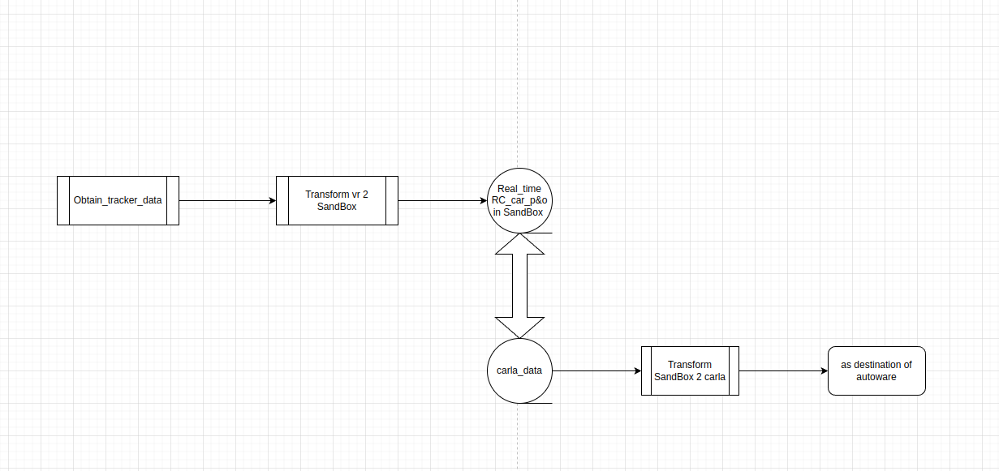

# Ideas for the project

SteamVR captures the P&O of the remote control car as the position input in Carla, achieving synchronization between the two

## Technical requirements

1. tracker data Obtain
2. transform from vr 2 SandBox
3. internet_connection between steamVR and ubuntu
4. carla design
5. data_update
6. transform_from SandBox 2 carla
7. autoware_design
8. test for errors and performance

## RoadMap

## Rapid Prototyping
