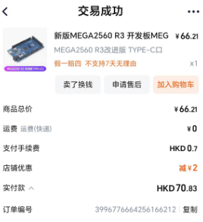
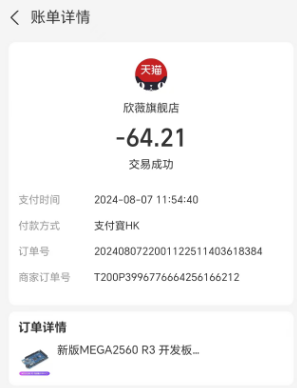
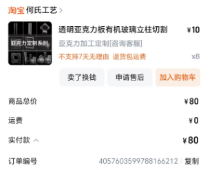
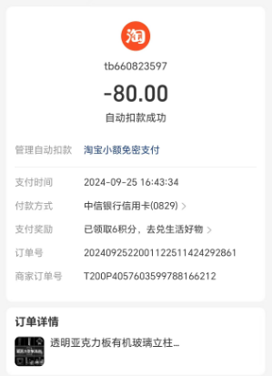
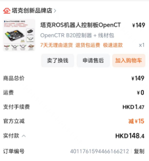
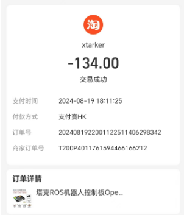
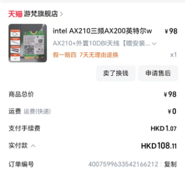
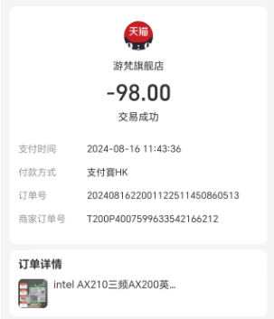
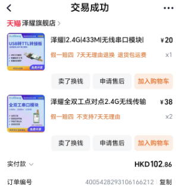
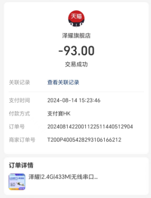

# This document shows the record of  single large expense items.

## list

|num|Name|Unit Price|Quantity|Total|Description|
|--|--|--|--|--|--|
|1|arduino_mega2560 development board|64.2|1|64.2|processing signal forwarding.(The records are shown in Figures 1-1 and 1-2.)|
|2|Car body acrylic plate|20|4|80|Car body and tracker fixing plate;The records are shown in Figures 2-1 and 2-2.|
|3|OpenCTR_B20 development board|134|1|134|Car master microcontroller.(The records are shown in Figures 3-1 and 3-2.)|
|4|intel_ax210|98|1|98|wifi chip.(The records are shown in Figures 4-1 and 4-2.)|
|5|Zeyao full-duplex wireless module | 38 | 2 | 76 | full-duplex version of 2.4G chip, for testing. (The records are shown in Figures 5-1 and 5-2.) |

## records

**The following image shows the purchase and payment history**

### 1. arduino_mega2560

    
     
    <em>Figures 1-1  Purchase history of arduino_mega2560;  file in <./img/img-2024-10-16-16-24-45.png></em>

    
     
    <em>Figures 1-2: Payment history of arduino_mega2560; file in ./img/img-2024-10-16-16-27-07.png</em>

### 2. Car body acrylic plate

    
     
    <em>Figures 2-1: Purchase history of Car body acrylic plate; file in ./img/img-2024-10-16-16-28-35.png</em>

    
     
    <em>Figures 2-2: Payment history of Car body acrylic plate; file in ./img/img-2024-10-16-16-29-23.png</em>

### 3. OpenCTR_B20

    
     
    <em>Figures 3-1: Purchase history of OpenCTR_B20; file in ./img/img-2024-10-16-16-30-31.png</em>

    
     
    <em>Figures 3-2: Payment history of OpenCTR_B20; file in ./img/img-2024-10-16-16-31-19.png</em>

### 4. intel_ax210

    
     
    <em>Figures 4-1: Purchase history of intel_ax210; file in ./img/img-2024-10-16-16-33-11.png</em>

    
     
    <em>Figures 4-2: Payment history of intel_ax210; file in ./img/img-2024-10-16-16-32-24.png</em>

### 5. Zeyao full-duplex wireless module

    
     
    <em>Figures 5-1: Purchase history of Zeyao full-duplex wireless module; file in ./img/img-2024-10-16-16-34-09.png</em>

    
     
    <em>Figures 5-2: Payment history of Zeyao full-duplex wireless module; file in ./img/img-2024-10-16-16-35-54.png</em>

