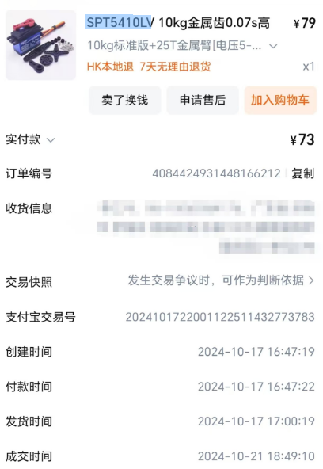
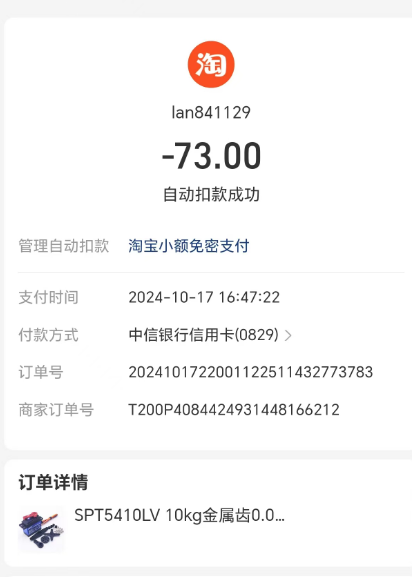
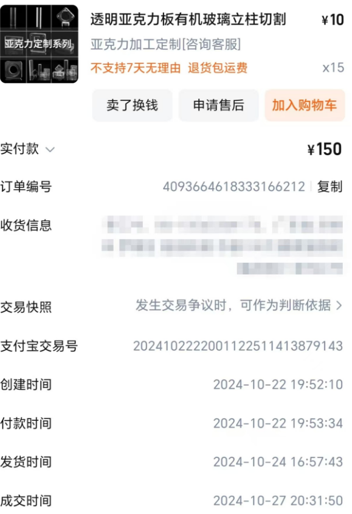
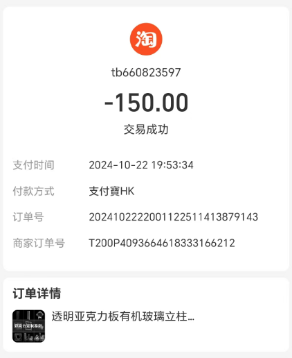
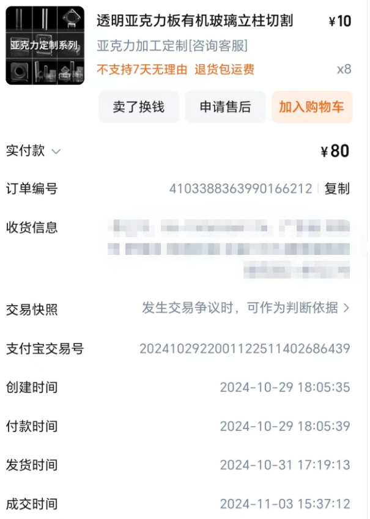
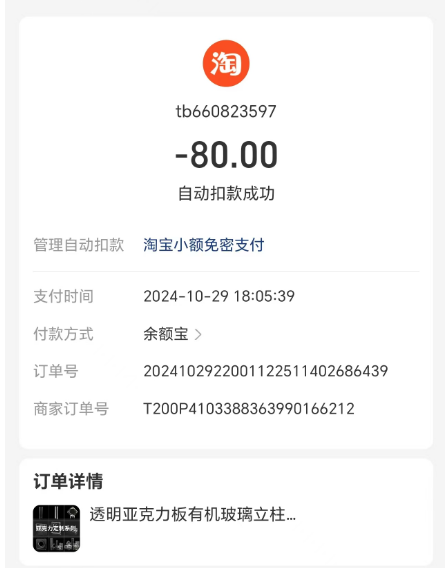

# This document shows the record of  single large expense items.

## list

|No.|Name|Unit_Price|Quantity|Item_Total|Item_ Description|
|--|--|--|--|--|--|
1|SPT5410LV High-Speed Servo|73|1 unit|73|A high-speed servo with faster response.
2|Chassis Acrylic Plate 1|20|8 pieces|150 (10 yuan discount)|First generation new car chassis, found to have certain mechanical issues after testing, needs redesign.
3|Chassis Acrylic Plate 2|20|4 pieces|80|Improved mechanical performance chassis.

## records

**The following image shows the purchase and payment history**

### 1. SPT5410LV High-Speed Servo

    
     
    <em>Figures 1-1  Purchase history of SPT5410LV High-Speed Servo;  file in <./img/img-2024-11-08-15-25-17.png></em>

    
     
    <em>Figures 1-2: Payment history of SPT5410LV High-Speed Servo; file in <./img/img-2024-11-08-17-08-46.png></em>

### 2. Chassis Acrylic Plate 1

    
     
    <em>Figures 2-1: Purchase history of Chassis Acrylic Plate 1; file in ./img/img-2024-11-08-15-51-06.png</em>

    
     
    <em>Figures 2-2: Payment history of Chassis Acrylic Plate 1; file in ./img/img-2024-11-08-17-11-41.png</em>

### 3. Chassis Acrylic Plate 2

    
     
    <em>Figures 3-1: Purchase history of Chassis Acrylic Plate 2; file in ./img/img-2024-11-08-16-32-47.png</em>

    
     
    <em>Figures 3-2: Payment history of Chassis Acrylic Plate 2; file in ./img/img-2024-11-08-17-13-40.png</em>

