# 基于混合现实的自动驾驶测试系统的系统性调研报告（专利申请前）

**报告日期：** [YYYY-MM-DD]
**调研负责人：** [姓名/团队名称]
**版本号：** V1.0

---

## 目录

1.  [引言与背景](#toc-1)
    1.1. [研究目的与范围](#toc-1-1)
    1.2. [技术领域概述](#toc-1-2)
    1.3. [相关定义与术语](#toc-1-3)
2.  [技术现状分析](#toc-2)
    2.1. [现有技术综述](#toc-2-1)
    2.2. [技术发展趋势](#toc-2-2)
    2.3. [关键技术点与难点](#toc-2-3)
    2.4. [国内外研究现状](#toc-2-4)
3.  [专利文献调研与分析](#toc-3)
    3.1. [检索策略与数据库](#toc-3-1)
    3.2. [主要专利文献概述](#toc-3-2)
    3.3. [专利技术分布](#toc-3-3)
        3.3.1. [技术功效/主题分布](#toc-3-3-1)
        3.3.2. [申请人/专利权人分布](#toc-3-3-2)
        3.3.3. [地域分布](#toc-3-3-3)
        3.3.4. [时间趋势分析](#toc-3-3-4)
    3.4. [核心专利分析](#toc-3-4)
    3.5. [专利技术路线图 (可选)](#toc-3-5)
    3.6. [专利空白点与机会点分析](#toc-3-6)
4.  [非专利文献调研与分析](#toc-4)
    4.1. [学术论文、期刊、会议论文](#toc-4-1)
    4.2. [行业报告、市场分析](#toc-4-2)
    4.3. [技术标准](#toc-4-3)
    4.4. [产品信息](#toc-4-4)
5.  [竞争情报分析](#toc-5)
    5.1. [主要竞争对手识别](#toc-5-1)
    5.2. [竞争对手专利布局](#toc-5-2)
    5.3. [竞争对手产品与技术分析](#toc-5-3)
6.  [风险评估与规避](#toc-6)
    6.1. [专利侵权风险评估](#toc-6-1)
    6.2. [技术壁垒分析](#toc-6-2)
    6.3. [规避设计建议 (如适用)](#toc-6-3)
7.  [结论与建议](#toc-7)
    7.1. [调研总结](#toc-7-1)
    7.2. [技术创新点与可专利性评估](#toc-7-2)
    7.3. [专利申请策略建议](#toc-7-3)
    7.4. [后续研发方向建议](#toc-7-4)
8.  [附录](#toc-8)
    8.1. [参考文献列表](#toc-8-1)
    8.2. [重要专利文献摘要或全文链接](#toc-8-2)
    8.3. [其他支撑材料](#toc-8-3)

---

## 1. 引言与背景 

### 1.1 研究目的与范围 
*   **研究目的：** 本次调研旨在系统性回顾与分析混合现实（Mixed Reality, MR）技术在自动驾驶汽车（Autonomous Vehicles, AVs）及高级驾驶辅助系统（Advanced Driver Assistance Systems, ADAS）测试领域的最新进展、应用、局限性及未来研究方向。重点关注MR如何应对现有测试方法的挑战，特别是在弥合仿真与现实世界差异（reality gap）方面。
*   **研究范围：**
    *   **技术领域：** 混合现实技术在自动驾驶及ADAS测试中的应用，特别关注车辆/代理（agent/vehicle）的应用
    *   **时间范围：** 近5-10年
    *   **地域范围：** [专利检索的主要国家/地区，例如：中国、美国、欧洲、日本、韩国、WIPO(PCT)等。]

### 1.2 技术领域概述 
[简要介绍所研究技术领域的基本概念、发展历程、当前的重要性、主要应用场景以及未来的发展前景。]
*   **自动驾驶与ADAS发展现状：**
    *   自动驾驶汽车（AVs）从L0（完全手动）到L5（完全自动）的演进，目前L5尚未实现，驾驶员仍需监控。高级驾驶辅助系统（ADAS）在实现完全自动驾驶过程中扮演关键角色，旨在增强车辆安全和驾驶效率（如自adaptive cruise control, collision avoidance, pedestrian detection）。([MR综述 Section I])。
    *   自动驾驶汽车的架构分层（感知层、决策层、导航层、执行层）需要不同类型的测试程序。感知层验证可使用硬件在环(HiL)测试，其他三层则需要路试或仿真。
        *   (An autonomous vehicle consists of several layers in architectural terms: Perception Layer, Decision Layer, Navigation Layer and Action Layer. These layers require different types of testing procedures. The perception layer is responsible for processing the data measured by the vehicle’s vision sensors (LiDaR, Radar). For verification, Hardver-in-the-Loop (HiL) tests can be used. The verification of the three other layers require test drives or simulations.)
    *   目前在自动驾驶测试领域，常用的测试方法有：仿真测试（SIL）、硬件在环（HIL）、整车在环（VIL）、实车测试等。
*   **自动驾驶测试方法概述：**
    *   **仿真测试(Software in the loop, SIL)：** 完全在仿真软件中进行的测试，通常用于算法或控制逻辑的早期验证。
    *   **整车在环 (Vehicle in the loop, VIL)：** 将真实的车辆（通常在台架上）接入仿真环境中，车辆的执行器响应虚拟环境的输入。（用实车替代车辆动力学模型，在实验室环境测试。）例如，文献[2]中用底盘测功机模拟道路交互，机器人车辆模拟障碍车；文献[3]采用可转向底盘测功机测试LKA和ACC；文献[4]基于VIL测试交叉口自动驾驶车辆交通管理。
    *   **实车场地测试与实车道路测试：** 成本高、周期长、危险性高、难以覆盖所有边缘场景。
*   **传统仿真工具的局限性 (源自 "VIVUS论文 Section I")：**
    *   标准仿真工具与真实条件存在差距，因为它们通常简化车辆/传感器物理模型和道路拓扑。
        *   (The main problem of standard simulation tools is their distance with real conditions since they generally simplify vehicle/sensors physical models and road topology.)
    *   虚拟摄像头通常简化为无畸变仿真的针孔模型，车辆模型不考虑任何动态特性和/或轮胎-道路接触（特定汽车工业工具如Calas除外）。
        *   (Virtual cameras are generally reduced to a simple pinhole model without distortion simulation and vehicle models do not take into account any dynamical characteristics and/or tyre-road contact excepted in specific automotive industry tools such as Calas for instance.)
    *   一些工具（如Pro-Sivic）专注于虚拟传感器的质量，在传感器仿真中引入了水汽（雨滴）和其他类型的扰动（雾等）。
        *   (Some other tools such as Pro-Sivic are focused on the quality of the virtual sensors having introduced hydro-meteor (rain drops) and other kind of perturbations (fog, etc.) in the sensors simulations.)
    *   许多实验室的模拟器各自专注于特定方面，如元件间的机械连接、电气设计、队列控制或人机工程学考虑。
        *   (Many laboratories simulators are also exiting focusing each on one specific aspect such as mechanical link between elements, electrical conception, platoon control or ergonomic considerations.)
*   **标准化通信接口在测试中的重要性 (源自 "基于SENSORIS的混合现实汽车测试论文 Section 1")：**
    *   来自不同OEM的车辆将拥有一个通用接口与测试系统通信。在汽车测试中使用标准通信协议至关重要，因为它能够实现不同OEM和供应商产品之间的接口对接。
        *   (Furthermore, vehicles from different OEMs will have a common interface to communicate with a test system. Using standard communication protocols in automotive testing is essential as it enables interfacing between the products of different OEMs and suppliers.)
    *   自动驾驶汽车配备各种传感器，持续测量车辆状态、位置和环境。在其他车辆或基础设施元素之间共享这些数据是增加互联性，从而提高自动驾驶能力的一种有吸引力的方式。
        *   (Automated vehicles are equipped with various sensors continuously measuring vehicle states, position, and the environment (perception). Sharing this data among other vehicles or infrastructure elements is an appealing way to increase connectedness, thus improving self-driving capabilities.)
    *   SENSORIS和ADASIS标准分别旨在为无线通信对象检测和高清地图数据定义数据结构。
        *   (The standards SENSORIS and ADASIS (Advanced Driver Assistance Systems Interface Specifications) aim at defining data structures for wirelessly 
*   **自动驾驶测试的挑战：**
    *   AVs/ADAS面临的普遍挑战：道德伦理、模型鲁棒性（应对天气、路况变化）、网络安全、以及巨大的测试里程需求（例如，MR综述提及可能需要140亿公里以证明可靠性）。([MR综述 Section I])
    *   现有测试方法的局限性：  
        *   **仿真测试(Software in the loop, SIL)：** 虽然成本低、效率高、可重复，但仿真模型（传感器、车辆动力学、交通环境）与真实世界之间存在“现实差距”（reality gap），导致基于仿真数据训练的模型泛化能力不足。([MR综述 Section I], [VIMS论文 前言])
        *   **整车在环 (Vehicle in the loop, VIL)：** 虽然成本降低，但在进行高危场景测试时，仍然存在较高的成本与风险，且依旧难以覆盖所有边缘场景
        *   **实车场地测试与实车道路测试：** 成本高、周期长、危险性高、难以覆盖所有边缘场景。
        *   **现有V2X协同感知数据集的不足**：公开数据集稀少，如DAIR-V2X仅包含单智能车和单智能路侧数据，忽略多智能车场景；V2V4Real未进行智能路侧数据收集；V2V-SIM不包含图像信息且不支持V2I；OPV2V和V2X-Sim虽生成V2V/V2I数据，但传感器模型和场景渲染真实性仍有提升空间 (VIMS论文 表1)。
        *   **单机式仿真测试平台的瓶颈**：在处理面向车路协同的大计算量、多模块交互场景时，受限于单台计算机的计算资源和扩展性，效率低下，难以实现水平扩展，且应用多集中于智能车，缺乏面向车、路、图协同机制的平台。
*   **Sim2Real的挑战：** 现有方法通常先在仿真中学习，然后迁移到真实世界（Sim2Real）。由于仿真与真实世界条件（如车辆动力学和传感器数据）之间的差异，这种迁移具有挑战性。尽管在该领域取得了实质性进展，但在自动驾驶汽车上直接执行不成熟策略仍存在安全问题，当多辆自动驾驶汽车共享同一工作空间时，这些问题会加剧。
        *   (These adversities call for learning that first takes place in simulation, before transferring to the real world. This transfer, often referred to as sim2real, is challenging due to discrepancies between conditions in simulation and the real world (such as vehicle dynamics and sensor data). Despite substantial advances in this field, the problem of executing immature policies directly on an autonomous vehicle still raises considerable safety concerns. These concerns are exacerbated when multiple autonomous vehicles share the same workspace, risking collisions and un-reparable damage.)
*   
*   **发展历程：** 自动驾驶技术在过去几十年从实验概念发展到可在公共道路使用的技术。MR技术在机器人（人形机器人抓取、移动机器人导航）中已有早期应用，后扩展至自动驾驶车辆测试。
*   **重要性与应用：**
    *   AVs/ADAS面临挑战：道德伦理、模型鲁棒性（天气、路况）、网络安全、巨大的测试里程需求（如140亿公里）。(该文献 Section I)
    *   现有测试方法（仿真、真实路测）的局限性：仿真与现实的“现实差距”（reality gap）。(该文献 Section I)
    *   MR的潜力：确保更安全的实验，使车辆能与物理和虚拟对象同时交互，复制关键场景以帮助车辆学习适应。(该文献 Abstract, Section I) MR在教育、医疗、建筑、机器人等领域已有应用。(该文献 Section II.B)
*   **新兴测试技术方向 (源自 "VIVUS论文" 对混合仿真的论述)：**
    *   **混合仿真 (Hybrid Simulation):** 为提高仿真质量，通常需要在回路中引入硬件。这种方法包括“仿真回路中的硬件” (Hardware in the Simulation Loop) 和/或“硬件实验回路中的软件仿真” (Software Simulation in the Hardware Experimental Loop)。
        *   (“work-in-progress” adaptation of IRTES/SeT-Lab simulation tool named VIVUS ... so as to be able to introduce hybrid simulation. Hybrid simulation consists in both introducing hardware in the simulation loop and/or software simulation in the hardware experimental loop.)
    *   “仿真回路中的硬件”在文献中已广为人知，但“硬件实验回路中的软件仿真”则较少见。后者允许例如模拟虚拟传感器检测移动障碍物并将数据发送给真实车辆，真实车辆根据其嵌入式算法行动。
        *   (If the first kind of simulation is well known in literature, the second aspect is more scarcely represented. This approach allows for instance, to simulate a virtual sensors detecting a moving obstacle and sending data to a real vehicle that will behave following its embedded algorithms (cf. Figure 1).)
*   **协同仿真(Co-Simulation)的需求与ROS的应用 (源自 "ROS协同仿真架构论文 Section I, II")：**
    *   当前研究表明，连接仿真模型能够在新兴的HAD领域（如人为因素、弱势道路使用者VRU安全）探索新发现。为提供高效的耦合，需要概念和框架来连接交通情境各个方面的模型。
        *   (Current research shows that the linking of simulation models enables the exploration of new findings in the field of HAD, such as human factors or vulnerable road user (VRU) safety. To provide an efficient and effective coupling, concepts and frameworks are therefore required to link models for individual aspects of traffic situations.)
    *   许多现有方法基于两个模型的双边耦合，而集成多个模型能从不同领域专家的知识中获得更全面的真实感。尤其从学术角度看，需要能够快速实现这些耦合的概念和框架。开源框架可能有助于这些模型的开发和连接。
        *   (Many approaches are currently based on a bilateral coupling of two models, futhermore, the integration of multiple models offers a comprehensive realism resulting from different domain expertises. Especially from an academic point of view, concepts and frameworks are needed that allow a fast implementation of these couplings. Open source frameworks might facilitate the development and linking of these models.)
    *   机器人操作系统(ROS)通常用于自动驾驶原型车，而本文提出一种方法，将ROS用作灵活协同仿真架构的核心，以挑战自动驾驶系统。
        *   (Where most use ROS for AD prototypes, we hereby propose an approach to use ROS as the core of a flexible co-simulation architecture to challenge the AD systems.)
    *   **现有协同仿真相关工作：**
        *   存在多种商业（如VIRES VTD, IPG CarMaker）和开源（如CARLA, Gazebo）仿真框架。
        *   双边耦合常见于交通流与车辆动力学仿真（如SUMO与Gazebo的ViL耦合），或仿真环境与行人仿真（如VTD与MomenTUM）。
        *   ROS通常作为接口而非测试系统基础被使用（如用于CoInCar-Sim集成AV算法）。
        *   统一模型连接和通信的尝试包括IEEE DIS标准、功能样机单元(FMU)、分布式协同仿真协议(DSP)以及开放仿真接口(OSI)。
    *   据作者所知，尚无方法使用ROS作为底层协同仿真架构来实现一个仿真框架，该框架能够集成不同交通参与者的任意行为模型，并同时集成真实实体和虚拟模型。
### 1.3 相关定义与术语 
*   **Mixed Reality (MR):** 真实世界和虚拟世界对象共同呈现在一个显示界面中的环境，是虚拟连续谱的中间地带。(该文献 Section II.A, [13])
*   **Augmented Reality (AR):** 真实环境被虚拟对象所增强，虚拟元素叠加在真实世界上，交互主要限于真实环境中的虚拟对象。(该文献 Section II.A, [14])
*   **Augmented Virtuality (AV):** 虚拟世界中包含真实对象。(该文献 Section II.A)
*   **Virtual Reality (VR):** 完全由计算机生成的沉浸式环境。
*   **X-in-the-Loop (XiL):** 一种利用虚拟环境进行测试和验证的框架，X可指软件(SiL)、硬件(HiL)、车辆(ViL)、场景(SciL)。(该文献 Section II.C, [6])
    *   **Scenario-in-the-Loop (SciL):** 可视为MR框架的一种，真实车辆和路面，部分交通控制组件可实际放置，同时引入虚拟对象。(该文献 Section II.C, [34])
*   **Reality Gap:** 仿真模型与真实世界环境之间的差异，可能源于动力学、传感器读数、路况等的不同。(该文献 Section I, [7])
*   **Digital Twin:** 物理系统（车辆或机器人）的虚拟实例，持续更新其性能、维护和健康状态数据。(该文献 Section III.D, [56])
*   **[VIMS论文] VIMS (Vehicle-Infrastructure-Map System):** 一种面向车-路-图协同的分布式自动驾驶仿真平台。
*   **[VIMS论文] 高精地图 (High-Definition Map):** 在车路协同自动驾驶中的基础设施，提供地理、几何、语义等先验信息，弥补感知盲区，实现协同高精度定位，为多源传感器提供统一时空标准。([VIMS论文 前言, Section 2.2])
*   **[VIMS论文] ROS (Robot Operating System):** 机器人分布式框架，在VIMS中用于实现模块间通信和分布式计算环境。
*   **[VIMS论文] 分布式计算 (Distributed Computing):** 将计算任务分散到多个计算单元处理，以提高效率和可扩展性。
*   **数字孪生测试 (Digital Twin Test) ：** 真实车辆行驶在真实测试场地中，同时与虚拟的测试环境进行有效映射与结合。它通过将物理模型和传感器虚拟数据在孪生空间中实现实时映射，构成了仿真空间与现实空间的沟通桥梁。
*   **软件在环 (Software in the loop, SIL) ：** 完全在仿真软件中进行的测试，通常用于算法或控制逻辑的早期验证。
*   **硬件在环 (Hardware in the loop, HIL) ：** 将真实的硬件控制器接入仿真环境中，与虚拟的车辆和环境模型进行交互测试。
*   **混合仿真 (Hybrid Simulation) ([VIVUS论文 Section I]):** “包括将硬件引入仿真回路和/或将软件仿真引入硬件实验回路。”
*   **整车在环 (Vehicle in the loop, VIL) ：** 将真实的车辆（通常在台架上）接入仿真环境中，车辆的执行器响应虚拟环境的输入。（用实车替代车辆动力学模型，在实验室环境测试。）例如，文献[2]中用底盘测功机模拟道路交互，机器人车辆模拟障碍车；文献[3]采用可转向底盘测功机测试LKA和ACC；文献[4]基于VIL测试交叉口自动驾驶车辆交通管理。
*   **亚尔勃斯（Albers）投影 ([数字孪生论文 Section 2.1.1])：** 一种正轴圆锥投影方法，用于将地理坐标系（经纬度）转换为笛卡尔坐标系，以实现实车运动轨迹在虚拟场景中的映射，适用于中低纬度地区以控制形变。
*   **基于卡尔曼滤波的位姿高精度优化技术 ([数字孪生论文 Section 2.1.2])：** 一种通过融合不同信息源（如组合惯导的局部姿态信息和虚拟姿态信息）来提高车辆运动姿态映射精度的方法，通过卡尔曼滤波不断修正被测车辆的姿态信息。
*   **Autonomous Intersection Management (AIM)** ([AIM-MR Paper Section II]): A reservation-based intersection control protocol where vehicles "call ahead" to reserve space-time in the intersection. It involves driver agents controlling vehicles and an arbiter agent called an intersection manager at each intersection. The manager grants or rejects reservation requests based on an intersection control policy.
自主交叉口管理 (AIM) ([AIM-MR论文 Section II])： 一种基于预订的交叉口控制协议，车辆通过“提前呼叫”来预订交叉口内的时空区域。它涉及控制车辆的驾驶员代理和位于每个交叉口的称为交叉口管理器的仲裁代理。管理器根据交叉口控制策略批准或拒绝预订请求。
*  **Reservation Tiles** ([AIM-MR Paper Section II, Fig. 2]): In AIM, the intersection is divided into a grid of reservation tiles. The intersection manager simulates a vehicle's path and determines which tiles will be occupied (including safety buffers) at each simulated time step.预订格位 (Reservation Tiles) ([AIM-MR论文 Section II, Fig. 2])： 在AIM中，交叉口被划分为预订格位的网格。交叉口管理器模拟车辆的路径，并确定在每个模拟时间步车辆将占用的格位（包括安全缓冲区）。
*  **Safety Buffers (in AIM)安全缓冲区** ([AIM-MR Paper Section II]): Used by the intersection manager to ensure safe traversal. Types include: 由交叉口管理器使用以确保安全通行：
   *   Static Buffer静态缓冲区: A constant sized buffer around the vehicle (e.g., for GPS error).车辆周围固定大小的缓冲区（例如，用于GPS误差）。
   *   Internal Time Buffer内部时间缓冲区: Adds a buffer in the direction of travel, allowing a vehicle to arrive early or late by a certain duration.在行驶方向上增加一个缓冲区，允许车辆提前或延迟一定时间到达。
   *   Edge Time Buffer边缘时间缓冲区: Creates a time gap at the edge of the intersection, preventing vehicles from exiting too close to the previous vehicle.在交叉口边缘创建一个时间间隙，防止车辆驶离时过于靠近前车。
*   **VIVUS (Virtual Intelligent Vehicle Urban Simulator) ([VIVUS论文 Section I]):** IRTES/SeT实验室开发的仿真工具名称。
*   **网联自动驾驶汽车 (Connected and Automated Vehicle, CAV)** ([AR CAV测试环境论文 Abstract, Section I]):具备网联和自动化功能的车辆 
*   **背景交通 (Background Traffic)**([AR CAV测试环境论文 Abstract, Section I]):与真实测试CAV互动的模拟车辆。
*   **路侧处理器 (Roadside Processor, RSP)** ([AR CAV测试环境论文 Section II]):负责接收和处理来自基础设施设备的数据，将处理后的信息发送到仿真平台和数据管理组件；同时接收来自仿真平台的数据并转发给基础设施设备。
*   **路侧单元 (Roadside Unit, RSU)** ([AR CAV测试环境论文 Section II]):用于基础设施的DSRC通信设备。
*   **专用短程通信 (Dedicated Short Range Communication, DSRC)** ([AR CAV测试环境论文 Section II]):用于V2X的无线通信技术。
*   **信号相位与配时 (Signal Phase and Timing, SPaT)** ([AR CAV测试环境论文 Section II.B]):包含交通信号灯信息的报文。
*   **基本安全消息 (Basic Safety Message, BSM)** ([AR CAV测试环境论文 Section II.B]):包含车辆状态信息（如位置、速度等）的报文。
*   **模拟基本安全消息 (Simulated BSM, sBSM)** ([AR CAV测试环境论文 Section II.C]):由仿真中的虚拟车辆生成的BSM。
*   **触发式交互机制 (Trigger-based interaction mechanism)** ([AR CAV测试环境论文 Section II.A]):
虚拟CAV在仿真中位置的更新可能会触发VISSIM中的测试事件。
*   **Sleepwalker框架 (Sleepwalker Framework) ([Sleepwalker框架论文 Abstract]):**
    *   一个通过混合现实LiDAR激励来验证和确认自动驾驶汽车的框架。
*   **混合现实激光雷达激励 (Mixed Reality LiDAR Stimulation) ([Sleepwalker框架论文 Abstract]):**
    *   用真实和虚拟LiDAR数据结合的方式来激励自动驾驶汽车的传感器。
*   **近传感器层面 (Sensor-close level) ([Sleepwalker框架论文 Abstract, Section I]):**
    *   指在自动驾驶汽车处理流程的非常早期，接近原始传感器数据的层面进行激励或评估。
*   **增强环境模型/混合现实环境模型 (Augmented Environment Model / Mixed Reality Environment Model) ([Sleepwalker框架论文 Abstract, Section I]):**
    *   自动驾驶汽车基于混合的（真实的+虚拟的）传感器数据所构建的环境模型。
*   **多层建模过程 (Multi-layer Modeling Process) ([Sleepwalker框架论文 Section I, III.B, Fig. 4]):**
    *   一种将测试场景划分为虚拟和真实多层结构（静态环境层、半静态层、动态层）的过程，用于场景增强。
*   **增强策略 (Augmentation Strategy) ([Sleepwalker框架论文 Section III.D]):**
    *   指融合真实和虚拟传感器数据（激光扫描）以生成增强激光扫描的三种不同方法：
        *   替换策略 (Replacement-Strategy): `fa(θ, ψ) = fv(θ, ψ)`
        *   最小值策略 (min()-Strategy): `fa(θ, ψ) = min (fv(θ, ψ), fr(θ, ψ))`
        *   δ策略 (δ-Strategy): 若虚拟激光扫描击中感兴趣对象，则用虚拟值，否则用真实值。
*   **代理驱动程序 (Proxy Driver) ([Sleepwalker框架论文 Section IV]):**
    *   一个软件组件，允许在未经处理的传感器数据被车辆内部融合单元处理前，对其进行检查和修改。
*   **CoCar (CoCar实验车) ([Sleepwalker框架论文 Section V]):**
    *   FZI研究中心的实验用自动驾驶汽车之一。
 **混合现实强化学习 (Mixed Reality Reinforcement Learning) ([多车混合现实强化学习论文 Abstract, Section 1]):**
    *   一种强化学习方法，其中学习代理（如真实车辆）在混合现实环境中进行训练，该环境包含真实和虚拟元素，允许在虚拟域中安全地模拟和学习碰撞等危险事件。
*   **Sim2Real (从仿真到现实) ([多车混合现实强化学习论文 Section 1]):**
    *   指将在仿真环境中学习到的策略或模型迁移到真实世界机器人或系统上应用的过程。
*   **在线策略自适应 (Online Policy Adaptation) ([多车混合现实强化学习论文 Abstract, Section 1]):**
    *   在真实世界（或混合现实）环境中，根据实时交互和经验持续调整和改进学习策略的过程。
*   **DeepRacer机器人 (DeepRacer Robot) ([多车混合现实强化学习论文 Section 4.1, Fig. 1]):**
    *   一款1/18比例的自动驾驶赛车平台，本文用作实验中的真实车辆。
*   **高层控制策略 (High-level control policy) ([多车混合现实强化学习论文 Section 3, 4.3]):**
    *   负责车辆的换道决策和速度调节，是本文中通过强化学习要学习的策略。
*   **低层控制器 (Low-level controller) ([多车混合现实强化学习论文 Section 3, 4.3]):**
    *   负责执行高层策略发出的指令，如保持车道中心和目标速度，通常使用PID或PD控制器。
*   **智能驾驶模型 (Intelligent Driver Model, IDM) ([多车混合现实强化学习论文 Section 4.3]):**
    *   一种用于模拟车辆纵向（前后）驾驶行为的跟驰模型，用于背景虚拟交通。
*   **MOBIL变道模型 (MOBIL lane-changing model) ([多车混合现实强化学习论文 Section 4.3]):**
    *   一种用于模拟车辆横向（换道）驾驶行为的模型，旨在最大化车辆加速自由度同时考虑周围车辆利益和安全，用于背景虚拟交通。
*   **演员-评论家方法 (Actor-Critic Method) ([多车混合现实强化学习论文 Section 5]):**
    *   一种强化学习算法框架，其中“演员”负责学习和选择动作（策略），“评论家”负责评估这些动作的好坏（价值函数）。
*   **异步优势演员-评论家 (Asynchronous Advantage Actor Critic, A3C) ([多车混合现实强化学习论文 Section 5.3]):**
    *   一种分布式强化学习算法，使用多个并行的“演员”与环境交互并异步更新全局策略。
*   **场景在环 (Scenario-in-the-Loop, SciL) ([Unity3D与SUMO混合现实测试环境论文 Section I, II.A]):**
    *   一种扩展的ViL概念，不仅包含真实车辆，还可以在虚拟环境中集成和管理多个真实的外部物体（如假人、交通标志），这些真实物体同样拥有其数字孪生。
*   **SUMO (Simulation of Urban MObility) ([Unity3D与SUMO混合现实测试环境论文 Section I, II.C]):**
    *   一款开源的微观交通流仿真软件，用于生成道路网络和虚拟交通。
*   **Unity 3D ([Unity3D与SUMO混合现实测试环境论文 Section I, II.B]):**
    *   一款流行的3D游戏引擎，本文用于测试场景的可视化和虚拟环境的构建。
*   **TraCI (Traffic Control Interface) ([Unity3D与SUMO混合现实测试环境论文 Section I, II.C]):**
    *   SUMO提供的一个接口协议，允许外部应用程序（如Python脚本）在运行时与SUMO进行交互和控制。
*   **被测车辆 (Vehicle Under Test, VUT) ([Unity3D与SUMO混合现实测试环境论文 Section I]):**
    *   指在测试环境中接受测试的真实或虚拟车辆。
*   **CAN网络 (Controller Area Network) ([Unity3D与SUMO混合现实测试环境论文 Section II]):**
    *   车辆内部常用的一种通信总线，用于各电子控制单元（ECU）之间的数据交换。本文通过CAN网络实现仿真服务器与真实测试车辆的数据交互。
*   **自动代客泊车 (Automated Valet Parking, AVP) ([AVP多车协同混合现实测试论文 Abstract, Section 1]):**
    *   一种L4级自动驾驶功能，车辆在停车场入口的下客区从驾驶员处接管，自动导航至停车位，并在用户请求后自动返回上客区。
*   **操作设计域 (Operational Design Domain, ODD) ([AVP多车协同混合现实测试论文 Section 1]):**
    *   预定义的自动驾驶系统可以安全运行的环境和场景条件。
*   **停车场管理系统 (Parking Area Management, PAM) ([AVP多C车协同混合现实测试论文 Section 2.1, Fig. 2]):**
    *   位于停车场的中央基础设施单元，负责任务规划（分配停车位或出口）、路径规划和控制协调，通过V2I与车辆通信。
*   **分布式模型预测控制 (Distributed Model Predictive Control, MPC) ([AVP多车协同混合现实测试论文 Section 1, 3.2]):**
    *   一种控制策略，其中多个车辆（或子系统）各自优化其控制输入，同时通过协调来满足全局约束和目标。
*   **混合A\* (Hybrid A\*) ([AVP多车协同混合现实测试论文 Section 1, 3.1]):**
    *   一种图形搜索路径规划算法，A\*算法的扩展，能够处理非完整约束（如车辆运动学）并生成连续路径。
*   **开放驾驶模型 (OpenDRIVE) ([AVP多车协同混合现实测试论文 Section 2.1]):**
    *   一种用于描述道路网络几何和逻辑信息的开放文件格式。
*   **Vires VTD (Virtual Test Drive) ([AVP多车协同混合现实测试论文 Section 2.1]):**
    *   一款驾驶仿真软件，用于模拟动态行为并在给定的地图环境中进行可视化。
*   **FlexRay (FR) ([AVP多车协同混合现实测试论文 Section 2.2, Fig. 3]):**
    *   一种高速、确定性的车载网络通信协议。
*   **dSPACE MicroAutoBox II (MABXII) ([AVP多车协同混合现实测试论文 Section 2.2, Fig. 3]):**
    *   一种实时硬件平台，用作车辆接口和仿真PC之间的转换器。
*   **占用栅格地图 (Occupancy Grid Map, OGM) ([AVP多车协同混合现实测试论文 Section 3.1]):**
    *   一种环境表示方法，将空间划分为网格单元，并标记每个单元是否被占用。
*   **EGO车辆 (EGO vehicle) ([基于SENSORIS的混合现实汽车测试论文 Section 2, 2.1]):**
    *   指测试场景中的主要被测车辆，通常是配备了待测试系统或传感器的真实车辆。
*   **协议缓冲区 (Protocol Buffers) ([基于SENSORIS的混合现实汽车测试论文 Section 2.3]):**
    *   一种由Google开发的语言无关、平台无关、可扩展的序列化结构化数据的方法，SENSORIS使用它来编码消息以实现高效压缩和模块化数据消息。
*   **Unity 3D ([基于SENSORIS的混合现实汽车测试论文 Abstract, Section 2.2]):**
    *   一款游戏引擎，用于创建和可视化测试场景的3D环境。
*   **RTK-GPS (Real-Time Kinematic GPS) ([基于SENSORIS的混合现实汽车测试论文 Section 2.1]):**
    *   一种高精度GPS定位技术，本文中用于EGO车辆的定位。
*   **领域专家模型 (Domain Expert Models) ([ROS协同仿真架构论文 Abstract, Section I]):**
    *   指由特定领域（如交通流、行人行为、车辆动力学）的专家开发的，用于模拟该领域特定方面的模型。
*   **客户端-多服务器架构 (Client-Multi-Server Architecture) ([ROS协同仿真架构论文 Section III.B, Fig. 3]):**
    *   一种网络架构，其中一个客户端（仿真内核）管理并与多个服务器（每个服务器代表一个行为模型）通信和协调。
*   **仿真内核 (Simulation Kernel) ([ROS协同仿真架构论文 Section III.B, Fig. 3]):**
    *   协同仿真中的核心组件，负责管理连接的模型、参数化、时间推进以及模型间的数据交换。
*   **ROS模型包装器 (ROS model wrappers) ([ROS协同仿真架构论文 Section IV, Fig. 4]):**
    *   用于将真实世界实体和各种仿真模型（如SUMO, Menge）集成为分布式ROS节点的适配器，分为同步和异步两种。
*   **重要性采样 (Importance Sampling) ([测试场安全评估框架论文 Section 3]):**
    *   一种蒙特卡洛方法中使用的技术，通过从一个不同于原始分布的建议分布中采样来提高估计效率。TSLG方法利用此理论构建关键场景库作为重要性函数。
*   **最小归一化正向增强碰撞时间 (minimal normalized positive enhanced time-to-collision, nmpETTC) ([测试场安全评估框架论文 Section 3]):**
    *   一种替代性安全指标，用于量化场景的机动挑战性。
*   **ARCAR ([ARCAR沃尔沃混合现实驾驶论文 Abstract, Introduction]):**
    *   沃尔沃汽车开发的一个基于头戴设备的混合现实体验的概念验证原型，专为在完全控制行驶车辆的驾驶员使用而设计。
*   **混合现实 (Mixed Reality, XR) ([ARCAR沃尔沃混合现实驾驶论文 Abstract, Introduction]):**
    *   一个涵盖增强现实(AR)和虚拟现实(VR)等技术的总称，指融合真实世界和虚拟世界的新环境和可视化。在ARCAR中，特指通过视频透视技术将虚拟元素叠加到驾驶员看到的真实世界影像上。
*   **视频透视 (Video Pass-Through) ([ARCAR沃尔沃混合现实驾驶论文 Abstract, Description]):**
    *   一种混合现实技术，头戴设备上的摄像头捕捉真实世界影像，经过处理后（例如叠加虚拟内容）实时显示在设备内部的屏幕上，让用户通过视频“看穿”设备感知现实。
*   **绿野仙踪测试 (Wizard of Oz, WoZ Testing) ([ARCAR沃尔沃混合现实驾驶论文 Related Work]):**
    *   一种研究方法，参与者与一个看似自主的系统互动，但实际上该系统的部分或全部功能是由一个隐藏的人类操作员（“巫师”）在幕后控制的。
*   **Varjo XR-1 ([ARCAR沃尔沃混合现实驾驶论文 Description]):**
    *   一款高端混合现实头戴设备，被用于ARCAR项目的实现，具有高分辨率视频透视和显示能力。
*   **光学运动捕捉系统 (Optical Motion Capture System) ([ARCAR沃尔沃混合现实驾驶论文 Description]):**
    *   如ARTTRACK5/C，一种通过多个光学摄像头追踪附着在物体（如头戴设备）上的反光标记点来实现高精度6自由度(6DOF)位置和姿态追踪的系统。ARCAR用其解决车内头戴设备追踪难题。
*   **光子到光子延迟 (Photon-to-Photon Latency) ([ARCAR沃尔沃混合现实驾驶论文 Description]):**
    *   指从真实世界的光线进入摄像头（第一个光子事件）到相应的图像最终显示在用户眼前的屏幕上（最后一个光子事件）所经过的总时间。低延迟对于减少晕动症和保证XR体验的真实感至关重要。

---

## 2. 技术现状分析 

### 2.1 混合现实(MR)在自动驾驶测试中的应用与技术基础

*   **MR在AV测试中的核心作用与优势：** (详见MR综述 Section III, III.A)
    *   识别和评估车辆对关键和危险场景的响应。
    *   弥合仿真与现实差距，提供更真实的测试环境。
    *   减少实验资源需求，降低真实世界测试的风险。
    *   提供成本效益高、低风险的算法和模型测试方式。
*   **MR与传统测试方法的比较：** (详见MR综述 Section III.B)
    *   相比仿真测试，MR融合虚拟与真实，感官反馈更真实。
    *   相比试验场测试，MR调整虚拟环境更灵活、成本更低。
    *   相比公共道路测试，MR更安全，场景可重复性高。
*   **MR框架的关键技术组件与实现：** (详见MR综述 Section III.C, III.D, III.E)
    *   **模拟器：** Unity3D, MATLAB, CARLA, SUMO, Gazebo, NeuralNDE等。
    *   **传感器模拟与融合：** LiDAR, 摄像头, ARUCO标签等虚拟传感器的实现，及其与真实传感器数据的融合策略 (如MR综述 Eq. 1, 2)。
    *   **数据同步与时间延迟管理：** 使用ROS等中间件，关注5G等低延迟通信技术。
    *   **MR框架架构元素：** 物理环境、物理机器人、虚拟环境、数字孪生。
*   **MR在AV/ADAS中的具体应用案例：** (详见MR综述 Section IV, Fig. 7, Table II)
    *   多车应用：交通场景模拟、列队行驶、自主交叉口管理、货物配送。
    *   ADAS应用：自适应巡航控制 (ACC)、自动紧急制动 (AEB)、自动泊车、车道变换辅助 (LCA)。

*   **MR在AV/ADAS中的应用方向 (该文献 Section IV, Fig. 7, Table II)：**
    *   **多车应用：**
        *   交通场景模拟 ([53, 57, 59-62])
        *   列队行驶 (Platooning) (该文献 Fig. 8, [29, 58, 64])
        *   自主交叉口管理 (AIM) ([41, 61])
        *   货物配送 ([66])
    *   **ADAS应用：**
        *   自适应巡航控制 (ACC) ([49, 70])
        *   自动紧急制动 (AEB) (该文献 Fig. 9, [68, 69, 71, 73])
        *   自动泊车 ([50])
        *   车道变换辅助 (LCA) (该文献提及为未来研究方向)
*   **评估技术：** (该文献 Section V)
    *   **定性观察：** 机器人与模拟对象成功交互，导航避障 (该文献 [10], Table III总结了[49]的定性评估标准)。
    *   **定量评估：** 时间延迟测量 (该文献 Fig. 10, [6, 29, 41, 58, 73])；数字孪生位姿/速度误差 ([10])；碰撞次数/率 ([53, 62])；Time-to-Collision (TTC) ([48, 51])。
    *   **建议的额外评估指标：** 感知检测指标 (AP, AR, RMSE, MAE)；安全评估指标 (MSDV, TTCV, MTTCV, PETV - 该文献 Eq. 4-10)；可扩展性指标 (Response Time - 该文献 Eq. 11, U-statistics - 该文献 Eq. 12)。
    *   **虚拟元素可靠性评估：** 主观质量评估，检索准确性，目标检测/跟踪/渲染的实时性和稳定性 ([83-86])。
    *   **MR测试到真实应用的可转移性评估：** 仿真精度验证（传感器数据保真度 [87, 88]），MR-to-Reality差异度量（改编STR Disparity [89]）。
    *   **MR结果验证：** 若用于模型训练，仍需传统验证方法 (该文献 Fig. 11)；若用于测试，MR可做预测试，但最终仍需真实世界测试确认。

### 2.2 案例分析：

#### 2.2.1 面向车-路-图协同的分布式自动驾驶仿真平台 (VIMS)
**(本节内容主要来自VIMS论文[2])**

为解决车路图协同仿真环境下单机式测试平台效率低下、系统可扩展性不足的问题，武汉理工大学等单位提出了VIMS（Vehicle-Infrastructure-Map System）平台。车路协同系统采用先进无线通信和人工智能、大数据、云计算等技术，通过全时空动态交通信息采集与融合，实现车车、车路信息交互共享，能突破单车智能感知范围有限、遮挡导致的可靠性不足，从根本上提升感知能力。

*   **VIMS平台核心设计理念：**
    *   采用松散耦合的分布式架构，将车、路、图等信息链接起来。
    *   以CARLA作为虚拟仿真引擎，Unreal Engine辅助场景构建。
    *   采用ROS分布式通信机制实现模块内部的相对独立和模块间的互联互通。
    *   通过分布式计算实现各模块间的独立计算，提升计算可靠性与可用性。
    *   引入真实高精地图和硬件在环设备（驾驶模拟器、信号机、整车等），实现虚实结合，提升仿真真实度和测试有效性。
*   **VIMS平台架构组成 (VIMS论文 )：**
    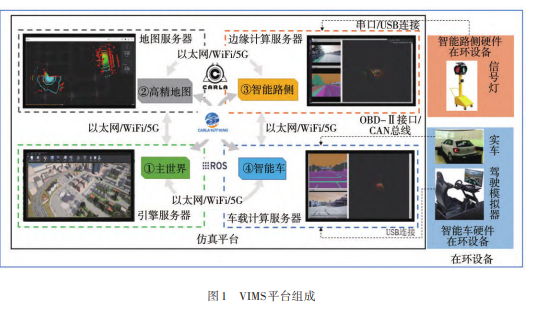
    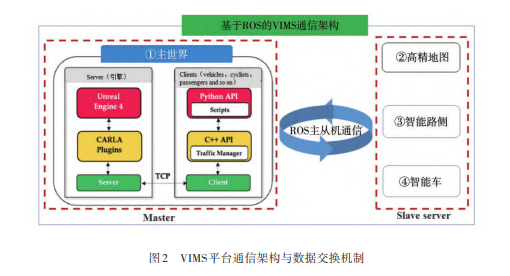
    *   **① 主世界 (Master Server)：**
        *   **功能：** 作为交通场景引擎，负责地图加载、传感器配置、模拟生成道路场景（路况、天气、交通流）、生成多视角异构传感器数据，管理仿真时间和事件，同步协调各计算单元。
        *   **实现：** Client-Server架构，Server端由Unreal Engine和CARLA组成（传感器渲染、物理计算、更新世界状态），Client端支持多用户控制actor逻辑和世界状态 (VIMS论文 Fig.3)。
    *   **② 高精地图模块 (Slave Server)：**
        *   **功能：** 提供高精度地图数据（路网、车道线、交通标志等静态信息；交通信号灯等半动态信息），将智能车、路侧的感知数据精确映射到地图上，实时更新车辆、行人等高动态信息，为车辆感知和规划（如车道级路径规划）提供超视距先验信息。
        *   **实现：** 引入真实场景高精地图。制作流程：数据采集（LiDAR, 相机, GPS, IMU）-> 数据处理（去噪、配准、过滤）-> SLAM建图（如LeGO-LOAM, LIO-SAM构建三维点云地图）-> 地图标注（路网、车道、标志等几何拓扑信息）-> 导入CARLA并用Unreal Engine添加三维模型进行场景构建 (VIMS论文 Fig.4, Fig.5)。
    *   **③ 智能路侧模块 (Slave Server)：**
        *   **功能：** 通过摄像头、LiDAR等传感器获取道路信息，数据汇聚到边缘计算单元进行融合分析，计算感知范围内交通参与者信息，并将信息按约定标准传递给智能车和高精地图。支持多路侧协同工作以扩大感知范围。可实现车流量统计、违停检测、区间测速等。
        *   **实现：** 支持信号机在环，仿真信号机模型控制虚拟信号灯，并与物理信号灯通信 (VIMS论文 Fig.6, Fig.7)。
    *   **④ 智能车模块 (Slave Server)：**
        *   **功能：** 提供多种可配置的车辆类型（乘用车、商用车、特种车）。支持自动驾驶算法和控制系统运行，通过感知传感器获取环境信息，与主世界和路侧模块通信，执行目标检测、避障、路径规划和控制。将自身状态反馈给其他单元。
        *   **实现：** 支持自动驾驶模式和手动驾驶模式（通过驾驶模拟器如罗技G29接管，遵循SAE J3016 L0-L5驾驶权切换逻辑）(VIMS论文 Fig.8, Fig.9)。
*   **VIMS平台通信与计算：**
    *   **通信：** 基于ROS（Master-Slave架构），模块通过有线/5G/WiFi连接至同一局域网，使用TCPROS/UDPROS或Nodelet进行数据交换。设计“即插即用”的交互协议和接口。
    *   **计算：** 各模块（主世界、高精地图、智能路侧、智能车）均包含独立的计算单元、通信单元和显示单元，实现分布式独立计算。
*   **VIMS平台应用验证案例：**
    *   **L2级车道保持算法仿真：** (VIMS论文 Section 3.1, Fig.10-Fig.15)
        *   **场景与配置：** 主世界设置高速公路地图和交通流，智能车安装语义相机。
        *   **算法流程：** 语义相机图像 -> 车道线边缘检测 -> 霍夫变换拟合车道线 -> 计算与预设锚点偏差 -> PID控制转向。
        *   **测试与结果：** 智能车模块订阅主世界语义相机数据（10Hz），在低/高密度交通下测试。通过转向盘按钮切换人工/自动驾驶模式。评估指标为车辆距车道中心线的偏移距离（低密度平均0.026m，高密度平均0.040m）。结果表明平台能支持L2算法的数据采集、传输和验证。
    *   **L4级车路图协同定位算法仿真 (基于STGO)：** (VIMS论文 Section 3.2, Fig.16-Fig.18, 表2)
        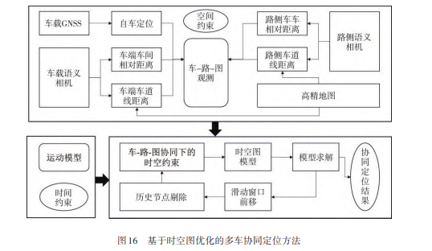
        *   **场景与配置：** 主世界设置城市道路地图，生成5辆智能网联车（均安装GNSS和语义LiDAR），路侧安装语义LiDAR。
        *   **算法流程：** 智能车模块计算GPS观测、车间距、自车与车道线距离；智能路侧模块计算每辆车位置观测、与车道线距离；数据汇总至路侧边缘计算单元，运行STGO算法求解协同定位结果；结果传输至高精地图模块进行可视化。
        *   **测试与结果：** 采用RMSE评估定位精度。STGO协同定位的平均定位误差为0.33m，较单独GNSS（10.02m）和单独路侧定位（0.64m）显著提升。结果表明平台能支持多模块协作、复杂算法的实时仿真与验证。
*   **VIMS技术难点**
    *   **[VIMS论文] 分布式系统本身的复杂性：** 多模块、多服务器间的通信管理、数据一致性、故障容错等。
    *   **[VIMS论文] 异构软硬件集成：** 不同厂商硬件与仿真软件、操作系统的兼容性与接口标准化。
    *   **[VIMS论文] 高精地图的动态更新与维护：** 真实高精地图数据采集成本高，动态信息实时更新至仿真系统存在挑战。
    *   **[VIMS论文] 大规模场景下的计算与通信瓶颈。**
*   **编者疑问：**
    *   1. VIMS的实车在环可以实现何种反馈？
    *   2. VIMS是否可以完整实现AVS过程？
    *   3. VIMS的所有信息来源均来自于虚拟环境，所有的反馈也来自虚拟环境，没有现实车辆运行信息的介入
#### 2.2.2 基于数字孪生技术的智能汽车测试平台 
**(本节内容主要来自“数字孪生论文”[4])**

为加快自动驾驶功能的开发与验证，清华大学、中国汽车工程研究院等单位提出了一种基于数字孪生的智能汽车测试与评价方法。其核心思想是：真实车辆在真实测试场地行驶，同时其状态与虚拟测试环境进行有效映射与结合，从而丰富测试环境、提高效率、降低成本。

*   **数字孪生测试系统总体框架 (数字孪生论文 Fig.1)：**
    *   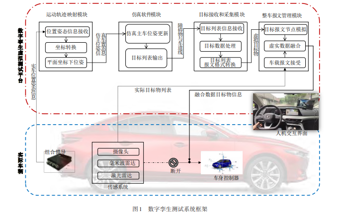
    *   **核心组成：** 实际车辆（被测对象） + 虚拟测试平台（虚拟道路环境、传感器模型等）。
    *   **工作流程：**
        1.  仿真软件模块生成虚拟场景和虚拟传感器模型。
        2.  虚拟传感器探测到的目标信息通过总线注入实车控制器。
        3.  实车控制器决策后指令发送给实际执行器。
        4.  实车运动状态（姿态、位置）通过组合惯导同步反馈给虚拟场景，更新实车在仿真场景中的映射。
        5.  实现整个系统的闭环实时仿真。
    *   **关键模块：**
        1.  **仿真软件模块：** 生成虚拟场景，建立虚拟传感器模型，输出虚拟目标信息。
        2.  **目标接收和采集模块：** 接收虚拟目标列表，进行数据处理。
        3.  **整车报文管理模块：** 将虚拟目标信息转换为实车可识别的报文格式并注入，或断开以使用实车真实传感器。
        4.  **运动轨迹映射模块：** 采集实车经纬度和姿态信息，进行坐标转换（亚尔勃斯投影）和位姿优化（卡尔曼滤波），实现真实世界到仿真场景的映射。
*   **数字孪生系统构建关键技术 (数字孪生论文 Section 2.1)：**
    *   **基于亚尔勃斯（Albers）的位置映射方法：**
        *   **目的：** 将实车采集的地理坐标（经纬度）转换为虚拟环境使用的笛卡尔坐标。
        *   **原理：** 采用正轴圆锥投影，适用于中低纬度地区，控制长距离映射形变。(数字孪生论文 Eq.1-3)
    *   **基于卡尔曼滤波的位姿高精度优化技术：**
        *   **目的：** 提高车辆运动姿态映射的精度和平滑度，解决采样频率低于姿态变化频率导致的延迟及局部姿态与整车姿态差异问题。
        *   **原理：** 融合虚拟与现实姿态信息进行姿态预测，通过卡尔曼滤波不断修正空间中被测车辆的姿态信息。(数字孪生论文 Eq.4-16)
*   **平台软硬件系统构建 (数字孪生论文 Section 2.2 - 2.4)：**
    *   **虚拟外部环境构建 (软件)：**
        *   **工具：** 51World公司的多功能虚拟仿真系统51Simone。
        *   **场景生成方式：** 1) 通过导入/编辑高精地图，自动生成三维场景；2) 针对具体场景，基于测绘数据建模或虚拟编辑创建高真实感场景 (数字孪生论文 Fig.2)。
    *   **车辆与传感器模型 (软件)：**
        *   **主车配置：** 51Simone提供基于Web的3D主车编辑器，支持导入自定义模型。
        *   **传感器支持：** 摄像头（内外参、畸变参数）、毫米波雷达（射线追踪）、激光雷达、超声波雷达、GPS/IMU、理想传感器（返回目标物位置、朝向、包围盒、速度等）。支持交互式添加、定位、参数设置和自定义扩展。
    *   **平台硬件系统构建：**
        *   **组成：** 上位机（PC/工控机）、组合惯导采集系统（如VBOX）、通信板卡（如USBCANFD接口卡）。
        *   **要求：** 硬件资源充足（高CPU、GPU性能），各硬件设备能在车载工况下稳定运行。
    *   **软硬件时间同步设计 (数字孪生论文 Fig.3)：**
        *   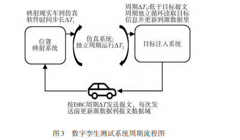
        *   **组成：** 位姿映射系统、仿真软件、目标注入系统，各系统采用独立进程解耦。
        *   **周期关系：** 位姿映射周期ΔT1，仿真软件最低运行周期ΔT2，虚拟目标注入周期ΔT3，车辆报文周期ΔT。需满足 ΔT1 + ΔT2 + ΔT3 < ΔT，以保证实时性和同步性 (数字孪生论文 Eq.17)。
*   **系统有效性验证案例 (数字孪生论文 Section 3)：**
    *   **测试功能：** 自适应巡航控制 (ACC) 和自动紧急制动 (AEB)。
    *   **对比方法：** 数字孪生测试系统 vs. 纯虚拟仿真测试。
    *   **ACC测试：** (数字孪生论文 Fig.4-9)
        *   **控制器：** 上层采用车间时距模型 (Eq.18)，下层采用双重PI控制。
        *   **工况：** 前车（虚拟）起步加速后匀速再减速停车。被测车辆为真实车辆。
        *   **结果：** 数字孪生测试结果与纯仿真结果基本一致。数字孪生测试中，由于考虑了真实车辆执行机构特性，各指标波动相对较小。
    *   **AEB测试：** (数字孪生论文 Fig.10-14)
        *   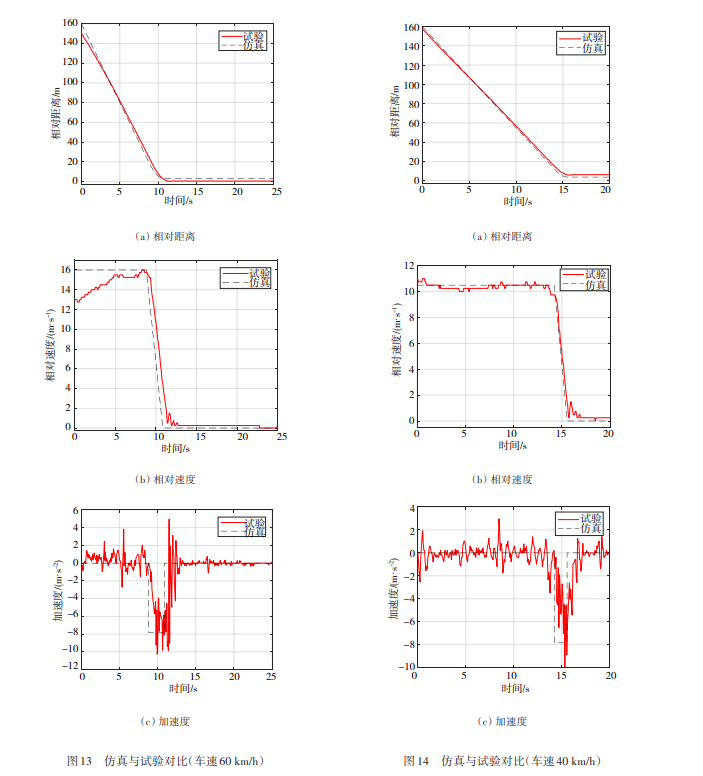
        *   **控制器：** 上层采用Honda安全距离算法 (Eq.19)，制动减速度设为路面最大值的80%。
        *   **工况：** 真实被测车辆以不同初速度（60km/h, 40km/h）匀速靠近静止虚拟障碍车。
        *   **结果：** 数字孪生测试结果与纯仿真结果总体趋势一致，停车距离因实际车速和加速度波动略有差异。
    *   **结论：** 数字孪生测试方法对智能汽车的测试有效。后续将与真实车辆测试对比，评估一致性。
    *   **编者疑问：**
        *   1. ~~疑似只是进行了理论性研究，给出的数据真实性存疑~~
        *   2. 虽然文章作者表示这是实车在环，但是从论文结果来看，有理有怀疑只是实现了硬件在环
        *   3. 测试缺乏一个系统性的评价指标
#### 2.2.3 利用混合现实测试自主交叉口管理协议 
(本节内容主要来自 "AIM-MR论文")Analysis of the Current State of Technology[6] 
为了在比纯仿真更真实的环境中验证自主交叉口管理 (AIM) 协议的有效性，并克服使用真实车队测试的高成本和高风险，德克萨斯大学奥斯汀分校的研究者们构建了一个混合现实平台。
*   **测试目标:**
    *   验证真实的自动驾驶车辆是否能够遵守AIM的FCFS协议并高效地通过交叉口。
    *   获取在真实交叉口中保证真实自动驾驶车辆安全通行的AIM控制器参数。
    *   评估在考虑真实车辆控制不精确性的情况下，AIM协议相比传统交通信号灯和停车标志的性能。

*   **混合现实平台搭建 ([AIM-MR论文 Section III.A, Fig. 3]):**
    *   **真实车辆:** "Marvin"，一辆全尺寸自动驾驶汽车。
    *   **仿真软件:** AIM 模拟器。
    *   **核心机制:**
        1.  在AIM模拟器中为真实车辆Marvin创建一个“代理车辆 (Proxy Vehicle)”。
        2.  Marvin上的驾驶员代理通过UDP与交叉口管理器（在AIM模拟器中运行）进行通信，发送预订请求。
        3.  Marvin通过其实时GPS信息，不断更新其在AIM模拟器中对应的代理车辆的位置、方向和速度。
        4.  交叉口管理器根据模拟世界中的虚拟交通状况（可生成超过100辆虚拟车以形成稳定车流）以及代理车辆的请求，决定是否接受或拒绝预订。
        5.  预订确认后，代理车辆将确认消息转发给Marvin，Marvin据此在真实世界和模拟世界中通过交叉口。
    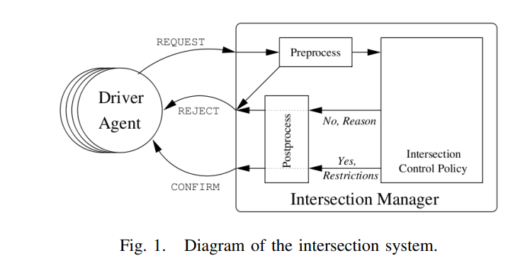
*   **参数调整与发现 ([AIM-MR论文 Section III.B, Fig. 4]):**
    *   **实际挑战:** 真实车辆的噪声和不精确性大于先前仿真中的预期。Marvin的实际加速度 (很少超过 0.5 m/s²) 远低于其技术能力 (2.5 m/s²)，且为安全起见，其实际速度可能略低于限速。
    *   **参数调整:** 为确保Marvin安全通行，需要增大了AIM协议中的安全缓冲区：
        *   静态缓冲区 (Static Buffer Size): 从默认0.25m 调整到 1m。
        *   内部时间缓冲区 (Internal Time Buffer): 从默认0s 调整到 2s。
        *   边缘时间缓冲区 (Edge Time Buffer): 从默认0.5s 调整到 4s。
        *   同时调整了车辆的最大速度 (Max Speed) 为 7.5 m/s (限速20mph约8.94m/s)，最大加速度 (Max Acceleration) 为 0.5 m/s²。
    *   **影响:** 增大缓冲区或使用更保守的车辆操作参数确实会增加车辆的平均延迟，尤其在交通流量较大时。

*   **为大缓冲区补偿性能的策略 ([AIM-MR论文 Section IV]):**
    *   **理论基础:** 利用排队论中的李特尔法则 (Little's Law: L = λW)，指出可以通过增加交叉口内平均车辆数 (L) 或减少车辆平均通过时间 (W) 来提高最大吞吐量 (λ)。
    *   **静态缓冲区大小与吞吐量 (Fig. 5):** 实验表明，增大静态缓冲区会增加平均延迟。当静态缓冲区大于2米（导致车道轨迹宽度大于车道宽度）时，延迟显著增加。
    *   **通过增加加速度减少通过时间 (Fig. 6):** 实验表明，增加车辆的最大加速度可以显著降低平均延迟并提高吞吐量。吞吐量约与最大加速度的平方根成正比。
    *   **防止车辆取消预订 (Fig. 7):** 提出一种新的到达时间和速度估计算法，该算法生成一个控制信号序列（加速度规划），确保车辆能够按估计的时间和速度到达，从而减少因无法按时到达而取消预订的情况。

*   **最终性能比较 ([AIM-MR论文 Fig. 8]):**
    *   即使使用了为真实车辆调整的较大缓冲区和保守车辆参数，改进后的FCFS（结合了优化的到达时间/速度估计）在性能上仍然优于传统的交通信号灯和四向停车标志。

*   **结论:**
    *   该混合现实平台成功验证了AIM系统，并确定了使自动驾驶车辆能够安全通过交叉口的FCFS参数。
    *   研究揭示了仿真假设与现实之间的差异，并提出了补偿策略。
    *   这项研究是朝着在密集的城市环境中用多个全自动驾驶汽车验证和测试AIM系统的长期目标迈出的重要一步。
    *   这是一个实车在环的，通过gps更新实车在虚拟环境位置与姿态的系统；但是作者仅用其进行了交叉路口管理的测试
#### 2.2.4 VIVUS - 混合虚实仿真平台及其应用
    Towards a Hybrid Real/Virtual Simulation of Autonomous Vehicles for Critical
Scenarios[7]
**(本节内容主要来自 "VIVUS论文")**

法国贝尔福-蒙贝利亚技术大学（UTBM）的IRTES-SeT实验室对其VIVUS (Virtual Intelligent Vehicle Urban Simulator) 仿真工具进行了改进，以支持针对自动驾驶汽车的混合仿真 (Hybrid Simulation)。

*   **VIVUS仿真平台架构 ([VIVUS论文 Section II, Fig.2])：**
    *   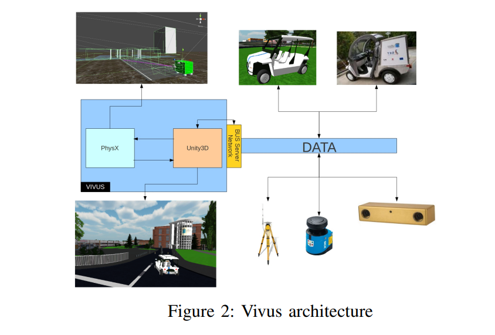
    *   **基础：** 基于Unity3D构建的3D模拟器，支持3D渲染和物理仿真。
    *   **通信：** 客户端-服务器架构。通过外部API提供服务，用于使用模拟的物品或车辆。
    *   **核心流程：** 每个仿真步骤，内核执行指令：(1) 更新项目感知；(2) 更新项目设定点；(3) 更新物理。其中“更新项目感知”和“更新项目设定点”是输入/输出访问器。
    *   **车辆模式：**
        *   **经典运动 (Classic motion)：** 基于牛顿定律，由物理引擎求解，车辆通过加速度矢量（加速度、转向角）控制。
        *   **虚拟化身模式 (Avatar mode)：** 用于传感器仿真。车辆位置和方向被直接设置（瞬移），不考虑物理定律、动力学和内部参数，但其上传感器会被正常模拟。

*   **VIVUS中模拟的元素 ([VIVUS论文 Section III])：**
    *   **车辆 (Vehicles)：** 可定制物理行为（最大加速度、速度、质量、最大转向角等）。提供了基于实验室真实实验平台SeT-Car的仿真模型（基于PhysX基本对象构成）。
    *   **传感器 (Sensors)：** 提供一系列自动驾驶车辆常用传感器，可调整3D位置、方向、频率和固有参数。包括：
        *   激光测量传感器 (LMS / Laser Range Finder)：如模拟Sick LMS 200。
        *   IBEO激光雷达：特殊激光雷达，可转换激光扫描的亮度值。
        *   GPS：提供NMEA帧。
        *   摄像头 (Camera)：可设置分辨率、帧率、焦距。
        *   里程计 (Odometry)：测量车轮转动。
        *   本体感知传感器 (Proprioceptive sensor)：提供车辆所有内部状态（速度、指令、位置等），并模拟惯性测量单元。
    *   **扰动 (Perturbations)：** 模拟可能发生的事件，影响传感器和车辆行为。包括：指令扰动（通信丢失、磁干扰）、电机扰动（引擎故障、电池放电）、车轮扰动（天气影响抓地力、轮胎问题）、传感器扰动（感知信息改变或丢失）。
    *   **度量 (Metrics)：** 用于记录仿真参数以供后续分析。包括：车间度量（用于队列算法开发）、指令完整性度量、定位度量、物理完整性度量（碰撞前最近距离、碰撞时间）。

*   **混合仿真的引入与应用 ([VIVUS论文 Section IV])：**
    *   **核心思想：** 混合真实（硬件）元素和模拟元素。VIVUS通过基于网络的中间件实现真实与虚拟实体的通信。
    *   **类别1：仿真回路中的硬件 (Hardware in the simulation loop, Fig.1 top)：**
        *   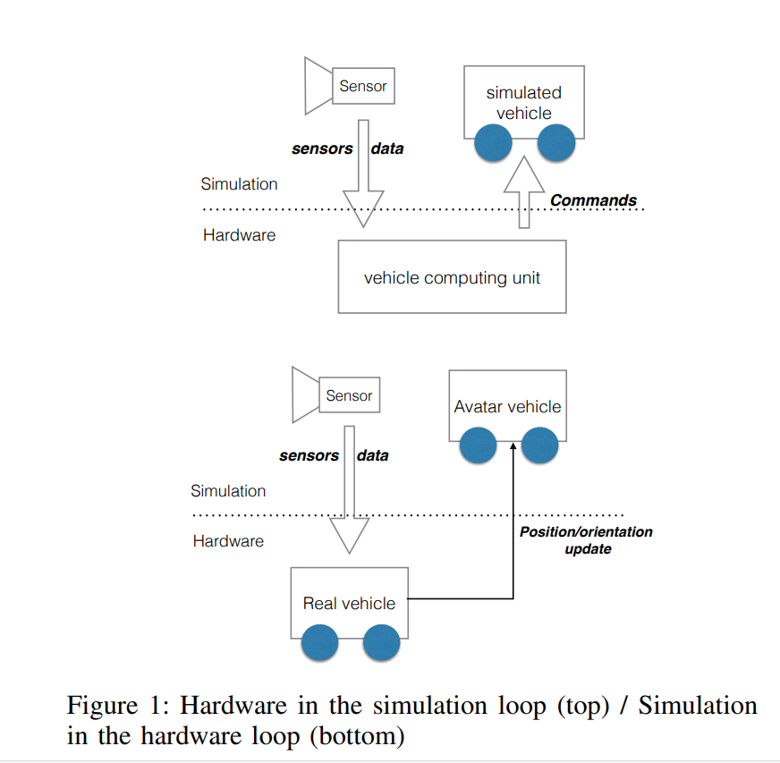
        *   **目的：** 精确模拟系统特定硬件部分的行为，常用于测试组件（执行器、CPU、嵌入式软件）、传感器集成、测量硬件处理时间、人机工程和设计验证。
        *   **VIVUS应用：** 用于验证模拟传感器模型与真实传感器的对比（输出结构、操作方式）。例如，使用光线追踪和纹理相关的镜面反射来模拟激光雷达，并与真实物体检测结果比较。
    *   **类别2：硬件实验回路中的软件仿真 (Simulations in the hardware loop, Fig.1 bottom)：**
        *   **目的：** 在关键情况下测试真实车辆的行为，如测试障碍物避免算法。能够精确再现移动障碍物轨迹和传感器层面扰动（数据丢失、错误数据、光照扰动等）的场景。
        *   **VIVUS应用：** 使用模拟传感器和真实车辆测试基于多智能体的障碍物避免算法。在虚拟世界中模拟传感器和移动障碍物，传感器数据传输给运行避障算法的真实车辆。真实车辆的行为通过厘米级RTK差分GPS跟踪，其真实位置传输回VIVUS以更新虚拟感知。此时，VIVUS的“虚拟化身模式”被用于在虚拟世界中代表真实车辆，以处理与真实车辆动力学、传感器位置和障碍物动力学相关的几何问题。这种方法优于传统使用箱子代表静态障碍物的实验。
    *   **副作用：虚拟与真实车辆协同工作 (Virtual and real vehicles working together)：**
        *   **应用：** 测试多车导航算法，如混合虚实车辆队列。
        *   **VIVUS测试实例：** 领航车是带有真实传感器的真实车辆。第一个跟随车是带有虚拟传感器的虚拟车辆，能够检测领航车的虚拟化身。第二个跟随车是带有虚拟传感器的真实车辆。
        *   **可视化：** 开发了增强现实查看器 (Augmented reality viewer)，可以在真实场地上同时观察真实和虚拟车辆 ([VIVUS论文 Fig.4])。

*   **当前挑战与未来工作 ([VIVUS论文 Section V])：**
    *   **挑战：** 真实车辆与模拟元素之间的耦合依赖于精确测量真实车辆在其真实环境中的绝对位置，目前这需要昂贵的设备（如差分GPS）。
    *   **未来工作：** 专注于解决精确定位问题，尝试使用更便宜的传感器（如惯性传感器和加速度计）并保持可接受的精度。一旦达到精度要求，将进行真实车辆与软件传感器的实验，如紧急情况下的避障、混合虚实车辆队列控制等。计划将此工具用于调整其自动驾驶车辆算法。最终目标是集成一个介于经典仿真和实验之间的中间步骤。
*   **总结**：
    *   1. 本文中提到的Avatar mode概念与我方方案的相同，均是不考虑虚拟环境（仿真引擎）中的物理定律与动力学模型，而是根据传感器对车辆的位置和方向（位姿）进行直接设定（瞬移/帧刷新）。
    *   2. 文章并没有给出一个完整的系统展示，且文章的未来展望部分提出，需进一步精确定位，并尝试用于自动驾驶车辆算法，可见系统并未完善。
#### 2.2.5 基于MR和虚拟队列控制的福祉车辆驾驶辅助及避障系统 (源自 "福祉车辆MR论文")
(本节内容主要来自 "福祉车辆MR论文")
Driving Assistance of Welfare Vehicle with Virtual Platoon Control Method which has Collision
Avoidance Function using Mixed Reality[8]
针对老年人和经验不足的驾驶员在狭窄空间操作福祉车辆时易发生碰撞的问题，熊本大学的研究者提出了一种结合虚拟队列控制、混合现实(MR)技术和碰撞避免功能的驾驶辅助系统。
*   **系统核心概念 ([福祉车辆MR论文 Section II, Fig.1])：**
    *   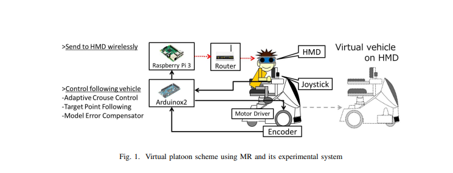
    *   **虚拟队列与客观视角：** 驾驶员佩戴HMD (Head Mounted Display, 具体为HoloLens)，在HMD上投射一个虚拟的前行车辆。驾驶员通过操纵杆远程控制这个虚拟前车，视角为从真实车辆后方观察虚拟前车的“模拟客观视角 (Simulated Objective Viewpoint)”。真实福祉车辆 (实验车辆名为STAVi) 则自动跟随虚拟前车的轨迹。这种客观视角有助于驾驶员更好地感知周围环境和车辆自身状态。
    *   **MR技术应用：**
        *   **虚拟车辆投射：** HoloLens负责将虚拟前车图像叠加到驾驶员的真实视野中。
        *   **环境3D建模：** HoloLens具备对行驶环境进行3D扫描和建模的功能，用于后续的避障。
    *   **控制系统构成：**
        *   **运动控制器 (Motion Controller)：** 使用Atmel AVR控制器计算真实车辆的速度、转向角、位置姿态，并将这些信息通过无线局域网发送给HMD。
        *   **混合现实控制器 (Mixed Reality Controller)：** HoloLens负责投射虚拟图像，构建环境3D模型，并根据驾驶员头部姿态（通过HMD上的IMU估计）生成模拟客观视角的AR图像。

*   **鲁棒队列控制设计 ([福祉车辆MR论文 Section III, Fig.3])：**
    *   为确保真实车辆能精确、稳定地跟随虚拟前车，即使在车辆动态特性变化时，系统也采用了鲁棒队列控制 (Robust Platoon Control) 策略。
    *   **模型误差补偿器 (Model Error Compensator, MEC)：** 用于抑制真实车辆与其参考模型之间的误差，保证输入/输出特性接近理想模型。
    *   **自适应巡航控制 (Adaptive Cruise Control, ACC)：** 根据车速动态调整与虚拟前车的期望距离 (dr = T*vi + d0, 其中 T = 2.0s 是目标车间时距, vi 是跟随车速, d0 = 2.0m 是停车车间距离)。
    *   **目标点跟随 (Target Point Following, TPF)：** 通过追踪虚拟前车历史位置点（路标点 WPs）来计算期望的转向角，以使真实车辆沿虚拟前车轨迹行驶。

*   **虚拟车辆的3D运动与HMD显示转换 ([福祉车辆MR论文 Section III.C, Fig.5, Fig.6])：**
    *   将虚拟车辆在地面上的3D位置姿态实时转换为主观视角在HMD上的2D图像，需要进行模型-视图 (model-view)、投影 (projection) 和视点变换 (viewpoint transformations)。
    *   虚拟车辆在HMD中以其“足迹”（车辆底面）的形式显示，以避免遮挡驾驶员对前方真实环境的观察。

*   **初步实验与评估 (无MR避障) ([福祉车辆MR论文 Section IV, Fig.7-Fig.11])：**
    *   **场景：** 在布置有障碍物的狭窄走廊中（车辆与障碍物间隙0.2m）进行测试。
    *   **对比：** 新手驾驶员（驾驶经验少于10分钟）在有/无驾驶辅助系统下的表现，并与专家驾驶员（驾驶经验20小时以上）的轨迹进行比较。
    *   **结果：**
        *   无辅助时，新手多次尝试后才成功通过，且轨迹与专家轨迹偏差较大 (Fig.10(a), Fig.10(b))。
        *   有虚拟队列辅助时，新手能更快成功通过（第二次尝试即可），轨迹更接近专家 (Fig.10(d))。
        *   通过计算轨迹与专家平均轨迹的均方误差 (Mean Squared Error) (Fig.11)，进一步量化了辅助系统的有效性。
        *   分析表明，新手驾驶失败的主要原因是与墙壁碰撞。

*   **基于MR的墙壁碰撞避免功能 ([福祉车辆MR论文 Section V, Fig.3, Fig.12-Fig.14])：**
    *   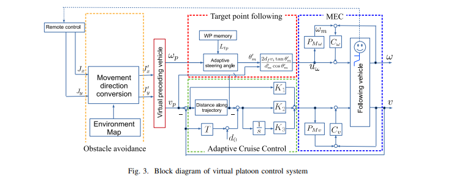
    *   **环境建模：** HoloLens对走廊进行3D扫描，生成环境地图 (Fig.12, 3D mapping of corridor)。
    *   **安全区域定义：** 基于3D地图，假设虚拟车辆为半径0.6m的圆柱体，通过搜索算法在地面上规划出安全驾驶区域 (Safety Driving Area, SA) (Fig.13b)。SA以外则为危险区域 (Hazardous Area, HA)。
    *   **操纵杆操作修正算法 (Joystick Operation Modification)：**
        *   当驾驶员通过操纵杆控制的虚拟车辆试图进入HA时，系统会自动修正操纵杆的输入向量 (F_modified = RotationMatrix(θ) * F_original)，使其转向SA (Fig.14)。修正角度φ根据虚拟车辆与走廊的角度及一个偏移量δ计算，确保虚拟车辆返回SA。
        *   一旦虚拟车辆返回SA，驾驶员即可恢复正常控制。
    *   **避障实验结果 ([福祉车辆MR论文 Fig.15-Fig.19])：**
        *   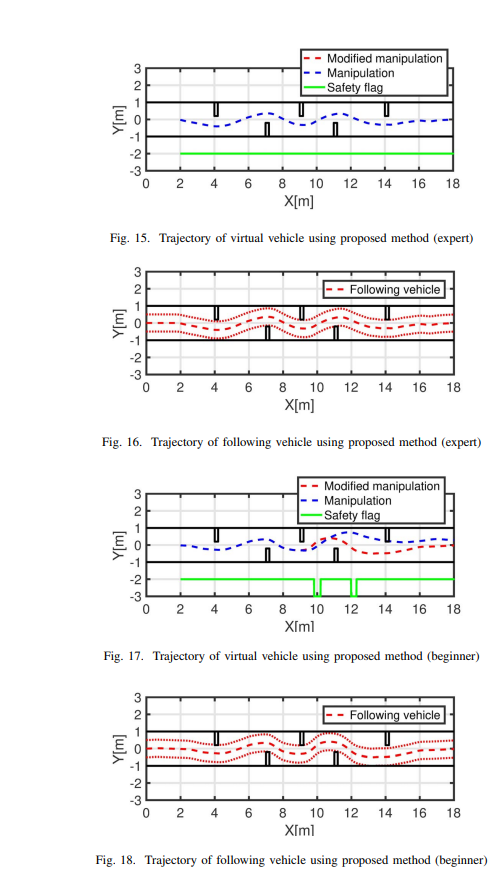
        *   专家驾驶时，虚拟车辆始终在SA内，操作未被修正 (Fig.15, Fig.16)。
        *   新手驾驶时，在第3和第4个障碍物处虚拟车辆有进入HA的趋势，系统成功修正了操纵杆输入（约在10秒和12秒时触发碰撞标志并修正） (Fig.17, Fig.19)，使其返回SA，真实车辆也相应调整轨迹，最终避免了碰撞 (Fig.18)。

*   **结论与未来工作 ([福祉车辆MR论文 Section VI])：**
    *   实验证实，基于模拟客观视角的虚拟队列控制对新手驾驶员是有效的。
    *   利用MR技术（HoloLens的3D建模）实现的静态障碍物（墙壁）避免功能，能够有效修正驾驶员的错误操作，防止碰撞。
    *   该研究标志着MR技术在福祉车辆领域应用的开端。
    *   **未来工作包括：**
        *   针对更多驾驶情境设计更安全的HMD辅助系统。
        *   由于难以评估驾驶技能和习惯过程，未来将采用更多驾驶次数的统计处理方法进行评估。
*   **总结**
    *   1. 此系统更像是一个能够在HUD上现实推荐路线的辅助驾驶系统，但其中提出的测试方法也许可以作为参考
#### 2.2.6 用于网联自动驾驶汽车(CAV)测试与评估的增强现实环境 (源自 "AR CAV测试环境论文")
An Augmented Reality Environment for Connected and Automated Vehicle Testing and Evaluation[9]
为克服传统封闭测试场缺乏真实交通交互能力的局限性，密歇根大学等机构的研究人员开发了一个用于网联自动驾驶汽车（CAV）测试与评估的增强现实（AR）环境。该环境旨在将真实测试场地与仿真平台无缝结合，使测试车辆能够与虚拟生成的背景交通进行互动。

*   **系统总体设计 ([AR CAV测试环境论文 Fig. 1, Section II])：**
    *   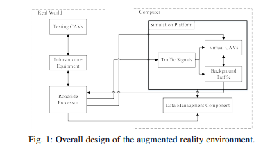
    *   **核心思想：** 融合真实世界的测试设施（Mcity）和微观交通仿真平台（VISSIM）。
    *   **数据流：**
        1.  真实测试CAV在Mcity中行驶，其运动数据（通过DSRC广播BSM）被RSU接收，经RSP处理后发送给仿真平台。
        2.  仿真平台中的虚拟CAV根据真实CAV的数据进行同步更新。
        3.  仿真平台（VISSIM）生成背景交通，这些虚拟车辆产生模拟BSM (sBSM)。
        4.  sBSM通过RSP发送给RSU，再由RSU广播给真实测试CAV。
        5.  真实世界的交通信号灯状态也与仿真中的虚拟信号灯同步。
    *   **交互：** 真实测试CAV通过接收sBSM和SPaT报文，能够感知并响应虚拟背景车辆和虚拟交通信号，如同在真实的交通环境中行驶。
    *   **数据管理：** 收集和管理来自真实世界和仿真平台的数据，用于性能评估。

*   **系统主要组件 ([AR CAV测试环境论文 Section II])：**
    *   **1. 仿真平台 (Simulation Platform)：**
        *   **组成：** VISSIM仿真器和一个仿真管理应用程序 (Fig. 2)。
            *   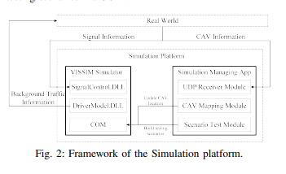
        *   **接口：** 使用VISSIM的SignalControl.DLL, DriverModel.DLL, 和COM接口与真实环境及管理应用交互。
        *   **功能：**
            *   交通信号同步：通过SignalControl.DLL与真实信号灯同步。
            *   模拟交通信息输出：通过DriverModel.DLL编码并发送模拟交通信息。
            *   真实CAV位置更新：仿真管理应用接收真实CAV信息，将GPS坐标转换为本地坐标，通过COM接口更新VISSIM中虚拟CAV的位置。
            *   测试场景构建：通过COM接口构建测试场景（如CAV路径、背景车输入、信号配时）。
        *   **工作流程 (Fig. 3)：** 
            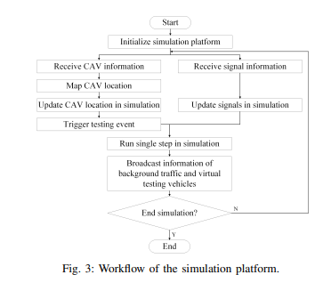
            加载场景 -> 初始化 -> 接收真实CAV和信号信息 -> 创建/更新虚拟CAV和虚拟信号 -> VISSIM执行仿真步 -> 更新并广播背景交通信息。采用基于触发的交互机制，保证测试可重复性。
    *   **2. 测试CAV (Testing CAV)：**
        *   **车辆平台：** 林肯MKZ混合动力车，具备完全的网联和自动化能力。
        *   **传感器配置：** Velodyne LiDAR (16线), Ibeo融合系统 (LUX LiDAR模块), 远程雷达, 短程雷达, Mobileye, Pointgrey相机, 高精度RTK GPS (牛津技术方案的RTK 3003, 精度约2cm), IMU。
        *   **控制：** 可通过软件控制方向盘、油门、刹车和变速器。底层路径规划、车速控制和转向控制由密歇根大学的OpenCAV项目开发。
        *   **通信：** 安装Cohda Wireless的车载单元 (OBU) 作为DSRC通信设备。
            *   任务1: 接收RSU广播的SPaT报文。
            *   任务2: 接收来自真实车辆（其他测试车）和模拟车辆的BSM。
            *   任务3: 向RSU广播测试车的BSM。
        *   **交互行为：** 例如，跟随模拟车辆时，遵循Gipps跟驰模型。
    *   **3. 通信网络 (Communication Network) (Fig. 4)：**
        *   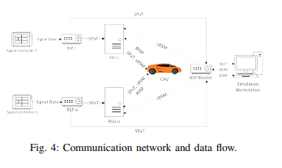
        *   **数据传输：** 在仿真平台和测试CAV之间传输数据。
        *   **SPaT流程：** 信号控制器 -> RSP（生成SAE J2735 SPaT） -> RSU（广播给CAV） & 主RSP -> 仿真平台。
        *   **真实BSM流程：** 测试CAV（广播BSM） -> RSU -> 主RSP -> 仿真平台。
        *   **模拟BSM (sBSM)流程：** VISSIM（通过DriverModel.DLL生成sBSM） -> 主RSP（根据车辆ID分发给不同RSU以平衡负载） -> 各RSU（广播给测试CAV）。
        *   **频率：** BSM和SPaT均以10Hz的频率广播。

*   **系统实现与测试 ([AR CAV测试环境论文 Section III])：**
    *   **测试场地：** 密歇根大学Mcity，一个专为CAV测试设计的小规模高保真模拟城市环境，包含多种道路属性和信号交叉口。
    *   **通信测试：**
        *   **方法：** 为避免时钟同步问题，采用环回方式测试延迟：VISSIM生成sBSM -> 主RSP -> RSU1广播 -> RSU2接收（模拟OBU） -> 主RSP -> VISSIM计算机。时间戳均由同一台计算机生成。
        *   **结果 (Fig. 5)：**
            *   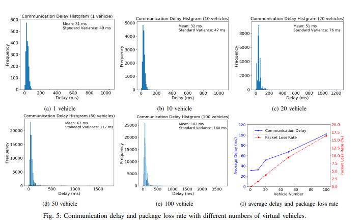
            *   1辆虚拟车时，平均延迟约31ms；100辆虚拟车时，平均延迟约102ms。
            *   延迟和丢包率随车辆数增加而增加。
            *   除100辆车的情况外，超过90%的数据包传输和处理时间小于100ms（DSRC消息的最短传输间隔）。
    *   **示例测试场景：**
        *   **1. 铁路道口 (Railway Crossing) (Fig. 6)：**
            *   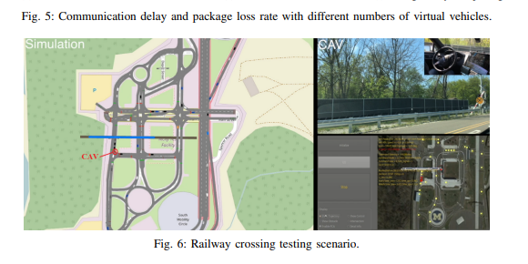
            *   场景：当测试CAV接近Mcity的铁路道口时，VISSIM中生成一列模拟火车。测试CAV应在道口前停车等待。
            *   演示：测试CAV成功在道口前停车，尽管前方没有真实车辆，其路径被虚拟车辆阻挡。
        *   **2. 闯红灯 (Red Light Running) (Fig. 7, Fig. 8)：**
            *   场景：测试CAV在Mcity某交叉口尝试左转（信号灯为绿灯），一辆模拟车辆在相交道路上闯红灯（向北行驶）。
            *   目的：评估测试CAV在不同情况下如何应对闯红灯车辆并避免碰撞。
            *   结果分析 (Fig. 8)：
                * 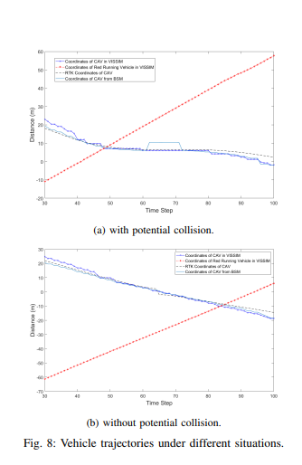
                *   对比了VISSIM中CAV坐标、OBU GPS坐标和RTK GPS坐标（真值）。OBU GPS与RTK GPS的差异代表GPS误差；OBU GPS与VISSIM坐标的差异代表车辆映射算法误差和VISSIM路网与真实路网的偏差。
                *   情况a（有潜在碰撞）：测试CAV检测到潜在碰撞（与闯红灯车辆到达冲突点的时间差小于3秒阈值）并完全停车。
                *   情况b（无潜在碰撞）：两车相距较远，CAV未停车。
                *   观察到OBU GPS在停车期间有约1秒的漂移，但车辆映射算法对其不敏感。

*   **结论与讨论 ([AR CAV测试环境论文 Section IV])：**
    *   提出的AR测试环境极大地增强了封闭测试设施的能力，为CAV提供了一个真实的交互式交通环境。
    *   该平台支持执行需要与其他车辆或出行方式（如行人）互动的复杂测试场景。
    *   未来的工作方向包括如何高效、全面地设计测试场景以覆盖各种交通状况，以及将该AR测试环境与加速评估方法相结合。
*   **总结：**
    *   1. 该系统通过在虚拟环境中生成虚拟车辆，来测试CAV实车在测试场地中对不同场景的反应效果；系统较为完备，且进行了交会场景的自动驾驶测试
    *   2. 此系统与我们的系统极为相似，且已经完成了对实车系统的整合，其坐标映射与通信方案值得借鉴。
#### 2.2.7 交通参与者在环的混合现实交互测试平台 (源自 "TPitL MR测试平台论文")
Traffic Participants in the loop: A Mixed Reality-Based Interaction Testbed for the Verification and Validation of Autonomous Vehicles [10]

为解决自动驾驶汽车（AV）在与行人等弱势道路使用者（VRU）交互时的验证与确认（V&V）难题，特别是真实场景复现困难和虚拟场景行为真实性不足的问题，德国FZI信息技术研究中心的研究人员提出了一个基于混合现实（MR）的“交通参与者在环”交互测试平台。

*   **核心理念与架构 ([TPitL MR测试平台论文 Section I, III, Fig. 1])：**
    *   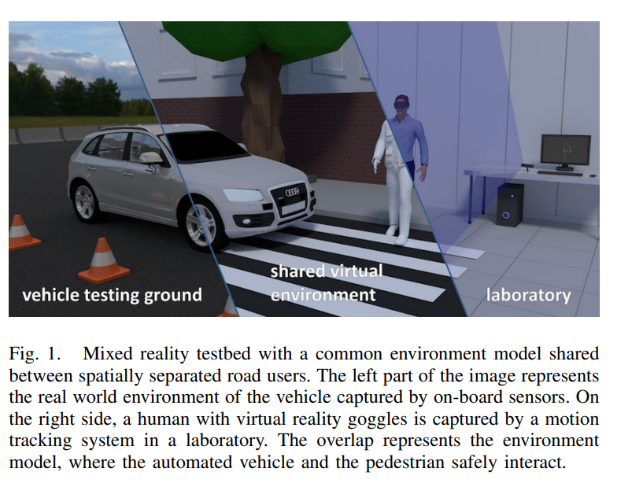
    *   **目标：** 在危险的、最坏情况的交通场景中，评估AV面对真实道路使用者行为时的性能。
    *   **方法：** 将一个沉浸式行人（在实验室内通过VR和运动追踪参与）和被测的自动驾驶功能（SuT，可以是模型、软件或真实车辆）注册到一个共享的通用环境模型中，使两者能在虚拟空间中安全交互。
    *   **X-in-the-loop的泛化 (Fig. 3)：** 
        *   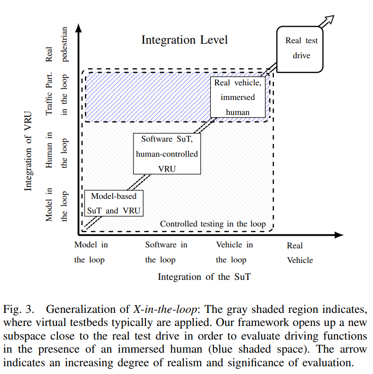
        *   不仅测试SuT，还将交互的道路使用者（由真人扮演的VRU）也纳入测试环路中进行观察和评估，适用于汽车V模型开发过程的各个阶段。
    *   **广义化身模型 (Generalized Avatar Model) (Fig. 4)：** 提出一个通用概念，用真实实体的行为无缝替代仿真环境中基于模型的交通参与者行为。该模型包含：
        *   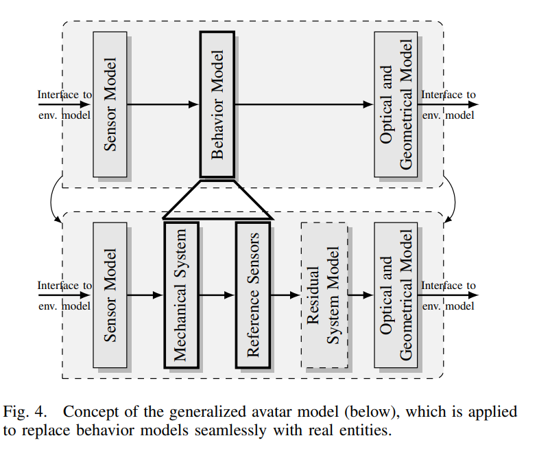
        *   传感器模型 (Sensor Model)：反映环境模型如何被感知。
        *   参考传感器 (Reference Sensors)：通过观察真实实体的时空行为来获取其行为。
        *   光学和几何模型 (Optical and Geometrical Model)：虚拟实体代表化身的光学和几何属性。
        *   残余系统模型 (Residual System Model)：可选，用于映射无法直接观测的量。

*   **系统实现细节 ([TPitL MR测试平台论文 Section IV, Fig. 5, Fig. 6, Fig. 8])：**
    *   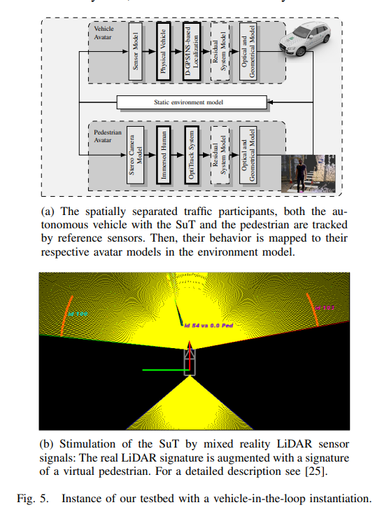
    *   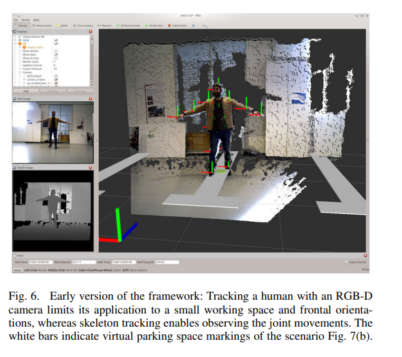
    *   **仿真与中间件：** 基于模块化的机器人仿真软件Gazebo和机器人操作系统ROS。
    *   **被测系统 (SuT) 的集成：** SuT可以作为模型或软件与车辆动力学模型耦合，并通过传感器模型接收激励。在车辆在环（ViL）的更高集成级别，SuT在真实的快速原型车上运行，通过D-GPS/INS系统定位，其传感器信号被虚拟信号替换或增强（如MR LiDAR传感器信号，Fig. 5(b)）。
    *   **行人的集成与沉浸：**
        *   **追踪：** 使用OptiTrack运动追踪系统（含6个Flex13摄像头，亚厘米级精度）在约4x2米的工作空间内追踪佩戴标记物的真人。
        *   **沉浸：** 使用基于智能手机的无线VR眼镜。通过追踪头部姿态，渲染并传输虚拟环境模型中的立体视图到手机屏幕，为行人提供第一视角沉浸感。
        *   **行为输入：** 行人的真实行为（如行走、姿态变化）被映射到其在通用环境模型中的化身。
    *   **通用环境模型：** 定义道路结构、交通标志、建筑物、静态障碍物等。可设置虚构场景或精确复现真实场景（如停车场Fig. 7(b)，公交站Fig. 7(a)），并通过改变遮挡物等方式制造危险场景。
    *   **通信与同步 (ViL场景)：**
        *   采用分布式协同仿真，车辆和行人的工作空间物理分离。
        *   通过无线通信（如IEEE802.11p/ITS-G5 V2X系统）交换参考测量数据（如参与者当前位姿）。
        *   使用ETSI标准化的协同感知消息 (CAM) 进行数据交换，并可能调整发送频率以减少延迟。
        *   使用GPS时间戳保证数据同步，便于场景回放和机器学习。

*   **系统评估与应用 ([TPitL MR测试平台论文 Section V, Fig. 9, Fig. 10])：**
    *   **定性评估 (Fig. 9)：** 从可观察性、安全性、吞吐量、灵活性和真实性五个维度，将该MR测试平台与虚拟验证、试验场测试、真实路测进行对比。结果显示，该平台在安全性、灵活性和（行为）真实性方面具有显著优势，同时保持了较好的可观察性。
    *   **用例：自适应巡航控制(ACC)参数化 (Fig. 10)：**
        *   **场景：** 模拟真实城市场景，行人需要穿过马路追赶电车，前方有停靠的公交车（造成遮挡）。
        *   **过程：** 真人扮演的行人沉浸在虚拟场景中，与一个搭载基于LiDAR的ACC和碰撞缓解系统（基于IDM模型）的虚拟车辆互动。行人通过进出传感器范围来挑战SuT。
        *   **结果：** 该方法使得研究人员能够安全地复现碰撞场景，从行人的视角体验车辆行为是否舒适，并据此优化IDM模型的参数（特别是安全距离和最大减速度）。

*   **结论与展望 ([TPitL MR测试平台论文 Section VI])：**
    *   该测试平台能够在不同集成级别、最坏情况下，面对空间分离的道路使用者的真实行为，对高度自动化的驾驶功能进行V&V。
    *   尤其适用于评估碰撞缓解与避免功能、合规与非合规行为预测功能，以及车辆与行人在无信号交叉口的协作功能。
    *   严格分离模拟环境模型和真实系统保证了安全性，允许测试人员扮演不负责任甚至危险的角色（如闯红灯、抢行），从而以“严肃游戏”的形式获取测试数据。
    *   未来研究包括：评估测量误差的传播、沉浸式行人传感器模型的细节设计（视觉准确性和照片真实感），以及扩展到更复杂场景和多参与者互动的大规模测试环境。
*   **总结：**
    *   此系统是将行人建模插入到MR中，并与虚拟车辆进行交互。
#### 2.2.8 Sleepwalker框架——通过混合现实LiDAR激励实现AV的V&V (源自 "Sleepwalker框架论文")

为解决自动驾驶汽车验证与确认（V&V）中仿真理想化与真实测试昂贵且不可复现的矛盾，德国FZI信息技术研究中心提出了Sleepwalker框架。该框架的核心思想是在近传感器层面（特别是LiDAR），通过混合真实与虚拟的激光扫描数据来激励自动驾驶功能，使其构建一个混合现实环境模型，从而实现对整个系统的综合性能评估[11]。

*   **Sleepwalker框架概念与架构 ([Sleepwalker框架论文 Section III, Fig. 2, Fig. 3])：**
    *   **核心思想：** 借鉴人类梦游者在睡眠状态下仍能部分感知并与（梦境）环境互动的概念，让自动驾驶功能在真实物理车辆上运行时，其传感器（如LiDAR）接收到的数据是真实世界数据与虚拟世界数据的混合体。
    *   **X-in-the-loop的扩展 (Fig. 2)：** 传统XiL方法侧重于将被测系统（SuT）在软件到硬件的不同阶段进行测试。Sleepwalker将此思想扩展到车辆所处的环境层面，允许逐步地将环境中的静态、半静态和动态元素在真实与虚拟之间进行切换。
    *   **系统架构 (Fig. 3)：**
        *   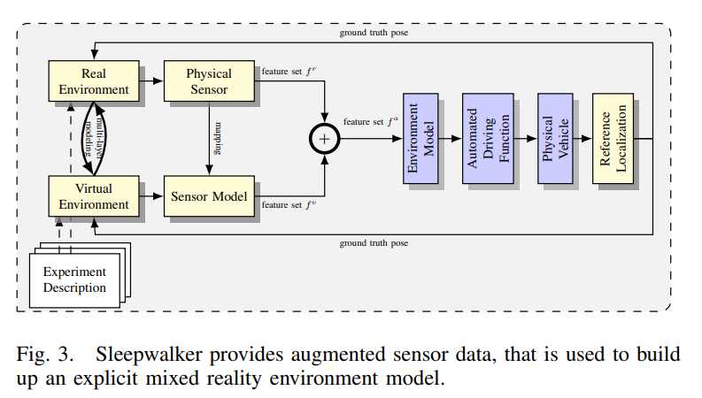
        1.  **物理车辆与SuT：** 真实车辆由被测的自动驾驶功能控制。
        2.  **参考定位系统：** 独立于SuT的高精度定位系统（如D-GPS/INS）提供车辆的地面真值位姿。
        3.  **真实传感器(Sr)与虚拟传感器模型(Sv)：** 真实LiDAR感知真实环境，虚拟LiDAR模型（基于光线投射）感知虚拟环境。虚拟车辆位姿与真实车辆同步。
        4.  **多层建模过程 (Fig. 4)：** 用于定义实验场景的真实与虚拟元素：
            *   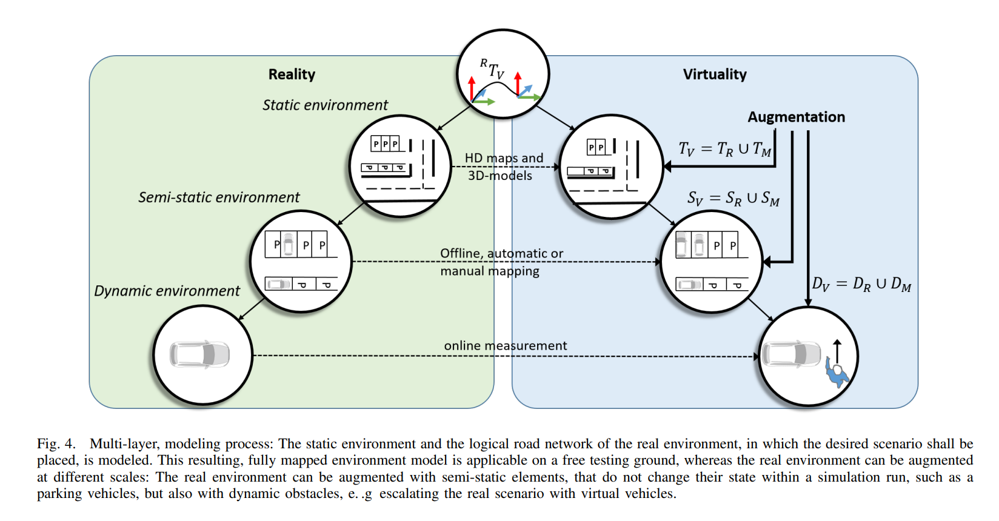
            *   **静态环境层：** 真实场景（TR）通过高清地图和3D模型映射为虚拟模型（TV），可添加虚拟元素（TM）增强，或将整个虚拟模型（TV）平移（TRV）到试验场。
            *   **半静态层：** 管理场景运行期间状态不变的非静态元素（如真实停放车辆SR），可增强虚拟元素（SM，如虚拟停放车辆、施工区）以制造遮挡等复杂情况，形成SV。
            *   **动态层：** 真实动态实体（DR，如其他真实交通参与者）被映射为虚拟元素，并可增强额外的模型控制的动态参与者（DM），形成DV。
        5.  **融合模块与增强策略：** 将真实激光扫描特征集(fr)和虚拟激光扫描特征集(fv)通过特定增强策略（替换策略、min()策略、δ策略）融合成增强特征集(fa)。
        6.  **SuT处理：** SuT接收增强后的传感器数据(fa)，构建混合现实环境模型，并据此进行后续的感知、决策和控制。

*   **Sleepwalker框架的实现 ([Sleepwalker框架论文 Section IV, Fig. 6])：**
    *   **软件基础：** 使用机器人操作系统ROS和开源机器人仿真框架Gazebo。
    *   **硬件平台：** FZI的CoCar实验车，配备多LiDAR传感器系统。
    *   **数据增强实现：** 开发了一个“代理驱动程序”(Proxy Driver)，该驱动程序位于物理LiDAR传感器和车辆内部的融合单元之间。它能够截取原始的真实激光扫描数据，并根据选定的增强策略，将其与来自并行运行的Gazebo仿真中的虚拟激光扫描数据进行混合，然后将增强后的数据转发给融合单元。
    *   **接口抽象：** 通过ROS消息定义抽象层，使得框架能够方便地集成不同的仿真工具和车辆平台。

*   **框架应用与演示 ([Sleepwalker框架论文 Section V, Fig. 7, Fig. 8])：**
    *   **目标场景：** 测试CoCar实验车的代客泊车系统。首先对真实停车库进行三维重建和路网建模。
    *   **阶段一：室外安全测试LiDAR定位 (Fig. 7)：**
        *   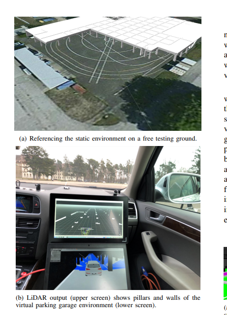
        *   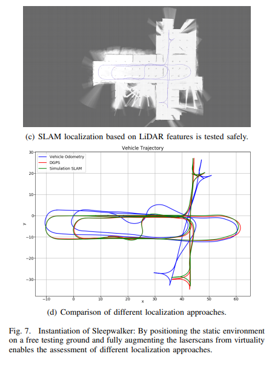
        *   将虚拟的静态停车库环境模型放置在一个空旷的试验场上。
        *   通过完全用虚拟激光扫描替换真实传感器的“替换策略”，安全地测试和评估基于LiDAR特征的SLAM定位算法的性能。
    *   **阶段二：真实车库中测试规划与避障，并引入虚拟动态元素 (Fig. 8)：**
        *   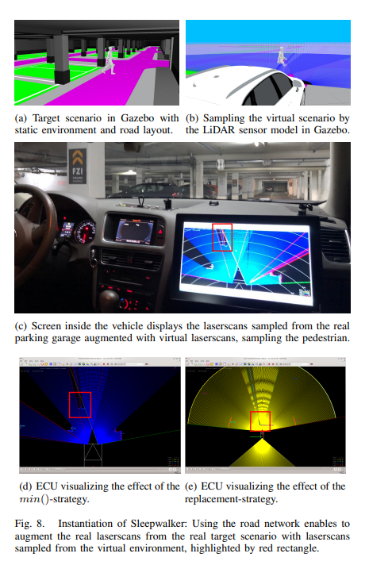
        *   在真实的停车库环境中运行车辆。
        *   使用路网模型生成虚拟交通参与者（如虚拟行人）的行为。
        *   通过“min()策略”或“δ策略”将真实激光扫描与虚拟行人产生的虚拟激光扫描进行增强。
        *   车内屏幕显示增强后的激光扫描和虚拟元素的叠加效果，ECU可视化增强结果，测试车辆对虚拟行人的避让等行为。

*   **结论与展望 ([Sleepwalker框架论文 Section VI])：**
    *   Sleepwalker框架成功弥合了基于模型的仿真与昂贵且难以重复的真实测试之间的鸿沟，能够在近传感器层面激励自动驾驶软件以评估其性能。
    *   通过逐步用真实对应物替换场景模型，实验的真实性和结果的重要性随之增加。
    *   未来研究问题包括：合适的LiDAR传感器模型验证、处理影响LiDAR底层的因素（如天气效应、多重回波）、以及框架对传感器融合算法评估的普适性（如集成Car2X和视觉传感器）。
*   **总结**
    *   1. 与我们的方案相比，该系统是将真是传感器数据与虚拟传感器数据进行融合，作为AV的感知信息，并以此进行运动决策。实际上是数据层面上的MR。
    *   2. 但是文章中提出的多层建模过程直接借鉴。
#### 2.2.9 面向自动驾驶多车道的多车混合现实强化学习 (源自 "多车混合现实强化学习论文")

剑桥大学的研究团队针对多车多车道环境下自动驾驶策略学习的安全性与效率问题，提出了一个创新的多车混合现实强化学习框架。该框架旨在通过Sim2Real方法，在混合现实环境中安全地训练自动驾驶汽车的驾驶策略，特别是处理与其他车辆和障碍物的交互[12]。
    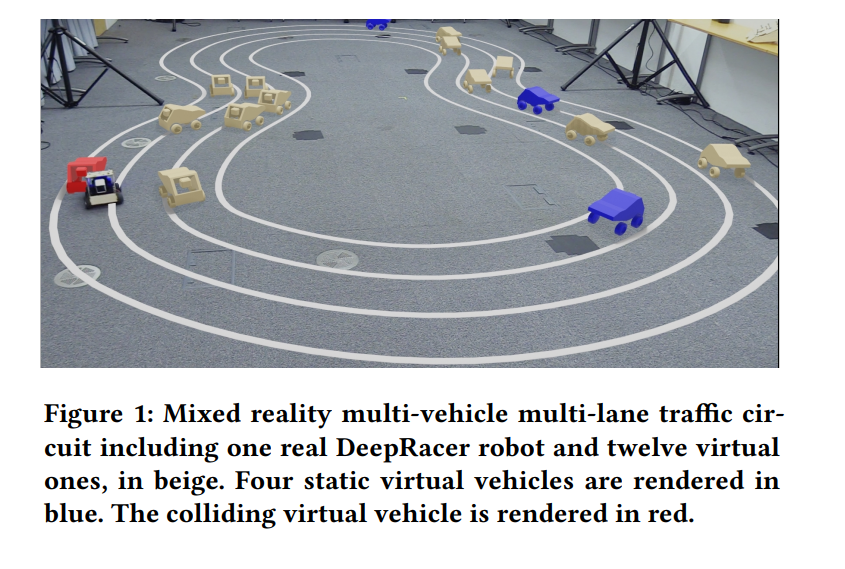
*   **核心问题与目标 ([多车混合现实强化学习论文 Section 1, 3])：**
    *   **问题：** 在多车共享工作空间中，直接在真实车辆上通过强化学习训练驾驶策略存在巨大的安全风险，因为学习过程（尤其是早期）不可避免地会发生碰撞，而碰撞是学习的关键经验。
    *   **目标：** 开发一个安全高效的框架，允许在无法保证无碰撞的共享工作空间中学习自动驾驶策略，使真实车辆能够与虚拟车辆和障碍物在混合现实中交互并从中学习。

*   **混合现实强化学习框架 ([多车混合现实强化学习论文 Section 1, 5, 6, Fig. 1, Fig. 5])：**
    *   **总体思路：** 结合真实世界的在线策略自适应和混合现实设置。一个或多个真实学习代理（如DeepRacer机器人）在物理赛道上行驶，而其他车辆和静态障碍物则存在于虚拟域中。
    *   **安全学习机制：** 真实车辆与虚拟对象之间的碰撞在虚拟现实中模拟和记录，学习代理从这些虚拟碰撞中吸取教训，而真实车辆本身不会发生物理损坏。
    *   **系统组成 (Fig. 5)：**
        *   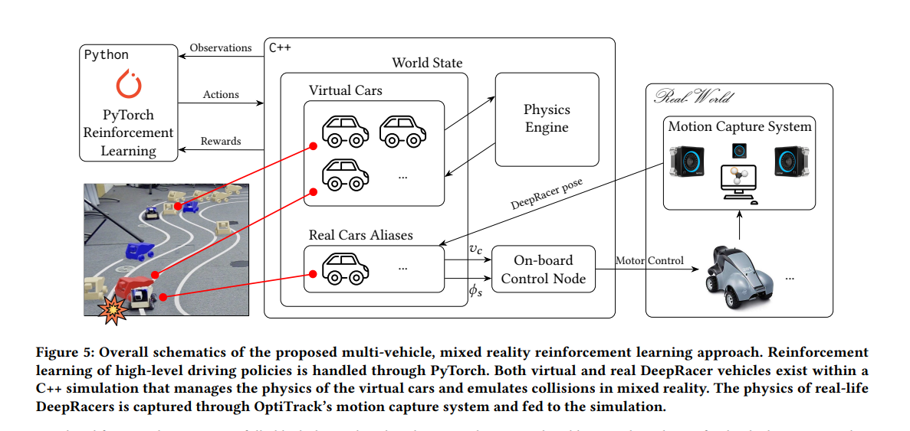
        *   **真实世界组件：**
            *   至少一辆真实DeepRacer机器人作为学习代理。
            *   运动捕捉系统（OptiTrack）：追踪真实DeepRacer的位置和姿态。
            *   车载控制节点：执行低层控制（如轨迹跟踪）。
        *   **仿真/虚拟世界组件 (C++实现)：**
            *   管理世界状态，包括虚拟车辆、真实车辆的虚拟“别名”(alias)以及静态虚拟障碍物。
            *   物理引擎：处理虚拟车辆的动力学和混合现实中的碰撞检测。
            *   背景虚拟交通：由固定的高层驾驶策略（IDM/MOBIL模型）控制。
        *   **学习组件 (Python, PyTorch实现)：**
            *   强化学习算法（基于演员-评论家方法，具体为A3C的变体）处理来自仿真环境的观测值和奖励信号，并输出动作。
        *   **混合现实接口：** 通过BOOST.Python库连接C++仿真和Python学习模块。真实车辆的姿态信息通过运动捕捉系统反馈给仿真，仿真中的高层策略（学习得到）的动作指令发送给真实车辆的低层控制器。

*   **驾驶策略与学习模型 ([多车混合现实强化学习论文 Section 4, 5])：**
    *   **两级驾驶策略：**
        *   **高层控制策略 (学习目标)：** 负责换道决策和速度调节。输入包括自身状态（当前速度、目标速度、左右车道数、换道状态）和周围最多六辆车的相对状态（相对位置、相对速度、相对车道、换道状态）。输出为离散的加速度（加速、保持、减速）和换道（左、右、不换）指令。
        *   **低层控制器 (固定)：** 负责轨迹跟踪和保持目标速度。
    *   **强化学习模型：**
        *   **奖励函数：** 惩罚偏离目标速度的行为，并对过于接近其他车辆的行为进行惩罚。
        *   **神经网络架构 (Fig. 3)：** 使用深度神经网络逼近价值函数和策略函数，包含一个演员网络和两个评论家网络（取两者中较小的值以减少早期训练中价值函数估计的偏差）。针对邻近车辆的观测特征提取使用多层线性网络和最大池化。
            *   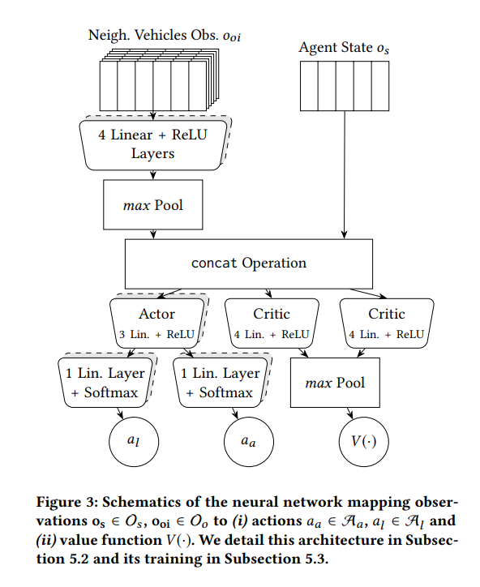
        *   **分布式训练 (Fig. 4)：** 采用A3C的变体，允许多个并行actor在环境中行动并异步更新策略参数，以提高学习速度和稳定性（主要用于纯仿真预训练）。在混合现实训练中，由于无法并行化环境，则通过增加经验轨迹的长度来弥补。
            *   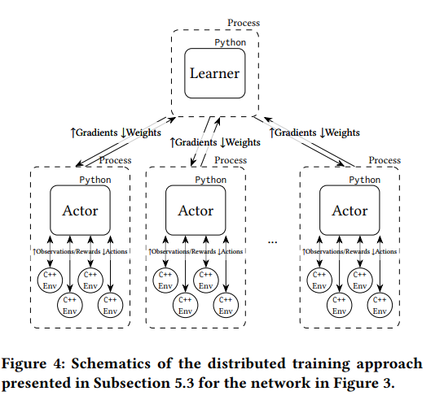

*   **实验与结果 ([多车混合现实强化学习论文 Section 7, Fig. 6, Fig. 7, Fig. 8])：**
    *   **实验设置：** 在一个3车道赛道上进行，包含1辆真实DeepRacer（学习代理），12辆虚拟背景车（IDM/MOBIL控制），以及4个静态虚拟障碍物 (Fig. 1)。
    *   **训练过程评估 (Fig. 6)：** 展示了单次训练过程中，每分钟碰撞次数随训练帧数增加总体呈下降趋势，而滑动窗口平均奖励则对应上升，表明学习有效。
    *   **混合现实训练效果评估 (Fig. 7)：** 对比混合现实训练前后的性能指标分布。训练后，每场景碰撞次数的分布显著左移（碰撞减少），累积奖励分布右移（奖励增加）。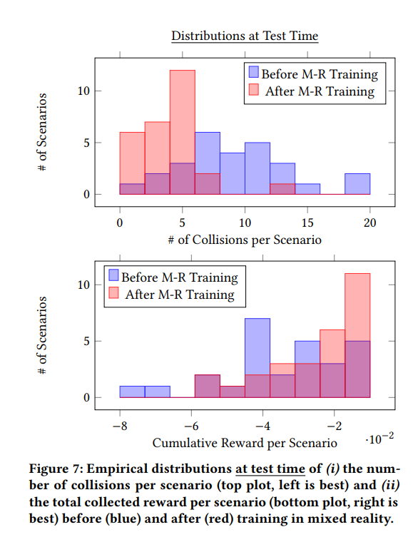
    *   **行为变化定性比较 (Fig. 8)：** 通过时空图展示训练前后DeepRacer的行为。训练前，真实DeepRacer频繁与虚拟障碍物发生碰撞。经过混合现实训练后，碰撞几乎完全消除。同时观察到，训练后的学习代理虽然更安全，但其谨慎行为有时可能导致后方虚拟车辆（IDM/MOBIL控制）的拥堵，影响整体交通效率。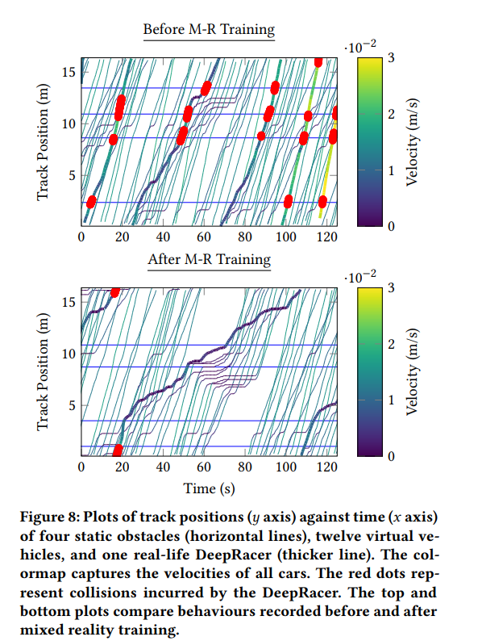

*   **结论与讨论 ([多车混合现实强化学习论文 Section 8, 9])：**
    *   该混合现实框架能够安全有效地训练多车系统中的驾驶策略，显著减少碰撞。
    *   该系统特别适用于多机器人场景，其中与其他动态对象的交互对学习过程至关重要，但直接在多个真实平台上执行会导致重复损坏。
    *   该框架有助于弥合强化学习在机器人领域中仍然存在的“现实差距”。
    *   未来工作将考虑多个学习代理使用车载传感（如视觉），以及如何利用混合现实设置逐步将它们引入共享空间。
*   **总结**
    *   1. 非常新颖的一种混合现实的碰撞学习系统，之后需要关注其AI模型的构建方法
    *   2. 此系统对定位的处理与我们的方案类似，都是通过动捕系统实现的。
    *   3. 问题：系统的MR系统非常原始，更确切的说，似乎是通过构建boundingbox来检测是否发暗生碰撞，而不是存在一个类似unity或carla这样的物理引擎。
#### 2.2.10 基于Unity 3D和SUMO的自动驾驶汽车混合现实测试环境 (源自 "Unity3D与SUMO混合现实测试环境论文")

布达佩斯技术与经济大学的研究团队开发了一套混合现实测试环境，旨在通过集成真实测试车辆、虚拟交通仿真和灵活的3D可视化，为自动驾驶汽车的开发和验证提供支持。该系统结合了Unity 3D游戏引擎和SUMO微观交通仿真器[13]。

*   **系统核心架构与组件 ([Unity3D与SUMO混合现实测试环境论文 Section II, Fig. 1])：**
    *   **目标：** 实现真实测试车辆在可定制的虚拟环境中的测试，支持车辆在环(ViL)和场景在环(SciL)仿真。
    *   **Python服务器 (核心)：**
        *   负责与真实测试车辆（通过CAN网络和无线通信）、Unity 3D可视化模块以及SUMO交通仿真模块进行通信。
        *   同步不同组件，根据预定义的测试场景向虚拟对象或被测车辆(VUT)发出指令。
        *   处理从车辆接收到的信息，定义其数字孪生。
        *   生成传感器信息并反馈给真实车辆。
    *   **Unity 3D 可视化模块：**
        *   **数字孪生创建：** 根据从真实车辆获取的高精度GPS数据（要求1-2cm精度以保证平滑运动）和车轮速度、转向角等数据，在虚拟环境中创建并驱动测试车辆的数字孪生。
        *   **数字环境创建：** 支持基于GPS坐标创建真实环境的数字副本（通过SUMO的NETEDIT将地理坐标转换为笛卡尔坐标），或创建完全自定义的虚拟场景。
        *   **动态对象处理：** 管理由SUMO生成的交通车辆（通过预制件克隆并随机选择车型）和行人（基于预制件克隆）的实时添加、销毁和重新定位。
    *   **SUMO 交通仿真模块：**
        *   **路网生成：** 使用NETEDIT插件基于OSM地图或手动创建与Unity 3D中一致的道路网络。
        *   **交通流生成：** 基于真实交通流特征生成交通，可固定路线或在整个网络中随机路由。定义交通信号灯及其控制程序。
        *   **接口：** 通过TraCI接口与Python服务器通信。
    *   **数据流与通信 (Fig. 1, TABLE I)：**
        *   信息主要分为三类：EGO车辆（真实测试车）信息、其他对象（虚拟车辆、行人）信息、交通信号灯信息。
        *   EGO车辆信息（ID, 位置x,y, 速度, 朝向, 转向角, 刹车灯状态）通过CAN网络 -> Python服务器 -> SUMO（GPS转SUMO坐标）-> Unity 3D。
        *   SUMO中所有车辆（包括EGO车辆的数字孪生）的位置和朝向被检索，并转换为中心点坐标后发送给Unity 3D进行可视化。
        *   系统支持无真实测试车辆的纯虚拟仿真，此时EGO车辆由Unity 3D直接控制，其位姿信息双向传递给Python服务器和SUMO。

*   **传感器仿真 ([Unity3D与SUMO混合现实测试环境论文 Section II.E, II.F])：**
    *   **基于SUMO的传感器信息生成：** 利用从SUMO查询到的所有对象的位置、角度、长度和宽度值。基于EGO车辆的已知位置，计算其与所有其他对象的“相关最近点”（不仅考虑欧氏距离，还加权考虑EGO车辆行驶方向与目标点之间的夹角），从而模拟传感器探测到的距离。
        *   `p_weighted = p_distance + |p_angle * weight_angle|`
    *   根据真实测试车辆上传感器的数量和布局，将每个探测区域内最近点的距离信息发送回车辆的CAN总线。
    *   **未来展望（基于Unity 3D的传感器仿真）：** 利用Unity 3D的灵活性开发更高级的、基于物理的传感器模型（如LiDAR, RADAR），生成虚拟传感器数据。

*   **测试车辆的控制选项 ([Unity3D与SUMO混合现实测试环境论文 Section III])：**
    *   **ViL模式（CAN接口）：** 输入信号直接来自车辆的CAN网络，传感器信息也通过CAN网络反馈给车辆，形成闭环。
    *   **键盘/方向盘/游戏座椅控制：** 数字孪生车辆由键盘或游戏方向盘控制，其在虚拟世界中的位置和角度通过TCP连接发送给服务器，用于在SUMO中定位。
    *   **基于转向角和扭矩的自动驾驶算法测试：** 为实现更真实的车辆动态，可使用Unity内置的或自定义的车辆动力学模型，接收算法计算出的加速度/减速度扭矩和转向角作为输入，控制虚拟测试车辆。

*   **仿真与实际测试结果 ([Unity3D与SUMO混合现实测试环境论文 Section IV, Fig. 2, Fig. 3])：**
    *   **初步测试：** 首先通过键盘控制的虚拟车辆在虚拟交通中进行测试，以验证系统逻辑架构的正确性 (Fig. 2)。
    *   **ZalaZone测试道真实测试 (Fig. 3)：** 在ZalaZone测试场的SmartCity区域进行了SciL场景演示，包括：
        *   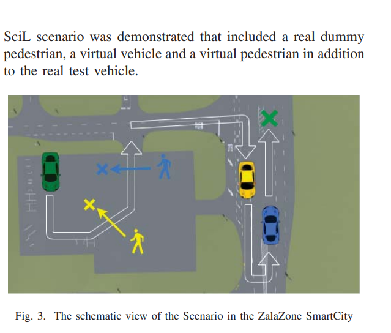
        *   真实测试车辆。
        *   一个真实假人行人（拥有数字孪生）。
        *   一个虚拟车辆。
        *   一个虚拟行人。
        *   测试车辆成功执行了对虚拟行人的紧急制动，以及与虚拟车辆的自适应巡航控制。
    *   **系统性能：** 组件间连接稳定且足够快，虚拟空间中车辆运动几乎实时。仿真频率可设置在10-20ms之间，保证了低速下信息的及时传递。

*   **结论与未来工作 ([Unity3D与SUMO混合现实测试环境论文 Section V])：**
    *   成功实现了在虚拟环境中测试真实车辆的目标。系统在交通仿真、多真实对象处理方面具有潜力，可辅助开发和验证过程。
    *   未来改进方向包括：遵循通信和场景描述标准，改进虚拟环境的感知（虚拟传感器信息对测试车辆的可用性），以及集成更高级的传感器模型。
*   **总结**：
    *   1. 本文提出的系统与我们预期的系统非常想死，但是就目前开了，作者团队的进展仍有限。
    *   2. 可信的结果是，他们通过键盘实现了与虚拟ego的交互；
    *   3. 作者表示他们在ZalaZone的测试场地对虚拟与真实结合的场景进行了测试，但是没能提供有效的测试数据
#### 2.2.11 自动代客泊车(AVP)环境中多车协同的混合现实测试 (源自 "AVP多车协同混合现实测试论文")

为应对高度自动驾驶功能（尤其是多车协同场景）测试的复杂性和成本问题，德国DENSO汽车公司、西门子PLM软件以及慕尼黑工业大学等机构的研究人员共同开发并演示了一个混合现实测试框架。该框架专注于自动代客泊车（AVP）场景下多辆虚拟车与一辆真实车辆在环（ViL）系统的交互与协调[14]。

*   **核心挑战与目标 ([AVP多车协同混合现实测试论文 Section 1])：**
    *   **挑战：** 证明高度自动驾驶系统的安全性和功能性需要大量测试，尤其在多车场景下，纯真实车辆测试不具规模经济性且成本高昂。
    *   **目标：** 提出一个能够无缝结合虚拟与真实测试的混合现实平台，用于评估AVP系统中分布式控制方案的算法设计，并验证其在真实车辆干扰下的鲁棒性，同时识别模型与现实的差异。

*   **混合现实测试架构 ([AVP多车协同混合现实测试论文 Section 2, Fig. 2, Fig. 3])：**
    *   **虚拟AVP测试平台 (Fig. 2 左侧和中部)：**
        *   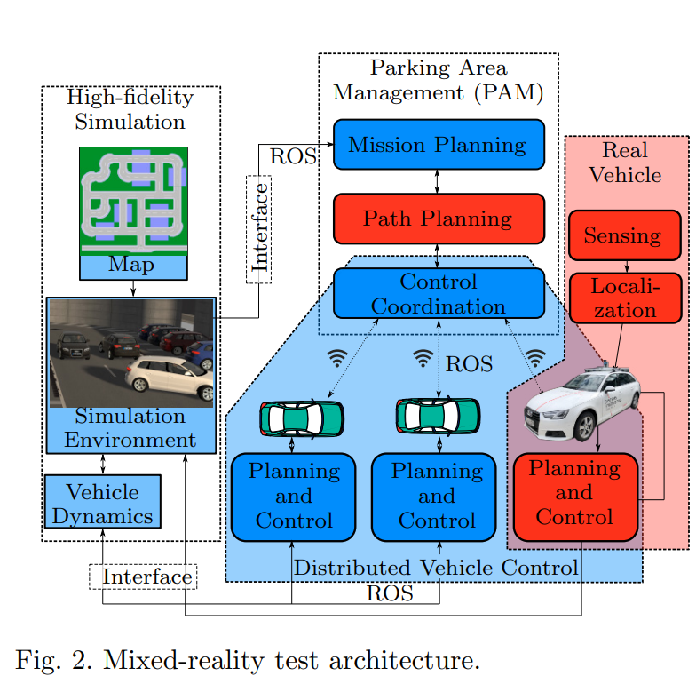
        *   **高保真仿真环境：** 使用Vires VTD驾驶模拟器，基于OpenDRIVE格式的停车场地图进行动态行为模拟和可视化。
        *   **被测系统 (SUT)：** 完整的AVP系统，包括：
            *   **停车场管理系统 (PAM)：** 作为基础设施单元，负责任务规划（分配停车位/出口）、路径规划和控制协调。通过V2I与车辆通信。
            *   **分布式车辆控制系统：** 每辆（虚拟或真实）车上均有本地的规划和控制单元。
        *   **通信：** 各模块（C++和Python实现）通过ROS中间件进行通信。V2I通信也在仿真PC上模拟。
    *   **真实车辆演示器集成 (Fig. 2 右侧, Fig. 3)：**
        *   **硬件平台：** 一辆奥迪A4 B9旅行车，通过附加模块（piggy-back）实现对原车低层功能的控制（如电动助力转向EPS、电子稳定程序ESP控制的制动、自适应巡航ACC控制的加速、车身控制功能如指示灯和刹车灯）。车载PC运行虚拟环境并为真实车辆进行轨迹规划。使用LIDAR为真实车辆提供定位数据。
        *   **通信与控制接口 (Fig. 3)：**
            *   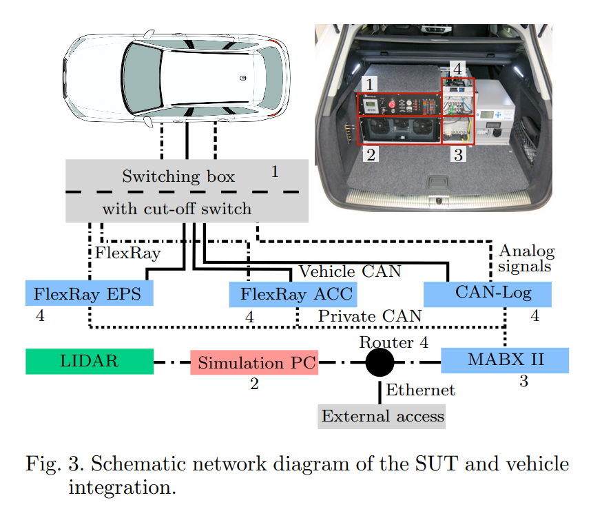
            *   通过两个FlexRay控制器、一个CAN总线开发单元和一台dSPACE MicroAutoBox II (MABXII) 实现虚拟仿真世界与真实车辆之间的信号处理与通信。
            *   MABXII作为车辆接口和仿真PC（运行虚拟环境和规划算法）之间的转换器，通过以太网连接。
            *   为了安全，所有连接可通过紧急开关立即切断，并激活驻车制动。
        *   **定位：** 基于扩展卡尔曼滤波器（EKF），融合里程计测量（从车辆CAN总线获取的速度和转向角）和LIDAR数据。里程计信息用于运动学自行车模型的数值积分，产生位置和姿态估计（模型更新）。LIDAR传感器（SICK NAV245）进行二维扫描并检测预先映射的路标，通过比较检测到的路标星座与预存地图来推断车辆位置和姿态（测量更新）。EKF最终结合两种估计（基于模型的和基于路标的）产生校正后的定位结果。停车场安装了8个高反光路标，确保传感器视场内至少总有3个可见。（也就是说是基于标记的）
        *   **软件：** 操作真实车辆的软件模拟ROS节点，通过ROS桥接器与仿真PC上的MABXII进行UDP数据包交换，实现与虚拟车的行为一致性。

*   **算法设计 ([AVP多车协同混合现实测试论文 Section 3])：**
    *   **半结构化路径规划：**
        *   **基础设施支持规划 (PAM端)：** 接收车辆初始和目标位姿后，首先基于车道网络拓扑计算最短路径（车道序列），然后细化为占用栅格地图（OGM），编码分配给车辆的可行驶区域。在交叉口和泊车位附近会扩大可行驶区域以方便机动。OGM随后发送给车辆本地规划模块。
        *   **本地车辆规划 (车辆端)：** 使用混合A\* (Hybrid A\*)算法，在接收到的OGM上规划从当前位置到目标停车位的可行驶、无碰撞路径。该算法考虑车辆的非完整约束，并优化路径长度、转向、换向等成本。
    *   **车辆协调控制：**
        *   **分布式架构：** 任务在PAM的控制协调模块和各车辆的本地控制系统之间分配。
        *   **纵向控制：** 每辆车使用模型预测控制（MPC）计算加速度。本地纵向预测结果共享给PAM。
        *   **横向控制：** 使用基于速度的增益调度LQR（线性二次调节器）进行路径跟踪（转向）。
        *   **协调机制：** PAM根据所有车辆的路径和预测，决定在潜在冲突区域（如交叉口、机动区）的车辆通行顺序，并将相关车辆的预测信息转发给其他相关车辆。这些信息以安全距离约束的形式纳入各自的本地MPC问题中，从而实现无碰撞的平稳协调。

*   **实验测试与结果 ([AVP多车协同混合现实测试论文 Section 4, Fig. 6, Fig. 7, Fig. 8, Fig. 9])：**
    *   **场景设置 (Fig. 6)：** 模拟停车场，三辆车（v1, v2, v3）行驶。v1的目标是停入指定车位，途中与其他车辆共享两个交叉口和一个机动区。
        *   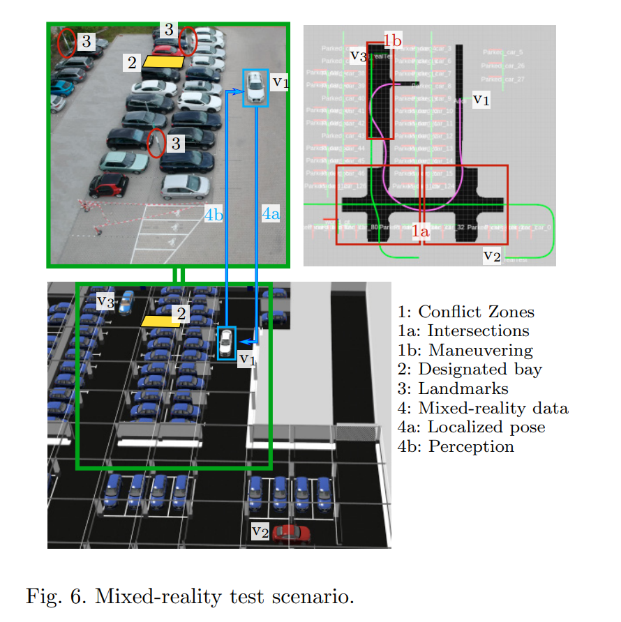
    *   **纯虚拟测试 (v1, v2, v3均为虚拟车)：**
        *   协调程序决定了交叉口的通行顺序。v1的路径规划（仅前向泊车）和控制信号（加速度、速度、转向角）被记录 (Fig. 7左, Fig. 9左)。
            *   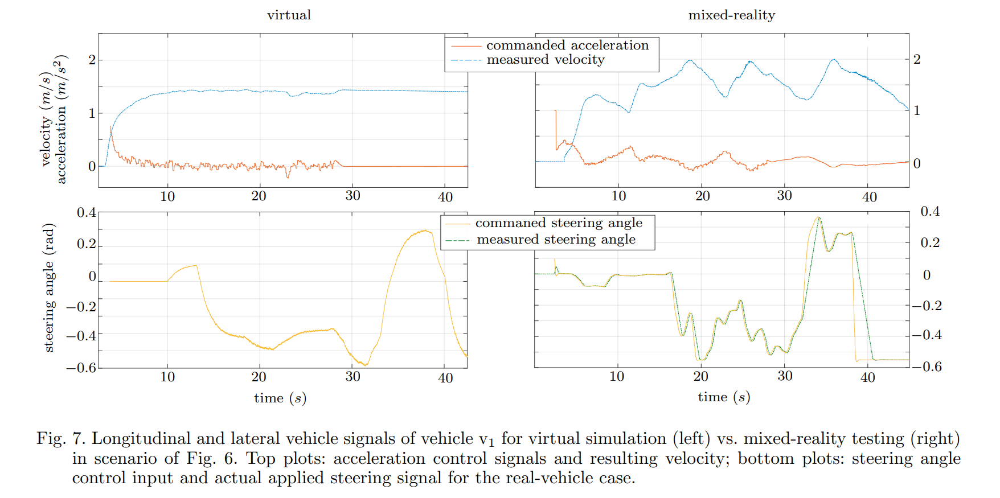
            *   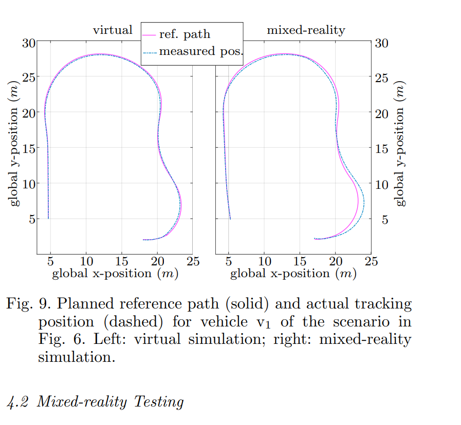
        *   观察到由于车辆间耦合导致的加速度信号噪声，在通过最后一个共享交叉口后消失 (Fig. 7左上)。相对车间距离和交叉口通过时间被记录 (Fig. 8上)。
    *   **混合现实测试 (v1为真实车辆，v2, v3为虚拟车)：**
        *   真实车辆v1在真实停车场（尺寸与虚拟模型部分相似）中运行，其位姿被投影到虚拟世界中。
        *   真实车辆v1的控制信号和测量数据显示，纵向加速度信号比虚拟对应部分波动更大，原因是测试参考速度下离合器的打开和关闭引入了时间延迟 (Fig. 7右上)。
        *   分布式协调系统能够对这些未建模的干扰做出反应，其他虚拟车辆相应调整了行为 (Fig. 8下)。
        *   真实车辆的横向路径跟踪与参考路径存在差距，源于真实车辆转向控制器未建模的横摆率限制 (Fig. 9右, Fig. 7右下)。
    *   **结论：** 分布式控制系统能够稳健地补偿未建模的干扰。混合现实测试提供了一个强大的环境，可以通过与真实世界结果的比较来快速判断虚拟模型的准确性。

*   **总结与展望 ([AVP多车协同混合现实测试论文 Section 5])：**
    *   成功演示了在AVP环境下的混合现实多车仿真实验。
    *   所应用的路径规划（混合A\*）和车辆控制（MPC, LQR）算法被介绍。评估显示了分布式车辆协调控制的鲁棒性和模型保真度检查的有效方法。
    *   未来工作包括考虑车辆控制器的时间延迟模型，以及在操作域中引入不确定性（如行人）。
*   **总结**
    *   1. 本系统是基于停车场场景的，值得注意的是，虽然系统提到了虚拟环境，我其实并没有很理解虚拟环境的作用；看起来只是将真实车辆的位姿导入到虚拟环境中，来查看对底层控制算法的影响。似乎这样的MR并没有什么意义。
#### 2.2.12 基于SENSORIS接口的混合现实汽车测试 (源自 "基于SENSORIS的混合现实汽车测试论文")
布达佩斯技术与经济大学的研究团队提出并实现了一个混合现实汽车测试框架，该框架的核心特点是利用标准化的SENSORIS通信接口，将真实车辆的感知传感器数据（特别是雷达探测）实时反馈并可视化到Unity 3D构建的虚拟环境中。此举旨在推动测试方法的标准化，并结合真实与虚拟元素进行高效测试[15]。

*   **系统目标与核心理念 ([基于SENSORIS的混合现实汽车测试论文 Section 1, 2])：**
    *   **目标：** 开发一个能够实时可视化真实车辆传感器数据的混合现实测试框架，并重点验证通过SENSORIS标准接口实现传感器数据虚拟化的可行性。
    *   **核心理念：** 在场景在环（SciL）的框架下，创建一个包含真实车辆（EGO车辆）及其数字孪生的测试环境。EGO车辆在真实世界中行驶，其传感器（如雷达）探测到的真实物体信息，通过SENSORIS接口发送到中央控制计算机，并在Unity 3D虚拟环境中实时显示。
    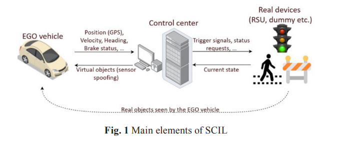
*   **系统硬件架构 ([基于SENSORIS的混合现实汽车测试论文 Section 2.1, Fig. 2])：**
    *   **EGO车辆：** 配备以下传感器和设备：
        *   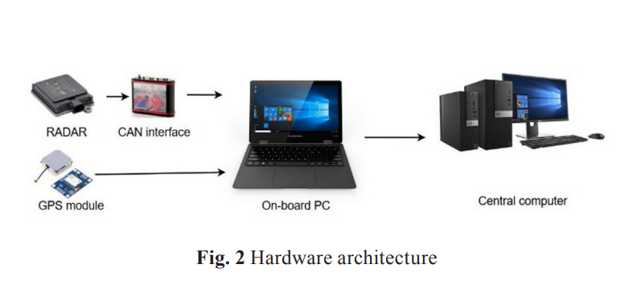
        *   **大陆ARS-408-21远程雷达传感器 (77 GHz)：** 负责探测车辆前方的物体。
        *   **自研RTK-GPS定位单元：** 由两个u-blox ZED-F9P GPS模块和一个LTE GSM模块组成，采用差分结构，提供EGO车辆的位置、速度和航向信息。
        *   **车载PC：** 负责连接传感器（雷达通过Vector CanCaseXL连接CAN总线，GPS通过串口连接），并与中央计算机进行无线通信（可通过V2X设备如Cohda Wireless MK5 OBU或5G技术）。
    *   **中央控制计算机：** 运行控制软件，处理来自真实世界和虚拟世界的数据，并管理测试流程。

*   **系统软件架构 ([基于SENSORIS的混合现实汽车测试论文 Section 2.2, Fig. 3])：**
    *   **开发语言与工具：** 主要使用Python 3.7（利用其丰富的开源库进行快速软件设计）和Unity 3D游戏引擎（用于灵活和逼真的可视化）。
    *   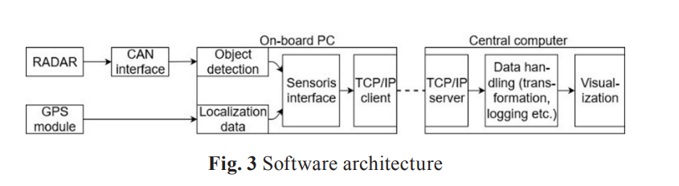
    *   **车载PC软件：**
        *   持续接收和处理来自GPS的UBX和NMEA报文（5Hz）以及来自雷达CAN总线的对象探测数据（16Hz）。
        *   通过两个单槽阻塞队列同步不同频率的传感器数据流。
        *   将定位和对象探测数据封装成SENSORIS数据帧。
        *   通过TCP/IP套接字将编码后的SENSORIS消息发送到中央计算机。
    *   **中央计算机软件（控制软件）：**
        *   作为TCP/IP服务器，接收来自车载PC的SENSORIS消息。
        *   解码SENSORIS消息，将数值赋给EGO车辆及其探测到的物体的虚拟表示。
        *   进行必要的坐标转换（GPS坐标转为场景特定笛卡尔坐标，雷达局部坐标转为全局坐标）。
        *   构建新的消息，通过本地TCP/IP连接发送给Unity 3D可视化模块。
    *   **Unity 3D可视化模块：**
        *   接收来自中央控制软件的消息。
        *   显示EGO车辆的数字孪生，其运动与真实车辆同步。
        *   将被传感器探测到的物体以立方体的形式在虚拟环境中相应位置显示，立方体的大小和透明度可根据探测信息设定（透明度基于存在概率）。
        *   更新频率为50Hz，需要对测量数据进行插值以实现平滑可视化。
    *   **可选组件：** 可集成微观交通仿真软件（如SUMO）来手动或自动规定虚拟对象的轨迹，并模拟大规模交通和交通信号灯状态。

*   **SENSORIS接口的应用 ([基于SENSORIS的混合现实汽车测试论文 Section 2.3, Fig. 4])：**
    *   **作用：** 作为车载传感器与中央计算机（充当车辆云和服务云角色）之间数据通信的标准接口。
    *   **消息编码：** 使用协议缓冲区 (Protocol Buffers) 进行高效压缩和模块化数据消息。
    *   **使用的数据类别：**
        *   **定位类别 (Localization category)：** 存储EGO车辆的GPS坐标、航向、速度及其精度。
        *   **对象探测类别 (Object detection category)：** 包含目标对象的状态、类型、边界框等信息。

*   **校园演示与结果 ([基于SENSORIS的混合现实汽车测试论文 Section 3, Fig. 5, Fig. 6, Fig. 7])：**
    *   **测试场地：** 布达佩斯技术与经济大学校园停车场，该场地在Unity 3D中有精确的厘米级模型 (Fig. 5)。
    *   **测试车辆：** 一辆丰田普锐斯3代，配备了前述的远程雷达和差分GPS。
    *   **过程：** 车辆在停车场内行驶一圈，雷达探测静止的停放车辆。GPS和雷达数据被同步，探测结果实时在Unity 3D中虚拟化显示 (Fig. 6, Fig. 7)。
    *   **结果：** 演示证实了使用标准化SENSORIS接口进行雷达传感器虚拟化在混合现实汽车测试中是可行的。尽管GPS采样率较低，但车辆轨迹平滑。雷达探测数据虽有噪声，但能识别出被探测对象的位置。

*   **结论与未来工作 ([基于SENSORIS的混合现实汽车测试论文 Section 4])：**
    *   成功实现了感知层传感器信号的虚拟化。系统基于被测车辆和测试网络的数字孪生，可由差分GPS、感知传感器和两台无线连接的PC机构建。
    *   主要挑战在于同步两种传感器数据流（GPS和感知）。仿真结果表明，车辆的数字表示能够与现实同步准确地在虚拟世界中移动，探测到的对象也能被充分定位在仿真中。
    *   当前系统以开环方式工作（数据从车到中央计算机单向流动）。下一步是通过传感器欺骗和虚拟传感器模型实现闭环，即虚拟感知传感器扫描虚拟世界并将探测结果传输给车辆，使车辆认为这些虚拟对象是真实的。
*   **总结**
    *   1. 本系统的核心是在虚拟环境中创建真实世界实时扫描到的探测对象
    *   2. 对我们的启发是，如何设计一个通用的接口？
#### 2.2.13 基于ROS的混合现实自动驾驶汽车测试协同仿真架构 (源自 "ROS协同仿真架构论文")

为应对自动驾驶汽车(AV)验证与确认(V&V)的复杂性，特别是需要整合多领域模型以实现全面真实场景再现的挑战，德国FZI信息技术研究中心的研究人员提出了一种基于机器人操作系统(ROS)的协同仿真架构。该架构旨在作为连接不同领域专家模型、真实行人沉浸以及自动驾驶(AD)系统集成的核心，构建一个统一的混合现实测试系统[16]。

*   **核心理念与目标 ([ROS协同仿真架构论文 Section I, III])：**
    *   **挑战：** 现有V&V方法中，仿真环境往往过于理想化，而真实测试成本高、不可复现且难以覆盖所有关键场景。需要一种能结合多领域模型以提供高真实度、同时保持灵活性和可控性的测试方案。
    *   **目标：** 利用ROS作为底层框架，构建一个灵活的协同仿真架构，能够：
        *   集成和耦合不同领域专家的行为模型（如交通流、行人行为）。
        *   支持真实行人通过VR设备沉浸式参与。
        *   集成真实的AD系统（被测系统 SuT）。
        *   为多传感器AD系统的性能评估生成统一的地面真值。

*   **协同仿真软件架构概念 ([ROS协同仿真架构论文 Section III, Fig. 2, Fig. 3])：**
    *   **形式化定义：** 交通场景被视为所有相关实体（车辆V、行人P、交通灯T、被测系统ε）在特定时间t的状态集合Ut。场景的动态演化依赖于各参与者的行为模型（ΩV(t)车辆, ΩP(t)行人, ΩT(t)交通灯）和SuT的行为。
    *   **客户端-多服务器架构 (Fig. 3)：**
        *   **仿真内核 (客户端)：** 作为核心组件，负责管理所有连接的模型，处理参数化和仿真运行时的模型间数据交换。其状态机包括初始化、仿真循环和后处理三个阶段。
        *   **行为模型 (服务器)：** 每个领域专家模型（如交通流模型、行人模型）被封装为一个服务器组件，提供初始化(init)、配置(configure)、步进(step(Δt))、停止(stop)和重置(reset)等服务。
        *   **观察者 (Observers)：** 用于观察和访问地面真值数据，计算性能指标，检查约束条件，并提供图形用户界面以监控仿真内部状态。

*   **基于ROS的实现 ([ROS协同仿真架构论文 Section IV, Fig. 4, Fig. 5, Fig. 7])：**
    *   **ROS节点包装器 (Fig. 4)：**
        *   **同步适配器 (Synchronous Adapter)：** 用于紧密耦合那些能直接反馈成功/失败及行为结果的行为模型。
        *   **异步适配器 (Asynchronous Adapter)：** 用于松散耦合真实实验车辆(ViL)和沉浸式行人（称为avatars），这些实体不提供实时响应。通过缓冲区将可靠的服务调用转换为话题，实现时间偏移的异步集成，并持续检查时间约束和位置质量。
        *   适配器负责协调坐标系、统一数据类型以及模型特定量的可视化。
    *   **ROS IPC (Interprocess Communication)：**
        *   一个专用的ROS节点作为仿真内核，通过ROS的话题(topics)和服(务services)处理通信和数据交换。
        *   `step()`服务 (Listing 1)：请求模型在时间上推进Δt，并将部分环境模型（包含外部控制的交通参与者）作为请求的一部分传递给各模型包装器。服务响应则包含更新后的部分世界模型。
    *   **集成具体模型实例：**
        *   **SUMO (交通流仿真 ΩV(t))：** 通过其TraCI接口与同步适配器包装的ROS节点集成，用于模拟车辆流行为和控制交通信号灯。
        *   **Menge (行人众包仿真 ΩP(t))：** 通过ROS包装器集成，用于模拟行人行为。为处理非圆形动态智能体（如车辆），采用多个圆形子智能体近似表示。
        *   **Unreal Engine (UE) (场景图模型与传感器数据生成)：** 作为统一的场景图引擎，用于生成逼真的传感器数据（如光学相机、LiDAR），以激励沉浸式行人和SuT。通过rosbridge与ROS内核松散耦合（异步适配器），以避免VR可视化卡顿。
    *   **系统交互流程 (Fig. 5, Fig. 7)：** 展示了SuT、沉浸式行人以及各行为模型（车辆流、行人流、信号灯）如何在ROS协同仿真内核的调度下，通过传感器模型（UE生成）、高精度定位和各自的行为逻辑进行交互和状态更新，形成一个闭环的混合现实测试系统。

*   **评估与应用 ([ROS协同仿真架构论文 Section V, Fig. 1, Fig. 6, Fig. 9])：**
    *   **硬件设置 (Fig. 1)：** 构建了一个约5x4.5米的VR CAVE，使用基于IEEE 802.11ad的无线HTC VIVE眼镜和四个Lighthouse追踪系统，工作空间超过25平方米。通过WLAN 802.11p的路侧单元可集成室外的真实实验车辆。
    *   **用例演示 (Fig. 9)：** 在协同仿真中映射了德国巴登符腾堡自动驾驶测试场的一个真实路段。演示了一个危险的“鬼探头”场景，其中SUMO控制的车辆流、Menge控制的行人流、一个示例SuT以及一个沉浸式行人相互作用。rviz用于可视化不同模型的环境模型（如高清地图、行人可行走区域），UE用于生成最终的全局场景图模型并驱动传感器仿真。
    *   **与其他协同仿真框架的比较 (Table I)：** 对比了该ROS方法与FMI、DSP在数据类型、IPC、集成工具和语言支持方面的差异，突出了ROS在集成工具和多语言支持方面的优势。

*   **结论与展望 ([ROS协同仿真架构论文 Section VI, Fig. 8])：**
    *   成功提出了一个基于ROS的协同仿真架构 (Fig. 8 展示了其分层模型)，能够将真实和虚拟的交通参与者集成到一个通用的混合现实框架中，利用ROS的分布式系统建模、IPC和生态系统能力，为HAD功能的广泛V&V提供了支持。
    *   未来研究方向包括：为协同仿真开辟的参数空间开发采样方法；研究引入定位系统时误差传播及其对沉浸式行人和真实车辆仿真结果的影响；调研ROS2在新协同仿真架构移植方面的能力
*   **总结**
    *   1. 本系统的其实是想将一个具有随机性的人作为虚拟对象插入到虚拟环境中，测试车辆的反应
#### 2.2.14 测试场中高度自动驾驶系统安全性评估新框架 (源自 "测试场安全评估框架论文")

为解决高度自动驾驶系统（ADS）在测试场评估中面临的动态交通环境缺乏和测试场景生成困难两大核心问题，密歇根大学的研究团队提出了一个集成了增强现实（AR）测试平台和测试场景库生成（TSLG）方法的新型安全评估框架。该框架已在Mcity测试场通过L4级ADS进行了实地验证[17]。

*   **框架总体设计 ([测试场安全评估框架论文 Section 2, Fig. 1])：**
    *   **目标：** 在测试场环境中准确、高效、经济地评估高度ADS的安全性。
    *   **主要步骤：**
        *   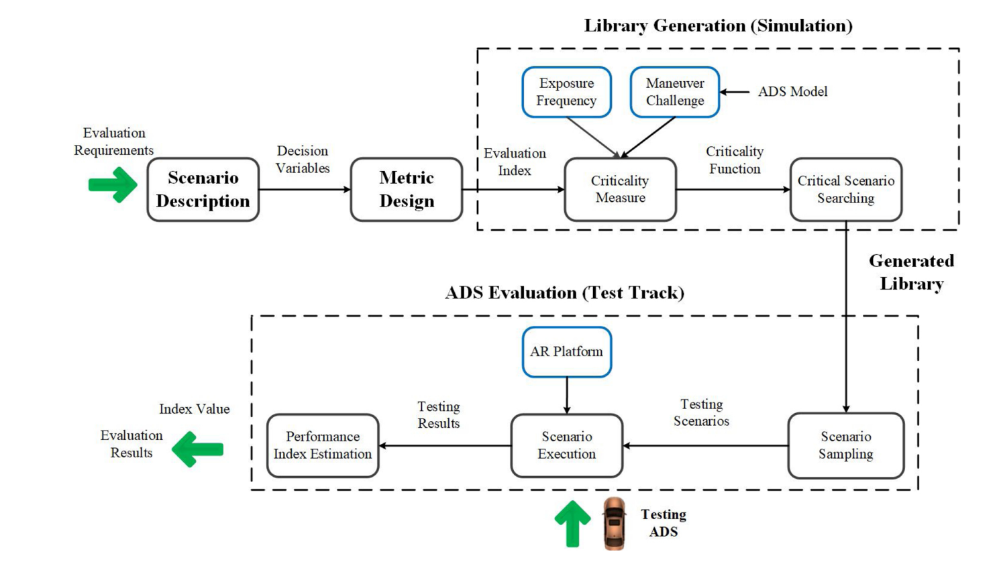
        1.  **场景描述：** 针对给定的操作设计域（ODD），确定场景的决策变量（静态参数θ如道路环境，动态参数x如背景车机动）。
        2.  **度量设计：** 定义量化安全性的性能指标（如事故率 P(A|θ)）。
        3.  **测试场景库生成 (TSLG)：** 核心步骤，旨在找到关键场景子集X_crit。
            *   **场景关键性定义 V(x)：** 结合“机动挑战性” P(S|x,θ)（替代模型SM在场景x中发生事故的概率）和“暴露频率” P(x|θ)（场景x在公共道路上的发生概率）。 `V(x) = P(S|x,θ) * P(x|θ)`。
            *   **替代模型 (SM)：** 用于估计机动挑战性。理想情况下使用与被测ADS特性相似的高级ADS规划模型。
            *   **关键场景搜索：** 采用基于优化的搜索方法（或其他方法如暴力搜索、强化学习），找到关键性值高于阈值的场景，构建场景库。
        4.  **ADS评估：**
            *   **场景采样：** 从生成的库中采用ε-greedy策略采样测试场景。
            *   **场景执行：** 在AR测试平台上执行采样场景，真实ADS与虚拟背景车交互。
            *   **性能指标估计：** 基于测试结果，利用重要性采样理论估计性能指标（如事故率）。

*   **增强现实(AR)测试平台 ([测试场安全评估框架论文 Section 2.4, Fig. 2])：**
    *   **目的：** 在物理测试场中创建逼真的动态交通环境。
    *   **实现：**

        *   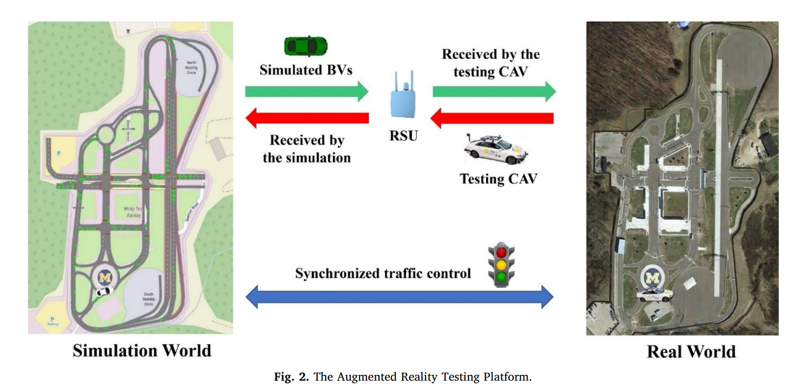
        *   **仿真环境：** 使用VISSIM微观交通仿真软件构建与物理测试场（如Mcity）一致的虚拟路网和基础设施。
        *   **同步机制：** 真实ADS在物理测试场中的运动被实时同步到VISSIM仿真环境中。
        *   **信息反馈：** VISSIM中生成的虚拟背景车辆（BVs）的信息（如BSM报文）通过DSRC无线通信由路边单元（RSU）发送给真实ADS。交通信号灯信息（SPaT报文）也在两世界间同步。
        *   **交互：** 真实ADS能够像在真实交通中一样与模拟的背景交通进行交互。
    *   **优势：** 保证了真实车辆动力学和道路环境的准确性，同时虚拟BVs易于控制和操纵，成本低且安全。

*   **测试场景库生成(TSLG)方法详解 ([测试场安全评估框架论文 Section 3, Fig. 3, Fig. 4])：**
    *   **步骤1：计算所有场景的关键性值 (Fig. 3左)：**
        *   **机动挑战性 P(S|x,θ)：** 通过替代模型(SM)的仿真获得。
        *   **暴露频率 P(x|θ)：** 通过分析自然驾驶数据(NDD)获得。
    *   **步骤2：搜索关键场景集X_crit (Fig. 3右, Fig. 4)：**
        *   采用基于优化的搜索方法。首先进行局部搜索找到一部分关键场景（局部最优解），然后以这些场景为“种子”，通过“种子填充法”扩展构建完整的关键场景库。
        *   搜索方向由替代性安全度量（如最小归一化正向增强碰撞时间nmpETTC）和替代性暴露度量（场景与NDD中高暴露区域的距离）组合的辅助目标函数引导。
    *   **理论基础：** 重要性采样理论。生成场景库等同于构建一个重要性函数q(x)。

*   **Mcity实施与案例研究 ([测试场安全评估框架论文 Section 4, 5, Fig. 5, Fig. 6, Fig. 7, Fig. 8, Fig. 9])：**
    *   **测试平台：** 密歇根大学Mcity测试场，被测ADS为L4级林肯MKZ混合动力自动驾驶汽车。Mcity的路网和基础设施在VISSIM中进行了校准。
    *   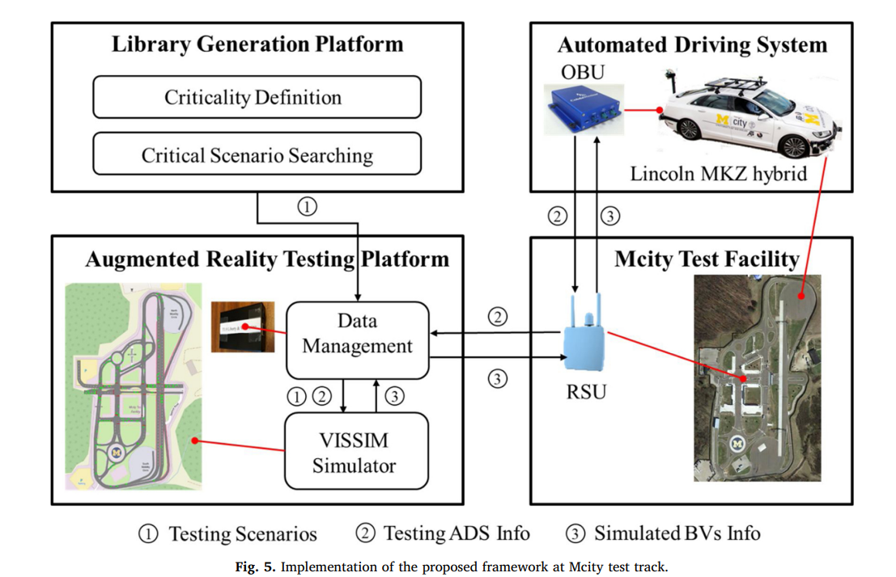
    *   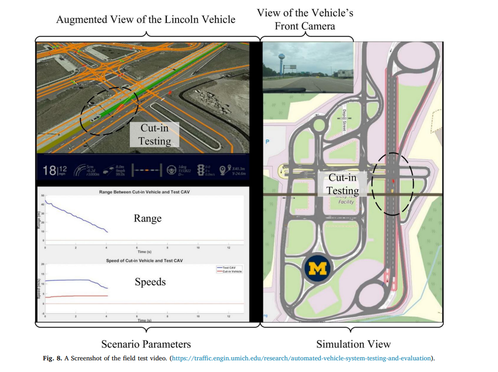
    *   **案例：切入(Cut-in)场景评估：**
        *   **场景描述：** 决策变量为切入时刻的相对距离（Range）和相对速度（Range Rate）。
        *   **NDD分析：** 使用安全试点模型部署(SPMD)项目数据分析切入场景的暴露频率 (Fig. 7a)。
        *   **替代模型(SM)构建：** 使用被测林肯MKZ的高级规划模型——Gipps跟驰模型作为SM (参数见Table 1)。SM的机动挑战性结果 (Fig. 7b)。
        *   **场景库生成：** 计算关键性值 (Fig. 7c)，通过优化搜索得到57个关键场景（约占可行场景的1.67%）。采用ε=0.1的ε-greedy策略采样。
        *   **ADS评估 (Fig. 6为测试示意图, Fig. 8为测试视频截图)：** 在Mcity的AR平台对林肯MKZ进行测试。
        *   **结果 (Fig. 9)：**
            *   **准确性：** 所提方法得到的事故率与基于NDD评估（基线）的结果一致。
            *   **效率：** 达到相同的评估精度（如相对半宽0.2），所提方法需约31次测试，而NDD评估需约3x10^6次测试。评估过程加速约9.87x10^4倍。

*   **结论与展望 ([测试场安全评估框架论文 Section 6])：**
    *   提出的集成了AR测试平台和TSLG方法的新框架，能够在测试场准确高效地评估高度ADS的安全性。
    *   未来工作包括：为AR平台添加传感器仿真组件以测试感知模块；构建更完整的场景类别库；验证框架在高维场景（如高速公路驾驶，多车交互）下的有效性；利用生成的安全关键场景训练和改进ADS模型。
*   **总结**
    *   1. 该系统有着完备的方案与测试场地
    *   2. 其提出的度量指标值得参考
    *   3. 需要重点关注文章提出的场景生成的概念与流程
#### 2.2.15 ARCAR——沃尔沃汽车的混合现实道路驾驶研究平台 (源自 "ARCAR沃尔沃混合现实驾驶论文")

沃尔沃汽车公司开发了一款名为ARCAR的概念验证原型，这是一个基于头戴设备的混合现实(XR)体验，专为在真实道路上完全控制行驶车辆的驾驶员设计。该项目旨在克服现有车载XR应用的局限性，并为未来在安全性、设计、感知质量和消费级应用等领域的研究提供一个强大的平台。

*   **核心理念与创新点 ([ARCAR沃尔沃混合现实驾驶论文 Introduction, Description])：**
    *   **驾驶员中心的XR体验：** 与以往多数研究关注乘客或采用“绿野仙踪”(WoZ)测试不同，ARCAR的驾驶员是车辆的唯一控制者，并在真实行驶（封闭道路）中使用XR头戴设备。
    *   **高端视频透视技术：** 采用Varjo XR-1头戴设备，通过其双1200万像素前置摄像头实现高质量的视频透视，结合实时光照估计和反射映射，以及深度传感器进行手部追踪和分割，实现虚拟内容与真实视频画面的逼真融合。
    *   **低延迟与高保真度：** 系统实现了个位数毫秒级的光子到光子延迟，配合高分辨率显示屏（每度60像素，87度视场角），最大限度减少晕动症，保证了驾驶安全和虚拟内容的真实感。
    *   **双向交互与车辆集成：** ARCAR不仅将虚拟内容呈现给驾驶员，还能将虚拟信息（如虚拟障碍物）反馈给车辆的辅助驾驶系统，触发如碰撞预警和辅助制动等功能。同时，车辆的行驶状态（速度、刹车、档位、方向盘位置、UI控制）也能实时反馈给XR软件，调节混合现实内容。

*   **系统实现细节 ([ARCAR沃尔沃混合现实驾驶论文 Description, Fig. 1, Fig. 2, Fig. 3])：**
    *   **硬件平台：**
        *   **车辆：** 一辆2019款沃尔沃XC90。
        *   **XR头戴设备：** Varjo XR-1，具备视频透视、高分辨率显示和眼动追踪功能。
        *   **头部追踪：** 为克服车内IMU追踪的不可靠性，车辆配备了ART ARTTRACK5/C光学运动捕捉系统，实现对头戴设备的鲁棒、低延迟、高精度6自由度追踪。
        *   **计算单元：** 一台PC负责运行Unity软件，处理信号并向头戴设备传输内容。
    *   **软件平台：**
        *   **核心软件：** 基于Unity构建，负责接收来自多种来源的信号以调节MR内容，并与车辆系统交互。
        *   **动态内容修改：** 支持实时修改动态内容 (Fig. 2)，使ARCAR可作为汽车美学和用户界面快速设计与研究的工具。
    *   **交互示例 (Fig. 3)：**
        *   可以在真实道路上投射虚拟障碍物。这些障碍物不仅显示在驾驶员的头戴设备中，也会被车辆的传感器（通过软件接口模拟接收）“感知”到，从而触发车辆的辅助驾驶功能。
        *   结合眼动追踪，系统可以识别驾驶员对虚拟障碍物的注意力和反应，并相应调节车辆的辅助响应。
    *   **安全性：** 除车辆本身已有的辅助驾驶功能（如车道保持、辅助制动）外，ARCAR原型增加了一个位于驾驶员和前排乘客之间扶手上的紧急停止按钮，按下后可中止所有系统。

*   **研究价值与未来工作 ([ARCAR沃尔沃混合现实驾驶论文 Introduction, Future Work and Conclusion])：**
    *   **研究平台：** ARCAR旨在成为一个多功能研究平台，用于探索：
        *   驾驶员分心、感知空间感、视野、可达性、感知质量等。
        *   驾驶员对各种刺激的注意力和反应。
        *   自动驾驶和辅助驾驶功能的切换交互。
        *   新颖的驾驶体验、汽车安全与可用性、产品设计工作流程及研究方法。
    *   **未来方向：**
        *   通过定性研究探索三个不同视角：面向消费者的应用、作为研究工具的人因研究参与者体验、以及可能被ARCAR丰富的设计师工作流程。
        *   预计ARCAR的影响将是深远的，其意义将超越汽车和人机交互领域。

*   **对现有挑战的解决方案：**
    *   **头部追踪：** 通过集成光学运动捕捉系统解决了车内IMU追踪的难题。
    *   **晕动症：** 通过使用高性能组件实现低延迟和高刷新率，最大限度地减少了晕动症。
    *   **其他挑战：** 为进一步研究如社会可接受性等问题提供了平台。

    ARCAR项目展示了在真实驾驶车辆中实现沉浸式、交互式混合现实体验的可行性，为汽车行业的人机交互研究、产品设计和未来驾驶体验的探索开辟了新的道路。
*    **总结：**
     *    1. 本系统是针对真人驾驶员的，通过佩戴vr头盔，研究驾驶员对虚拟世界中的各种场景进行决策时的反映能力
#### 2.2.16 微缩尺度下混合现实自动驾驶汽车仿真的HIL架构实现 (源自 "微缩HIL架构论文")

法国贝尔福-蒙贝利亚技术大学等机构的研究人员，在SURATRAM（城乡自主货物运输系统）项目背景下，实现了一个微缩尺度的硬件在环（HIL）架构，用于自动驾驶汽车的混合现实仿真。该工作的初步目标是研究控制算法在接收模拟摄像头数据与真实摄像头数据时执行时间的差异[19]。

*   **项目背景与动机 ([微缩HIL架构论文 Section I])：**
    *   SURATRAM项目旨在通过部署自动驾驶货车车队来革新城乡货运，货车将以列队形式跟随现有的人工驾驶公交车或有轨电车。
    *   对列队算法的广泛测试是必要的，但真实车辆测试成本高昂且受限。因此，采用HIL方法，将真实硬件（微缩车）集成到仿真环境中进行测试。
    *   微缩车HIL平台作为未来全尺寸车辆HIL实现的预研步骤。

*   **HIL架构设计 ([微缩HIL架构论文 Section III, Fig. 3])：**
    *   **目标：** 实现微缩车及其“网络孪生”(cyber-twin)在仿真和真实世界中跟随模拟巴士。架构允许控制算法交替使用来自仿真或真实小车的传感器数据。
    *   **全局架构 (Fig. 3)：**
        *    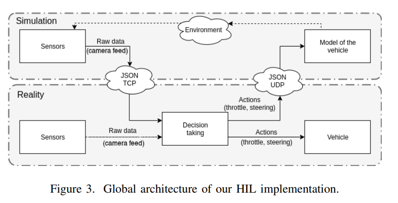
        *   **仿真端（PC运行）：**
            *   运行仿真环境（Unity3D），更新车辆位置和速度。
            *   发送模拟传感器读数（摄像头画面、里程计）到网络。
            *   接收来自真实微缩车的动作指令（油门、转向角）并更新仿真状态。
        *   **真实车辆端（微缩车嵌入式硬件运行）：**
            *   接收来自仿真端或自身真实传感器的原始数据。
            *   运行决策单元（控制算法）。
            *   输出动作指令，同时发送给仿真器和车载ECU（电子控制单元）。
    *   **仿真器架构 (Unity3D)：**
        *   使用Unity3D游戏引擎（集成PhysX 4.1物理引擎）构建仿真环境。
        *   包含微缩车和巴士的通用3D模型，动力学参数初步任意设定。
        *   巴士可由用户控制或沿预定义样条线行驶。
        *   虚拟传感器包括虚拟摄像头和测量车轮转速的转速计。
    *   **软件架构 (ROS)：**
        *   仿真层由Unity3D管理，通过脚本将JSON格式的仿真器输出（摄像头画面、里程计）通过局域网转发给真实小车。
        *   真实小车上的ROS网络处理接收到的观测信息。
        *   输出的动作指令同时转发给ECU和仿真器。
        *   ROS用于传感器驱动集成、多机通信、可视化和数据记录回放。
        *   **简化的传感器处理与控制算法：**
            *   **摄像头处理：** 在巴士后部使用ArUco标记。一个ROS节点 `/aruco_detect_node` 接收摄像头流（模拟或真实），输出标记相对于摄像头的坐标系。
            *   **控制算法：** 计算小车与巴士的相对距离，输入PID控制器，输出油门指令。小车的航向误差（摄像头中心与ArUco标记横向位置的角度差）输入另一个PID控制器，输出转向指令。
    *   **硬件架构（微缩车）：**
        *   尺寸：长25cm，宽14cm，四轮驱动，前轮转向，后轮驱动。
        *   车载计算机：树莓派4，运行ROS服务器，通过Wi-Fi与仿真计算机通信。
        *   执行器：转向角和油门指令通过GPIO引脚传输到外部ECU，开环控制电机。
        *   摄像头：前置摄像头，分辨率640x480px，帧率10Hz。

*   **实验与初步结果 ([微缩HIL架构论文 Section IV, Fig. 4, Fig. 5])：**
    *   **实验一：真实小车由仿真引导 (HIL模式)：**
        *   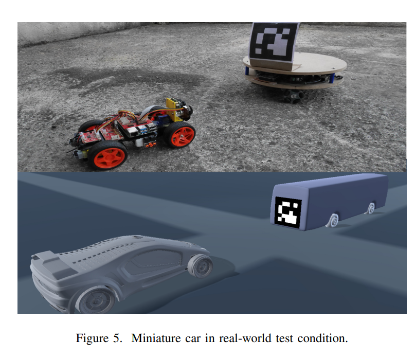
        *   仿真中的虚拟巴士沿预定轨迹行驶，虚拟小车跟随。
        *   真实微缩车执行与虚拟孪生相同的动作。
        *   通过视觉确认微缩车的运动与仿真同步且一致。
    *   **实验二：真实硬件在真实世界条件下运行：**
        *   一个手动控制的三轮机器人扮演真实世界中的巴士（后部贴有ArUco标记）。
        *   微缩车运行相同的软件，使用真实摄像头数据。
        *   通过视觉评估，小车能够跟随机器人，行为与实验一相比无显著变化 (Fig. 5)。
    *   **执行时间测量 (Fig. 4)：**
        *   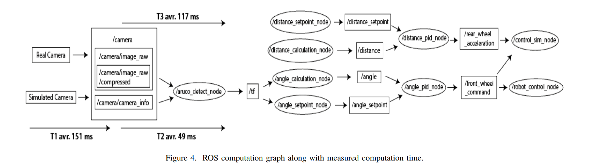
        *   测量了从仿真端渲染虚拟摄像头画面到ROS网络接收到的延迟(T1)，以及ArUco检测节点处理模拟(T2)和真实(T3)摄像头数据所需的时间。
        *   摄像头帧率设定为5Hz（ArUco检测包在当前硬件上能处理的最大频率）。
        *   结果显示，即使代码和硬件相同，仅视频流内容不同（模拟图像清晰、噪声少 vs 真实图像复杂、有噪声），处理真实摄像头数据(T3)的延迟也显著高于处理模拟数据(T2)。这可能由图像处理算法（如ArUco检测）的迭代次数随输入图像复杂度和噪声变化导致。

*   **结论与未来工作 ([微缩HIL架构论文 Section V])：**
    *   成功展示了在微缩尺度上实现自动驾驶汽车HIL的用例，验证了所选仿真、软件和硬件组合的有效性。
    *   全局架构在传感器信息来自模拟或真实环境时，均能产生相似的动态行为，但在计算时间上观察到了差异。
    *   强调了选择执行时间固定的算法的重要性，无论输入复杂度如何。
    *   未来工作：
        *   通过增加额外传感器（车上或测试环境中）获取“地面真值”，量化模拟车与其真实对应物之间的动力学差异。
        *   研究ROS2在降低延迟方面的性能。
        *   使用更先进的、无需在被跟随车辆上做修改的计算机视觉算法。
        *   最终目标是将这些经验应用于真实的自动驾驶汽车平台，开发新颖的MR架构，例如将虚拟障碍物叠加到真实摄像头画面上，以改进控制算法性能并缩短开发时间。
*   **总结**
    *   该项目与我方案类似；其实验一与我系统中的跟随autoware指令任务完全相同；但是其定位方法存在局限性
#### 2.2.17 基于ROS和Unity 3D的移动配送机器人混合现实仿真 (源自 "移动配送机器人MR仿真论文")

奥地利林茨约翰内斯开普勒大学等机构的研究人员提出了一种基于机器人操作系统(ROS)和Unity 3D游戏引擎的混合现实(MR)仿真方法，专为移动配送机器人设计。该方法旨在通过同步真实与虚拟环境，并利用真实机器人的传感器信息进行定位和交互，从而实现更真实可靠的多机器人仿真[20]。

*   **核心理念与目标 ([移动配送机器人MR仿真论文 Section I, III])：**
    *   **目标：** 开发一种方法，使基于ROS的真实移动机器人能够与Unity 3D构建的虚拟环境进行混合现实交互。真实机器人利用自身传感器定位并将其状态投影到虚拟世界，形成“虚拟分身”(virtual doppelganger)，该分身可以感知虚拟环境。同时，真实机器人也能感知到虚拟世界中的对象。
    *   **优势：** 允许少量真实机器人与大量虚拟机器人结合进行多机器人仿真，提高仿真结果的真实性和可靠性，同时提升系统效能。

*   **匹配虚拟与物理世界的方法 (MR实现) ([移动配送机器人MR仿真论文 Section III, Fig. 1, Fig. 2, Fig. 3])：**
    *   **第一阶段：Unity 3D中的可视化与投影：**
        *   **AR Foundation应用：** 利用Unity 3D的AR Foundation包在智能移动设备（如安卓手机）上实现AR功能。主要使用其平面检测功能将虚拟场景叠加到检测到的真实平面上，并利用世界追踪功能保持虚拟对象与真实环境的相对位置。
        *   **环境建模与坐标系匹配：**
            *   基于机器人扫描的2D地图（如Lidar地图），在Unity中手动建模环境，创建带有碰撞体的游戏对象，而非简单使用点云。
            *   精确缩放模型，使Unity中的单位长度与现实中的米对应 (Fig. 2a)。
            *   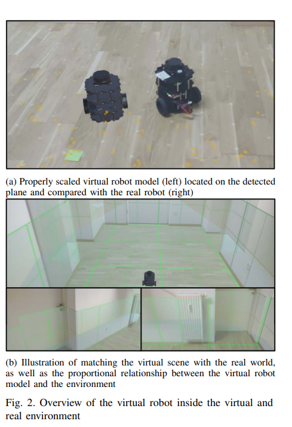
            *   通过调整Unity游戏对象的层级结构，使虚拟环境的局部坐标系与ROS的原点对齐，并消除缩放影响。
        *   **设备安装与测试：** 将实现的AR应用安装到安卓智能手机上。启动APP后，移动设备摄像头完成环境平面检测。通过触摸屏手势（点按、拖拽）微调虚拟环境的变换，使其与真实环境匹配 (Fig. 2b)。环境初始化时同时建立Unity与ROS的连接。
    *   **第二阶段：ROS中的自定位与数据共享 (Fig. 1)：**
        *   **机器人自定位：** 使用ROS的`amcl`包（一种概率定位系统）使真实机器人在2D环境中进行自定位，获取其位置和姿态。
        *   **数据共享：** 机器人的位姿信息通过ROS的`tf`系统共享。
        *   **虚实映射：** 由于虚拟和真实场景的地图及坐标系已完全匹配，单个真实机器人的位姿可以被准确映射到虚拟空间中 (Fig. 3a)。
        *   **双向感知：**
            *   真实机器人投影到虚拟空间后，其“虚拟分身”可以发射另一组（虚拟的）激光扫描。将这些扫描数据发送回ROS，真实机器人便能感知到虚拟对象。
            *   最终的AR视图在移动设备上呈现，其中真实机器人旁边可能会显示一个半透明模型作为其“虚拟分身”以更好地区分 (Fig. 3b)。
            *   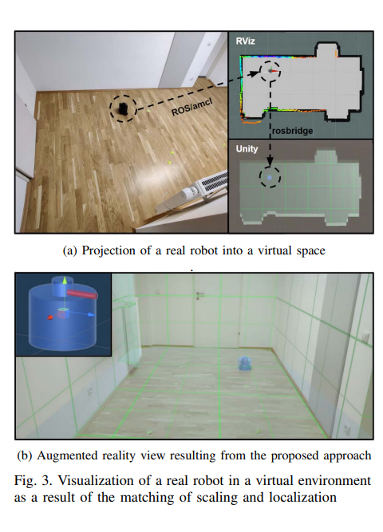

*   **系统评估与用例 ([移动配送机器人MR仿真论文 Section IV, Fig. 4, Fig. 5, Fig. 6])：**
    *   **用例一：机器人跟随行为 (Fig. 4)：**
        *   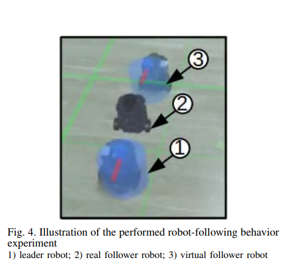
        *   场景：一个真实的领导机器人 (leader robot)，一个虚拟的跟随机器人 (virtual follower robot)，以及一个真实的跟随机器人 (real follower robot) 依次跟随。
        *   实现：
            *   领导机器人自定位，将其位置投影到虚拟环境生成分身。
            *   虚拟跟随机器人在Unity环境中，直接获取自身变换信息并传输给ROS共享。它通过虚拟激光扫描感知领导机器人的分身。
            *   真实跟随机器人通过扫描真实环境自定位，投影到虚拟空间。然后利用其分身的激光扫描信息感知前方的虚拟跟随机器人，并进行跟随。
        *   结果：成功验证了使用Unity为基于ROS的机器人执行MR仿真的可行性。真实机器人的变换信息被准确投影，真实与虚拟机器人间建立了相互感知。
    *   **用例二：多机器人环岛进出行为 (Fig. 5, Fig. 6)：**
        *   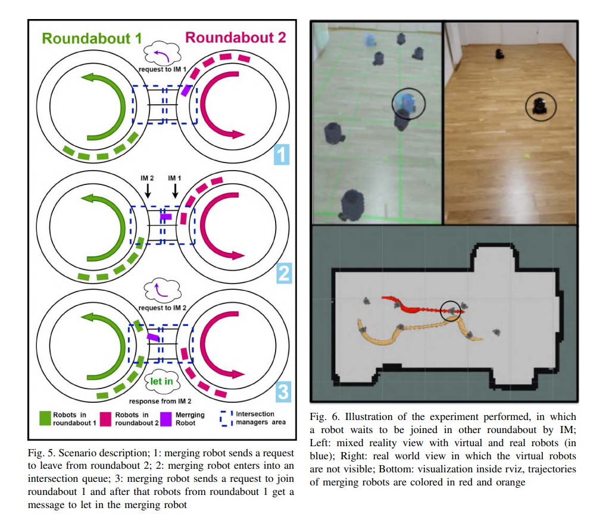
        *   场景：八个Turtlebot3机器人（两个真实，六个虚拟）在包含两个单车道环岛和连接它们的双向两车道道路的场景中运行。
        *   实现：
            *   每个机器人通过自定位获取位姿并共享。
            *   机器人被初始化在环岛上形成交通队列，以不同速度用PID控制器沿车道行驶。
            *   通过手动请求，一个机器人离开当前队列，驶向另一个环岛并安全汇入。
            *   **速度控制与碰撞避免：**
                *   在环岛上，使用基本线性控制根据Unity内模拟LIDAR传感器获取的距离调整机器人速度以避免碰撞。
                *   环岛的入口和出口由一个自主交叉口管理器(IM)控制交通 (Algorithm 1)。每个环岛有其自己的IM。机器人进入IM区域时发送当前速度和运动类型（离开、跟随、进入）给IM。IM基于FIFO原则处理请求，计算到达交叉口时间(TTI)，检测潜在冲突，并调整后续机器人的速度。
        *   结果：IM成功更新了真实机器人（图中圆圈标记）的速度，使其避免与环岛内的模拟机器人碰撞 (Fig. 6)。验证了方法的稳定性，真实或虚拟机器人的位姿信息均能实时准确更新，相互感知有助于避碰。

*   **结论与未来工作 ([移动配送机器人MR仿真论文 Section V])：**
    *   所提出的基于混合现实的方法可用于测试配送机器人在逼真仿真框架中的行为和交互。
    *   通过Unity和ROS成功实现了虚拟与真实环境的匹配以及虚拟与真实机器人的相互感知。
    *   未来工作包括：动态执行空间映射以提高MR应用的普适性，并将成果集成到3DCoAutoSim仿真框架的“自动驾驶汽车”选项中。
*   **总结：**
    *   1. 针对定位系统而言，此系统是将虚拟与真实的环境进行融合的产物，其real_car使用lidar+imu获得自己在场景中的位姿，并将其更新到simulator中以生成sim_car，sim_car会根据在simulator中获得的与其他纯虚拟小车的相对信息进行跟随、避障等操作。
    *   2. 该系统其实是对一些子功能进行验证的系统；并不能对autoware这类完备的系统进行测试。
#### 2.2.18 基于混合现实的自动驾驶汽车测试方法 (源自 "自动驾驶混合现实测试方法论文")

针对自动驾驶汽车在复杂环境下安全测试的需求，齐鲁工业大学（山东省科学院）自动化研究所的研究人员提出了一种基于混合现实的自动驾驶汽车测试方法。该方法旨在结合虚拟仿真与真实测试的优势，构建一个闭环的测试系统，以满足各种场景下的测试要求[21]。

*   **方法核心理念与框架 ([自动驾驶混合现实测试方法论文 Section II.A, Fig. 1])：**
    *   **目标：** 克服传统测试方法（如纯仿真真实性不足、真实路测风险高场景覆盖难）的局限性，提供一种充分、安全、可靠的自动驾驶功能测试方案。
    *   **基本流程 (Fig. 1)：**
        *   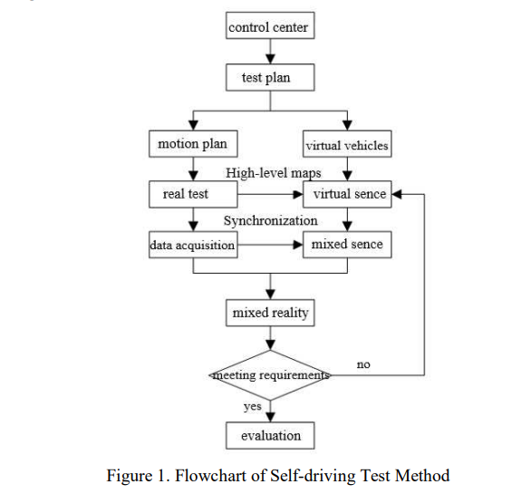
        1.  **虚拟场景与车辆建模：** 根据主车（被测自动驾驶车）的测试需求，进行虚拟场景构建和任务制定。
        2.  **虚实映射：** 将虚拟仿真环境和控制指令映射到真实的和虚拟的背景车辆。
        3.  **同步交互：** 通过背景车辆与控制中心的耦合操作，使控制指令和车辆状态同步作用于主车。
        4.  **测试与评估：** 利用灵活的仿真场景和测试用例全面测试主车的安全性能，并输出测试评估结果。

*   **混合现实系统构建 ([自动驾驶混合现实测试方法论文 Section II.B, Fig. 2])：**
    *   **系统组成 (Fig. 2)：** 测试场、控制中心、背景车。
        *   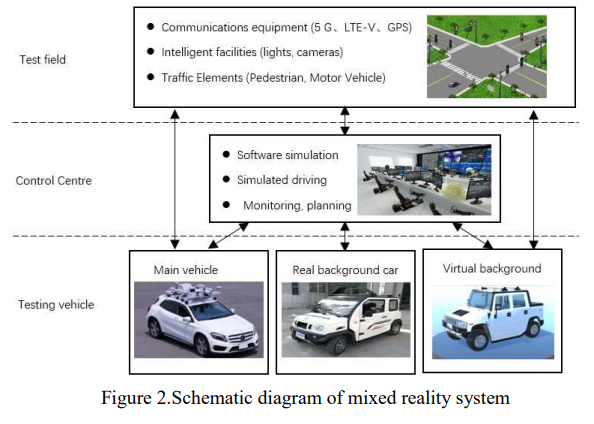
    *   **测试场：**
        *   提供真实的测试环境。
        *   配备车联网通信设施、路边单元、智能交通基础设施和差分GPS基站，形成“车-路”和“车-车”即时交互的智能生态系统。
        *   记录测试过程中产生的实时数据。
    *   **控制中心：**
        *   通过人机交互对背景车辆进行路径规划、行为模拟、监控和远程控制。
        *   建立虚拟仿真环境，将主车和背景车的真实数据映射到仿真系统中，同步再现实际场景下的测试过程。
        *   通过在虚拟仿真环境中添加虚拟车辆等元素，构建更复杂或危险的测试场景。
    *   **背景车：** 可以是真实的物理车辆，也可以是虚拟仿真环境中的虚拟车辆。
    *   **交互实现：** 通过自驾测试车、实际背景车和虚拟测试车的交互实现混合现实测试，并对测试数据进行分析评估。

*   **自动驾驶测试方法实现步骤 ([自动驾驶混合现实测试方法论文 Section II.C])：**
    1.  **构建虚实对应的测试场：** 建立与实际测试场对应的虚拟测试场，模拟实际交通环境。虚拟软件提供物理世界信息输入接口和虚拟世界控制输出接口，实现虚拟仿真与物理车辆的镜像操作。
    2.  **创建典型场景并复现：** 利用背景车辆、标志、障碍物等道具在实际测试场创建典型场景（如AEB测试），检验主车行为是否达到预期目标。结合实际测试场、主车和背景车的实时数据，在虚拟测试场中复现场景。
    3.  **生成测试用例并闭环反馈：** 在虚拟仿真环境中添加虚拟背景车或传感器生成测试用例。将仿真环境中运行的测试用例转换为驱动主车和实际背景车的控制指令。然后，通过网络层将实际测试数据反馈到仿真环境，实现虚实同步的闭环反馈测试。
    4.  **多维度评估：** 利用测试过程中收集的主车和交通环境数据，结合给定的测试任务，通过多指标和多时空维度评估自动驾驶汽车的安全性、舒适性和效率。

*   **案例验证：自适应巡航控制(ACC)测试 ([自动驾驶混合现实测试方法论文 Section III, IV, Fig. 3, Fig. 4, Table I, Table II])：**
    *   **测试场景 (Fig. 3)：**
        *   低速/减速/静止场景：主车激活ACC后，前方分别出现低速、减速、静止的背景车。
        *   切入/切出场景：背景车在一定距离内切入主车道或从主车道切出。
        *   多车场景：主车跟随背景车，并逐渐接近和超过邻近车道的另一辆低速背景车。
    *   **测试过程（以切入场景为例）：**
        1.  建立虚拟与实际环境的映射关系，设置路网地图和通信连接。
        2.  给虚拟背景车分配任务（路径、类型、ID），并同步传输给实际背景车。
        3.  开始测试，主车加速至目标速度，背景车按预定轨迹和速度进入运行状态。实时收集主车和背景车的运行数据，并在仿真环境中同步反映虚拟车辆状态。
        4.  若满足测试要求，则评估性能；否则返回步骤2。
    *   **测试结果与评估（以一次切入测试为例 - Table I, Table II, Fig. 4）：**
        *   **参数设置 (Table I)：** 例如主车速度50km/h，背景车速度30km/h，切入速度3.6~7.2km/h。
        *   **数据记录 (Table II)：** 记录切入前后主车和背景车的位置、航向角、速度、加速度、最小车间时距、横向偏离等。
        *   **行为分析 (Fig. 4)：** 主车在18s检测到前方切入的背景车，采取正确的制动措施，车速明显减慢。背景车完成切入动作后，主车速度降至最低约26km/h，然后自动提速以接近背景车速度约30km/h，两车达到稳定运行状态。整个过程无过度制动和加速现象。
        *   **通过标准：** 重复测试20~30次，若通过率超过90%，则认为主车通过该场景测试。

*   **结论与展望 ([自动驾驶混合现实测试方法论文 Section V])：**
    *   提出的基于混合现实的自动驾驶测试方法为自动驾驶测试技术提供了新思路。
    *   目前基于场景的自动驾驶测试技术仍处于探索阶段，需要在测试模式、测试场景库构建、测试工具链设计、测试用例设计等方面进一步研究。
*   **总结：**
    *   1. 提出了想法但未见具体系统的构建
    *   2. 文章提到了混合现实，但在测试部分基本都是在虚拟环境中完成的。
#### 2.2.19 基于5G的V2X场景在环自动驾驶演示 (源自 "5G场景在环演示论文")

布达佩斯技术与经济大学及爱立信匈牙利等机构的研究人员，在匈牙利M86高速公路和ZalaZONE试验场进行了一系列基于5G网络的自动驾驶演示。这些演示采用了场景在环（SciL）的方法，即真实车辆（被测车辆VUT）在物理世界中行驶，同时其数字孪生在虚拟世界中与模拟的或真实感知的触发因素进行交互，并通过5G网络实现两者间的实时信息交换和控制。该研究旨在评估当前5G非独立组网（NSA）架构在支持V2X通信场景下的可行性，特别是关注延迟和吞吐量等关键性能指标[22]。

*   **核心理念与目标 ([5G场景在环演示论文 Abstract, Section 1, 2.3])：**
    *   **目标：** 演示5G技术在支持自动驾驶V2X通信，特别是SciL测试方法中的应用，并评估其在真实场景下的网络性能。
    *   **SciL方法 (Fig. 2)：** 物理车辆在真实环境中行驶，其行为受自身传感器以及来自其数字孪生环境（虚拟世界）的信息共同影响。虚拟世界中的障碍或事件通过5G网络传递给真实车辆，使其做出相应反应。这种方法结合了物理测试的真实性和虚拟测试的灵活性与可重复性。
    *   **5G的角色：** 提供低延迟、高带宽的通信链路，确保真实车辆与其数字孪生之间以及与其他V2X实体之间的实时、可靠信息交换。

*   **演示场景与设置 ([5G场景在环演示论文 Section 3, Fig. 1, Fig. 3, Fig. 4, Fig. 5])：**
    *   **地点：**
        *   **ZalaZONE试验场智能城市区域 (Fig. 1)：** 用于SciL演示，该区域已被激光扫描并创建了厘米级精度的数字孪生。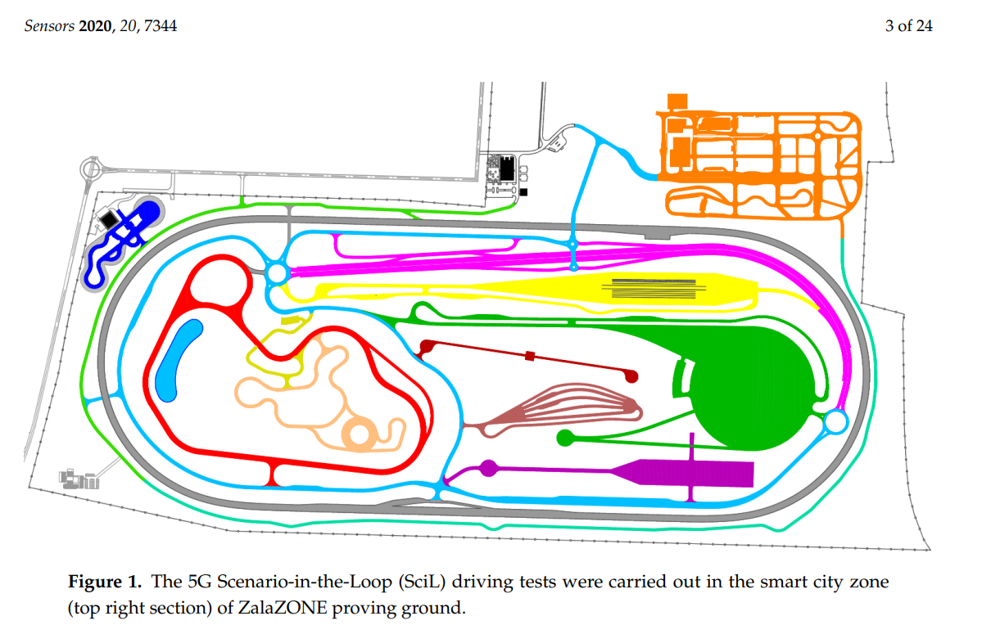
        *   **M86高速公路（临时封闭路段） (Fig. 5)：** 用于5G网络性能测量活动，收集车辆和基础设施数据。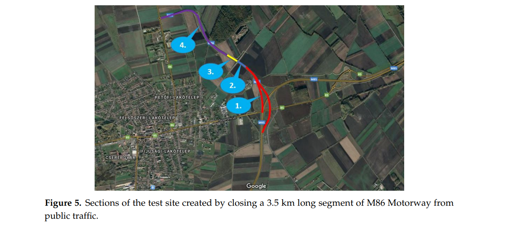
    *   **BME自动驾驶仿真演示 (ZalaZONE)：**
        *   **车辆：** 一辆自动驾驶测试车(VUT)。
        *   **场景1：“代客泊车” (Valet Parking)：** 车辆自动响应手机呼叫进行泊车或前往呼叫者位置。途中，虚拟行人和受控的真实行人横穿车辆路径，VUT成功停车避让 (Fig. 3, Fig. 4)。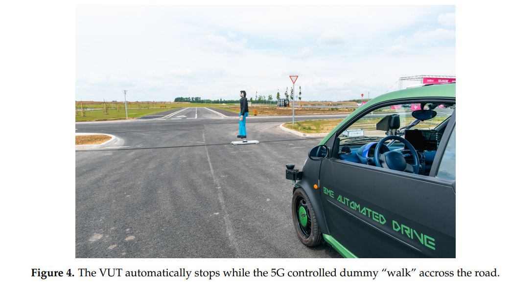
        *   **场景2：“交通拥堵辅助” (Traffic Jam Pilot)：** 车辆自动驾驶，根据摄像头检测到的车道线进行转向，并根据前方车辆调整速度。VUT先后跟随了虚拟车辆和真实车辆。
        *   **通信：** 车辆、仿真环境和受控测试对象之间的通信通过5G网络实现。
    *   **M86高速公路测量活动：**
        *   **目标：** 记录对后续自动驾驶技术研发至关重要的车辆和基础设施数据。
        *   **参与者：** 多所大学和汽车公司。
        *   **设置：** 道路完全封闭，所有测量车辆配备高精度GNSS发射器。沿途部署了光纤通信网络、传感器、摄像头、可变信息标志(VMS)以及移动5G基站。

*   **SciL演示架构 ([5G场景在环演示论文 Section 4, Fig. 6, Fig. 7])：**
    *   **高层架构 (Fig. 6)：**
        *   **设备 (Devices)：** 现场数据提供者或消费者（如VUT、路边传感器、物理行人假人）。
        *   **现场计算机 (On-site computer)：** 运行SciL仿真，实现数字孪生，直接从设备和数据收集系统(DCS)接收数据。
        *   **数据收集系统 (Data Collector System, DCS)：** 收集和分发系统中的各种数据。
        *   **外部算法运行平台 (External Algorithm Running Platform)：** 可选，用于接收和分析DCS数据以提供进一步洞察。
    *   **现场计算机架构 (Fig. 7)：**
        *   **交通模拟器 (Traffic simulator)：** 生成VUT周围的虚拟交通并在仿真环境中显示。
        *   **可视化 (Visualization)：** 显示交通模拟器的虚拟现实和检测到的环境。
        *   **调度器 (Dispatcher)：** 处理、转换和传输来自附加组件的消息，将接收到的数据转发到所需子系统。
        *   通过设备接口与场景中的设备通信，发送控制命令、虚拟对象位置，并接收设备检测到的信号和对象。
    *   **系统需求 (Table 1)：** 区分高优先级（硬实时，如控制指令）和低优先级（软实时，如视频流）数据，对延迟、可靠性有不同要求。

*   **5G网络配置与测量 ([5G场景在环演示论文 Section 5, Fig. 8, Fig. 9, Table 2])：**
    *   **网络架构：** 采用5G NSA Option 3.X架构，下行链路使用5G新空口，上行链路和核心网仍依赖LTE EPC。爱立信提供5G天线系统和移动核心网解决方案。
    *   **设备：** VUT配备5G NSA调制解调器（WNC 5G袖珍路由器）。
    *   **数据类型 (Table 2)：** 收集GNSS坐标、方向、速度、加速度、动态对象（摄像头/激光雷达/雷达/V2X）、车道位置/几何形状等。
    *   **测量方法：**
        *   在车辆移动过程中，通过改变数据包到达间隔时间(IAT)和数据包长度(PL)来测量端到端往返时间(RTT)。
        *   测量了架构中不同连接点之间的延迟 (Fig. 9中的T0-T5)，以估算无线链路(gNB-UE)的延迟。
    *   **参考测量：** 在对称新空口资源的公共5G网络上进行了额外的RTT测量，以消除NSA架构的非对称效应。

*   **测量结果与分析 ([5G场景在环演示论文 Section 6, Fig. 10-16, Table 3, Table 4, Table 5])：**
    *   **5G NSA性能 (Table 3, Fig. 10-15)：**
        *   与4G相比，5G NSA在下行峰值速率和延迟方面表现显著更优。上行速率与4G相似（因使用相同eNB）。
        *   RTT中值随车速增加而增加。大数据包长度（导致分段）会增加RTT分布的离散度和偏度。
        *   估算的gNB-UE间无线链路平均延迟约为4.2ms，符合预期。
    *   **对称5G网络参考RTT (Fig. 16, Table 4)：**
        *   在商用5G网络（上下行均为5G）上，使用40字节数据包可稳定达到约9ms的RTT。单向延迟可视为RTT的一半，即约4.5ms。
    *   **V2X场景支持能力 (Table 5)：** 基于3GPP TS 22.186标准，当前5G NSA网络解决方案已能支持多种V2X用例，特别是自动化程度较低的场景，如车辆编队协同驾驶、信息共享、交叉口安全和协同换道等。

*   **结论与展望 ([5G场景在环演示论文 Section 7])：**
    *   成功演示了5G支持的自动驾驶SciL测试，验证了5G NSA在真实V2X场景下的通信能力。
    *   SciL方法结合5G能够更快、更经济有效地开发和测试自动驾驶系统。
    *   未来研究方向包括：开发更复杂的SciL交通案例；对即将到来的5G独立组网(SA)架构进行延迟测量；进一步研究URLLC。
*   **总结**
    *   是爱立信的5G在环场景的V2X数据包有效性验证
### 2.3 技术发展趋势 
*   **领域自适应 (Domain Adaptation):** 利用MR生成多样化场景（天气、路况、交通）以扩充训练数据，减少源域与目标域差异，弥合现实差距。例如使用Faster R-CNN检测MR环境中的真实和虚拟元素 ([95, 96])。
*   **在MR环境中训练AI模型：** 实现动态实时反馈，模型在训练时与模拟环境主动交互并即时调整，有望提升性能和泛化能力，减少碰撞 ([53])。
*   **增加复杂性和真实感：** 引入更复杂的虚拟环境元素，如动态交通信号、临时标志、道路封闭、复杂道路拓扑（十字路口、环岛、匝道合并等）、恶劣天气条件（雨、雪、雾）下的虚拟障碍物 ([98-100])。
*   **共享MR环境与V2X通信：** 利用MR测试车联网（V2X）通信，包括V2V, V2P, V2I, V2N。评估CAV在混合交通流中的表现，集成交通流模拟器（如SUMO）与MR框架，通过5G实现真实车辆与虚拟元素间的近实时连接 ([71, 101, 102])。

### 2.4 关键技术点与难点 

*   **关键技术点 (已在2.1中提及，此处总结)：**
    *   高保真度环境模拟与渲染
    *   真实与虚拟元素的无缝融合与交互
    *   精确的数字孪生技术
    *   低延迟的数据同步与通信
    *   可靠的传感器模拟与数据融合
    *   有效的MR场景下AI模型训练与评估方法
*   **主要技术难点/挑战 (根据该文献 Section VI "POTENTIAL CHALLENGES")：**
    *   **数字孪生精度与实时性：** 准确反映真实对应物的物理特性和动态行为，并保持实时同步，对建模、传感器和算力要求高。([MR综述 Section VI.A], [VIMS论文 结论提及通信延迟])
    *   **时间延迟与同步：** 系统各环节的累积延迟和抖动影响测试真实性和控制有效性。([MR综述 Section VI.B], [VIMS论文 结论])
    *   **验证方法的完备性与标准化：** MR及分布式仿真测试结果的有效性、可靠性及与真实世界测试结果的一致性难以完全验证，缺乏统一标准。([MR综述 Section VI.C])
    *   **传感器模型的保真度：** 在复杂环境下精确模拟传感器特性仍具挑战。([MR综述 Section VI.C])

*   **关键技术点：**
    *   [技术点A]
    *   [技术点B]
*   **主要技术难点/挑战：**
    *   [难点1]
    *   [难点2]

### 2.5 国内外研究现状 
[对比分析国内外在该领域的研究进展、主要研究机构/公司、代表性成果及技术水平差异。]
*   **国际研究现状：** 该文献本身作为一篇国际综述，其引用的102篇参考文献以及**Table II "RELATED WORK ON MIXED REALITY FOR SELF-DRIVING VEHICLES"** 中列举的各项研究（如[10, 29, 40, 41, 48-73]等）广泛来源于全球各地的大学和研究机构，表明MR在自动驾驶测试领域是国际性的研究热点。Table II中明确列出了不同研究的车辆平台、传感器、模拟器和具体应用。
*   **国际研究现状：**
    *   主要国家/地区：
    *   代表性机构/公司：
    *   主要研究方向与成果：
*   **国内研究现状：**
    *   代表性机构/公司：
    *   主要研究方向与成果：
*   **国内外对比分析：**

---

## 3. 专利文献调研与分析 

### 3.1 检索策略与数据库 
*   **检索关键词：**
    *   中文：[关键词1, 关键词2, ...]
    *   英文：[Keyword1, Keyword2, ...]
    *   其他语言（如适用）：
*   **专利分类号：**
    *   IPC：[分类号1, 分类号2, ...]
    *   CPC：[分类号1, 分类号2, ...]
    *   其他（如FI, F-term）：
*   **检索表达式示例：** [例如：(关键词A OR 关键词B) AND (IPC分类号X OR CPC分类号Y) AND (AD=YYYYMMDD-YYYYMMDD)]
*   **检索数据库：** [例如：CNIPA, USPTO, EPO, WIPO Patentscope, Derwent Innovation, Patsnap, incoPat等]
*   **检索时间范围：** [YYYY-MM-DD] 至 [YYYY-MM-DD]
*   **检索执行日期：** [YYYY-MM-DD]

### 3.2 主要专利文献概述 
[以表格形式列出与研究主题密切相关的重要专利文献。]

| 序号 | 发明名称                      | 申请人/专利权人     | 申请号/专利号 | 申请日     | 公开/授权日 | 法律状态 | 简要技术特点/相关性说明 |
|------|-------------------------------|--------------------|---------------|------------|-------------|----------|-----------------------|
| 1    | [专利1名称]                   | [申请人1]          | [号码1]       | [YYYY-MM-DD] | [YYYY-MM-DD]  | [有效/失效] | [说明]                |
| 2    | [专利2名称]                   | [申请人2]          | [号码2]       | [YYYY-MM-DD] | [YYYY-MM-DD]  | [有效/失效] | [说明]                |
| ...  | ...                           | ...                | ...           | ...        | ...         | ...      | ...                   |

### 3.3 专利技术分布 
[可结合图表进行分析，如柱状图、饼图、气泡图等。]

#### 3.3.1 技术功效/主题分布 
[分析专利主要集中在解决哪些技术问题、实现哪些技术效果或涉及哪些具体技术分支。]

#### 3.3.2 申请人/专利权人分布 
[识别该领域的主要技术玩家（公司、高校、研究机构），分析其专利数量、核心专利及技术侧重点。]
*   **Top 申请人：**
    *   [申请人A]：[专利数量]，主要技术方向：[...]
    *   [申请人B]：[专利数量]，主要技术方向：[...]

#### 3.3.3 地域分布 
[分析专利申请的主要目标国家和地区，了解技术保护的地域重点和市场布局。]

#### 3.3.4 时间趋势分析 
[分析专利申请量的年度变化趋势，判断技术发展的活跃程度、生命周期阶段（萌芽期、发展期、成熟期、衰退期）。]

### 3.4 核心专利分析 
[选取若干篇对本领域技术发展有重大影响或与本方拟研发技术高度相关的核心专利进行深入解读。]
*   **核心专利1：[专利号/名称]**
    *   **申请人：**
    *   **技术方案简介：**
    *   **权利要求保护范围分析：**
    *   **技术价值/影响力评估：**
    *   **引用与被引用情况：**
    *   **与本方技术的关联性/启示：**
*   **核心专利2：[专利号/名称]**
    *   ...

### 3.5 专利技术路线图 (可选) 
[如果适用，可以根据专利的时间演进和技术关联性，绘制专利技术发展路线图，形象展示技术演进路径。]

### 3.6 专利空白点与机会点分析 
[通过对现有专利布局的分析，识别出技术保护相对薄弱、尚未被覆盖或有待改进的技术点，为新的专利申请和技术研发提供方向。]
*   **技术空白点1：** [描述]
    *   可能原因：
    *   潜在机会：
*   **技术空白点2：** [描述]
    *   ...
*   **现有技术的改进机会：** [描述]

---

## 4. 非专利文献调研与分析 

### 4.1 学术论文、期刊、会议论文 
[概述相关学术研究的重要发现、前沿理论、实验进展等。列举重要文献。]
*   **主要研究方向：**
    *   多车交互场景（交通流、列队、交叉口管理）、ADAS功能测试（ACC、AEB、自动泊车）、MR框架搭建技术（模拟器、传感器融合、数据同步、数字孪生
    *   **智能汽车测试方法研究现状：**
    *   传统测试方法包括SIL, HIL, VIL, 实车场地/道路测试，各有其适用场景和局限性。
    *   加速测试评估、激光雷达等传感器仿真、测试场景库构建是提高测试效率和覆盖度的研究方向。
    *   **数字孪生技术在测试中的应用研究：**
    *   数字孪生被认为是连接物理与虚拟的桥梁，能提供更真实、高效、安全的测试环境。
    *   已有项目（如欧盟INFRAMIX）和研究开始应用数字孪生进行自动驾驶功能测试和评估。
    *   “数字孪生论文”本身即为对数字孪生在智能汽车测试中具体实现与验证的深入研究。
*   **代表性文献：**
    *   [作者, "标题", 期刊/会议, 年份] - 简要说明其贡献。 Advancements in Mixed Reality for Autonomous Vehicle Testing and Advanced Driver Assistance Systems: A Survey
    *   Milgram & Kishino [13] 定义了MR；CARLA simulator [43]；Gazebo [44]；多篇文献探讨具体应用如交通场景[57, 59]，列队行驶[29, 58]，AEB测试[68, 71, 73]，自动泊车[50]

### 4.2 行业报告、市场分析 
[概述该技术的市场规模、增长率、主要市场参与者、产业链结构、商业化应用前景等。]
*   **[MR综述]**该文献提及NHTSA对自动驾驶的分级 [1]，以及美国交通部（USDOT）资助的VOICES项目 [8] 用于改善交通系统安全性和效率
*   **[VIMS论文]** 提及国家重点研发计划项目（2022YFB2502904）、湖北省重点研发计划项目（2022BAA082）和重庆市科技创新重大研发项目（CSTB2022TIAD-STX0003）对VIMS研究的资助，反映了政府对该技术方向的支持。
*   **市场规模与趋势：**
*   **主要应用领域及前景：**
*   **产业链分析：**

### 4.3 技术标准 
[调研与该技术相关的国际标准、国家标准、行业标准等，了解技术规范和发展方向。]
*   **相关标准列举：**
    *   **[MR综述]** 提及汽车功能安全标准 ISO 26262。
    *   **[VIMS论文]** 提及SAE J3016标准关于自动驾驶等级和驾驶权接管的定义。
    *   **(其他与MR、分布式仿真、V2X、高精地图相关的具体技术标准，需额外调研。)**
*   **标准对技术发展的影响：**

### 4.4 产品信息 
[分析市场上已有的相关产品及其技术特点、优缺点、用户反馈等。]
*   **仿真软件/引擎：** CARLA ([MR综述], [VIMS论文]), Unity3D ([MR综述]), Gazebo ([MR综述]), MATLAB ([MR综述]), SUMO ([MR综述]), Unreal Engine ([VIMS论文])。
*   **建图技术/软件提及：** LeGO-LOAM, LIO-SAM ([VIMS论文])。
*   **硬件在环设备提及：** 驾驶模拟器（如罗技G29 [VIMS论文]）、信号机 ([VIMS论文])、整车 ([VIMS论文])。
*   **通信技术/框架提及：** ROS ([MR综述], [VIMS论文]), 5G URLLC ([MR综述])。
*   **定位技术提及：** OptiTrack ([MR综述])。
*   
*   **代表性产品1：**
    *   厂商：
    *   技术特点：
    *   优缺点：
*   **代表性产品2：**
    *   ...

---

## 5. 竞争情报分析 

### 5.1 主要竞争对手识别 
[列出该领域的主要竞争对手（公司、研究机构），并简要介绍其背景、技术实力、市场地位等。]
*   **竞争对手A：**
    *   简介：
    *   主要技术领域：
    *   市场份额/影响力：
*   **竞争对手B：**
    *   ...

### 5.2 竞争对手专利布局 
[详细分析主要竞争对手的专利申请策略、核心专利、技术研发重点方向、地域布局等。]
*   **竞争对手A专利分析：**
    *   专利数量与趋势：
    *   核心技术领域：
    *   主要发明人：
    *   地域布局：
*   **竞争对手B专利分析：**
    *   ...

### 5.3 竞争对手产品与技术分析 
[分析主要竞争对手的代表性产品、采用的技术路线、技术优势与劣势、以及市场策略。]
*   **竞争对手A产品/技术分析：**
    *   代表产品：
    *   技术路线：
    *   优势/劣势：
*   **竞争对手B产品/技术分析：**
    *   ...

---

## 6. 风险评估与规避 

### 6.1 专利侵权风险评估 
[基于调研结果，初步评估本方拟研发/申请专利的技术方案是否存在侵犯他人（特别是主要竞争对手）现有有效专利权的风险。]
*   **潜在高风险专利：** [列举可能构成侵权风险的专利号及其权利要求要点]
*   **风险等级评估：** [高/中/低]
*   **初步分析说明：**

### 6.2 技术壁垒分析 
[分析进入该技术领域可能面临的技术壁垒，如核心专利壁垒、技术诀窍壁垒等。]
*   **数字孪生精度壁垒：** 难以完美复制真实车辆的物理特性和动态行为，高精度传感器和模型构建成本高，实时同步要求高。
*   **时间延迟壁垒：** 系统各环节（感知、传输、处理、作动）的累积延迟可能导致MR环境与真实世界失真，影响测试有效性和安全性。消除或补偿延迟技术复杂。
*   **传感器模拟与融合壁垒：** 真实模拟各类传感器在复杂环境（如恶劣天气、光照变化）下的特性极具挑战，多传感器数据融合算法的鲁棒性和实时性要求高。
*   **验证与标准化壁垒：** MR测试结果的有效性、可靠性及与真实世界测试结果的一致性难以完全验证，缺乏统一的MR测试标准和评估体系。
*   **场景复杂度与真实性壁垒：** 构建足够复杂且高度逼真的虚拟场景（含动态元素、非常见事件）成本高、技术难度大。
*   **可扩展性壁垒：** MR系统在处理大规模、高并发场景时的性能和稳定性。
*   **领域自适应难度：** 从MR环境训练的模型迁移到真实世界的性能保持，即“现实差距”的有效弥合。
### 6.3 规避设计建议 (如适用) 
[如果存在较高的专利侵权风险，初步提出规避现有专利保护范围的设计思路或替代技术方案建议。]
*   **针对专利 [专利号] 的规避思路：**
*   **替代技术方案探讨：**

---

## 7. 结论与建议 

### 7.1 调研总结 

*   数字孪生测试技术作为一种新兴的智能汽车测试技术，通过将真实车辆、真实场地与虚拟测试环境有效映射和结合，能够大大丰富测试验证环境，提高测试效率，减小测试成本，对于推动智能汽车功能开发及测试评价具有较大的现实意义和积极推动作用。
*   具体的数字孪生测试系统（如“数字孪生论文”中构建的平台）可以通过合理的软硬件架构（仿真软件、目标注入、报文管理、轨迹映射）和关键技术（位置映射、位姿优化、时间同步）实现，并通过ACC、AEB等典型功能验证了其有效性。
[对整个调研过程和核心发现进行概括性总结。]
*   **技术现状总结：**
*   **专利态势总结：**
*   **市场与竞争总结：**

### 7.2 技术创新点与可专利性评估 
[结合调研结果，明确本方技术的创新点，并初步评估其获得专利授权的可能性。]
*   **本方技术创新点：**
    *   [创新点1及其描述]
    *   [创新点2及其描述]
*   **可专利性初步评估：**
    *   **新颖性：** [与现有技术对比，分析是否具备新颖性]
    *   **创造性：** [与现有技术对比，分析是否具备突出的实质性特点和显著的进步]
    *   **实用性：** [分析是否能够制造或使用，并能产生积极效果]

### 7.3 专利申请策略建议 
*   **专利布局建议：**
    *   核心技术点保护：[建议优先保护哪些核心创新点]
    *   外围技术点保护：[是否需要进行外围专利布局]
    *   地域选择：[建议在哪些国家/地区提交申请]
*   **权利要求撰写初步构思：** [对核心创新点的保护范围进行初步设想]
*   **申请类型建议：** [发明/实用新型]
*   **申请时机建议：** [结合技术成熟度、市场推广计划等因素考虑]

### 7.4 后续研发方向建议 
[基于调研中发现的技术空白、发展趋势或竞争对手的薄弱环节，为后续的技术研发工作提供方向性建议。]
*   将数字孪生测试方法与真实车辆测试进行对比，进一步评估其结果的一致性，提高数字孪生仿真测试方法的实用性。
*   开展人-车-路等复杂交通环境下的其它自动驾驶功能（超越ACC/AEB）的数字孪生测试研究。
*   进一步完善数字孪生仿真平台的闭环仿真测试能力。
*   **建议研发方向1：**
*   **建议研发方向2：**

---

## 8. 附录 

### 8.1 参考文献列表 
[列出报告中引用的所有专利文献、学术论文、行业报告、网站链接等。]
*   **专利文献：**
    1.  [专利号], [发明名称], [申请人]
*   **非专利文献：**
    1.  Argui, I., Gueriau, M., & Ainouz, S. (2024). Advancements in Mixed Reality for Autonomous Vehicle Testing and Advanced Driver Assistance Systems: A Survey. *IEEE Transactions on Intelligent Transportation Systems*. (DOI: 10.1109/TITS.2024.3473740)
    2.  张佳楠, 胡钊政, 孟杰, 胡华桦, 左洁. (2024). 面向车-路-图协同的分布式自动驾驶仿真平台架构及应用. *汽车工程*, 46(8)
    3.  Jones, D., Snider, C., Nassehi, A., Yon, J., & Hicks, B. (2020). Characterising the Digital Twin: A systematic literature review. CIRP journal of manufacturing science and technology, 29, 36-52.
    4.  赵树廉, 来飞, 李克强, 陈涛, 孟璋劼, 唐逸超, ... & 田浩东. (2023). 基于数字孪生技术的智能汽车测试方法研究. 汽车工程, 45(1), 42-51.
    5.  Chen, I. Y. H., MacDonald, B., & Wunsche, B. (2009, May). Mixed reality simulation for mobile robots. In 2009 IEEE International Conference on Robotics and Automation (pp. 232-237). IEEE. 
    6.  Quinlan, M., Au, T. C., Zhu, J., Stiurca, N., & Stone, P. (2010, October). Bringing simulation to life: A mixed reality autonomous intersection. In 2010 IEEE/RSJ International Conference on Intelligent Robots and Systems (pp. 6083-6088). IEEE.
    7.  Gechter, F., Dafflon, B., Gruer, P., & Koukam, A. (2014, October). Towards a hybrid real/virtual simulation of autonomous vehicles for critical scenarios. In The Sixth International Conference on Advances in System Simulation (SIMUL 2014) (pp. 14-17).
    8.  Matsunaga, N., Kimura, R., Ishiguro, H., & Okajima, H. (2018, October). Driving assistance of welfare vehicle with virtual platoon control method which has collision avoidance function using mixed reality. In 2018 IEEE International Conference on Systems, Man, and Cybernetics (SMC) (pp. 1915-1920). IEEE.
    9.  Feng, Y., Yu, C., Xu, S., Liu, H. X., & Peng, H. (2018, June). An augmented reality environment for connected and automated vehicle testing and evaluation. In 2018 IEEE Intelligent Vehicles Symposium (IV) (pp. 1549-1554). IEEE.
    10. Zofka, M. R., Ulbrich, S., Karl, D., Fleck, T., Kohlhaas, R., Rönnau, A., ... & Zöllner, J. M. (2018, November). Traffic participants in the loop: A mixed reality-based interaction testbed for the verification and validation of autonomous vehicles. In 2018 21st International conference on intelligent transportation systems (ITSC) (pp. 3583-3590). IEEE.
    11. Zofka, M. R., Essinger, M., Fleck, T., Kohlhaas, R., & Zöllner, J. M. (2018, May). The sleepwalker framework: Verification and validation of autonomous vehicles by mixed reality LiDAR stimulation. In 2018 IEEE International Conference on Simulation, Modeling, and Programming for Autonomous Robots (SIMPAR) (pp. 151-157). IEEE.
    12. Mitchell, R., Fletcher, J., Panerati, J., & Prorok, A. (2019). Multi-vehicle mixed-reality reinforcement learning for autonomous multi-lane driving. arXiv preprint arXiv:1911.11699.
    13. Szalai, M., Varga, B., Tettamanti, T., & Tihanyi, V. (2020, January). Mixed reality test environment for autonomous cars using Unity 3D and SUMO. In 2020 IEEE 18th World Symposium on Applied Machine Intelligence and Informatics (SAMI) (pp. 73-78). IEEE.
    14. Kneissl, M., vom Dorff, S., Molin, A., Denniel, M., Son, T. D., Lleras, N. O., ... & Hirche, S. (2020). Mixed-reality testing of multi-vehicle coordination in an automated valet parking environment. IFAC-PapersOnLine, 53(2), 17564-17571.
    15. Varga, B., Szalai, M., Fehér, Á., Aradi, S., & Tettamanti, T. (2020). Mixed-reality automotive testing with sensoris. Periodica Polytechnica Transportation Engineering, 48(4), 357-362.
    16. Zofka, M. R., Töttel, L., Zipfl, M., Heinrich, M., Fleck, T., Schulz, P., & Zöllner, J. M. (2020, September). Pushing ROS towards the dark side: a ROS-based Co-simulation architecture for mixed-reality test systems for autonomous vehicles. In 2020 IEEE International Conference on Multisensor Fusion and Integration for Intelligent Systems (MFI) (pp. 204-211). IEEE.
    17. Feng, S., Feng, Y., Yan, X., Shen, S., Xu, S., & Liu, H. X. (2020). Safety assessment of highly automated driving systems in test tracks: A new framework. Accident Analysis & Prevention, 144, 105664.
    18. Ghiurãu, F. T., Baytaş, M. A., & Wickman, C. (2020, October). Arcar: On-road driving in mixed reality by volvo cars. In Adjunct Proceedings of the 33rd Annual ACM Symposium on User Interface Software and Technology (pp. 62-64).
    19. Baruffa, R., Pereira, J., Romet, P., Gechter, F., & Weiss, T. (2020). Mixed reality autonomous vehicle simulation: Implementation of a hardware-in-the-loop architecture at a miniature scale. In SIMUL 2020, The Twelfth International Conference on Advances in System Simulation (pp. 59-63).
    20. Liu, Y., Novotny, G., Smirnov, N., Morales-Alvarez, W., & Olaverri-Monreal, C. (2020, October). Mobile delivery robots: Mixed reality-based simulation relying on ros and unity 3D. In 2020 IEEE Intelligent Vehicles Symposium (IV) (pp. 15-20). IEEE.
    21. Che, X., Li, C., & Zhang, Z. (2021, August). A test method for self-driving vehicle based on mixed reality. In 2021 IEEE International Conference on Smart Internet of Things (SmartIoT) (pp. 401-405). IEEE.
    22. Szalay, Z., Ficzere, D., Tihanyi, V., Magyar, F., Soós, G., & Varga, P. (2020). 5G-enabled autonomous driving demonstration with a V2X scenario-in-the-loop approach. Sensors, 20(24), 7344.

### 8.2 重要专利文献摘要或全文链接 
[附上关键专利的摘要信息，或提供可直接访问的全文链接。]

### 8.3 其他支撑材料 
[如图表原始数据、详细的检索过程记录等。]

---

**免责声明：** 本报告基于截至[检索截止日期]的公开信息进行分析，仅供内部参考，不构成任何法律意见或投资建议。