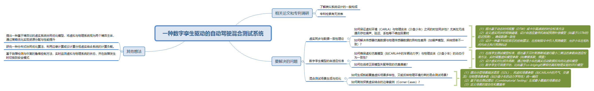

# International Exhibition patent

## mindroute

## 数字孪生驱动的自动驾驶混合测试系统解读

### 中心主题：一种数字孪生驱动的自动驾驶混合测试系统

该项目的核心目标是构建一个基于数字孪生技术的自动驾驶测试系统。此系统旨在结合虚拟测试与物理测试的各自优势，从而对自动驾驶功能进行全面且高效的评估。

---

### 一、相关论文和专利调研

在项目初期，进行充分的背景调研至关重要。

*   **了解类似系统设计的一般构成:**
    *   研究现有技术和已存在的类似系统，为本系统的设计提供理论基础和实践参考。
*   **专利检索有无发表:**
    *   检索当前技术领域内已公开的相关专利，以避免重复性研究或潜在的知识产权侵权风险。
    *   同时，专利文献也可能为项目提供新的思路和技术启发。

---

### 二、要解决的问题

这部分是项目的核心，详细列出了在构建该系统过程中需要攻克的关键技术难题，并针对性地提出了初步的解决思路。

#### 1. 虚实同步与数据一致性理论

确保虚拟环境与物理实体之间的数据和状态能够精确、实时地同步是系统的基础。

*   **问题1: 时空同步性**
    *   **描述:** 如何保证虚拟环境（例如CARLA仿真平台）与物理实体（例如沙盘小车）之间的时空同步性？尤其是在无线通讯存在噪声、延迟、丢包等不确定因素时。
    *   **具体描述**
        * 1. 消息传输延迟（Message transmission delay）：消息从 ROS 传输到模拟器以及反之所需的时间。
        * 2. 处理延迟（Processing delay）：处理器解释和处理接收到的数据所需的时间。
        * 3. 执行延迟（ Actuation delay）：执行器对物理形式命令的响应时间
    *   **解决思路:**
        1.  **时空校准方法:** 提出基于动态时间规整（DTW）或卡尔曼滤波（Kalman Filter）的时空校准算法。
        2.  **容错与补偿机制:** 定义虚实同步的容错阈值，设计自适应重传机制或基于预测的补偿模型（例如，使用LSTM进行延迟预测），以确保数据的一致性。
        3.  **时延容忍控制:** 设计一种基于时延容忍的控制算法，在控制指令中引入预测模型，允许物理小车在短暂的通讯中断或延迟期间，依据预测轨迹自主执行。

*   **问题2: 传感器数据异构性**
    *   **描述:** 如何解决传感器仿真数据与物理传感器数据之间的异构性差异（例如，两者在噪声模型、采样频率等方面可能不一致）？
    *   **解决思路:** （虽然未直接在图中给出绿色框解决方案，但上述关于数据一致性和校准的方法，尤其是模型参数的自适应调整，也部分适用于此问题。）

#### 2. 数字孪生模型的自适应校准

数字孪生模型的准确性直接影响测试结果的可靠性。

*   **问题1: 动态行为一致性**
    *   **描述:** 如何确保虚拟仿真模型（例如CARLA中的车辆动力学模型）与物理实体（沙盘小车）的动态行为保持高度一致性？
*   **问题2: 在线仿真偏差修正**
    *   **描述:** 如何在线修正由于模型失配（模型与实际物理特性不完全相符）而导致的仿真偏差？
    *   **解决思路:**
        1.  **在线参数自适应校准:** 提出基于贝叶斯推断或递归最小二乘法（RLS）的参数自适应校准方法，用以实时调整虚拟模型的关键参数（如摩擦系数、转动惯量等）。
        2.  **虚实对比损失函数与反向优化:** 设计虚实对比的损失函数，利用物理小车的真实运动数据，通过反向传播或类似优化算法来优化虚拟模型。
        3.  **数字孪生可信度评估:** 建立数字孪生模型的可信度评估体系，例如，可以研究基于co-kriging等方法，综合仿真结果和物理实验数据，对模型的准确性进行量化评价。

#### 3. 混合测试场景生成与优化

高效、全面地生成和管理测试场景是提升测试效率的关键。

*   **问题1: 兼顾多样性与物理约束的场景生成**
    *   **描述:** 如何生成既能充分覆盖虚拟场景的多样性（如不同的天气、交通流组合），又能准确反映物理环境实际约束（如小车动力学极限、场地限制）的混合测试场景？
*   **问题2: 高效探索边缘案例 (Corner Cases)**
    *   **描述:** 如何高效地发现和探索那些在虚实结合条件下可能引发系统失效或非预期行为的边缘案例？
    *   **解决思路:**
        1.  **分层场景描述语言 (SDL):** 提出一种分层的场景描述语言，能够将虚拟场景参数（例如CARLA中的天气条件、交通流密度）与物理场景参数（例如沙盘小车的具体动力学特性）进行统一编码和管理。
        2.  **基于组合测试理论的场景生成:** 应用组合测试理论（Combinatorial Testing）等方法，以最少的场景组合达到最大的测试覆盖率。
        3.  **场景复杂性与覆盖率定义:** 定义明确的场景复杂性度量指标和测试覆盖率评估标准。

---

### 三、其他想法

这部分展望了系统在更宏观层面或更深层次技术上的优化和功能拓展方向。

*   **基于博弈论的虚实系统协同优化模型:**
    *   将虚拟系统与物理系统视为两个相互作用的博弈主体，通过研究它们的策略互动，实现资源分配和整体性能的优化。
*   **分布式协同优化算法:**
    *   研究利用边缘计算或云计算技术来分担虚实结合测试系统可能面临的巨大计算负载，提高运算效率。
*   **基于故障检测与恢复的鲁棒控制方法:**
    *   开发实时的虚拟与物理系统状态监测机制，设计鲁棒控制策略，确保在系统发生故障时能够迅速检测并安全地切换到预设的安全模式。

---

### 四、总结

这份思维导图清晰地勾勒出了一个“数字孪生驱动的自动驾驶混合测试系统”的研发蓝图。它从前期的技术调研入手，深入剖析了系统构建过程中所面临的核心技术挑战，包括虚实同步、模型校准、场景生成等关键环节，并针对这些挑战提出了具体的技术路径和潜在解决方案。同时，导图也对系统未来的优化方向，如引入博弈论、分布式计算以及增强系统鲁棒性等方面进行了前瞻性的思考。整体而言，这是一个结构完整、逻辑清晰、具有较高可行性的技术规划方案。
