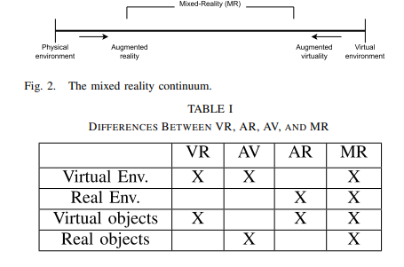
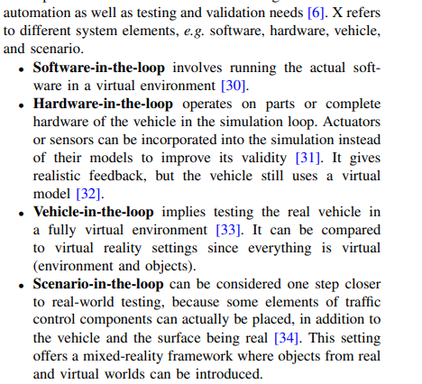
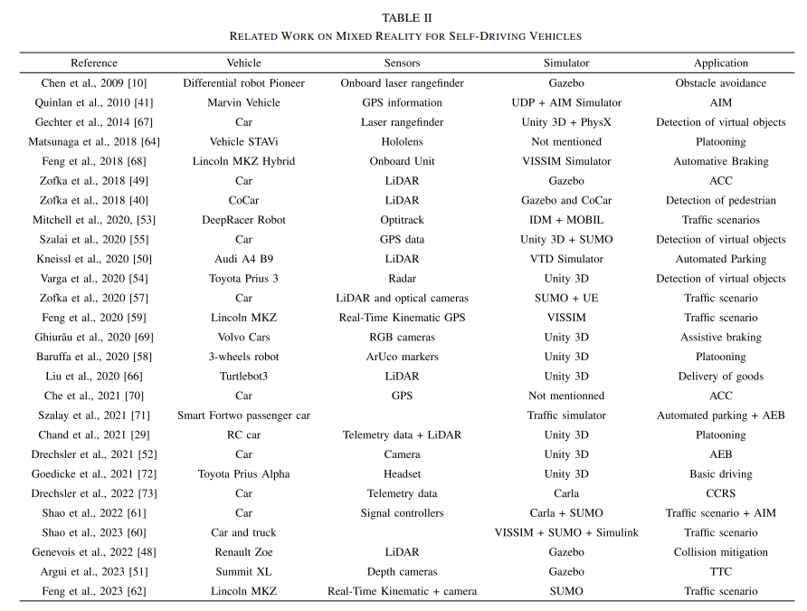
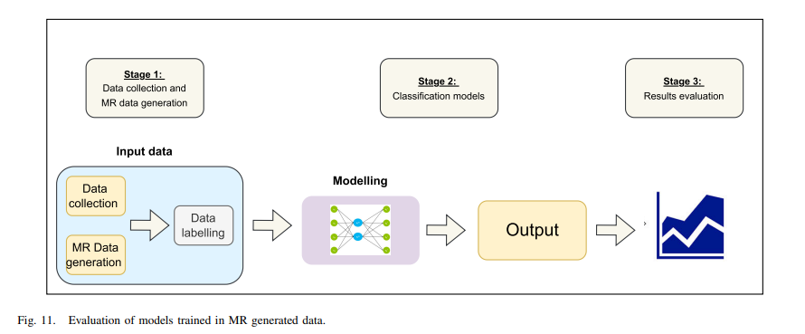

# 相关论文和专利调研

## 同类系统设计的一般构成

### 核心概念构成

1. 数字孪生 (Digital Twin)
2. 自动驾驶 (Autonomous Driving / Self-Driving Cars)
3. 混合测试 (Hybrid Testing / Mixed Reality Testing / Virtual-Physical Testing)
4. 仿真 (Simulation)
5. 虚实同步/一致性 (Virtual-Real Synchronization / Co-simulation / Data Consistency)
6. 模型校准 (Model Calibration / Parameter Estimation / System Identification)
7. 场景生成 (Scenario Generation / Test Case Generation)
8. 车辆动力学 (Vehicle Dynamics)
9. 传感器模型 (Sensor Models)
10. CARLA, SUMO, VISSIM, PreScan

### 关键词组合

"digital twin AND autonomous driving AND testing"
"hybrid simulation AND self-driving AND scenario generation"
"virtual-real synchronization AND automotive AND digital twin"
"CARLA AND physical vehicle AND co-simulation"
"patent AND digital twin AND autonomous vehicle testing"

### 相关文献浅读

1. Review of the US Patent Literature on Digital Twins and Possible Applications for Coordinate Metrology
    Fuller 等人在其论文 的 II.A. 节中给出了六个定义。可能与坐标计量学界更相关的是，他们在 II.B. 节中谈论了数字孪生的误解，其中他们对比了数字模型、数字影子和数字孪生。

    2020年12月3日，数字孪生联盟发布了以下定义：

    数字孪生是真实世界实体和过程的虚拟表示，以指定的频率和保真度进行同步。
    文章审查了所有271项专利/申请的标题。阅读了那些标题表明可能与坐标计量学相关的摘要。对于那些摘要表明可能与坐标计量学相关的，打印并审查了其完整说明书。经过数小时的审查和大约两令打印纸，一项授予 Grale Technologies 的 Garvey 等人的专利，以及两项待批申请——一项是 Garvey 等人关于该专利的延续申请，另一项是 GE Inspection Technologies, LP 的 Zhang 等人的申请，被认为与坐标计量学相关，即3/271。Grale Technologies 的专利和延续申请涉及在成品仍在工作单元中（例如，仍在车床、铣床等中）时进行的测量。GE Inspection Technologies 的申请涉及超声波检测。

2.  Advancements in Mixed Reality for Autonomous Vehicle Testing and Advanced Driver Assistance Systems: A Survey

MR 首次出现在 Milgram 和 Kishino 的工作中，其定义如下：“观察混合现实环境最直接的方式是将其视为真实世界和虚拟世界对象在单个显示器中一起呈现的环境，即在虚拟连续谱的极端之间的任何位置”，因此将 AR 和增强虚拟 (AV) 视为 MR 的子集。AR 通常涉及用虚拟对象增强的真实环境。在这种设置中，虚拟元素叠加在真实世界上，但交互通常仅限于真实环境中的虚拟对象，而 AV 是具有真实对象的虚拟世界。同时，特定的 MR 环境将是一个真实环境，由虚拟环境进行数字表示，从而实现真实和虚拟对象共存的丰富交互

AR can be reused and adapted for MR. These include: (i) Realtime data processing, (ii) Hardware and software integration,
(iii) Scalability. The major difference with MR is its ability to
combine the virtual and real worlds, allowing virtual and real
objects to coexist and interact within the same environment.
This capability requires additional technical considerations to
ensure that the interactions between virtual and real elements
are not only synchronized but also realistic and meaningful.

2) Time Delay Management: Maintaining the simulation’s
realism requires controlling temporal delays, particularly when
real-time data is being used. The system’s smooth operation is
ensured by addressing multiple sources of delay in the implementation. Delays, for instance, may happen when pose data is
transferred from Unity3D to ROS and vice versa. The performance and accuracy of real-time simulations can be impacted
by factors like processing time and network latency, which
are the source of the delay [50]. The overall system delay
can be broken down into: (i) Message transmission delay:
The amount of time it takes for messages to move from ROS
to the simulator and vice versa. (ii) Processing delay Time
required by processors to interpret and act on received data.
(iii) Actuation delay Actuators’ response time to commands in
physical form. The use of ROS services, such as the “step()”
function, helps to maintain time consistency between different
simulation components. This is particularly important when
integrating various models like SUMO for traffic simulation
and Menge for pedestrian behavior simulation [58]. Moreover,
5G technology significantly optimizes time delay, ensuring
ultra-reliable low-latency communication (URLLC) essential
for MR testing. This optimization allows for real-time data
synchronization and processing, crucial for accurate simulation
and real-world integration. The 5G network’s high bandwidth
and low latency capabilities enable seamless connectivity and interaction between virtual and real environments,
enhancing the fidelity and reliability of MR testing for AV
systems [6].
(i) 消息传输延迟：消息从 ROS 传输到模拟器以及反之所需的时间。
(ii) 处理延迟：处理器解释和处理接收到的数据所需的时间。
(iii) 执行延迟：执行器对物理形式命令的响应时间

I. Barabás, A. Todoru¸s, N. Cordo¸s, and A. Molea, “Current challenges
in autonomous driving,” IOP Conf. Ser., Mater. Sci. Eng., vol. 252,
Oct. 2017, Art. no. 012096.

 S. James et al., “sim-to-real via sim-to-sim: Data-efficient robotic
grasping via randomized-to-canonical adaptation networks,” in Proc.
IEEE/CVF Conf. Comput. Vis. Pattern Recognit. (CVPR), Jun. 2019,
pp. 12619–12629.   虚拟与现实之间的gap

 Virtual Open Innovation Collaborative Environment for Safety
(VOICES) Proof of Concept (PoC), U.S. Department of Transportation,
Washington, DC, USA, 2021.  美国的系统

MR：
M. Stilman, P. Michel, J. Chestnutt, K. Nishiwaki, S. Kagami, and
J. Kuner, Augmented Reality for Robot Development and Experimentation, vol. 2, no. 3. Pittsburgh, PA, USA: Robotics Institute, Carnegie
Mellon Univ., 2005.
I. Y.-H. Chen, B. MacDonald, and B. Wunsche, “Mixed reality simulation for mobile robots,” in Proc. IEEE Int. Conf. Robot. Autom., Kobe,
Japan, May 2009, pp. 232–237.

MR in Robotics：
 P. Chand, P. Romet, F. Gechter, and E. H. Aglzim, “A mixed reality
simulator for an autonomous delivery system using platooning,” in A
mixed Reality Simulator for an Autonomous Delivery System Using
Platooning, 2021.
 I. Y.-H. Chen, B. MacDonald, and B. Wunsche, “Mixed reality simulation for mobile robots,” in Proc. IEEE Int. Conf. Robot. Autom., Kobe,
Japan, May 2009, pp. 232–237.

X in the loop
 Z. Szalay, “Next generation X-in-the-loop validation methodology for
automated vehicle systems,” IEEE Access, vol. 9, pp. 35616–35632,
2021

America test model---- CARMA XiL
Federal Highway Administration. Office of Safety and United States.
Federal Highway Administration. Office of Operations Research and
Development, “CARMA simulation: Enabling cooperative driving
automation research,” Federal Highway Admin., Washington, DC,
USA, Tech. Rep. FHWA-HRT-22-028, Dec. 2021.

ros as communication manager
M. R. Zofka et al., “Pushing ROS towards the dark side: A ROSbased co-simulation architecture for mixed-reality test systems for
autonomous vehicles,” in Proc. IEEE Int. Conf. Multisensor Fusion
Integr. Intell. Syst. (MFI), Sep. 2020, pp. 204–211.

MR效果评估指标：
 M. F. Drechsler, V. Sharma, F. Reway, C. Schütz, and W. Huber,
“Dynamic vehicle-in-the-loop: A novel method for testing automated
driving functions,” SAE Int. J. Connected Automated Vehicles, vol. 5,
no. 4, pp. 367–380, Jun. 2022.
在 MR 环境中训练代理的背景下，一种有价值的评估方法是评估代理在此环境中的学习进度。诸如 MR 训练前后每个场景的碰撞次数等指标可以提供关于 MR 训练过程有效性的见解，如 中所述。当目标是提高代理的性能并减少碰撞时，这种方法尤其相关。此外， 中的作者采用了其他指标来为评估代理训练的性能提供一个强大的框架：(i) 碰撞率和类型（例如，追尾、侧滑），(ii) 通过加快开发周期和减少资源消耗来减少所需的测试迭代次数，(iii) 策略梯度估计中的方差减少，从而提高学习过程的稳定性和可靠性，(iv) 效率指标，通过证明所提出的方法可以将评估过程加速多个数量级与传统方法相比，(v) 跨场景的泛化能力，通过证明训练有素的代理如何将其学习到的行为泛化到新的、未见过的环境。该指标对于评估 MR 训练过程的鲁棒性至关重要。
另一方面，研究人员采用了诸如碰撞时间 (TTC) 等替代指标。这是一个传统指标，用于计算跟随车辆与前方车辆碰撞所需的时间。它可以计算如下：
TTC = H · Vr = θ · (dθ/dt) (3)
其中 θ 是前方车辆所对的视角，Vr 是相对速度，H 是车头时距，dθ/dt 表示所对车辆视角的变化率。当主要目标是保证代理以一致的方式感知虚拟和真实世界障碍物时，该指标已在文献中使用,。该框架可以使用 TTC 进行全面测试，并且可以在仿真、真实世界和 MR 场景之间对比结果。

定量指标来评估机器人控制器从模拟环境过渡到真实世界环境时的有效性
S. Koos, J.-B. Mouret, and S. Doncieux, “The transferability approach:
Crossing the reality gap in evolutionary robotics,” IEEE Trans. Evol.
Comput., vol. 17, no. 1, pp. 122–145, Feb. 2013.

仿真与现实差异度量 (STR Disparity)
该指标将涉及测量代理响应 MR 环境中动态变化所需的时间，并将其与真实世界测试中的响应时间进行比较，评估 MR 环境中传感器解释的精度和可靠性与从真实世界数据获得的传感器解释的精度和可靠性，以及评估 MR 与道路测试中车辆路径跟踪、障碍物规避和其他与导航相关的操纵的准确性。
This metric
would involve the measurement of the time it takes for
an agent to respond to dynamic changes in the MR
environment, and compare it to response times in realworld tests, the evaluation of the precision and reliability of sensor interpretations in MR settings against those
obtained from real-world data, and the assessment of the
accuracy of vehicle path tracking, obstacle avoidance, and
other navigation-related maneuvers in MR versus road
tests
通过传统的真实世界测试进行最终验证至关重要

时间延迟
Potential technical restrictions in a MR framework intended
for autonomous driving are mostly caused by time delays
inside the system. The operation of the system is impacted
in numerous ways by these delays [29]:
• Components of time delay: There are three main factors
that influence the system’s overall time delay. These
include the processing time for data, the updating of
world pose data from ROS to the simulator, and the time
it takes for messages to travel from the Robot Operating
System (ROS) to the simulator.
• Lag in the vehicle’s movements: The introduction of a
considerable lag is one notable effect of time delay. The
agent’s movements and the simulation can be noticeably
out of sync due to this lag. As a result, this asynchrony
may jeopardize the system’s ability to produce accurate
results.
• Effect on control strategies: Time delay has a significant impact on control strategy effectiveness beyond
simple asynchrony. Effective control requires anticipating
delays, making it a crucial element for improving system
performance as a whole.
• Jitter effects: The difference in timing between messages, sometimes known as “jitter,” poses a further
difficulty. Jitter can cause significant delay discrepancies
between various queries. Therefore, the accuracy, effectiveness, and overall consistency of the system may be
compromised by these differences in time delay.
用于自动驾驶的 MR 框架中的潜在技术限制主要是由系统内部的时间延迟引起的。这些延迟以多种方式影响系统的运行：

时间延迟的组成部分：影响系统整体时间延迟的主要因素有三个。这些包括数据处理时间、世界姿态数据从 ROS 更新到模拟器的时间，以及消息从机器人操作系统 (ROS) 传输到模拟器所需的时间。
车辆运动的滞后：时间延迟的一个显著影响是引入了相当大的滞后。由于这种滞后，代理的运动和仿真可能会明显不同步。因此，这种异步性可能会危及系统产生准确结果的能力。
对控制策略的影响：时间延迟除了简单的异步性之外，还对控制策略的有效性产生重大影响。有效的控制需要预测延迟，使其成为提高系统整体性能的关键因素。
抖动效应：消息之间的时间差异，有时称为“抖动”，构成了进一步的困难。抖动可能导致不同查询之间出现显著的延迟差异。因此，时间延迟的这些差异可能会损害系统的准确性、有效性和整体一致性。

将注意力转向理解参与者姿态（包括车辆、行人和其​​他参与者）中潜在的测量不准确性如何扩散到整个系统并不可避免地影响评估结果

共享MR ENV
----V2X

** NHTSA (National Highway Traffic Safety Administration) levels of vehicle autonomy:** 这是讨论自动驾驶时非常基础和普遍引用的标准，用于定义不同级别的自动化程度。分析其如何为本文设定自动驾驶的背景。
** Authors demonstrate that autonomous vehicles would need tests over 14 billion kilometers...:** 这个惊人的数字强调了传统真实世界测试的局限性，从而引出了对 MR 等替代测试方法的需求。这是阐述问题严重性的关键数据。
** The difference in dynamics between the real-world model and the simulated model generates the reality gap:** “现实差距”是本文的核心问题之一，MR 技术的主要目标就是弥合这个差距。这个引用定义了关键挑战。
** Chen et al. used MR technology for autonomous navigation and observed the mobile robot Pioneer interact with both virtual and physical objects:** 这是 MR 技术在机器人自主导航中早期应用的例子，展示了 MR 的基本交互能力。
** Milgram and Kishino where it (MR) was defined as follows: “The most straightforward way to view a Mixed Reality environment is one in which real world and virtual world objects are presented together within a single display…”:** 这是 MR 概念的经典定义和“虚拟-现实连续谱”的提出者，是理解 MR 理论基础的关键文献。
** Scenario-in-the-loop can be considered one step closer to real-world testing... This setting offers a mixed-reality framework...:** 将 XiL 中的场景在环 (SciL) 与 MR 联系起来，说明了 MR 在测试方法论谱系中的位置。
,,,,,,,, (以及表 II 中的其他文献): 这些文献代表了 MR 在自动驾驶汽车测试中具体技术实现（如传感器融合、里程计数据增强）和应用案例（如交通场景、ACC、AEB、自动泊车）的实例。选择其中一两个进行深入分析，可以了解 MR 如何在实践中应用。例如， 和 讨论了传感器数据的融合方法（公式1和2）。
** The digital twin...is considered as the virtual instance of a physical system...:** 数字孪生的定义对于理解 MR 框架的核心组件至关重要。
** Figure 8 is a representation of a platooning application at a miniature scale...:** 这个引用及其对应的图示（如果可见）可以具体展示 MR 在车辆编队等复杂多车协同场景中的应用潜力，即使是在缩小模型上。
** Since MR can provide a realistic rendering of virtual content... it can be used as a tool to create diverse scenarios... (关于领域自适应):** 这指出了 MR 在解决机器学习中领域自适应问题方面的潜力，是未来研究方向的一个重要支撑。
** A prominent research study has examined V2X communication within MR environment...:** 这是 MR 与 V2X 通信结合应用于测试的一个具体案例，代表了共享 MR 环境这一前沿研究方向的实践。
** Kalman filter is a common approach to estimate and synchronize the vehicle’s state in real time (for digital twin):** 提到了解决数字孪生同步挑战的一种具体技术方法。
** ROS 2 has proved to improve real-time support and better timing precision compared to ROS 1:** 针对时间延迟挑战，提出了一个潜在的技术解决方案。
