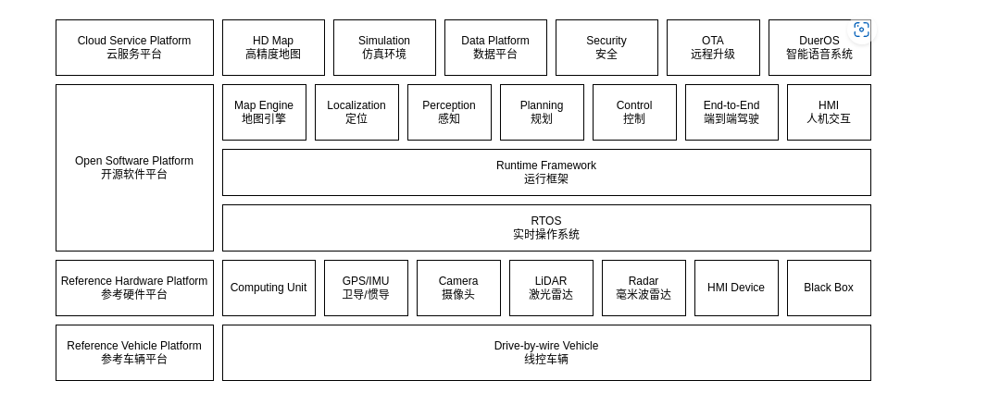
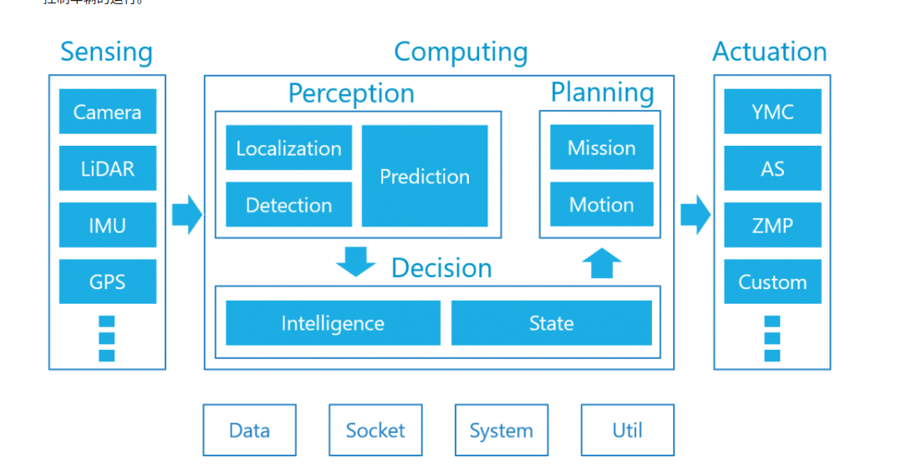
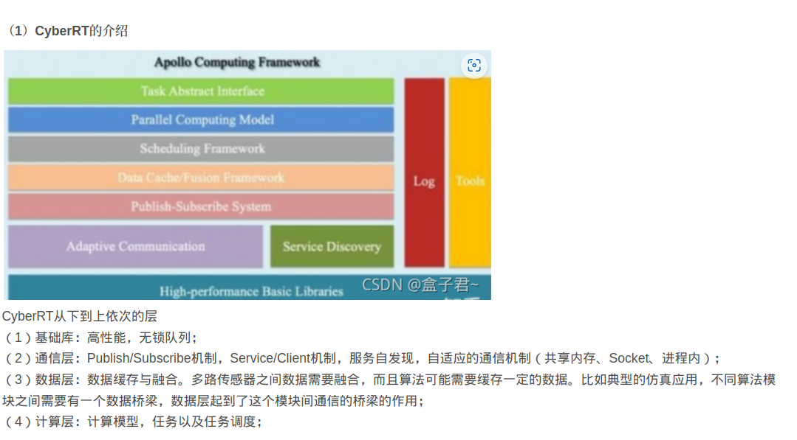

# the difference between autoware and apollo

## previous

## architecture

apollo

autoware

### software

1. autoware using ros as Middleware.

    ROS kernel scheduling does not have any business logic.

2. apollo using CyberRT as Middleware.
   

    using coroutine Realize close integration of scheduling and algorithm business logic

3. ros2 provide DDS as coroutine

## safety
