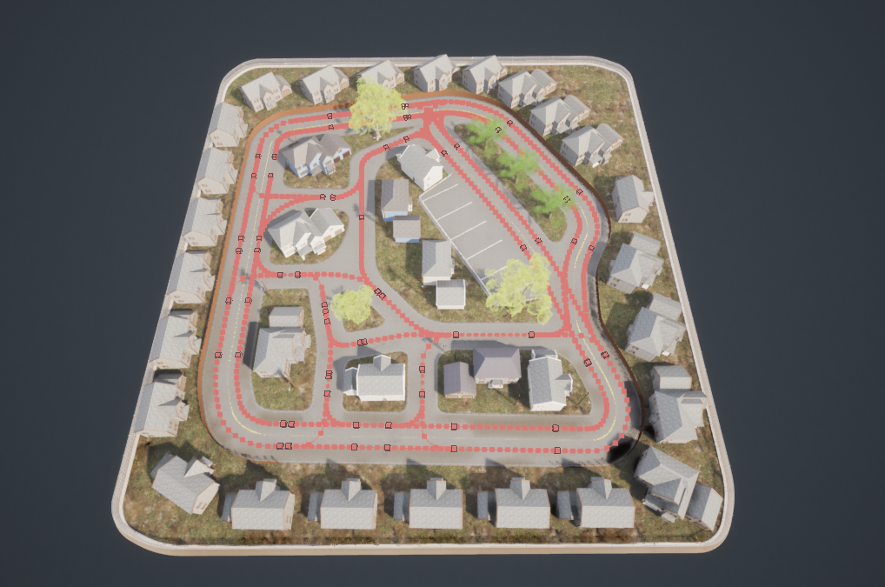

# how to use carla

## purpose

1. what is carla
2. what is the purpose of using carla
3. what have done with carla
4. what i need to do with carla
5. how do i need to do with carla
6. is the use of carla is correct

## requirements

### usercase

the picture of the sandbox is shown as follows

Make the car's movement in the real world synchronized to the carla world in real time

1. transform ros_coor to carla_coor
2. carla subscribe carla_coor
3. carla update coordinates
4. carla subscribe carla_coor through tcp_client

### questions

Is it to transmit the coordinates of RC to carla in real time as the coordinates of the car, and then complete the entire movement process through the remote control robot? Or is it to use this coordinate as a positioning system similar to ekf, and then rely on the navigation stack based on ros to obtain cmd messages to control RC?

### Technical route

1. Update the car's position information in real time in carla.
2. Record a dense list of waypoints and let the car in carla keep tracking the waypoints
3. The coordinates obtained in steam-vr are used as the positioning system coordinates in the planning process

### function

way_function

run_car

initial_pose

### road map

### priority
