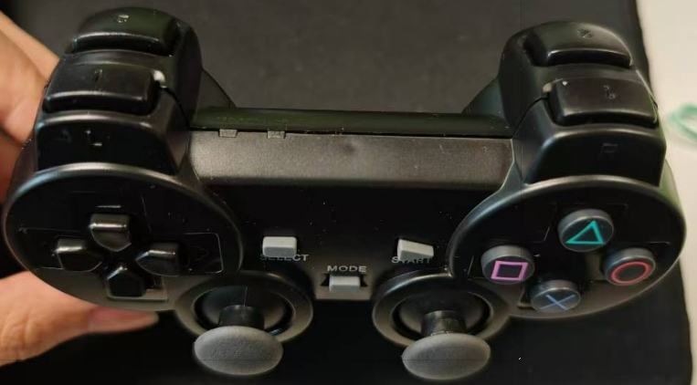
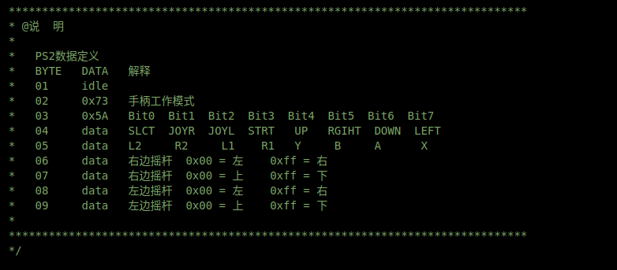

# draft

python编写脚本通过串口发送2.4G信号给遥控车  ps2 It is a variant of spi

rc小车是通过2.4GHz连接的

需要源代码

## msg_handler

### msg_original_signal

```c
/**
  *   PS2数据定义
  *   BYTE   DATA   解释
  *   01     idle
  *   02     0x73   手柄工作模式
  *   03     0x5A   Bit0  Bit1  Bit2  Bit3  Bit4  Bit5  Bit6  Bit7
  *   04     data   SLCT  JOYR  JOYL  STRT   UP   RGIHT  DOWN  LEFT
  *   05     data   L2     R2     L1    R1   Y     B     A      X
  *   06     data   右边摇杆  0x00 = 左    0xff = 右
  *   07     data   右边摇杆  0x00 = 上    0xff = 下
  *   08     data   左边摇杆  0x00 = 左    0xff = 右
  *   09     data   左边摇杆  0x00 = 上    0xff = 下
  * 
**/
```

### Remote controller sender way

1. establish connection

    ```c
    //不在PS2控制模式下
    if(ax_control_mode != CTL_PS2)
    {
        //判断是否开启PS2手柄控制
        //START按键被按下后，左边摇杆上推，进入PS2控制模式
        if((my_joystick.btn1 == PS2_BT1_START) && (my_joystick.LJoy_UD == 0x00))
        {
            //切换到PS2模式
            ax_control_mode = CTL_PS2;

            //执行蜂鸣器鸣叫提示
            ax_beep_ring = BEEP_SHORT;
        }
    }
    ```

### msg_receive

The data exchange between PS2 and MCU is single byte

```c
/**
  * @简  述  PS2数据读写函数
  * @参  数  cmd:要写入的命令
  * @返回值  读出数据
  */
static uint8_t PS2_ReadWriteData(uint8_t cmd)
{
    volatile uint8_t res = 0;
    volatile uint8_t ref;

    //写入命令，并读取一个1字节数据
    for(ref = 0x01; ref > 0x00; ref <<= 1)
    {
        ////输出一位数据
        if(ref&cmd)
            CMD_H();
        else
            CMD_L();

        CLK_L();
        AX_Delayus(16);

        //读取一位数据
        if(DI())
            res |= ref; 
        CLK_H();
        AX_Delayus(16);
    }

    //返回读出数据
    return res;
    }
```

### Hardware key value correspondence



```c
  uint8_t btn1;         /* B0:SLCT B1:JR  B0:JL B3:STRT B4:UP B5:R B6:DOWN  B7:L   */

  uint8_t btn2;         /* B0:L2   B1:R2  B2:L1 B3:R1   B4:Y  B5:B B6:A     B7:X */
```

triangle, square, circle, X; with AXBY

in sonny playStation

* key_X sandfor key_B
* key_circle stand for key_A
* **need test**

### msg_trans

1. data_trans

    ```c
    //数值传递
    JoystickStruct->mode = PS2_data[1];
    JoystickStruct->btn1 = ~PS2_data[3];
    JoystickStruct->btn2 = ~PS2_data[4];
    JoystickStruct->RJoy_LR = PS2_data[5];
    JoystickStruct->RJoy_UD = PS2_data[6];
    JoystickStruct->LJoy_LR = PS2_data[7];
    JoystickStruct->LJoy_UD = PS2_data[8];
    ```

2. Numerical correspondence/Structure

    ```c
    //PS2手柄键值数据结构体
    typedef struct
    {
        uint8_t mode;       /* 手柄的工作模式 */
        uint8_t btn1;         /* B0:SLCT B1:JR  B0:JL B3:STRT B4:UP B5:R B6:DOWN  B7:L   */
        uint8_t btn2;         /* B0:L2   B1:R2  B2:L1 B3:R1   B4:Y  B5:B B6:A     B7:X */
        uint8_t RJoy_LR;      /* 右边摇杆  0x00 = 左    0xff = 右   */
        uint8_t RJoy_UD;      /* 右边摇杆  0x00 = 上    0xff = 下   */
        uint8_t LJoy_LR;      /* 左边摇杆  0x00 = 左    0xff = 右   */
        uint8_t LJoy_UD;      /* 左边摇杆  0x00 = 上    0xff = 下   */    

    }JOYSTICK_TypeDef;

    ```

in ax_ps2.c



in ax_ps2.h

defines of the key and struct

```c
//PS2按键定义
#define  PS2_BT1_SELECT     0x01    //选择按键
#define  PS2_BT1_JOY_L      0x02    //左摇杆按键
#define  PS2_BT1_JOY_R      0x04    //右摇杆按键 
#define  PS2_BT1_START      0x08    //启动按键
#define  PS2_BT1_UP         0x10    //方向 上按键
#define  PS2_BT1_RIGHT      0x20    //方向 右按键
#define  PS2_BT1_DOWN       0x40    //方向 下按键 
#define  PS2_BT1_LEFT       0x80    //方向 左按键

#define  PS2_BT2_L2         0x01    //选择按键
#define  PS2_BT2_R2         0x02    //左摇杆按键
#define  PS2_BT2_L1         0x04    //右摇杆按键 
#define  PS2_BT2_R1         0x08    //启动按键
#define  PS2_BT2_Y          0x10    //功能 Y按键(或三角) 
#define  PS2_BT2_B          0x20    //功能 B按键(圆形)
#define  PS2_BT2_A          0x40    //功能 A按键(叉号)
#define  PS2_BT2_X          0x80    //功能 X按键(方形)


//PS2手柄键值数据结构体 
typedef struct
{
  uint8_t mode;         /* 手柄的工作模式 */

  uint8_t btn1;         /* B0:SLCT B1:JR  B0:JL B3:STRT B4:UP B5:R B6:DOWN  B7:L   */

  uint8_t btn2;         /* B0:L2   B1:R2  B2:L1 B3:R1   B4:Y  B5:B B6:A     B7:X */

  uint8_t RJoy_LR;      /* 右边摇杆  0x00 = 左    0xff = 右   */

  uint8_t RJoy_UD;      /* 右边摇杆  0x00 = 上    0xff = 下   */

  uint8_t LJoy_LR;      /* 左边摇杆  0x00 = 左    0xff = 右   */

  uint8_t LJoy_UD;      /* 左边摇杆  0x00 = 上    0xff = 下   */

}JOYSTICK_TypeDef;
```

this is the code of ps2_controller

```c

/**
* @简  述  处理PS2手柄控制命令
* @参  数  无
* @返回值  无
*/
void AX_CTL_Ps2(void)
{
    static uint8_t btn_select_flag = 0;
    static uint8_t btn_joyl_flag = 0;
    static uint8_t btn_joyr_flag = 0;
    static uint8_t speed = 4;
    
    //红绿灯模式下，执行控制操作
    if(my_joystick.mode ==  0x73)
    {
        R_Vel.TG_IX = (int16_t)(speed*(0x80 - my_joystick.RJoy_UD));
        R_Vel.TG_IY = (int16_t)(speed*(0x80 - my_joystick.RJoy_LR));

        //如果是阿克曼机器人
        #if (ROBOT_TYPE == ROBOT_AKM)
            ax_akm_angle = (int16_t)(4*(0x80 - my_joystick.LJoy_LR));
        #else
            R_Vel.TG_IW = (int16_t)(4*speed*(0x80 - my_joystick.LJoy_LR));
        #endif
        
        //SELECT按键，切换RGB灯效模式
        if(my_joystick.btn1 & PS2_BT1_SELECT)
        {
            btn_select_flag = 1;
        }
        else
        {
            if(btn_select_flag)
            {
                //灯光效果切换
                if(R_Light.M < LEFFECT6)
                    R_Light.M++;
                else
                    R_Light.M = LEFFECT1;
                
                //复位标记
                btn_select_flag = 0;
            }
        }
        
        //左摇杆按键，减速
        if(my_joystick.btn1 & PS2_BT1_JOY_L)
        {
            btn_joyl_flag = 1;
        }
        else
        {
            if(btn_joyl_flag)
            {
                
                //速度减小
                if(speed > 2)
                {
                    speed--;
                }
                else
                {
                    speed = 2;
                    
                    //蜂鸣器鸣叫提示
                    ax_beep_ring = BEEP_SHORT;
                }
                    
                //复位标记
                btn_joyl_flag = 0;
            }
        }
        
        //右摇杆按键，加速
        if(my_joystick.btn1 & PS2_BT1_JOY_R)
        {
            btn_joyr_flag = 1;
        }
        else
        {
            if(btn_joyr_flag)
            {
                //速度增加
                if(speed < 9)
                {
                    speed++;
                }
                else
                {
                    speed = 9;
                    
                    //蜂鸣器鸣叫提示
                    ax_beep_ring = BEEP_SHORT;
                }
                    
                //复位标记
                btn_joyr_flag = 0;
            }
        }
    }
}

```
