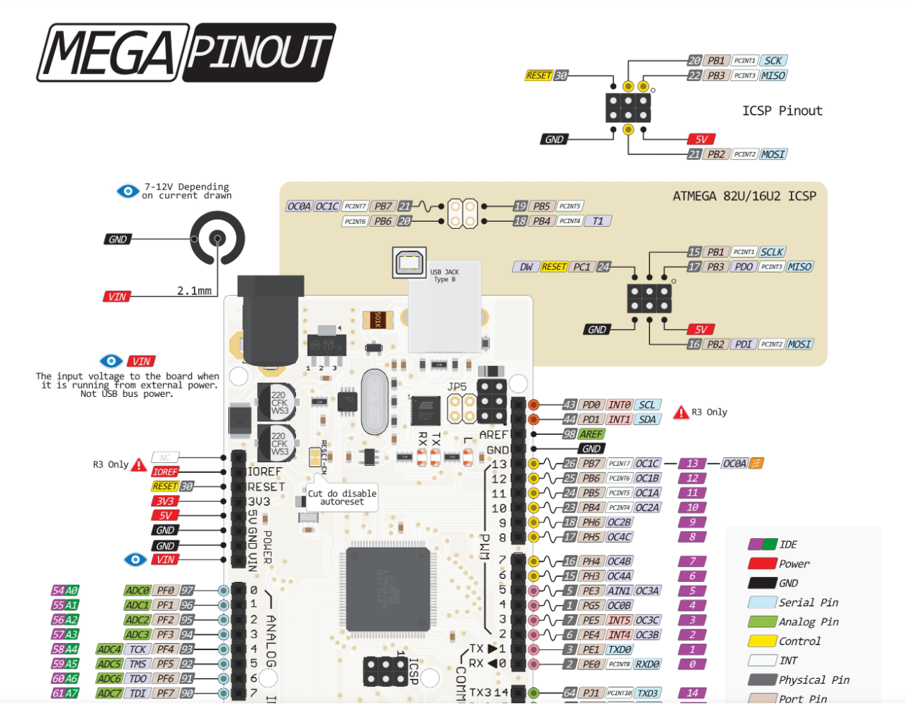
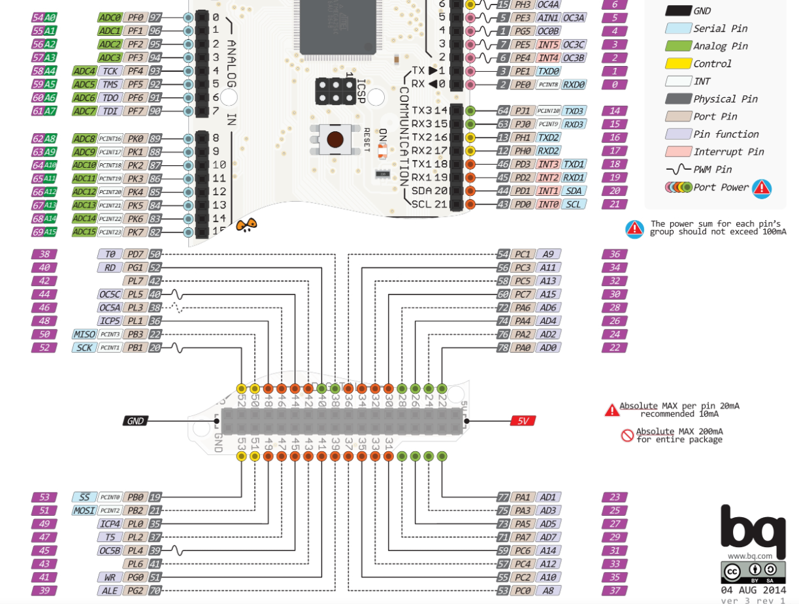
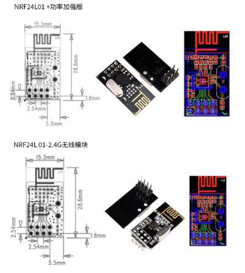
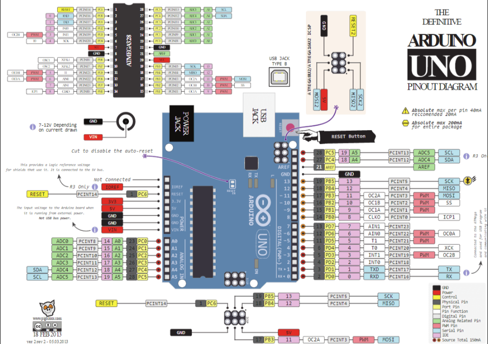

# this is the doc to describe the pin of arduino and the nrf24l01

## arduino_mega_2560

for pin

pin|description|nRF24L01_pin
--|--|--
7|ce|4
8|csn|3
50|MISO|8
51|MOSI|5
52|SCK|6

## nrf24l01

pin|description
--|--
1|VCC
2|GND
3|CSN
4|CE
5|MOSI
6|SCK
7|IRQ
8|MISO

## arduino_uno

pin_uno|description|pin_nrf24l01
--|--|--
13|SCK|
12|MISO|
11|MOSI|
7|CE|4
8|CSN|3