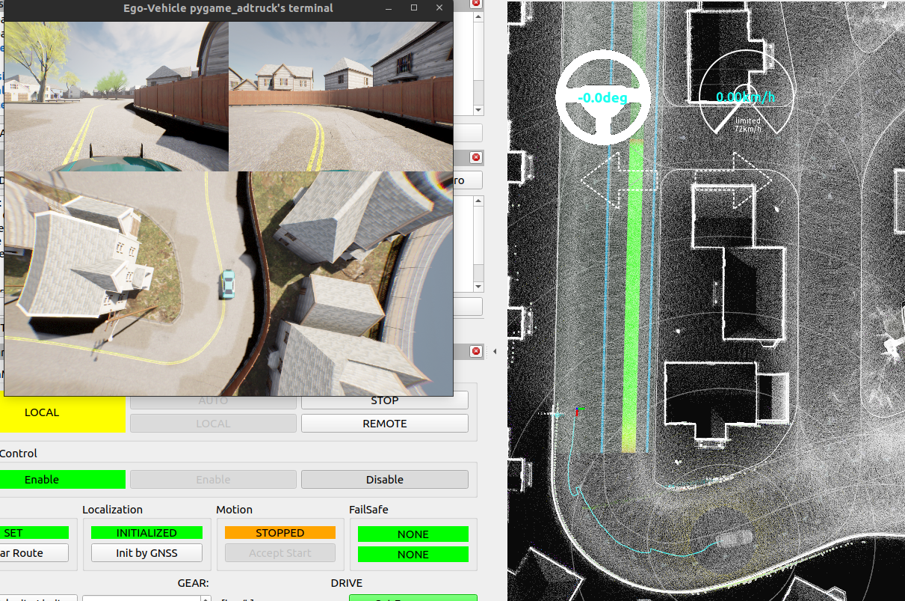
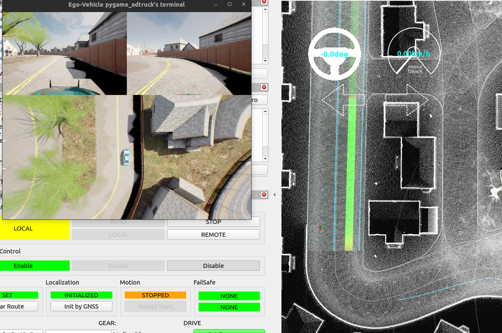
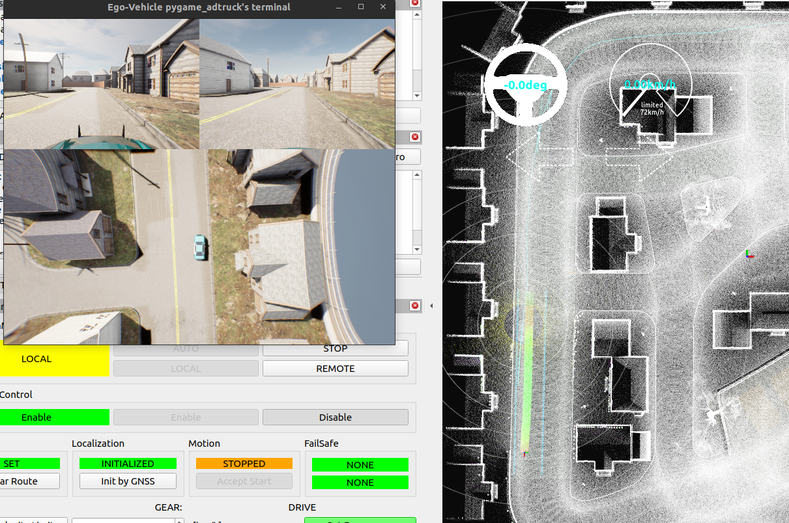

# log

/home/cityu-fsm-lab-carla/Workspace/autoware/src/universe/autoware.universe/planning/behavior_path_planner/config/behavior_path_planner.param.yaml

```yaml
    lane_following:
      drivable_area_right_bound_offset: 0.713
      drivable_area_left_bound_offset: 0.713
      drivable_area_types_to_skip: [road_border]
```

/home/cityu-fsm-lab-carla/Workspace/autoware/src/universe/autoware.universe/control/vehicle_cmd_gate/config/vehicle_cmd_gate.param.yaml

```yaml
/**:
  ros__parameters:
    update_rate: 10.0
    system_emergency_heartbeat_timeout: 0.5
    use_emergency_handling: false
    check_external_emergency_heartbeat: false
    use_start_request: false
    enable_cmd_limit_filter: true
    external_emergency_stop_heartbeat_timeout: 0.0
    stop_hold_acceleration: -1.5
    emergency_acceleration: -2.4
    moderate_stop_service_acceleration: -1.5
    stopped_state_entry_duration_time: 0.1
    stop_check_duration: 1.0
    nominal:
      vel_lim: 25.0
      reference_speed_points: [20.0, 30.0]
      steer_lim: [1.0, 0.8]
      steer_rate_lim: [1.0, 0.8]
      lon_acc_lim: [5.0, 4.0]
      lon_jerk_lim: [5.0, 4.0]
      lat_acc_lim: [5.0, 4.0]
      lat_jerk_lim: [7.0, 6.0]
      actual_steer_diff_lim: [1.0, 0.8]
    on_transition:
      vel_lim: 50.0
      reference_speed_points: [20.0, 30.0]
      steer_lim: [1.0, 0.8]
      steer_rate_lim: [1.0, 0.8]
      lon_acc_lim: [1.0, 0.9]
      lon_jerk_lim: [0.5, 0.4]
      lat_acc_lim: [2.0, 1.8]
      lat_jerk_lim: [7.0, 6.0]
      actual_steer_diff_lim: [1.0, 0.8]


```

```yaml
/**:
  ros__parameters:
    wheel_radius: 0.39
    wheel_width: 0.42
    wheel_base: 2.74 # between front wheel center and rear wheel center   142
    wheel_tread: 1.63 # between left wheel center and right wheel center
    front_overhang: 1.0 # between front wheel center and vehicle front
    rear_overhang: 1.03 # between rear wheel center and vehicle rear
    left_overhang: 0.1 # between left wheel center and vehicle left
    right_overhang: 0.1 # between right wheel center and vehicle right
    vehicle_height: 2.5
    max_steer_angle: 0.70 # [rad]


```

```shell

this is orginal pose: x: 0.28334152858299966, y: -0.7929726805410002, z: 0.0016,yaw: -0.8060164893060717


error message:

[INFO] [1731392017.015929398] [transformed_SandBox_coordinate_publisher_node]: this is orginal pose: x: 0.5884465218329997, y: -0.30214417219500067, z: 0.0016,yaw: 79.01638352734433,

[INFO] [1731392103.729495487] [transformed_SandBox_coordinate_publisher_node]: this is orginal pose: x: 0.30794050636399994, y: -0.31195007053000046, z: 0.0016,yaw: 105.12088349550496,


[INFO] [1731392129.852527822] [transformed_SandBox_coordinate_publisher_node]: this is orginal pose: x: 0.46157619249599957, y: -0.2941030524320003, z: 0.0016,yaw: 90.31518349092273,
[INFO] [1731392129.852933887] [transformed_SandBox_coordinate_publisher_node]: ____transformed___pose x: -38.72229587793303, y: -62.71514515812645, z:0.0016000000400000006,yaw: -0.3151834909227347,


[INFO] [1731392190.720718401] [transformed_SandBox_coordinate_publisher_node]: this is orginal pose: x: 0.8221694748179997, y: -0.38359453453400016, z: 0.0016,yaw: 68.70328352451922,
[INFO] [1731392190.720972984] [transformed_SandBox_coordinate_publisher_node]: ____transformed___pose x: -27.185204881843074, y: -60.18848514965954, z:0.0016000000400000006,yaw: 21.29671647548078,


[INFO] [1731392315.740968740] [transformed_SandBox_coordinate_publisher_node]: this is orginal pose: x: 0.2498663989679999, y: -1.2145123186610003, z: 0.0016,yaw: -13.044016491454226,
[INFO] [1731392315.741239040] [transformed_SandBox_coordinate_publisher_node]: ____transformed___pose x: -45.76641622744761, y: -33.52928312961133, z:0.0016000000400000006,yaw: 103.04401649145423,


[INFO] [1731394634.834019375] [transformed_SandBox_coordinate_publisher_node]: this is orginal pose: x: 0.271747696032, y: -2.059356429767, z: 0.0016,yaw: 2.3397835112436205,
[INFO] [1731394634.834948963] [transformed_SandBox_coordinate_publisher_node]: ____transformed___pose x: -39.9975320221597, y: -5.906098811324558, z:0.0016000000400000006,yaw: 87.66021648875638,


[INFO] [1731394693.747832657] [transformed_SandBox_coordinate_publisher_node]: this is orginal pose: x: 0.2863793067029996, y: -2.755915234295, z: 0.0016,yaw: 0.25148351087870363,
[INFO] [1731394693.748888700] [transformed_SandBox_coordinate_publisher_node]: ____transformed___pose x: -38.83748561456424, y: 17.021790565126686, z:0.0016000000400000006,yaw: 89.7485164891213,

[INFO] [1731394790.758239733] [transformed_SandBox_coordinate_publisher_node]: this is orginal pose: x: 0.28738442110899953, y: -3.0098053483930003, z: 0.0016,yaw: -0.6515164892790771,
[INFO] [1731394790.759202967] [transformed_SandBox_coordinate_publisher_node]: ____transformed___pose x: -38.557388987251926, y: 25.391171115641477, z:0.0016000000400000006,yaw: 90.65151648927908,

[INFO] [1731394828.130556544] [transformed_SandBox_coordinate_publisher_node]: this is orginal pose: x: 0.274309823621, y: -1.9181773392740002, z: 0.0016,yaw: 0.9657835110035207,
[INFO] [1731394828.131596394] [transformed_SandBox_coordinate_publisher_node]: ____transformed___pose x: -40.04568759840433, y: -10.45584126444685, z:0.0016000000400000006,yaw: 89.03421648899648,


```

[INFO] [1731399310.123644539] [transformed_SandBox_coordinate_publisher_node]: this is orginal pose: x: 0.7197051236339997, y: -0.3908517229830002, z: 0.0016,yaw: 78.3469835271488,
[INFO] [1731399310.123931290] [transformed_SandBox_coordinate_publisher_node]: ____transformed___pose x: -30.20548063569314, y: -60.77787253596383, z:0.0016000000400000006,yaw: 11.653016472851206,


[INFO] [1731399379.264073582] [transformed_SandBox_coordinate_publisher_node]: this is orginal pose: x: 1.475994034318, y: -0.5454380622000001, z: 0.0016,yaw: 96.40788349293562,
[INFO] [1731399379.264653997] [transformed_SandBox_coordinate_publisher_node]: ____transformed___pose x: -5.275999964155503, y: -56.44509545679973, z:0.0016000000400000006,yaw: -6.407883492935625,


[INFO] [1731399426.183767801] [transformed_SandBox_coordinate_publisher_node]: this is orginal pose: x: 2.7786898233859993, y: -0.539390019287, z: 0.0016,yaw: 57.23118352175811,
[INFO] [1731399426.184188791] [transformed_SandBox_coordinate_publisher_node]: ____transformed___pose x: 37.40097662171005, y: -57.9045399581916, z:0.0016000000400000006,yaw: 32.76881647824189,


[INFO] [1731399476.223802164] [transformed_SandBox_coordinate_publisher_node]: this is orginal pose: x: 3.263137860962, y: -0.8443970689950002, z: 0.0016,yaw: 55.10648352128115,
[INFO] [1731399476.224084795] [transformed_SandBox_coordinate_publisher_node]: ____transformed___pose x: 53.56922860012342, y: -48.380029262619026, z:0.0016000000400000006,yaw: 34.89351647871885,


[INFO] [1731399554.823637911] [transformed_SandBox_coordinate_publisher_node]: this is orginal pose: x: 3.905932441948, y: -2.115823254756, z: 0.0016,yaw: -9.843816490889429,
[INFO] [1731399554.823970589] [transformed_SandBox_coordinate_publisher_node]: ____transformed___pose x: 75.86140030051891, y: -7.344104372628021, z:0.0016000000400000006,yaw: 99.84381649088942,


[INFO] [1731399639.943756883] [transformed_SandBox_coordinate_publisher_node]: this is orginal pose: x: 3.096207453352, y: -3.8076815995240003, z: 0.0016,yaw: -91.58031646968811,
[INFO] [1731399639.944142358] [transformed_SandBox_coordinate_publisher_node]: ____transformed___pose x: 50.968828666581956, y: 48.87362268354772, z:0.0016000000400000006,yaw: 181.5803164696881,


[INFO] [1731399728.543766246] [transformed_SandBox_coordinate_publisher_node]: this is orginal pose: x: 0.08239862717899982, y: -1.7681294037710003, z: 0.0016,yaw: -175.9283164884535,
[INFO] [1731399728.544063915] [transformed_SandBox_coordinate_publisher_node]: ____transformed___pose x: -49.7533392204199, y: -15.034319045065839, z:0.0016000000400000006,yaw: 265.9283164884535,



[INFO] [1731400393.954713518] [rviz2]: Setting goal pose: Frame:map, Position(-15.625, -11.9509, 0), Orientation(0, 0, 0.687054, 0.726606) = Angle: 1.51485 


[INFO] [1732068941.317441532] [rviz2]: Setting goal pose: Frame:map, Position(54.7385, -47.1952, 0), Orientation(0, 0, 0.298168, 0.954513) = Angle: 0.605545

[INFO] [1732068968.490328145] [rviz2]: Setting goal pose: Frame:map, Position(-48.7665, -27.0183, 0), Orientation(0, 0, -0.744462, 0.667665) = Angle: -1.67946
[INFO] [1732068970.226597497] [rviz]: client request
[INFO] [1732068970.268462333] [rviz]: Status: 0, 
[INFO] [1732069036.377988663] [rviz2]: Setting goal pose: Frame:map, Position(57.2278, 1.93691, 0), Orientation(0, 0, -0.456269, 0.889842) = Angle: -0.947596
[INFO] [1732069038.920184208] [rviz]: client request
[INFO] [1732069038.926719246] [rviz]: Status: 0, 
[INFO] [1732069076.863165995] [rviz2]: Setting goal pose: Frame:map, Position(-15.6187, -29.7697, 0), Orientation(0, 0, 0.707107, 0.707107) = Angle: 1.5708


[INFO] [1732074745.530787932] [rviz2]: Setting goal pose: Frame:map, Position(49.7086, -43.887, 0), Orientation(0, 0, -0.963161, 0.268924) = Angle: -2.59704
[INFO] [1732074800.296554789] [rviz]: client request
[INFO] [1732074800.303028076] [rviz]: Status: 0, 
[INFO] [1732074883.819082637] [rviz2]: Setting goal pose: Frame:map, Position(-15.9319, -23.4481, 0), Orientation(0, 0, 0.703376, 0.710818) = Angle: 1.56027
[INFO] [1732074894.024895926] [rviz]: client request
[INFO] [1732074894.098257148] [rviz]: Status: 0, 
[INFO] [1732074915.580836015] [rviz2]: Setting goal pose: Frame:map, Position(51.1498, -42.4458, 0), Orientation(0, 0, -0.963715, 0.266934) = Angle: -2.60117
[INFO] [1732074917.270788954] [rviz]: client request
[INFO] [1732074917.274672741] [rviz]: Status: 0, 
[INFO] [1732074951.525688576] [rviz2]: Setting goal pose: Frame:map, Position(-15.9319, -30.9161, 0), Orientation(0, 0, 0.696092, 0.717953) = Angle: 1.53988
[INFO] [1732074958.612475801] [rviz]: client request
[INFO] [1732074958.617539572] [rviz]: Status: 0, 
[INFO] [1732074976.421378051] [rviz2]: Setting goal pose: Frame:map, Position(54.2938, -40.6186, 0), Orientation(0, 0, -0.960519, 0.278215) = Angle: -2.57772
[INFO] [1732074978.358372149] [rviz]: client request
[INFO] [1732074978.362490929] [rviz]: Status: 0,


new array 1

[INFO] [1732176983.339649813] [transformed_SandBox_coordinate_publisher_node]: this is orginal pose: x: 1.1455111295509997, y: -1.0389520146400004, z: 0.0016,yaw: -1.1804164893714855,
[INFO] [1732176983.340016825] [transformed_SandBox_coordinate_publisher_node]: ____transformed___pose x: -14.462830590551008, y: -39.965535048651844, z:0.0016000000400000006,yaw: 91.18041648937148,

[INFO] [1732177059.569538761] [transformed_SandBox_coordinate_publisher_node]: this is orginal pose: x: 0.8829819143949997, y: -0.8655865866060002, z: 0.0016,yaw: 2.40018351125418,
[INFO] [1732177059.569994600] [transformed_SandBox_coordinate_publisher_node]: ____transformed___pose x: -23.23537618293557, y: -45.46432178602338, z:0.0016000000400000006,yaw: 87.59981648874582,


[INFO] [1732177162.882856950] [transformed_SandBox_coordinate_publisher_node]: this is orginal pose: x: 0.8239335907390002, y: -2.013350896667, z: 0.0016,yaw: 4.475083511617053,
[INFO] [1732177162.883647875] [transformed_SandBox_coordinate_publisher_node]: ____transformed___pose x: -24.062588273565893, y: -7.842618545272781, z:0.0016000000400000006,yaw: 85.52491648838294,

[INFO] [1732177203.883403458] [transformed_SandBox_coordinate_publisher_node]: this is orginal pose: x: 1.3043353922919998, y: -2.5719416963770003, z: 0.0016,yaw: 56.00368352148141,
[INFO] [1732177203.883775439] [transformed_SandBox_coordinate_publisher_node]: ____transformed___pose x: -8.316448083501932, y: 9.135943275147927, z:0.0016000000400000006,yaw: 33.996316478518594,

[INFO] [1732177261.612739118] [transformed_SandBox_coordinate_publisher_node]: this is orginal pose: x: 1.7373296844629995, y: -2.786275254187, z: 0.0016,yaw: 85.44138352932383,
[INFO] [1732177261.613100665] [transformed_SandBox_coordinate_publisher_node]: ____transformed___pose x: 5.514443749955781, y: 15.560706353858047, z:0.0016000000400000006,yaw: 4.558616470676171,

[INFO] [1732177337.664267803] [transformed_SandBox_coordinate_publisher_node]: this is orginal pose: x: 2.4616922181889995, y: -2.948471222778, z: 0.0016,yaw: 107.4244834961338,
[INFO] [1732177337.664847861] [transformed_SandBox_coordinate_publisher_node]: ____transformed___pose x: 28.96594036161575, y: 20.236443448039534, z:0.0016000000400000006,yaw: -17.424483496133803,

[INFO] [1732177380.727191679] [transformed_SandBox_coordinate_publisher_node]: this is orginal pose: x: 3.0874740076669998, y: -2.8259271743810004, z: 0.0016,yaw: 94.50188349232734,
[INFO] [1732177380.727693704] [transformed_SandBox_coordinate_publisher_node]: ____transformed___pose x: 49.606571146175895, y: 15.558019972263113, z:0.0016000000400000006,yaw: -4.501883492327337,

[INFO] [1732177436.250528251] [transformed_SandBox_coordinate_publisher_node]: this is orginal pose: x: 3.243929437092, y: -2.11715874888, z: 0.0016,yaw: 156.64898350669733,
[INFO] [1732177436.250843398] [transformed_SandBox_coordinate_publisher_node]: ____transformed___pose x: 53.09065105029777, y: -7.0888670182487346, z:0.0016000000400000006,yaw: -66.64898350669733,

[INFO] [1732177472.753682809] [transformed_SandBox_coordinate_publisher_node]: this is orginal pose: x: 2.721832061451, y: -2.503779741919, z: 0.0016,yaw: 103.23848349497653,
[INFO] [1732177472.754258968] [transformed_SandBox_coordinate_publisher_node]: ____transformed___pose x: 37.14014290965068, y: 5.389370839330166, z:0.0016000000400000006,yaw: -13.238483494976537,

[INFO] [1732177525.288959408] [transformed_SandBox_coordinate_publisher_node]: this is orginal pose: x: 1.9899403258169999, y: -2.154331533615, z: 0.0016,yaw: 86.89528352980008,
[INFO] [1732177525.289305093] [transformed_SandBox_coordinate_publisher_node]: ____transformed___pose x: 13.14987240788188, y: -5.390613727120133, z:0.0016000000400000006,yaw: 3.104716470199918,

[INFO] [1732177551.184007410] [transformed_SandBox_coordinate_publisher_node]: this is orginal pose: x: 1.6561142513999996, y: -2.0649688312180006, z: 0.0016,yaw: 28.80738351597688,
[INFO] [1732177551.184346430] [transformed_SandBox_coordinate_publisher_node]: ____transformed___pose x: 3.0995094709030298, y: -7.422662550159009, z:0.0016000000400000006,yaw: 61.19261648402312,

[INFO] [1732177583.573130918] [transformed_SandBox_coordinate_publisher_node]: this is orginal pose: x: 1.6255610120949995, y: -1.6862205239990002, z: 0.0016,yaw: -14.842116491773105,
[INFO] [1732177583.573611016] [transformed_SandBox_coordinate_publisher_node]: ____transformed___pose x: 1.86223094649376, y: -18.94744015570983, z:0.0016000000400000006,yaw: 104.84211649177311,

[INFO] [1732177097.765623420] [transformed_SandBox_coordinate_publisher_node]: ____transformed___pose x: -3.519769219886669, y: -38.886362006092014, z:0.0016000000400000006,yaw: 110.05461649270543,
[INFO] [1732177097.785349912] [transformed_SandBox_coordinate_publisher_node]: this is orginal pose: x: 1.480294752752, y: -1.070223985284, z: 0.0016,yaw: -20.054416492705457,

[1.1455, -1.0390, 0.0016, -1.1804]
[0.8830, -0.8656, 0.0016, 2.4002]
[0.8239, -2.0134, 0.0016, 4.4751]
[1.3043, -2.5719, 0.0016, 56.0037]
[1.7373, -2.7863, 0.0016, 85.4414]
[2.4617, -2.9485, 0.0016, 107.4245]
[3.0875, -2.8259, 0.0016, 94.5019]
[3.2439, -2.1172, 0.0016, 156.6490]
[2.7218, -2.5038, 0.0016, 103.2385]
[1.9899, -2.1543, 0.0016, 86.8953]
[1.6561, -2.0650, 0.0016, 28.8074]
[1.6256, -1.6862, 0.0016, -14.8421]
[1.4803, -1.0702, 0.0016, -20.0544]