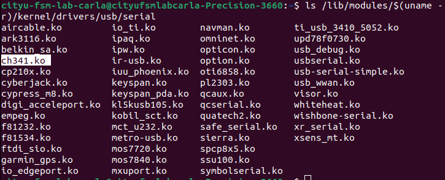

# this file is about the Configuration of serial port

1. Check whether the system contains ch34x driver

    ``` bash
    ls /lib/modules/$(uname -r)/kernel/drivers/usb/serial
    ```

    if exists, do not need to install
    
    if Does not exist, follow the steps below

    <https://blog.csdn.net/qq_50972633/article/details/132795565#:~:text=%E7%94%B1%E4%BA%8E%E7%AC%94%E8%AE%B0%E6%9C%AC%E4%B8%8A%E5%AE%89%E8%A3%85%E4%BA%86U>

2. View serial port devices

    <pre>
    if exists, continue
    if not:
        `sudo dmesg | grep brltty`
        if u got:
            `[ 7033.078452] usb 1-13: usbfs: interface 0 claimed by ch341 while 'brltty' sets config #1`
            then:
                it means the port has been ocuppied by other drivers, which we have to remove;
                Type in `sudo apt remove brltty` (brltty is drivers that provide support for Braille and speech devices);
                Re-plug the serial port device;
                    then:
                        u will see the above msg:
                        `ls /dev/ttyUSB0`
                        `/dev/ttyUSB0`
    </pre>

3. Grant Access

    `sudo chmod 777 /dev/ttyUSB0`

4. Set Permanent Permissions
   