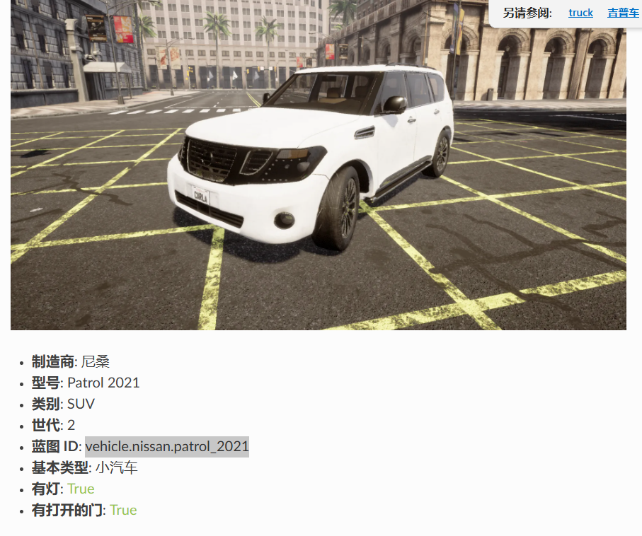
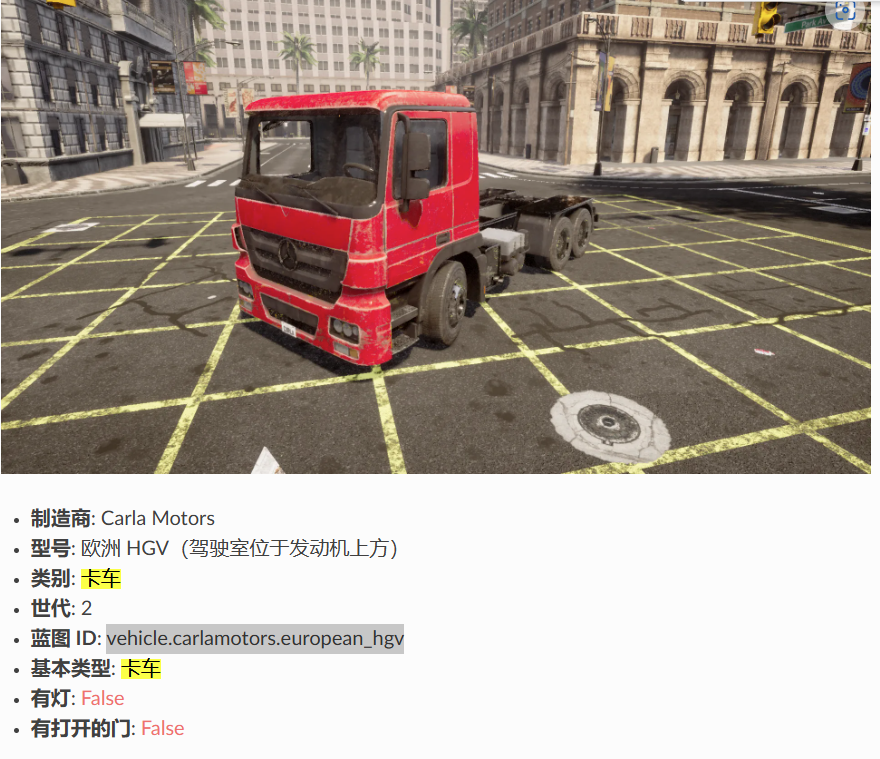
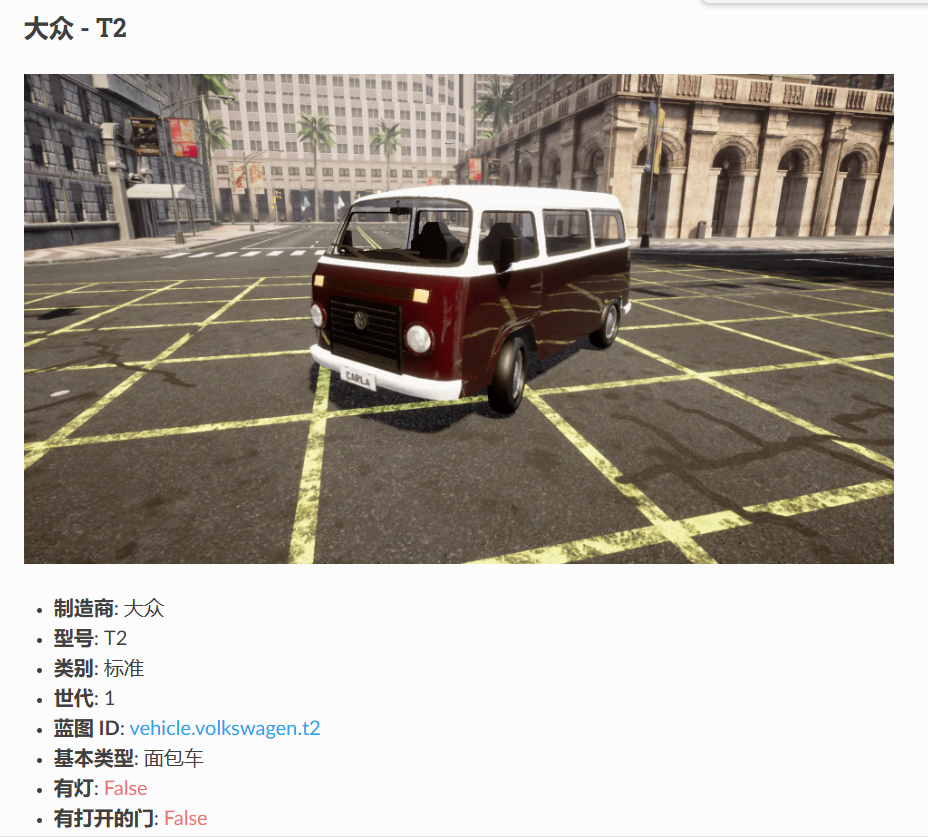
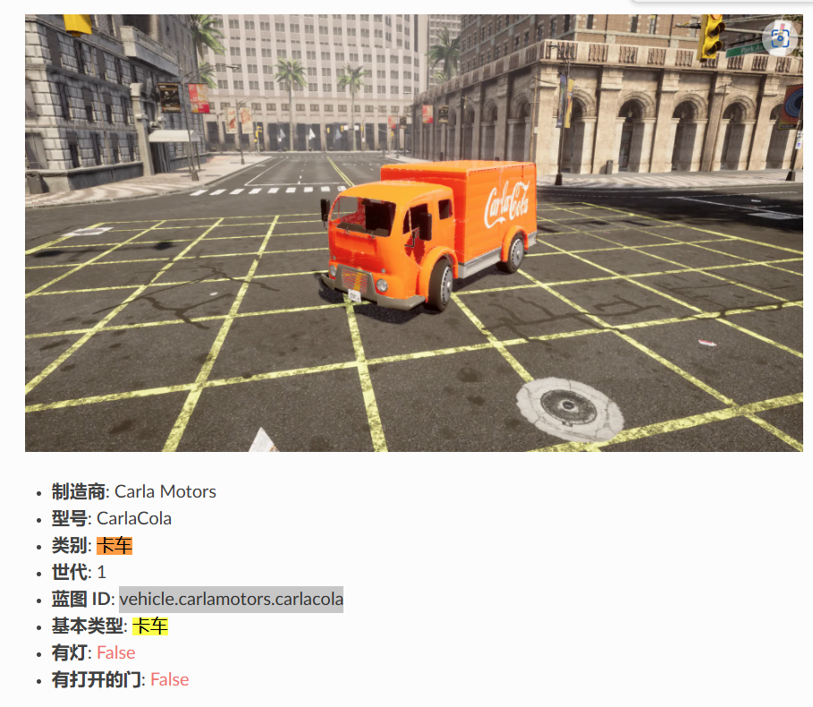
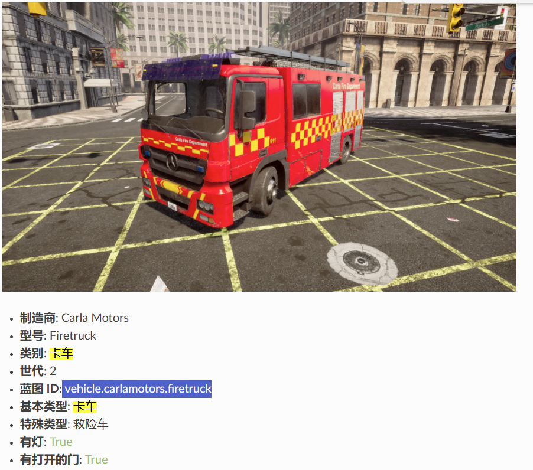

# this is the description of the vehicle in carla

1. vehicle.nissan.patrol_2021

2. vehicle.carlamotors.european_hgv

3. vehicle.volkswagen.t2

4. vehicle.carlamotors.carlacola

5. vehicle.carlamotors.firetruck

id_link

<https://openhutb.github.io/carla_doc/catalogue_vehicles/#carla-motors-european-hgv-cab-over-engine-type>