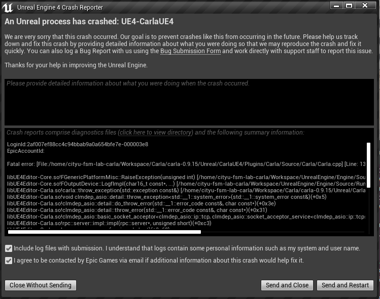

# thie is about the error message of carla

LoginId:2af007ef88cc4c94bbab9a0a654bfe7e-000003e8
EpicAccountId:

Fatal error: [File:/home/cityu-fsm-lab-carla/Workspace/Carla/carla-0.9.15/Unreal/CarlaUE4/Plugins/Carla/Source/Carla/Carla.cpp] [Line: 136] Exception thrown: bind: Address already in use << callstack too long >>

libUE4Editor-Core.so!FGenericPlatformMisc::RaiseException(unsigned int) [/home/cityu-fsm-lab-carla/Workspace/UnrealEngine/Engine/Source/Runtime/Core/Private/GenericPlatform/GenericPlatformMisc.cpp:472]
libUE4Editor-Core.so!FOutputDevice::LogfImpl(char16_t const*, ...) [/home/cityu-fsm-lab-carla/Workspace/UnrealEngine/Engine/Source/Runtime/Core/Private/Misc/OutputDevice.cpp:61]
libUE4Editor-Carla.so!carla::throw_exception(std::exception const&) [/home/cityu-fsm-lab-carla/Workspace/Carla/carla-0.9.15/Unreal/CarlaUE4/Plugins/Carla/Source/Carla/Carla.cpp:136]
libUE4Editor-Carla.so!void clmdep_asio::detail::throw_exception<std::__1::system_error>(std::__1::system_error const&)(+0x5)
libUE4Editor-Carla.so!clmdep_asio::detail::do_throw_error(std::__1::error_code const&, char const*)(+0x3e)
libUE4Editor-Carla.so!clmdep_asio::detail::throw_error(std::__1::error_code const&, char const*)(+0x31)
libUE4Editor-Carla.so!clmdep_asio::basic_socket_acceptor<clmdep_asio::ip::tcp, clmdep_asio::socket_acceptor_service<clmdep_asio::ip::tcp> >::basic_socket_acceptor(clmdep_asio::io_service&, clmdep_asio::ip::basic_endpoint<clmdep_asio::ip::tcp> const&, bool)(+0x255)
libUE4Editor-Carla.so!rpc::server::impl::impl(rpc::server*, unsigned short)(+0xc3)
libUE4Editor-Carla.so!rpc::server::server(unsigned short)(+0x68)
libUE4Editor-Carla.so!FCarlaServer::FPimpl::FPimpl(unsigned short, unsigned short, unsigned short) [/home/cityu-fsm-lab-carla/Workspace/Carla/carla-0.9.15/Unreal/CarlaUE4/Plugins/Carla/Source/Carla/Server/CarlaServer.cpp:104]
libUE4Editor-Carla.so!FCarlaServer::Start(unsigned short, unsigned short, unsigned short) [/home/cityu-fsm-lab-carla/Workspace/Carla/carla-0.9.15/Unreal/CarlaUE4/Plugins/Carla/Source/Carla/Server/CarlaServer.cpp:3016]
libUE4Editor-Carla.so!FCarlaEngine::NotifyInitGame(UCarlaSettings const&) [/home/cityu-fsm-lab-carla/Workspace/Carla/carla-0.9.15/Unreal/CarlaUE4/Plugins/Carla/Source/Carla/Game/CarlaEngine.cpp:87]
libUE4Editor-Carla.so!ACarlaGameModeBase::InitGame(FString const&, FString const&, FString&) [/home/cityu-fsm-lab-carla/Workspace/Carla/carla-0.9.15/Unreal/CarlaUE4/Plugins/Carla/Source/Carla/Game/CarlaGameModeBase.cpp:147]
libUE4Editor-Engine.so!UWorld::InitializeActorsForPlay(FURL const&, bool, FRegisterComponentContext*) [/home/cityu-fsm-lab-carla/Workspace/UnrealEngine/Engine/Source/Runtime/Engine/Private/World.cpp:4252]
libUE4Editor-Engine.so!UGameInstance::StartPlayInEditorGameInstance(ULocalPlayer*, FGameInstancePIEParameters const&) [/home/cityu-fsm-lab-carla/Workspace/UnrealEngine/Engine/Source/Runtime/Engine/Private/GameInstance.cpp:449]
libUE4Editor-UnrealEd.so!UEditorEngine::CreateInnerProcessPIEGameInstance(FRequestPlaySessionParams&, FGameInstancePIEParameters const&, int) [/home/cityu-fsm-lab-carla/Workspace/UnrealEngine/Engine/Source/Editor/UnrealEd/Private/PlayLevel.cpp:2941]
libUE4Editor-UnrealEd.so!UEditorEngine::OnLoginPIEComplete_Deferred(int, bool, FString, FPieLoginStruct) [/home/cityu-fsm-lab-carla/Workspace/UnrealEngine/Engine/Source/Editor/UnrealEd/Private/PlayLevel.cpp:1502]
libUE4Editor-UnrealEd.so!UEditorEngine::CreateNewPlayInEditorInstance(FRequestPlaySessionParams&, bool, EPlayNetMode) [/home/cityu-fsm-lab-carla/Workspace/UnrealEngine/Engine/Source/Editor/UnrealEd/Private/PlayLevel.cpp:1746]
libUE4Editor-UnrealEd.so!UEditorEngine::StartPlayInEditorSession(FRequestPlaySessionParams&) [/home/cityu-fsm-lab-carla/Workspace/UnrealEngine/Engine/Source/Editor/UnrealEd/Private/PlayLevel.cpp:2707]
libUE4Editor-UnrealEd.so!UEditorEngine::StartQueuedPlaySessionRequestImpl() [/home/cityu-fsm-lab-carla/Workspace/UnrealEngine/Engine/Source/Editor/UnrealEd/Private/PlayLevel.cpp:1103]
libUE4Editor-UnrealEd.so!UEditorEngine::StartQueuedPlaySessionRequest() [/home/cityu-fsm-lab-carla/Workspace/UnrealEngine/Engine/Source/Editor/UnrealEd/Private/PlayLevel.cpp:1015]
libUE4Editor-UnrealEd.so!UEditorEngine::Tick(float, bool) [/home/cityu-fsm-lab-carla/Workspace/UnrealEngine/Engine/Source/Editor/UnrealEd/Private/EditorEngine.cpp:1622]
libUE4Editor-UnrealEd.so!UUnrealEdEngine::Tick(float, bool) [/home/cityu-fsm-lab-carla/Workspace/UnrealEngine/Engine/Source/Editor/UnrealEd/Private/UnrealEdEngine.cpp:423]
UE4Editor!FEngineLoop::Tick() [/home/cityu-fsm-lab-carla/Workspace/UnrealEngine/Engine/Source/Runtime/Launch/Private/LaunchEngineLoop.cpp:4830]
UE4Editor!GuardedMain(char16_t const*) [/home/cityu-fsm-lab-carla/Workspace/UnrealEngine/Engine/Source/Runtime/Launch/Private/Launch.cpp:171]
libUE4Editor-UnixCommonStartup.so!CommonUnixMain(int, char**, int (*)(char16_t const*), void (*)()) [/home/cityu-fsm-lab-carla/Workspace/UnrealEngine/Engine/Source/Runtime/Unix/UnixCommonStartup/Private/UnixCommonStartup.cpp:264]
libc.so.6!UnknownFunction(0x29d8f)
libc.so.6!__libc_start_main(+0x7f)
UE4Editor!_start()

