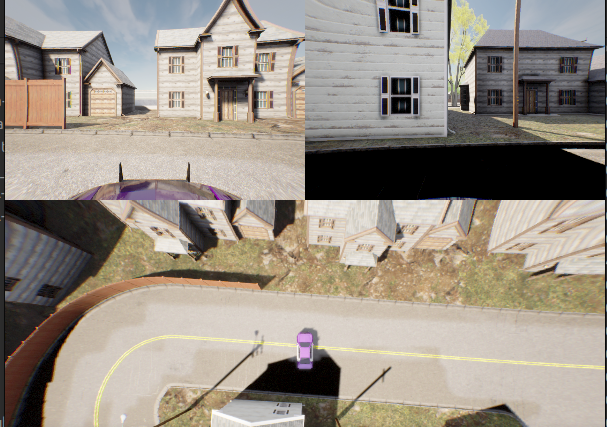
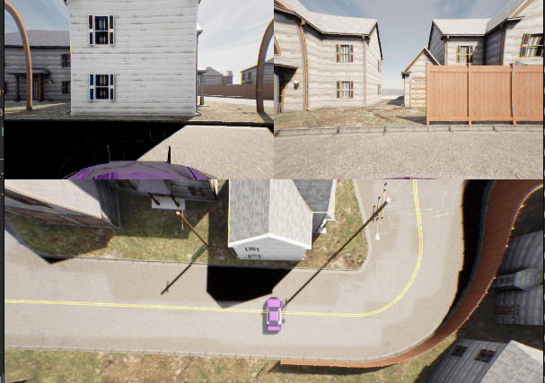
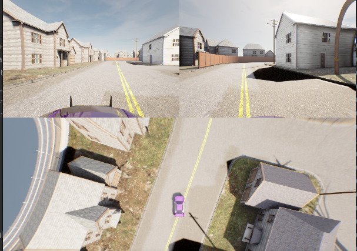

# record data of the ekf

[INFO] [1731480234.451989982] [transformed_SandBox_coordinate_publisher_node]: this is orginal pose: x: 0.08674791554199945, y: -0.8579059655759997, z: 0.0016,yaw: -178.44011648889264,
[INFO] [1731480234.453020227] [transformed_SandBox_coordinate_publisher_node]: ____transformed___pose x: -51.555731717168996, y: -44.80156187144443, z:0.0016000000400000006,yaw: 268.4401164888926,

[INFO] [1731482780.158658521] [transformed_SandBox_coordinate_publisher_node]: this is orginal pose: x: 0.2505308549349996, y: -1.0670851210460004, z: 0.0016,yaw: -93.78491647042415,
[INFO] [1731482780.158967742] [transformed_SandBox_coordinate_publisher_node]: ____transformed___pose x: -44.945382860054906, y: -37.56081165314978, z:0.0016000000400000006,yaw: 183.78491647042415,

[INFO] [1731482834.166789544] [transformed_SandBox_coordinate_publisher_node]: this is orginal pose: x: 0.22581030096799992, y: -0.963033046279, z: 0.0016,yaw: 88.28288353026541,
[INFO] [1731482834.167070858] [transformed_SandBox_coordinate_publisher_node]: ____transformed___pose x: -45.833696382947004, y: -42.158573595795986, z:0.0016000000400000006,yaw: 1.7171164697345915,

[INFO] [1731483267.465150341] [transformed_SandBox_coordinate_publisher_node]: this is orginal pose: x: 0.19959547063699956, y: -1.4227158104000002, z: 0.0016,yaw: -16.477116492064162,
[INFO] [1731483267.465961781] [transformed_SandBox_coordinate_publisher_node]: ____transformed___pose x: -45.661476244234535, y: -26.31051938789643, z:0.0016000000400000006,yaw: 106.47711649206417,

[88,180]
[-180,-93]---->+0.01

[INFO] [1731483403.986831058] [transformed_SandBox_coordinate_publisher_node]: this is orginal pose: x: 0.1687734751319998, y: -0.6700254509820005, z: 0.0016,yaw: -179.84651648913845,
[INFO] [1731483403.987195657] [transformed_SandBox_coordinate_publisher_node]: ____transformed___pose x: -48.5925623401998, y: -51.077792394300445, z:0.0016000000400000006,yaw: 269.8465164891385,
[INFO] [1731483538.794767145] [transformed_SandBox_coordinate_publisher_node]: this is orginal pose: x: 0.3045547144709997, y: -3.095216243835, z: 0.0016,yaw: 1.6409835111214919,
[INFO] [1731483538.795163026] [transformed_SandBox_coordinate_publisher_node]: ____transformed___pose x: -40.58410719494692, y: 28.197330222219236, z:0.0016000000400000006,yaw: 88.35901648887851,

yaw->[-93,88]
y->[-3.09,-0.45]
if x<0.41 and -3.09<= y <=-0.45 and -93 <= yaw <= 88:

[INFO] [1731483762.858451232] [transformed_SandBox_coordinate_publisher_node]: this is orginal pose: x: 0.41605215041599974, y: -0.45873686343300024, z: 0.0016,yaw: -51.13641649874441,
[INFO] [1731483762.858695542] [transformed_SandBox_coordinate_publisher_node]: ____transformed___pose x: -39.6946560647067, y: -57.798879647062215, z:0.0016000000400000006,yaw: 141.1364164987444,

--->-0.06

[INFO] [1731567795.195217708] [transformed_SandBox_coordinate_publisher_node]: this is orginal pose: x: 0.884923888691, y: -0.4572828889860001, z: 0.0016,yaw: 70.73108352504545,

[INFO] [1731567795.195545079] [transformed_SandBox_coordinate_publisher_node]: ____transformed___pose x: -24.346673512372558, y: -59.96430863420839, z:0.0016000000400000006,yaw: 19.26891647495455,

[INFO] [1731489979.850899828] [transformed_SandBox_coordinate_publisher_node]: this is orginal pose: x: 3.8407750639069995, y: -2.216235635226, z: 0.0016,yaw: -11.907916491253337,
[INFO] [1731489979.851299615] [transformed_SandBox_coordinate_publisher_node]: ____transformed___pose x: 74.42054300614961, y: -3.883459711887849, z:0.0016000000400000006,yaw: 101.90791649125333,

[INFO] [1731490044.821314852] [transformed_SandBox_coordinate_publisher_node]: this is orginal pose: x: 3.833917256784, y: -1.4712762316390005, z: 0.0016,yaw: 24.967683515267566,
[INFO] [1731490044.821620878] [transformed_SandBox_coordinate_publisher_node]: ____transformed___pose x: 73.41971145077774, y: -28.66506346007645, z:0.0016000000400000006,yaw: 65.03231648473243,

[INFO] [1731490123.181891194] [transformed_SandBox_coordinate_publisher_node]: this is orginal pose: x: 3.5942300189719996, y: -2.193502595496, z: 0.0016,yaw: -99.74051647228744,
[INFO] [1731490123.182195876] [transformed_SandBox_coordinate_publisher_node]: ____transformed___pose x: 65.63877988518746, y: -3.896702978375891, z:0.0016000000400000006,yaw: 189.74051647228742,

[INFO] [1731490205.798293908] [transformed_SandBox_coordinate_publisher_node]: this is orginal pose: x: 3.105311931611, y: -1.7821181576540002, z: 0.0016,yaw: -119.86241647757353,
[INFO] [1731490205.798645806] [transformed_SandBox_coordinate_publisher_node]: ____transformed___pose x: 49.01968910845188, y: -16.96819758204031, z:0.0016000000400000006,yaw: 209.86241647757353,
