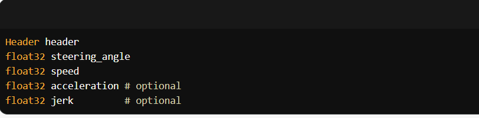
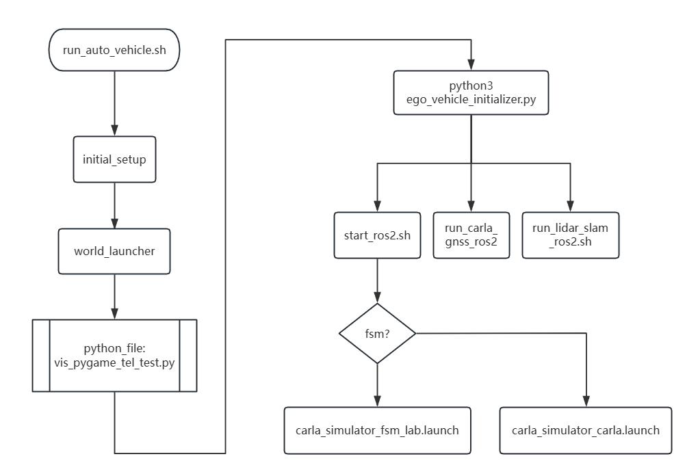

# this is the framework design for the autoware_commn

## AckermannControlCommand

from autoware_auto_control_msgs.msg import AckermannControlCommand


<https://autowarefoundation.github.io/autoware-documentation/main/design/autoware-interfaces/components/control/>




perhaps need Instruction Adjustment Mechanism

## source_code_framework

this is the framework of launching the autoware



## ego_vehicle_initializer.py

* fun_setup()  this is the initializer of the whole agent
* Load a series of startup files
* run_step()
* init_subscribers()
* call_backfunctions()
* init_publishers()
* publisher_handlers()
* other_handlers()

## start_ros2.sh

this bash include the following two files

### carla_simulation_fsm.launch

(find-pkg-share autoware_launch)/launch/autoware.launch.xml"

### carla_simulation_carla.launch

autoware_launch

## run_carla_gnss_ros2.sh

gnss.launch.xml

## run_lidar_slam_ros2.sh

lidarslam.launch.py

## **autoware_launch.xml**

## localization node list

```bash

/localization/localization_error_monitor
/localization/pose_estimator/ndt_scan_matcher
/localization/pose_estimator/transform_listener_impl_57e936088da8
/localization/pose_twist_fusion_filter/ekf_localizer
/localization/pose_twist_fusion_filter/stop_filter
/localization/pose_twist_fusion_filter/twist2accel
/localization/twist_estimator/gyro_odometer
/localization/twist_estimator/transform_listener_impl_5990160b90a0
/localization/util/crop_box_filter_measurement_range
/localization/util/default_ad_api/helpers/automatic_pose_initializer
/localization/util/pose_initializer_node
/localization/util/random_downsample_filter
/localization/util/transform_listener_impl_559561216108
/localization/util/voxel_grid_downsample_filter

```

## localization topic list

```bash

/localization/acceleration
/localization/debug/ellipse_marker
/localization/initialization_state

        /localization/kinematic_state

/localization/pose_estimator/debug/loaded_pointcloud_map
/localization/pose_estimator/exe_time_ms

/localization/pose_estimator/initial_pose_with_covariance
/localization/pose_estimator/initial_to_result_distance
/localization/pose_estimator/initial_to_result_distance_new
/localization/pose_estimator/initial_to_result_distance_old
/localization/pose_estimator/iteration_num

/localization/pose_estimator/monte_carlo_initial_pose_marker
/localization/pose_estimator/ndt_marker
/localization/pose_estimator/nearest_voxel_transformation_likelihood
/localization/pose_estimator/no_ground_nearest_voxel_transformation_likelihood
/localization/pose_estimator/no_ground_transform_probability
/localization/pose_estimator/points_aligned
/localization/pose_estimator/points_aligned_no_ground
        /localization/pose_estimator/pose
        /localization/pose_estimator/pose_with_covariance
/localization/pose_estimator/transform_probability
/localization/pose_twist_fusion_filter/biased_pose
/localization/pose_twist_fusion_filter/biased_pose_with_covariance
/localization/pose_twist_fusion_filter/debug
/localization/pose_twist_fusion_filter/debug/measured_pose
/localization/pose_twist_fusion_filter/debug/stop_flag
/localization/pose_twist_fusion_filter/estimated_yaw_bias
/localization/pose_twist_fusion_filter/kinematic_state
        /localization/pose_twist_fusion_filter/pose
        /localization/pose_twist_fusion_filter/twist
/localization/pose_twist_fusion_filter/twist_with_covariance
        /localization/pose_with_covariance
/localization/twist_estimator/gyro_twist
/localization/twist_estimator/gyro_twist_raw
        /localization/twist_estimator/twist_with_covariance
/localization/twist_estimator/twist_with_covariance_raw
/localization/util/crop_box_filter/debug/cyclic_time_ms
/localization/util/crop_box_filter/debug/processing_time_ms
/localization/util/crop_box_filter_measurement_range/crop_box_polygon
/localization/util/downsample/pointcloud
/localization/util/measurement_range/pointcloud
/localization/util/voxel_grid_downsample/pointcloud

```

## topic list

/Sensor_msgs/INS/GnssInsOrientation
/api/autoware/get/emergency
/api/autoware/get/engage
/api/autoware/get/map/info/hash
/api/external/get/command/selected/control
/api/external/get/rtc_status
/api/external/set/command/local/control
/api/external/set/command/local/heartbeat
/api/external/set/command/local/shift
/api/external/set/command/local/turn_signal
/api/external/set/command/remote/control
/api/external/set/command/remote/heartbeat
/api/external/set/command/remote/shift
/api/external/set/command/remote/turn_signal
/api/fail_safe/mrm_state
/api/localization/initialization_state
/api/motion/state
/api/operation_mode/state
/api/perception/objects
/api/planning/steering_factors
/api/planning/velocity_factors
/api/routing/route
/api/routing/state
/api/vehicle/kinematics
/api/vehicle/status
/autoware/engage
/autoware/state
/awapi/tmp/virtual_traffic_light_states
/carla/map_file
/carla_nav_sat_fix
/carla_pointcloud
/clock
/control/command/control_cmd
/control/command/emergency_cmd
/control/command/gear_cmd
/control/command/hazard_lights_cmd
/control/command/turn_indicators_cmd
/control/control_validator/debug/marker
/control/control_validator/output/markers
/control/control_validator/validation_status
/control/control_validator/virtual_wall
/control/current_gate_mode
/control/external_cmd_selector/current_selector_mode
/control/gate_mode_cmd
/control/operation_mode_transition_manager/debug_info
/control/shift_decider/gear_cmd
/control/trajectory_follower/control_cmd
/control/trajectory_follower/controller_node_exe/output/debug_marker
/control/trajectory_follower/controller_node_exe/output/estimated_steer_offset
/control/trajectory_follower/lane_departure_checker_node/debug/processing_time_ms
/control/trajectory_follower/lateral/diagnostic
/control/trajectory_follower/lateral/predicted_trajectory
/control/trajectory_follower/longitudinal/diagnostic
/control/trajectory_follower/longitudinal/slope_angle
/control/vehicle_cmd_gate/is_filter_activated
/control/vehicle_cmd_gate/is_filter_activated/marker
/control/vehicle_cmd_gate/is_paused
/control/vehicle_cmd_gate/is_start_requested
/control/vehicle_cmd_gate/is_stopped
/control/vehicle_cmd_gate/operation_mode
/diagnostic/planning_evaluator/metrics
/diagnostics
/diagnostics_agg
/diagnostics_err
/diagnostics_toplevel_state
/external/selected/control_cmd
/external/selected/external_control_cmd
/external/selected/gear_cmd
/external/selected/hazard_lights_cmd
/external/selected/heartbeat
/external/selected/turn_indicators_cmd
/initialpose
/initialpose3d
/joint_states
/localization/acceleration
/localization/debug/ellipse_marker
/localization/initialization_state
/localization/kinematic_state
/localization/pose_estimator/debug/loaded_pointcloud_map
/localization/pose_estimator/exe_time_ms
/localization/pose_estimator/initial_pose_with_covariance
/localization/pose_estimator/initial_to_result_distance
/localization/pose_estimator/initial_to_result_distance_new
/localization/pose_estimator/initial_to_result_distance_old
/localization/pose_estimator/iteration_num
/localization/pose_estimator/monte_carlo_initial_pose_marker
/localization/pose_estimator/ndt_marker
/localization/pose_estimator/nearest_voxel_transformation_likelihood
/localization/pose_estimator/no_ground_nearest_voxel_transformation_likelihood
/localization/pose_estimator/no_ground_transform_probability
/localization/pose_estimator/points_aligned
/localization/pose_estimator/points_aligned_no_ground
/localization/pose_estimator/pose
/localization/pose_estimator/pose_with_covariance
/localization/pose_estimator/transform_probability
/localization/pose_twist_fusion_filter/biased_pose
/localization/pose_twist_fusion_filter/biased_pose_with_covariance
/localization/pose_twist_fusion_filter/debug
/localization/pose_twist_fusion_filter/debug/measured_pose
/localization/pose_twist_fusion_filter/debug/stop_flag
/localization/pose_twist_fusion_filter/estimated_yaw_bias
/localization/pose_twist_fusion_filter/kinematic_state
/localization/pose_twist_fusion_filter/pose
/localization/pose_twist_fusion_filter/twist
/localization/pose_twist_fusion_filter/twist_with_covariance
/localization/pose_with_covariance
/localization/twist_estimator/gyro_twist
/localization/twist_estimator/gyro_twist_raw
/localization/twist_estimator/twist_with_covariance
/localization/twist_estimator/twist_with_covariance_raw
/localization/util/crop_box_filter/debug/cyclic_time_ms
/localization/util/crop_box_filter/debug/processing_time_ms
/localization/util/crop_box_filter_measurement_range/crop_box_polygon
/localization/util/downsample/pointcloud
/localization/util/measurement_range/pointcloud
/localization/util/voxel_grid_downsample/pointcloud
/map/map_projector_info
/map/pointcloud_map
/map/vector_map
/map/vector_map_marker
/odo
/parameter_events
/perception/object_recognition/detection/centerpoint/lidar_centerpoint/debug/cyclic_time_ms
/perception/object_recognition/detection/centerpoint/lidar_centerpoint/debug/processing_time_ms
/perception/object_recognition/detection/centerpoint/objects
/perception/object_recognition/detection/centerpoint/validation/objects
/perception/object_recognition/detection/clustering/clusters
/perception/object_recognition/detection/clustering/crop_box_filter/debug/cyclic_time_ms
/perception/object_recognition/detection/clustering/crop_box_filter/debug/processing_time_ms
/perception/object_recognition/detection/clustering/debug/clusters
/perception/object_recognition/detection/clustering/low_height/pointcloud
/perception/object_recognition/detection/clustering/low_height_crop_box_filter/crop_box_polygon
/perception/object_recognition/detection/clustering/objects
/perception/object_recognition/detection/clustering/objects_with_feature
/perception/object_recognition/detection/debug/downsampled_map/pointcloud
/perception/object_recognition/detection/detection_by_tracker/debug/divided_objects
/perception/object_recognition/detection/detection_by_tracker/debug/initial_objects
/perception/object_recognition/detection/detection_by_tracker/debug/merged_objects
/perception/object_recognition/detection/detection_by_tracker/debug/tracked_objects
/perception/object_recognition/detection/detection_by_tracker/objects
/perception/object_recognition/detection/objects
/perception/object_recognition/detection/objects_before_filter
/perception/object_recognition/detection/pointcloud_map_filtered/pointcloud
/perception/object_recognition/detection/temporary_merged_objects
/perception/object_recognition/detection/voxel_based_compare_map_filter/debug/cyclic_time_ms
/perception/object_recognition/detection/voxel_based_compare_map_filter/debug/processing_time_ms
/perception/object_recognition/objects
/perception/object_recognition/prediction/maneuver
/perception/object_recognition/prediction/map_based_prediction/debug/calculation_time
/perception/object_recognition/tracking/objects
/perception/obstacle_segmentation/crop_box_filter/crop_box_polygon
/perception/obstacle_segmentation/crop_box_filter/debug/cyclic_time_ms
/perception/obstacle_segmentation/crop_box_filter/debug/processing_time_ms
/perception/obstacle_segmentation/occupancy_grid_map_outlier_filter/debug/cyclic_time_ms
/perception/obstacle_segmentation/occupancy_grid_map_outlier_filter/debug/processing_time_ms
/perception/obstacle_segmentation/pointcloud
/perception/obstacle_segmentation/pointcloud_map_filtered/downsampled/pointcloud
/perception/obstacle_segmentation/range_cropped/pointcloud
/perception/obstacle_segmentation/scan_ground_filter/debug/cyclic_time_ms
/perception/obstacle_segmentation/scan_ground_filter/debug/processing_time_ms
/perception/obstacle_segmentation/single_frame/pointcloud_raw
/perception/occupancy_grid_map/map
/perception/occupancy_grid_map/map_updates
/perception/occupancy_grid_map/pointcloud_based_occupancy_grid_map/debug/cyclic_time_ms
/perception/occupancy_grid_map/pointcloud_based_occupancy_grid_map/debug/processing_time_ms
/perception/traffic_light_recognition/external/traffic_signals
/perception/traffic_light_recognition/fusion/traffic_signals
/perception/traffic_light_recognition/internal/traffic_signals
/perception/traffic_light_recognition/traffic_light/camera_info
/perception/traffic_light_recognition/traffic_light/classification/classified/traffic_signals
/perception/traffic_light_recognition/traffic_light/classification/traffic_light_classifier/output/debug/image
/perception/traffic_light_recognition/traffic_light/classification/traffic_light_classifier/output/debug/image/compressed
/perception/traffic_light_recognition/traffic_light/classification/traffic_light_classifier/output/debug/image/compressedDepth
/perception/traffic_light_recognition/traffic_light/classification/traffic_light_classifier/output/debug/image/theora
/perception/traffic_light_recognition/traffic_light/classification/traffic_signals
/perception/traffic_light_recognition/traffic_light/debug/rois
/perception/traffic_light_recognition/traffic_light/debug/rois/compressed
/perception/traffic_light_recognition/traffic_light/debug/rois/compressedDepth
/perception/traffic_light_recognition/traffic_light/debug/rois/theora
/perception/traffic_light_recognition/traffic_light/detection/expect/rois
/perception/traffic_light_recognition/traffic_light/detection/rois
/perception/traffic_light_recognition/traffic_light/detection/traffic_light_map_based_detector/debug/markers
/perception/traffic_light_recognition/traffic_light_map_based_detector/debug/markers
/perception/traffic_light_recognition/traffic_signals
/perception/traffic_light_recognition/traffic_signals/markers
/planning/cooperate_status/avoidance_by_lane_change_left
/planning/cooperate_status/avoidance_by_lane_change_right
/planning/cooperate_status/avoidance_left
/planning/cooperate_status/avoidance_right
/planning/cooperate_status/blind_spot
/planning/cooperate_status/crosswalk
/planning/cooperate_status/detection_area
/planning/cooperate_status/external_request_lane_change_left
/planning/cooperate_status/external_request_lane_change_right
/planning/cooperate_status/goal_planner
/planning/cooperate_status/intersection
/planning/cooperate_status/intersection_occlusion
/planning/cooperate_status/lane_change_left
/planning/cooperate_status/lane_change_right
/planning/cooperate_status/no_stopping_area
/planning/cooperate_status/occlusion_spot
/planning/cooperate_status/start_planner
/planning/cooperate_status/traffic_light
/planning/cooperate_status/virtual_traffic_light
/planning/hazard_lights_cmd
/planning/mission_planning/checkpoint
/planning/mission_planning/debug/goal_footprint
/planning/mission_planning/echo_back_goal_pose
/planning/mission_planning/goal
/planning/mission_planning/mrm_route
/planning/mission_planning/normal_route
/planning/mission_planning/route
/planning/mission_planning/route_marker
/planning/mission_planning/route_state
/planning/path_candidate/avoidance
/planning/path_candidate/avoidance_by_lane_change
/planning/path_candidate/external_request_lane_change_left
/planning/path_candidate/external_request_lane_change_right
/planning/path_candidate/goal_planner
/planning/path_candidate/lane_change
/planning/path_candidate/lane_change_left
/planning/path_candidate/lane_change_right
/planning/path_candidate/side_shift
/planning/path_candidate/start_planner
/planning/path_reference/avoidance
/planning/path_reference/avoidance_by_lane_change
/planning/path_reference/goal_planner
/planning/path_reference/lane_change_left
/planning/path_reference/lane_change_right
/planning/path_reference/side_shift
/planning/path_reference/start_planner
/planning/planning_validator/debug/marker
/planning/planning_validator/output/markers
/planning/planning_validator/validation_status
/planning/planning_validator/virtual_wall
/planning/scenario_planning/clear_velocity_limit
/planning/scenario_planning/current_max_velocity
/planning/scenario_planning/external_velocity_limit_selector/debug
/planning/scenario_planning/lane_driving/behavior_planning/behavior_path_planner/debug/avoidance
/planning/scenario_planning/lane_driving/behavior_planning/behavior_path_planner/debug/avoidance_by_lane_change
/planning/scenario_planning/lane_driving/behavior_planning/behavior_path_planner/debug/avoidance_debug_message_array
/planning/scenario_planning/lane_driving/behavior_planning/behavior_path_planner/debug/bound
/planning/scenario_planning/lane_driving/behavior_planning/behavior_path_planner/debug/goal_planner
/planning/scenario_planning/lane_driving/behavior_planning/behavior_path_planner/debug/lane_change_debug_message_array
/planning/scenario_planning/lane_driving/behavior_planning/behavior_path_planner/debug/lane_change_left
/planning/scenario_planning/lane_driving/behavior_planning/behavior_path_planner/debug/lane_change_right
/planning/scenario_planning/lane_driving/behavior_planning/behavior_path_planner/debug/side_shift
/planning/scenario_planning/lane_driving/behavior_planning/behavior_path_planner/debug/start_planner
/planning/scenario_planning/lane_driving/behavior_planning/behavior_path_planner/debug/turn_signal_info
/planning/scenario_planning/lane_driving/behavior_planning/behavior_path_planner/drivable_lanes/avoidance
/planning/scenario_planning/lane_driving/behavior_planning/behavior_path_planner/drivable_lanes/avoidance_by_lane_change
/planning/scenario_planning/lane_driving/behavior_planning/behavior_path_planner/drivable_lanes/goal_planner
/planning/scenario_planning/lane_driving/behavior_planning/behavior_path_planner/drivable_lanes/lane_change_left
/planning/scenario_planning/lane_driving/behavior_planning/behavior_path_planner/drivable_lanes/lane_change_right
/planning/scenario_planning/lane_driving/behavior_planning/behavior_path_planner/drivable_lanes/side_shift
/planning/scenario_planning/lane_driving/behavior_planning/behavior_path_planner/drivable_lanes/start_planner
/planning/scenario_planning/lane_driving/behavior_planning/behavior_path_planner/info/avoidance
/planning/scenario_planning/lane_driving/behavior_planning/behavior_path_planner/info/avoidance_by_lane_change
/planning/scenario_planning/lane_driving/behavior_planning/behavior_path_planner/info/goal_planner
/planning/scenario_planning/lane_driving/behavior_planning/behavior_path_planner/info/lane_change_left
/planning/scenario_planning/lane_driving/behavior_planning/behavior_path_planner/info/lane_change_right
/planning/scenario_planning/lane_driving/behavior_planning/behavior_path_planner/info/side_shift
/planning/scenario_planning/lane_driving/behavior_planning/behavior_path_planner/info/start_planner
/planning/scenario_planning/lane_driving/behavior_planning/behavior_path_planner/input/lateral_offset
/planning/scenario_planning/lane_driving/behavior_planning/behavior_path_planner/maximum_drivable_area
/planning/scenario_planning/lane_driving/behavior_planning/behavior_path_planner/output/is_reroute_available
/planning/scenario_planning/lane_driving/behavior_planning/behavior_path_planner/virtual_wall/avoidance
/planning/scenario_planning/lane_driving/behavior_planning/behavior_path_planner/virtual_wall/avoidance_by_lane_change
/planning/scenario_planning/lane_driving/behavior_planning/behavior_path_planner/virtual_wall/external_request_lane_change_left
/planning/scenario_planning/lane_driving/behavior_planning/behavior_path_planner/virtual_wall/external_request_lane_change_right
/planning/scenario_planning/lane_driving/behavior_planning/behavior_path_planner/virtual_wall/goal_planner
/planning/scenario_planning/lane_driving/behavior_planning/behavior_path_planner/virtual_wall/lane_change_left
/planning/scenario_planning/lane_driving/behavior_planning/behavior_path_planner/virtual_wall/lane_change_right
/planning/scenario_planning/lane_driving/behavior_planning/behavior_path_planner/virtual_wall/side_shift
/planning/scenario_planning/lane_driving/behavior_planning/behavior_path_planner/virtual_wall/start_planner
/planning/scenario_planning/lane_driving/behavior_planning/behavior_velocity_planner/debug/blind_spot
/planning/scenario_planning/lane_driving/behavior_planning/behavior_velocity_planner/debug/crosswalk
/planning/scenario_planning/lane_driving/behavior_planning/behavior_velocity_planner/debug/detection_area
/planning/scenario_planning/lane_driving/behavior_planning/behavior_velocity_planner/debug/intersection
/planning/scenario_planning/lane_driving/behavior_planning/behavior_velocity_planner/debug/merge_from_private
/planning/scenario_planning/lane_driving/behavior_planning/behavior_velocity_planner/debug/no_stopping_area
/planning/scenario_planning/lane_driving/behavior_planning/behavior_velocity_planner/debug/out_of_lane
/planning/scenario_planning/lane_driving/behavior_planning/behavior_velocity_planner/debug/path
/planning/scenario_planning/lane_driving/behavior_planning/behavior_velocity_planner/debug/stop_line
/planning/scenario_planning/lane_driving/behavior_planning/behavior_velocity_planner/debug/traffic_light
/planning/scenario_planning/lane_driving/behavior_planning/behavior_velocity_planner/debug/walkway
/planning/scenario_planning/lane_driving/behavior_planning/behavior_velocity_planner/output/stop_reason
/planning/scenario_planning/lane_driving/behavior_planning/behavior_velocity_planner/virtual_wall/blind_spot
/planning/scenario_planning/lane_driving/behavior_planning/behavior_velocity_planner/virtual_wall/crosswalk
/planning/scenario_planning/lane_driving/behavior_planning/behavior_velocity_planner/virtual_wall/detection_area
/planning/scenario_planning/lane_driving/behavior_planning/behavior_velocity_planner/virtual_wall/intersection
/planning/scenario_planning/lane_driving/behavior_planning/behavior_velocity_planner/virtual_wall/merge_from_private
/planning/scenario_planning/lane_driving/behavior_planning/behavior_velocity_planner/virtual_wall/no_drivable_lane
/planning/scenario_planning/lane_driving/behavior_planning/behavior_velocity_planner/virtual_wall/no_stopping_area
/planning/scenario_planning/lane_driving/behavior_planning/behavior_velocity_planner/virtual_wall/occlusion_spot
/planning/scenario_planning/lane_driving/behavior_planning/behavior_velocity_planner/virtual_wall/out_of_lane
/planning/scenario_planning/lane_driving/behavior_planning/behavior_velocity_planner/virtual_wall/run_out
/planning/scenario_planning/lane_driving/behavior_planning/behavior_velocity_planner/virtual_wall/speed_bump
/planning/scenario_planning/lane_driving/behavior_planning/behavior_velocity_planner/virtual_wall/stop_line
/planning/scenario_planning/lane_driving/behavior_planning/behavior_velocity_planner/virtual_wall/traffic_light
/planning/scenario_planning/lane_driving/behavior_planning/behavior_velocity_planner/virtual_wall/virtual_traffic_light
/planning/scenario_planning/lane_driving/behavior_planning/behavior_velocity_planner/virtual_wall/walkway
/planning/scenario_planning/lane_driving/behavior_planning/debug/traffic_signal
/planning/scenario_planning/lane_driving/behavior_planning/output/auto_mode_statuses
/planning/scenario_planning/lane_driving/behavior_planning/path
/planning/scenario_planning/lane_driving/behavior_planning/path_with_lane_id
/planning/scenario_planning/lane_driving/motion_planning/debug_markers
/planning/scenario_planning/lane_driving/motion_planning/elastic_band_smoother/debug/calculation_time
/planning/scenario_planning/lane_driving/motion_planning/elastic_band_smoother/debug/eb_fixed_traj
/planning/scenario_planning/lane_driving/motion_planning/elastic_band_smoother/debug/eb_traj
/planning/scenario_planning/lane_driving/motion_planning/elastic_band_smoother/debug/extended_traj
/planning/scenario_planning/lane_driving/motion_planning/elastic_band_smoother/output/traj
/planning/scenario_planning/lane_driving/motion_planning/obstacle_avoidance_planner/debug/calculation_time
/planning/scenario_planning/lane_driving/motion_planning/obstacle_avoidance_planner/debug/extended_traj
/planning/scenario_planning/lane_driving/motion_planning/obstacle_avoidance_planner/debug/marker
/planning/scenario_planning/lane_driving/motion_planning/obstacle_avoidance_planner/debug/mpt_fixed_traj
/planning/scenario_planning/lane_driving/motion_planning/obstacle_avoidance_planner/debug/mpt_ref_traj
/planning/scenario_planning/lane_driving/motion_planning/obstacle_avoidance_planner/debug/mpt_traj
/planning/scenario_planning/lane_driving/motion_planning/obstacle_avoidance_planner/trajectory
/planning/scenario_planning/lane_driving/motion_planning/obstacle_avoidance_planner/virtual_wall
/planning/scenario_planning/lane_driving/motion_planning/obstacle_cruise_planner/virtual_wall
/planning/scenario_planning/lane_driving/motion_planning/obstacle_stop_planner/adaptive_cruise_control/debug_values
/planning/scenario_planning/lane_driving/motion_planning/obstacle_stop_planner/debug/collision_pointcloud
/planning/scenario_planning/lane_driving/motion_planning/obstacle_stop_planner/debug/marker
/planning/scenario_planning/lane_driving/motion_planning/obstacle_stop_planner/debug/obstacle_pointcloud
/planning/scenario_planning/lane_driving/motion_planning/obstacle_stop_planner/input/expand_stop_range
/planning/scenario_planning/lane_driving/motion_planning/obstacle_stop_planner/obstacle_stop/debug_values
/planning/scenario_planning/lane_driving/motion_planning/obstacle_stop_planner/virtual_wall
/planning/scenario_planning/lane_driving/motion_planning/obstacle_velocity_limiter/output/runtime_microseconds
/planning/scenario_planning/lane_driving/motion_planning/obstacle_velocity_limiter/trajectory
/planning/scenario_planning/lane_driving/motion_planning/path_smoother/path
/planning/scenario_planning/lane_driving/motion_planning/surround_obstacle_checker/debug/footprint
/planning/scenario_planning/lane_driving/motion_planning/surround_obstacle_checker/debug/footprint_offset
/planning/scenario_planning/lane_driving/motion_planning/surround_obstacle_checker/debug/footprint_recover_offset
/planning/scenario_planning/lane_driving/motion_planning/surround_obstacle_checker/debug/marker
/planning/scenario_planning/lane_driving/motion_planning/surround_obstacle_checker/virtual_wall
/planning/scenario_planning/lane_driving/trajectory
/planning/scenario_planning/max_velocity
/planning/scenario_planning/max_velocity_candidates
/planning/scenario_planning/max_velocity_default
/planning/scenario_planning/modified_goal
/planning/scenario_planning/motion_velocity_smoother/calculation_time
/planning/scenario_planning/motion_velocity_smoother/closest_acceleration
/planning/scenario_planning/motion_velocity_smoother/closest_jerk
/planning/scenario_planning/motion_velocity_smoother/closest_max_velocity
/planning/scenario_planning/motion_velocity_smoother/closest_merged_velocity
/planning/scenario_planning/motion_velocity_smoother/closest_velocity
/planning/scenario_planning/motion_velocity_smoother/debug/backward_filtered_trajectory
/planning/scenario_planning/motion_velocity_smoother/debug/forward_filtered_trajectory
/planning/scenario_planning/motion_velocity_smoother/debug/merged_filtered_trajectory
/planning/scenario_planning/motion_velocity_smoother/debug/trajectory_external_velocity_limited
/planning/scenario_planning/motion_velocity_smoother/debug/trajectory_lateral_acc_filtered
/planning/scenario_planning/motion_velocity_smoother/debug/trajectory_raw
/planning/scenario_planning/motion_velocity_smoother/debug/trajectory_steering_rate_limited
/planning/scenario_planning/motion_velocity_smoother/debug/trajectory_time_resampled
/planning/scenario_planning/motion_velocity_smoother/distance_to_stopline
/planning/scenario_planning/motion_velocity_smoother/stop_speed_exceeded
/planning/scenario_planning/motion_velocity_smoother/trajectory
/planning/scenario_planning/motion_velocity_smoother/virtual_wall
/planning/scenario_planning/parking/costmap_generator/grid_map
/planning/scenario_planning/parking/costmap_generator/occupancy_grid
/planning/scenario_planning/parking/freespace_planner/debug/partial_pose_array
/planning/scenario_planning/parking/freespace_planner/debug/pose_array
/planning/scenario_planning/parking/is_completed
/planning/scenario_planning/parking/trajectory
/planning/scenario_planning/scenario
/planning/scenario_planning/scenario_selector/trajectory
/planning/scenario_planning/status/infrastructure_commands
/planning/scenario_planning/status/no_start_reason
/planning/scenario_planning/status/stop_reason
/planning/scenario_planning/status/stop_reasons
/planning/scenario_planning/trajectory
/planning/steering_factor/avoidance
/planning/steering_factor/goal_planner
/planning/steering_factor/intersection
/planning/steering_factor/lane_change
/planning/steering_factor/start_planner
/planning/turn_indicators_cmd
/planning/velocity_factors/blind_spot
/planning/velocity_factors/crosswalk
/planning/velocity_factors/detection_area
/planning/velocity_factors/intersection
/planning/velocity_factors/merge_from_private
/planning/velocity_factors/no_stopping_area
/planning/velocity_factors/obstacle_cruise
/planning/velocity_factors/obstacle_stop
/planning/velocity_factors/occlusion_spot
/planning/velocity_factors/out_of_lane
/planning/velocity_factors/stop_line
/planning/velocity_factors/surround_obstacle
/planning/velocity_factors/traffic_light
/planning/velocity_factors/virtual_traffic_light
/planning/velocity_factors/walkway
/robot_description
/rosout
/rviz/routing/reroute
/rviz/routing/rough_goal
/sensing/camera/traffic_light/camera_info
/sensing/camera/traffic_light/image_raw
/sensing/camera/traffic_light/image_raw/compressed
/sensing/camera/vehicle_back/camera_info
/sensing/camera/vehicle_back/image_raw
/sensing/camera/vehicle_bev/camera_info
/sensing/camera/vehicle_bev/image_raw
/sensing/gnss/fixed
/sensing/gnss/pose
/sensing/gnss/pose_with_covariance
/sensing/imu/gyro_bias
/sensing/imu/imu_data
/sensing/imu/tamagawa/imu_raw
/sensing/imu/twist
/sensing/lidar/concatenate_data_synchronizer/debug/cyclic_time_ms
/sensing/lidar/concatenate_data_synchronizer/debug/processing_time_ms
/sensing/lidar/concatenated/pointcloud
/sensing/lidar/left/crop_box_filter_mirror/crop_box_polygon
/sensing/lidar/left/crop_box_filter_self/crop_box_polygon
/sensing/lidar/left/mirror_cropped/pointcloud_ex
/sensing/lidar/left/outlier_filtered/pointcloud
/sensing/lidar/left/outlier_filtered/pointcloud_synchronized
/sensing/lidar/left/pointcloud_raw_ex
/sensing/lidar/left/rectified/pointcloud_ex
/sensing/lidar/left/self_cropped/pointcloud_ex
/sensing/lidar/right/crop_box_filter_mirror/crop_box_polygon
/sensing/lidar/right/crop_box_filter_self/crop_box_polygon
/sensing/lidar/right/mirror_cropped/pointcloud_ex
/sensing/lidar/right/outlier_filtered/pointcloud
/sensing/lidar/right/outlier_filtered/pointcloud_synchronized
/sensing/lidar/right/pointcloud_raw_ex
/sensing/lidar/right/rectified/pointcloud_ex
/sensing/lidar/right/self_cropped/pointcloud_ex
/sensing/lidar/top/crop_box_filter_mirror/crop_box_polygon
/sensing/lidar/top/crop_box_filter_self/crop_box_polygon
/sensing/lidar/top/mirror_cropped/pointcloud_ex
/sensing/lidar/top/outlier_filtered/pointcloud
/sensing/lidar/top/outlier_filtered/pointcloud_synchronized
/sensing/lidar/top/pointcloud_raw
/sensing/lidar/top/pointcloud_raw_ex
/sensing/lidar/top/rectified/pointcloud_ex
/sensing/lidar/top/self_cropped/pointcloud_ex
/sensing/vehicle_velocity_converter/twist_with_covariance
/service_log
/simulation/dummy_perception_publisher/object_info
/system/component_state_monitor/component/autonomous/control
/system/component_state_monitor/component/autonomous/localization
/system/component_state_monitor/component/autonomous/map
/system/component_state_monitor/component/autonomous/perception
/system/component_state_monitor/component/autonomous/planning
/system/component_state_monitor/component/autonomous/sensing
/system/component_state_monitor/component/autonomous/system
/system/component_state_monitor/component/autonomous/vehicle
/system/component_state_monitor/component/launch/control
/system/component_state_monitor/component/launch/localization
/system/component_state_monitor/component/launch/map
/system/component_state_monitor/component/launch/perception
/system/component_state_monitor/component/launch/planning
/system/component_state_monitor/component/launch/sensing
/system/component_state_monitor/component/launch/system
/system/component_state_monitor/component/launch/vehicle
/system/emergency/control_cmd
/system/emergency/gear_cmd
/system/emergency/hazard_lights_cmd
/system/emergency/hazard_status
/system/emergency_handler/output/control_command
/system/fail_safe/mrm_state
/system/mrm/comfortable_stop/status
/system/mrm/emergency_stop/status
/system/operation_mode/state
/tf
/tf_static
/vehicle/status/battery_charge
/vehicle/status/control_mode
/vehicle/status/gear_status
/vehicle/status/hazard_lights_status
/vehicle/status/steering_status
/vehicle/status/turn_indicators_status
/vehicle/status/velocity_status
/vehicle_transform
/waypoints

## node list

/aggregator_node
/autoware_api/external/rtc_controller/container
/autoware_api/external/rtc_controller/node
/carla_pointcloud_interface
/control/control_container
/control/control_validator
/control/external_cmd_converter
/control/external_cmd_selector
/control/glog_component
/control/operation_mode_transition_manager
/control/shift_decider
/control/trajectory_follower/controller_node_exe
/control/trajectory_follower/lane_departure_checker_node
/control/vehicle_cmd_gate
/default_ad_api/container
/default_ad_api/helpers/initial_pose_adaptor
/default_ad_api/helpers/routing_adaptor
/default_ad_api/helpers/transform_listener_impl_5c981f336f38
/default_ad_api/node/autoware_state
/default_ad_api/node/fail_safe
/default_ad_api/node/interface
/default_ad_api/node/localization
/default_ad_api/node/motion
/default_ad_api/node/operation_mode
/default_ad_api/node/perception
/default_ad_api/node/planning
/default_ad_api/node/routing
/default_ad_api/node/vehicle
/default_ad_api/node/vehicle_info
/default_ad_api/web_server
/gnss_poser
/launch_ros_15817
/localization/localization_error_monitor
/localization/pose_estimator/ndt_scan_matcher
/localization/pose_estimator/transform_listener_impl_6382cc617538
/localization/pose_twist_fusion_filter/ekf_localizer
/localization/pose_twist_fusion_filter/stop_filter
/localization/pose_twist_fusion_filter/twist2accel
/localization/twist_estimator/gyro_odometer
/localization/twist_estimator/transform_listener_impl_5f77f49df660
/localization/util/crop_box_filter_measurement_range
/localization/util/default_ad_api/helpers/automatic_pose_initializer
/localization/util/pose_initializer_node
/localization/util/random_downsample_filter
/localization/util/transform_listener_impl_6167f6a74778
/localization/util/voxel_grid_downsample_filter
/map/lanelet2_map_loader
/map/lanelet2_map_visualization
/map/map_container
/map/map_hash_generator
/map/map_projection_loader
/map/pointcloud_map_loader
/map/vector_map_tf_generator
/perception/object_recognition/detection/centerpoint/lidar_centerpoint
/perception/object_recognition/detection/centerpoint/transform_listener_impl_581ea0dae448
/perception/object_recognition/detection/clustering/detected_object_feature_remover
/perception/object_recognition/detection/clustering/euclidean_cluster
/perception/object_recognition/detection/clustering/euclidean_cluster_container
/perception/object_recognition/detection/clustering/low_height_crop_box_filter
/perception/object_recognition/detection/clustering/shape_estimation
/perception/object_recognition/detection/clustering/transform_listener_impl_76ee2c006b70
/perception/object_recognition/detection/detection_by_tracker/detection_by_tracker_node
/perception/object_recognition/detection/detection_by_tracker/transform_listener_impl_5fb3a6b29068
/perception/object_recognition/detection/object_association_merger_cityufsmlabcarla_Precision_3660_15817_5175649256619043842
/perception/object_recognition/detection/object_association_merger_cityufsmlabcarla_Precision_3660_15817_9129675578588965462
/perception/object_recognition/detection/object_lanelet_filter
/perception/object_recognition/detection/obstacle_pointcloud_based_validator_node
/perception/object_recognition/detection/transform_listener_impl_55bb12cc5dd8
/perception/object_recognition/detection/transform_listener_impl_57d853941be8
/perception/object_recognition/detection/transform_listener_impl_5d9e2fa60d20
/perception/object_recognition/detection/transform_listener_impl_6005567d3dd8
/perception/object_recognition/detection/voxel_based_compare_map_filter
/perception/object_recognition/detection/voxel_grid_downsample_filter
/perception/object_recognition/prediction/map_based_prediction
/perception/object_recognition/prediction/transform_listener_impl_564703527010
/perception/object_recognition/tracking/multi_object_tracker
/perception/object_recognition/tracking/transform_listener_impl_61272a2b7d18
/perception/obstacle_segmentation/common_ground_filter
/perception/obstacle_segmentation/crop_box_filter
/perception/obstacle_segmentation/occupancy_grid_map_outlier_filter
/perception/occupancy_grid_map/occupancy_grid_map_node
/perception/traffic_light_recognition/crosswalk_traffic_light_estimator
/perception/traffic_light_recognition/traffic_light/classification/traffic_light_classifier
/perception/traffic_light_recognition/traffic_light/classification/traffic_light_occlusion_predictor
/perception/traffic_light_recognition/traffic_light/classification/transform_listener_impl_556cdae06758
/perception/traffic_light_recognition/traffic_light/detection/traffic_light_map_based_detector
/perception/traffic_light_recognition/traffic_light/detection/transform_listener_impl_58c6eed2f518
/perception/traffic_light_recognition/traffic_light/traffic_light_camera_info_relay
/perception/traffic_light_recognition/traffic_light/traffic_light_image_decompressor
/perception/traffic_light_recognition/traffic_light/traffic_light_node_container
/perception/traffic_light_recognition/traffic_light/traffic_light_roi_visualizer
/perception/traffic_light_recognition/traffic_light_arbiter/arbiter
/perception/traffic_light_recognition/traffic_light_arbiter/container
/perception/traffic_light_recognition/traffic_light_map_visualizer
/perception/traffic_light_recognition/traffic_light_multi_camera_fusion
/planning/mission_planning/glog_component
/planning/mission_planning/goal_pose_visualizer
/planning/mission_planning/mission_planner
/planning/mission_planning/mission_planner_container
/planning/mission_planning/transform_listener_impl_62fde0f6e6f0
/planning/planning_evaluator
/planning/planning_validator
/planning/scenario_planning/external_velocity_limit_selector
/planning/scenario_planning/glog_component
/planning/scenario_planning/lane_driving/behavior_planning/behavior_path_planner
/planning/scenario_planning/lane_driving/behavior_planning/behavior_planning_container
/planning/scenario_planning/lane_driving/behavior_planning/behavior_velocity_planner
/planning/scenario_planning/lane_driving/behavior_planning/glog_component
/planning/scenario_planning/lane_driving/behavior_planning/rtc_auto_mode_manager
/planning/scenario_planning/lane_driving/behavior_planning/transform_listener_impl_728864039828
/planning/scenario_planning/lane_driving/motion_planning/elastic_band_smoother
/planning/scenario_planning/lane_driving/motion_planning/glog_component
/planning/scenario_planning/lane_driving/motion_planning/motion_planning_container
/planning/scenario_planning/lane_driving/motion_planning/obstacle_avoidance_planner
/planning/scenario_planning/lane_driving/motion_planning/obstacle_stop_planner
/planning/scenario_planning/lane_driving/motion_planning/obstacle_velocity_limiter
/planning/scenario_planning/lane_driving/motion_planning/surround_obstacle_checker
/planning/scenario_planning/lane_driving/motion_planning/transform_listener_impl_75d7b0005f88
/planning/scenario_planning/lane_driving/motion_planning/transform_listener_impl_75d7bc0159f0
/planning/scenario_planning/lane_driving/motion_planning/transform_listener_impl_75d7c80118a0
/planning/scenario_planning/motion_velocity_smoother
/planning/scenario_planning/motion_velocity_smoother_container
/planning/scenario_planning/parking/costmap_generator
/planning/scenario_planning/parking/freespace_planner
/planning/scenario_planning/parking/parking_container
/planning/scenario_planning/parking/transform_listener_impl_641b3569c538
/planning/scenario_planning/parking/transform_listener_impl_7c133800d4d0
/planning/scenario_planning/scenario_selector
/planning/transform_listener_impl_622f7a96abf0
/pointcloud_container
/pygame_adtruck
/robot_state_publisher
/rviz
/rviz
/sensing/imu/gyro_bias_estimator
/sensing/imu/imu_corrector
/sensing/imu/transform_listener_impl_5fac8d927a30
/sensing/lidar/concatenate_data
/sensing/lidar/left/crop_box_filter_mirror
/sensing/lidar/left/crop_box_filter_self
/sensing/lidar/left/pointcloud_distortion_relay
/sensing/lidar/left/pointcloud_preprocessor/transform_listener_impl_78323c00c3d0
/sensing/lidar/left/pointcloud_preprocessor/transform_listener_impl_78323c00fbe0
/sensing/lidar/left/pointcloud_preprocessor/transform_listener_impl_78323c02d1c0
/sensing/lidar/left/pointcloud_preprocessor/velodyne_node_container
/sensing/lidar/left/ring_outlier_filter
/sensing/lidar/right/crop_box_filter_mirror
/sensing/lidar/right/crop_box_filter_self
/sensing/lidar/right/pointcloud_distortion_relay
/sensing/lidar/right/pointcloud_preprocessor/transform_listener_impl_7ed2f4007940
/sensing/lidar/right/pointcloud_preprocessor/transform_listener_impl_7ed2f4011220
/sensing/lidar/right/pointcloud_preprocessor/transform_listener_impl_7ed2f40116a0
/sensing/lidar/right/pointcloud_preprocessor/velodyne_node_container
/sensing/lidar/right/ring_outlier_filter
/sensing/lidar/top/crop_box_filter_mirror
/sensing/lidar/top/crop_box_filter_self
/sensing/lidar/top/pointcloud_distortion_relay
/sensing/lidar/top/pointcloud_preprocessor/transform_listener_impl_5ba4ff1bab20
/sensing/lidar/top/pointcloud_preprocessor/transform_listener_impl_70f8880190d0
/sensing/lidar/top/pointcloud_preprocessor/transform_listener_impl_70f88801f760
/sensing/lidar/top/pointcloud_preprocessor/velodyne_node_container
/sensing/lidar/top/ring_outlier_filter
/sensing/vehicle_velocity_converter_node
/system/component_state_monitor/component
/system/component_state_monitor/container
/system/emergency_handler
/system/mrm_comfortable_stop_operator
/system/mrm_comfortable_stop_operator/mrm_comfortable_stop_operator_container
/system/mrm_emergency_stop_operator
/system/mrm_emergency_stop_operator/mrm_emergency_stop_operator_container
/system/service_log_checker
/system/system_error_monitor
/system/topic_state_monitor_control_command_control_cmd
/system/topic_state_monitor_initialpose3d
/system/topic_state_monitor_mission_planning_route
/system/topic_state_monitor_object_recognition_objects
/system/topic_state_monitor_obstacle_segmentation_pointcloud
/system/topic_state_monitor_pointcloud_map
/system/topic_state_monitor_pose_twist_fusion_filter_pose
/system/topic_state_monitor_scenario_planning_trajectory
/system/topic_state_monitor_system_emergency_control_cmd
/system/topic_state_monitor_trajectory_follower_control_cmd
/system/topic_state_monitor_transform_map_to_base_link
/system/topic_state_monitor_vector_map
/system/topic_state_monitor_vehicle_status_steering_status
/system/topic_state_monitor_vehicle_status_velocity_status
/transform_listener_impl_575d336b0230
/transform_listener_impl_5b9f63441610
/transform_listener_impl_60650c086160
/transform_listener_impl_62c38764d290
/transform_listener_impl_6312dc20a4d8
/transform_listener_impl_727a4400c430
/transform_listener_impl_727a6407bd90
/transform_listener_impl_727a80062690
/transform_listener_impl_727a98057460
/transform_listener_impl_727b740b6e90
/transform_listener_impl_727b7443d320
/transform_listener_impl_727b780191e0
/transform_listener_impl_727b78034be0
/transform_listener_impl_727b780478d0
/transform_listener_impl_727b780527b0
