# this is for the topic 

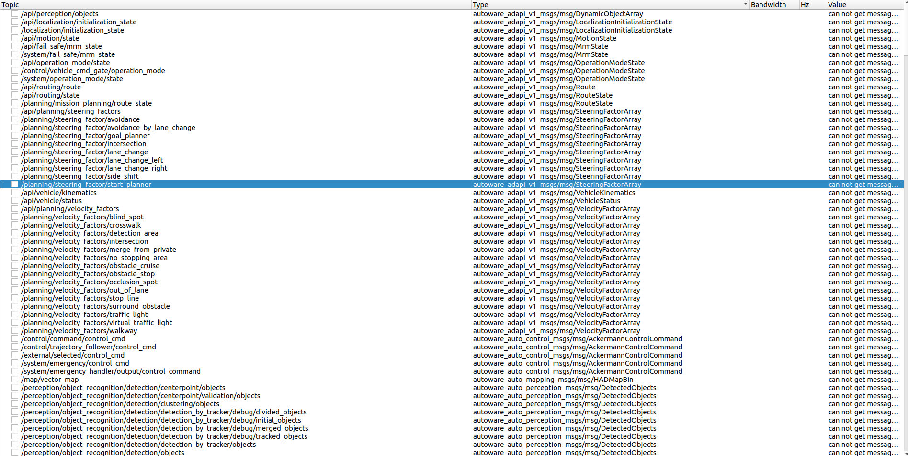

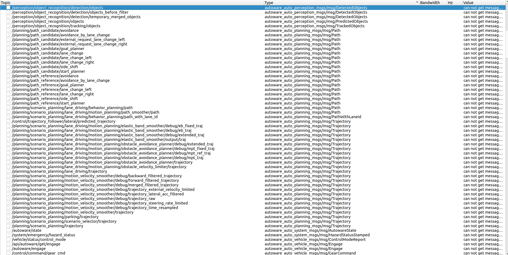

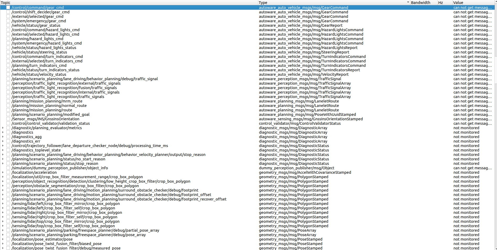

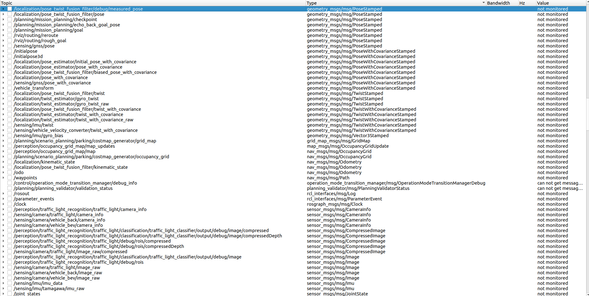

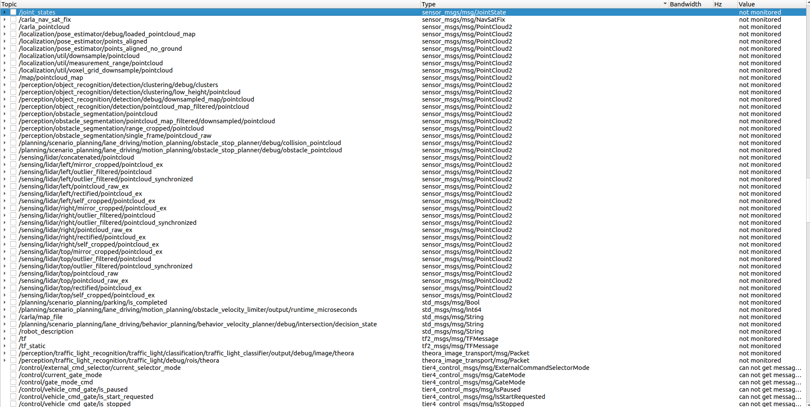

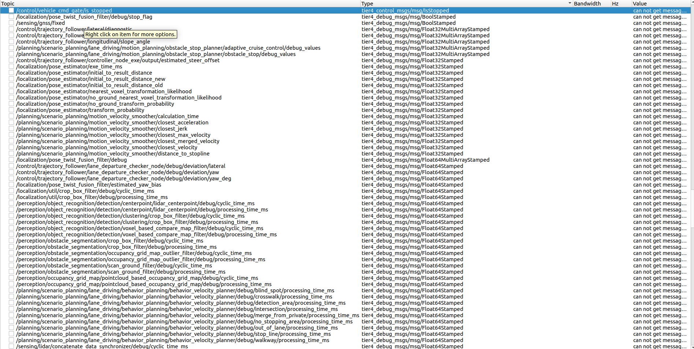

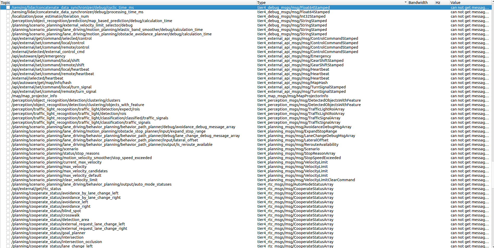

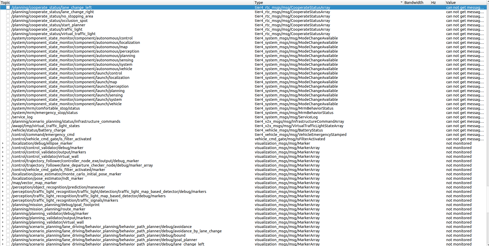

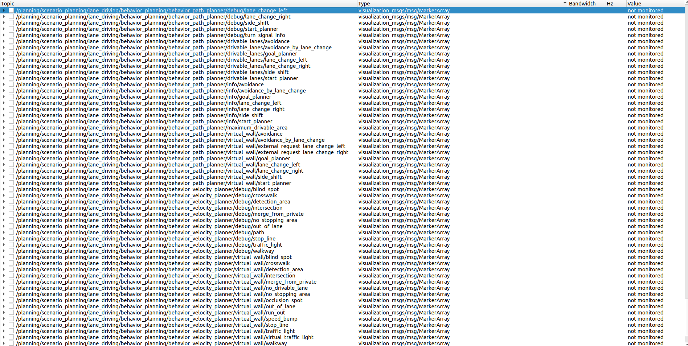

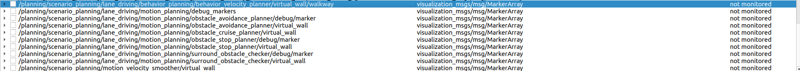

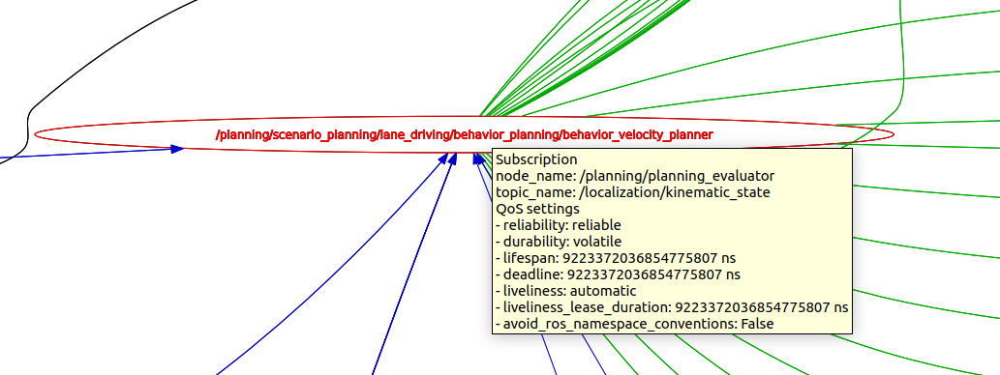

maint topic

                    /localization/pose_twist_fusion_filter/kinematic_state
                    
                    /localization/pose_twist_fusion_filter/pose-------------only sys_node need
                    
                    /localization/pose_twist_fusion_filter/twist
                    

                    /odo
                    **/control/command/control_cmd**
                    
                    **/control/trajectory_follower/control_cmd**

