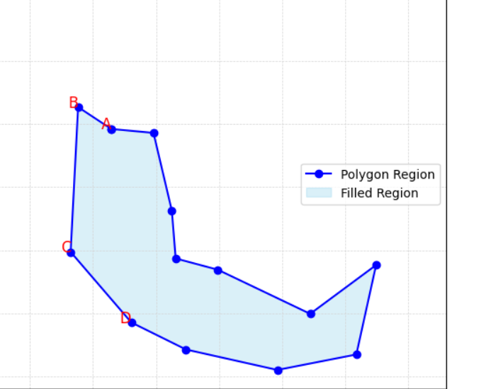
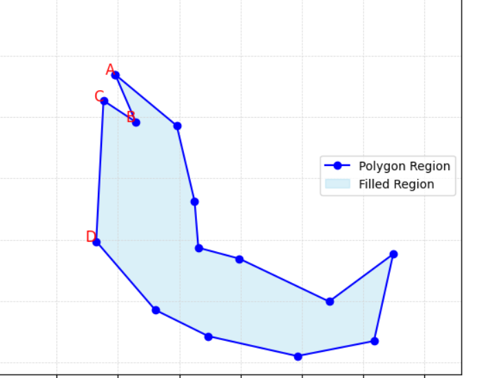
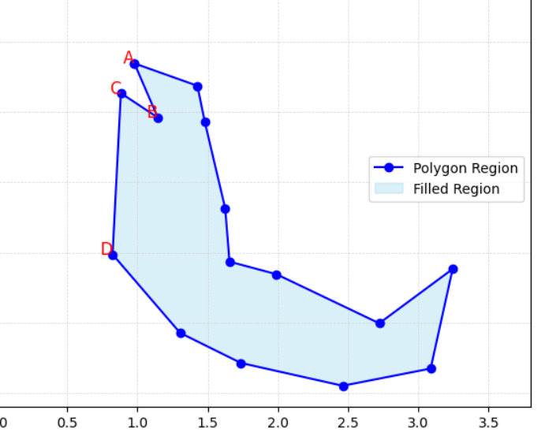
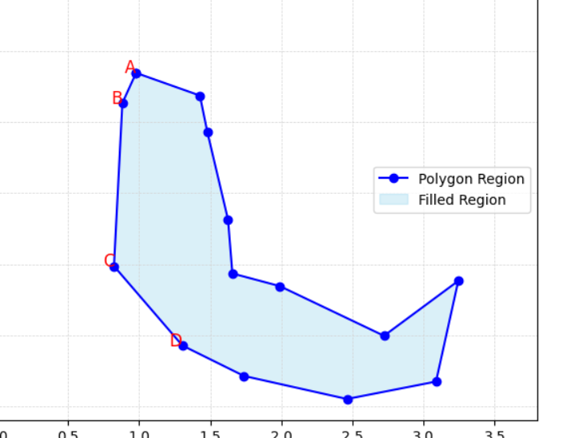

# ssss

[INFO] [1732594227.596154841] [transformed_SandBox_coordinate_publisher_node]: this is orginal pose: x: 3.817717295405, y: -1.9828299164430003, z: 0.0016,yaw: -68.50971650280016,
[INFO] [1732594227.596921792] [transformed_SandBox_coordinate_publisher_node]: 区域 3: 点在原始多边形内部，权重为 1.0,偏移为 [-0.125  0.     0.   ]
[INFO] [1732594227.597201700] [transformed_SandBox_coordinate_publisher_node]: ____transformed___pose x: 74.45528322938486, y: -7.849661685771615, z:0.0016000000400000006,yaw: 158.50971650280016,

[3.942,-1.983]
[3.993,-1.557]

[INFO] [1732603357.408614516] [transformed_SandBox_coordinate_publisher_node]: this is orginal pose: x: 0.13720463818499962, y: -2.2021738508310005, z: 0.0016,yaw: 174.0841835098002,
[INFO] [1732603357.409053948] [transformed_SandBox_coordinate_publisher_node]: ____transformed___pose x: -47.53737480486551, y: -0.865914743949166, z:0.0016000000400000006,yaw: -84.0841835098002,

[INFO] [1732603409.376623288] [transformed_SandBox_coordinate_publisher_node]: this is orginal pose: x: 0.10111887093999972, y: -0.8297932345550003, z: 0.0016,yaw: 175.72708351008785,
[INFO] [1732603409.377614424] [transformed_SandBox_coordinate_publisher_node]: ____transformed___pose x: -50.04847485527817, y: -45.79703218915251, z:0.0016000000400000006,yaw: -85.72708351008785,
[INFO] [1732603409.396752377] [transf

[0.1372, -2.2022]
[0.1011, -0.8298]
[0.6600, -0.]

[INFO] [1732608764.090823855] [transformed_SandBox_coordinate_publisher_node]: this is orginal pose: x: 3.874165660197, y: -1.9031193013690002, z: 0.0016,yaw: -31.63641649483771,
[INFO] [1732608764.091746123] [transformed_SandBox_coordinate_publisher_node]: ____transformed___pose x: 74.61461993109248, y: -14.282593343340572, z:0.0016000000400000006,yaw: 121.63641649483772,

[INFO] [1732608795.087696924] [transformed_SandBox_coordinate_publisher_node]: this is orginal pose: x: 3.848455628643, y: -1.9162095374730002, z: 0.0016,yaw: -50.07161649851685,
[INFO] [1732608795.088641045] [transformed_SandBox_coordinate_publisher_node]: ____transformed___pose x: 73.78490472209421, y: -13.828799053325017, z:0.0016000000400000006,yaw: 140.07161649851685,

x: 0.10839983845699974, y: -1.2988798028000001, z: 0.0016,yaw: 179.08318351067456,