# this file is the info of /control/command/control_cmd

/home/cityu-fsm-lab-carla/Workspace/autoware/src/universe/autoware.universe/control/vehicle_cmd_gate/launch/vehicle_cmd_gate.launch.xml 
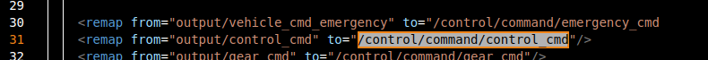

/home/cityu-fsm-lab-carla/Workspace/autoware/src/universe/autoware.universe/control/vehicle_cmd_gate/script/delays_checker.py
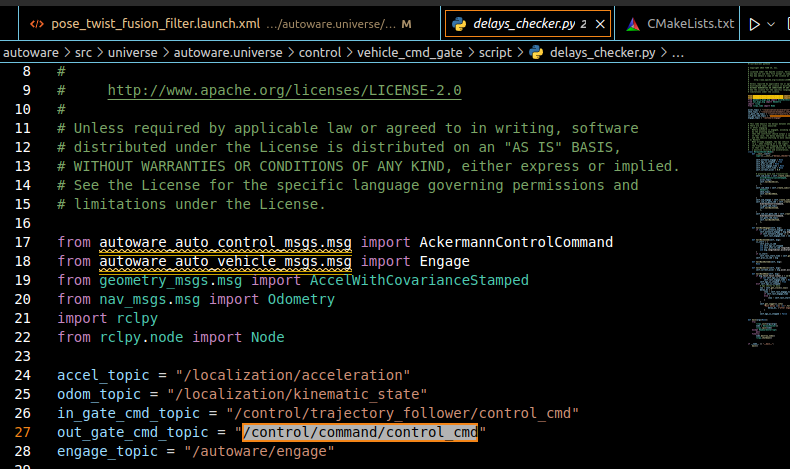

/home/cityu-fsm-lab-carla/Workspace/autoware/src/universe/autoware.universe/launch/tier4_control_launch/launch/control.launch.py

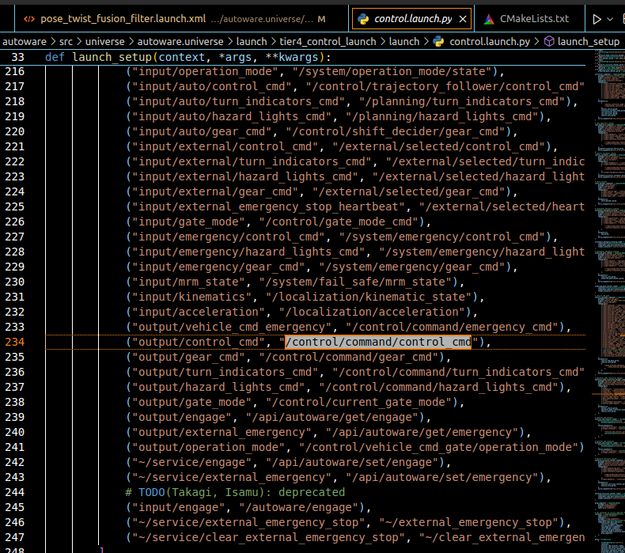

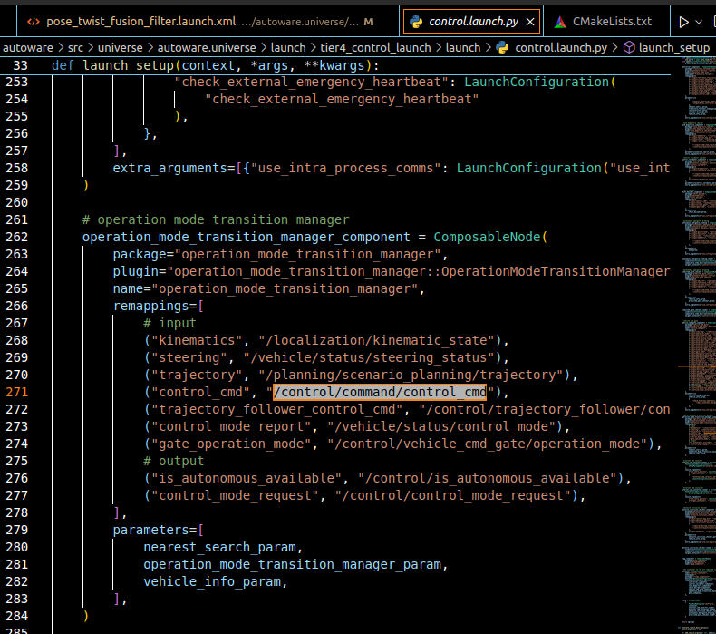

/home/cityu-fsm-lab-carla/Workspace/autoware/src/universe/autoware.universe/tools/simulator_test/simulator_compatibility_test/simulator_compatibility_test/publishers/ackermann_control_command.py

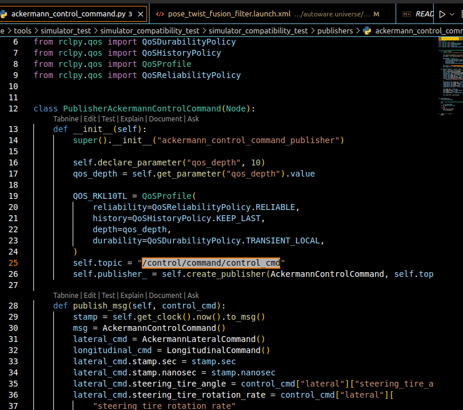

/home/cityu-fsm-lab-carla/Workspace/autoware/install/autoware_launch/share/autoware_launch/config/control/vehicle_cmd_gate/vehicle_cmd_gate.param.yaml

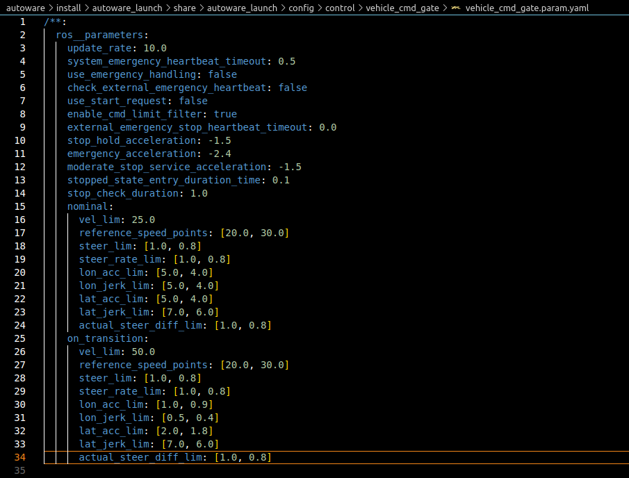

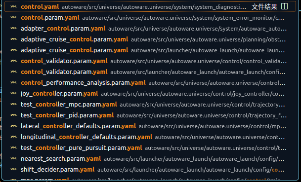

/home/cityu-fsm-lab-carla/Workspace/autoware/src/universe/autoware.universe/control/trajectory_follower_node/src/controller_node.cpp

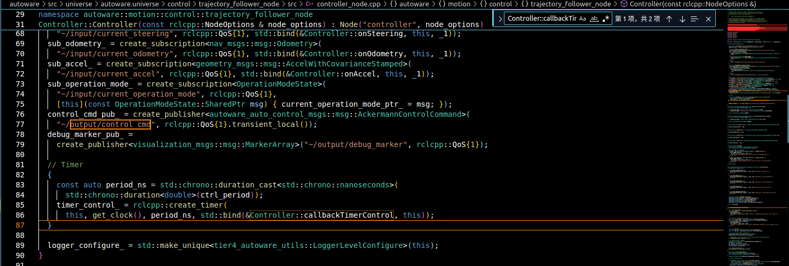

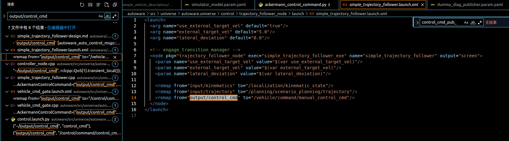

modify in /home/cityu-fsm-lab-carla/Workspace/autoware/src/universe/autoware.universe/control/trajectory_follower_node/src/simple_trajectory_follower.cpp

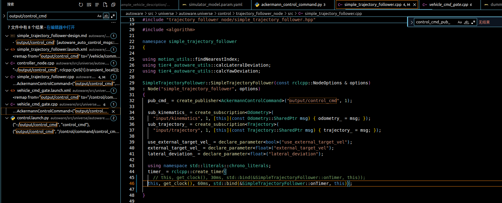

/home/cityu-fsm-lab-carla/Workspace/Carla/carla-ros-bridge/src/ros-bridge/carla_ackermann_control/launch/carla_ackermann_control.launch

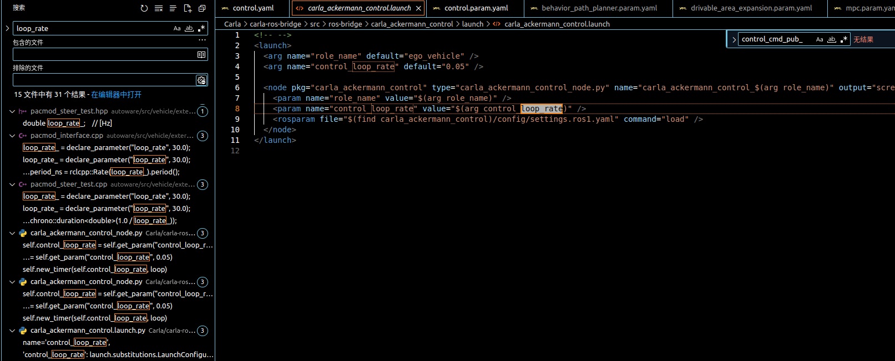

/home/cityu-fsm-lab-carla/Workspace/autoware/src/vehicle/sample_vehicle_launch/sample_vehicle_description/config/simulator_model.param.yaml

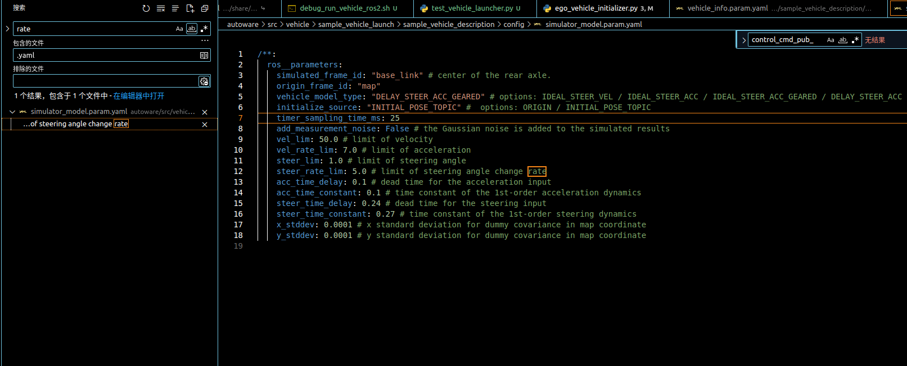
