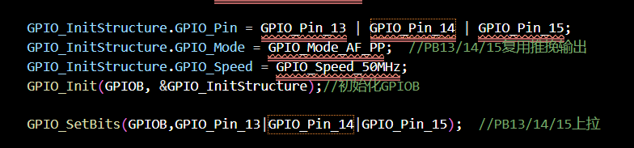
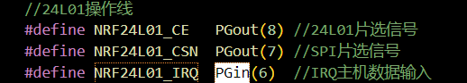
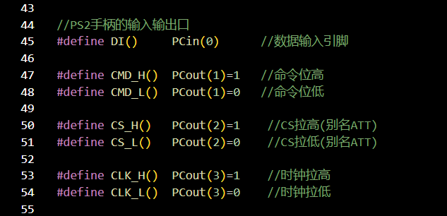
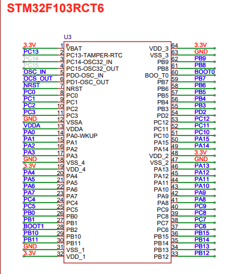
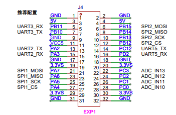

# this is the description of the b20_controller

## 1. pin_mode

the spi_pin of the controller:


the pin of the nrf24l01


nrf_pin|description|b20_pin
--|--|--
1|vcc|3.3
2|gnd|gnd
3|CSN/CS|A4
4|CE|
5|MOSI|A7
6|SCK|A5
7|IRQ|
8|MISO|A6


## todo_list

1. chose the pin to deal with the nrf24l01 irq &ce
2. to init the pin mode
3. to test the transmit from PC to arduino
4. to test the transmit from arduino to nrf24l01
5. to test the receice form nrf24l01 to B20
6. to test the control of 2.4G 
   1. what is the logic of control
   

```python
import serial

ser = serial.Serial('COM3', 9600)

# 发送命令打开 LED 灯
ser.write("LED_ON:1\n".encode())

# 发送命令读取传感器 1 的数据
ser.write("SENSOR_READ:1\n".encode())

# 接收传感器数据
while True:
  if ser.available() > 0:
    message = ser.readline().decode().strip()
    if message.startswith("SENSOR_DATA:"):
      sensor_value = float(message.split(":")[1])
      print("Sensor value:", sensor_value)
      break

ser.close()

```

```c
void setup() {
  Serial.begin(9600);
}

void loop() {
  if (Serial.available() > 0) {
    String command = Serial.readStringUntil('\n');
    command.trim(); // 去除空格

    if (command.startsWith("LED_ON:")) {
      int ledState = command.substring(7).toInt();
      digitalWrite(13, ledState); // 控制 LED 灯
    } else if (command.startsWith("SENSOR_READ:")) {
      int sensorId = command.substring(12).toInt();
      if (sensorId == 1) {
        float sensorValue = 25.5; // 模拟传感器数据
        Serial.print("SENSOR_DATA:");
        Serial.println(sensorValue);
      }
    }
  }
}
```







the original and new settings of pin as

|ori_test|ori_ps2|description|new|
|--|--|--|--|
|8|*|CE| PA0(s5-3)
|7|PB12|CSN|PB12
|6|*|IRQ| PA1(s6-3)
|13|PB13|SCK|PB13
|14|0|MOSI|PB15
|15|1|MISO|PB14

write/read once for 32 Bytes of data

tmp_buf[0]=0x55
tmp_buf[1]=0x7E

tmp_buf[7]=0x7E
tmp_buf[8]=0x55

pin_mapping





```c
	//CLK 信号从主机到手柄   输出口
	GPIO_InitStructure.GPIO_Pin = GPIO_Pin_3;	
	GPIO_InitStructure.GPIO_Mode = GPIO_Mode_Out_PP;
	GPIO_InitStructure.GPIO_Speed = GPIO_Speed_50MHz;	
	GPIO_Init(GPIOC, &GPIO_InitStructure);	
``` 

q1: pin_mapping
q2: function right or not 

address of car

TX: 0xff,0xff,0xff,0xff,0xff
RX: 0xff,0xff,0xff,0xff,0xff

address of trans

TX: 0xff,0xff,0xff,0xff,0xff
RX: 0xff,0xff,0xff,0xff,0xff

address for test usb

TX: ff,ff,ff,ff,ff

RX: ff,ff,ff,ff,ff


* q1: 确认nrf24l01的正确连接
    1. CS、CSN、IQR接线是否正确
    2. 是否正确初始化
* q2: 传输配置是否正确
* q3：包传输协议配置是否正确
* q4: 测试数据能否正确从arduino发出
* q5：测试参数对应关系
* q6: 键盘中断捕获

CE、CSN、IQR是控制线

CSN低电平有效，可以直接接地


nrf24l01的工作极性：

q:spi的CS与24L01的CSN之间的联系

## motor_controller

```c
typedef struct  
{
	uint8_t  ST;            // state of remote (0 closed, 1 open)
    uint8_t  steering_angle ;           // angle of yaw
    uint8_t  steering_angle_velocity;      // speed of angle of yaw
    uint8_t  speed ;                 // speed of 
    uint8_t  acceleration ;         // 
}NRF_CTL_INFO;
```

data for test msg

40 for turn is enough

55 7e 01 00 40 20 00 7e 55 

目前的控制原理是设定一个目标角度