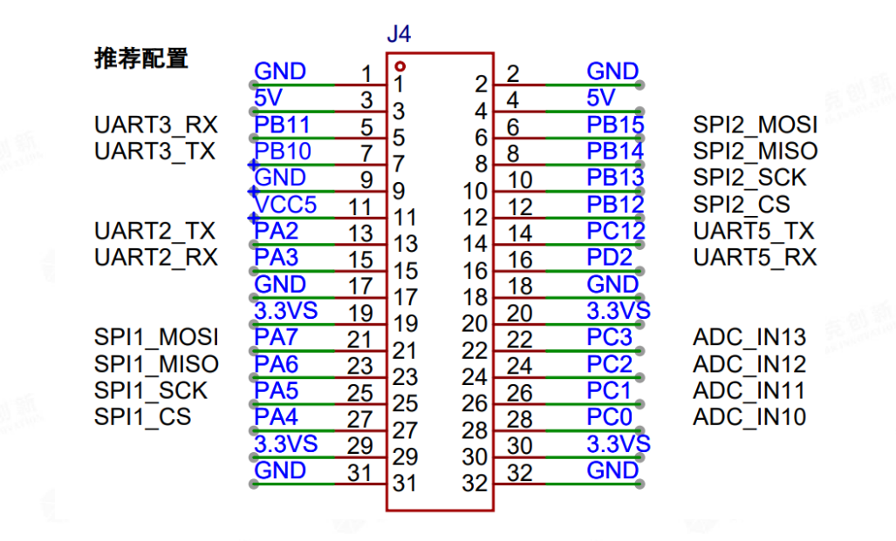
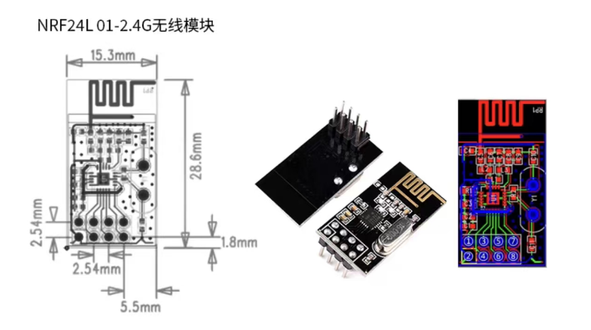
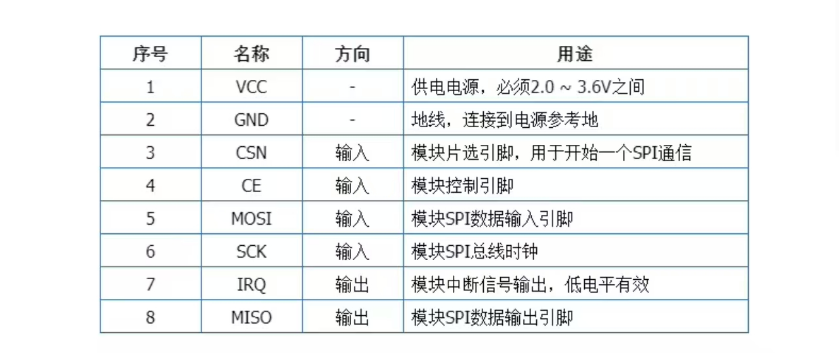

# this is the description of the b20_controller

## 1. pin_mode

the spi_pin of the controller:


the pin of the nrf24l01




nrf_pin|description|b20_pin
--|--|--
1|vcc|3.3
2|gnd|gnd
3|CSN/CS|A4
4|CE|
5|MOSI|A7
6|SCK|A5
7|IRQ|
8|MISO|A6


## todo_list

1. chose the pin to deal with the nrf24l01 irq &ce
2. to init the pin mode
3. to test the transmit from PC to arduino
4. to test the transmit from arduino to nrf24l01
5. to test the receice form nrf24l01 to B20
6. to test the control of 2.4G 
   1. what is the logic of control
   
   ```c
    void Ps2_Task(void* parameter)
    {	
        // Save the last time. The system automatically updates it after being called.
        static portTickType PreviousWakeTime1;

        // Set the delay time to 20ms and convert the time to tick counts.
        const portTickType TimeIncrement1 = pdMS_TO_TICKS(20);
        
        // Get the current system time.
        PreviousWakeTime1 = xTaskGetTickCount();
        
        while(1)
        {
            // Call the absolute delay function for 20ms, execution frequency 50HZ.
            vTaskDelayUntil(&PreviousWakeTime1, TimeIncrement1 );
            
            // Read the PS2 handle key value.
            AX_PS2_ScanKey(&my_joystick);
            
            // Not in PS2 control mode.
            if(ax_control_mode != CTL_PS2)
            {
                // Determine whether to enable PS2 handle control.
                // After the START button is pressed, push the left joystick up to enter PS2 control mode.
                if((my_joystick.btn1 == PS2_BT1_START) && (my_joystick.LJoy_UD == 0x00))
                {
                    // Switch to PS2 mode.
                    ax_control_mode = CTL_PS2;	

                    // Execute the buzzer beep prompt.
                    ax_beep_ring = BEEP_SHORT;
                }
            }
            
        }
    }
   ```

   ```c
        if(my_joystick.mode ==  0x73)
        {
            R_Vel.TG_IX = (int16_t)(speed*(0x80 - my_joystick.RJoy_UD));
            R_Vel.TG_IY = (int16_t)(speed*(0x80 - my_joystick.RJoy_LR));

            //如果是阿克曼机器人
            #if (ROBOT_TYPE == ROBOT_AKM)
                ax_akm_angle = (int16_t)(4*(0x80 - my_joystick.LJoy_LR));
            #else
                R_Vel.TG_IW = (int16_t)(4*speed*(0x80 - my_joystick.LJoy_LR));
            #endif	
            
            //SELECT按键，切换RGB灯效模式
            if(my_joystick.btn1 & PS2_BT1_SELECT)
            {
                btn_select_flag = 1;
            }
            else
            {
                if(btn_select_flag)
                {
                    //灯光效果切换
                    if(R_Light.M < LEFFECT6)
                        R_Light.M++;
                    else
                        R_Light.M = LEFFECT1;
                    
                    //复位标记
                    btn_select_flag = 0;
                }
            }
            
            //左摇杆按键，减速
            if(my_joystick.btn1 & PS2_BT1_JOY_L)
            {
                btn_joyl_flag = 1;
            }
            else
            {
                if(btn_joyl_flag)
                {
                    
                    //速度减小
                    if(speed > 2)
                    {
                        speed--;
                    }
                    else
                    {
                        speed = 2;
                        
                        //蜂鸣器鸣叫提示
                        ax_beep_ring = BEEP_SHORT;
                    }
                        
                    //复位标记
                    btn_joyl_flag = 0;
                }
            }
            
            //右摇杆按键，加速
            if(my_joystick.btn1 & PS2_BT1_JOY_R)
            {
                btn_joyr_flag = 1;
            }
            else
            {
                if(btn_joyr_flag)
                {
                    //速度增加
                    if(speed < 9)
                    {
                        speed++;
                    }
                    else
                    {
                        speed = 9;
                        
                        //蜂鸣器鸣叫提示
                        ax_beep_ring = BEEP_SHORT;					
                    }
                        
                    //复位标记
                    btn_joyr_flag = 0;
                }
            }
        }

   ```

```python
import serial

ser = serial.Serial('COM3', 9600)

# 发送命令打开 LED 灯
ser.write("LED_ON:1\n".encode())

# 发送命令读取传感器 1 的数据
ser.write("SENSOR_READ:1\n".encode())

# 接收传感器数据
while True:
  if ser.available() > 0:
    message = ser.readline().decode().strip()
    if message.startswith("SENSOR_DATA:"):
      sensor_value = float(message.split(":")[1])
      print("Sensor value:", sensor_value)
      break

ser.close()

```

```c
void setup() {
  Serial.begin(9600);
}

void loop() {
  if (Serial.available() > 0) {
    String command = Serial.readStringUntil('\n');
    command.trim(); // 去除空格

    if (command.startsWith("LED_ON:")) {
      int ledState = command.substring(7).toInt();
      digitalWrite(13, ledState); // 控制 LED 灯
    } else if (command.startsWith("SENSOR_READ:")) {
      int sensorId = command.substring(12).toInt();
      if (sensorId == 1) {
        float sensorValue = 25.5; // 模拟传感器数据
        Serial.print("SENSOR_DATA:");
        Serial.println(sensorValue);
      }
    }
  }
}
```