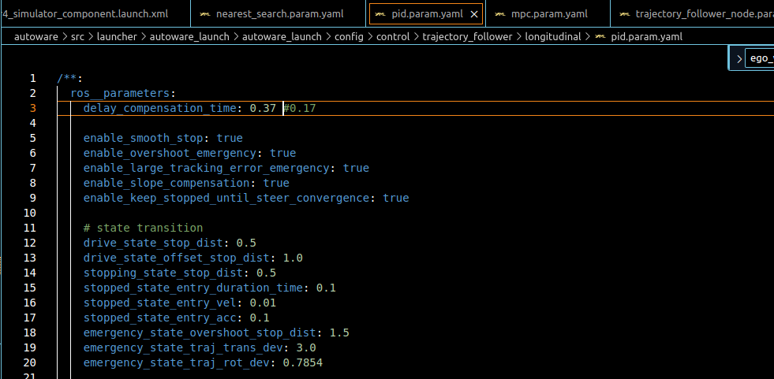

# list

/home/cityu-fsm-lab-carla/Workspace/autoware/src/launcher/autoware_launch/autoware_launch/config/control/vehicle_cmd_gate/vehicle_cmd_gate.param.yaml
/home/cityu-fsm-lab-carla/Workspace/autoware/src/universe/autoware.universe/common/global_parameter_loader/launch/global_params.launch.py
/home/cityu-fsm-lab-carla/Workspace/autoware/src/launcher/autoware_launch/autoware_launch/launch/components/tier4_control_component.launch.xml
/home/cityu-fsm-lab-carla/Workspace/autoware/src/launcher/autoware_launch/autoware_launch/launch/autoware.launch.xml
/home/cityu-fsm-lab-carla/Workspace/autoware/src/universe/autoware.universe/launch/tier4_control_launch/launch/control.launch.py
/home/cityu-fsm-lab-carla/Workspace/Carla/op_carla/op_bridge/op_bridge/fsm_lab_simulation/test_vehicle_launcher.py
/home/cityu-fsm-lab-carla/Workspace/Carla/op_carla/op_bridge/op_bridge/fsm_lab_simulation/ego_vehicle_initializer.py
/home/cityu-fsm-lab-carla/Workspace/Carla/op_carla/op_bridge/op_bridge/fsm_lab_simulation/test_ego_vehicle_initializer.py
/home/cityu-fsm-lab-carla/Workspace/Carla/op_carla/op_bridge/op_scripts/fsm_lab_simulation/debug_run_vehicle_ros2.sh
/home/cityu-fsm-lab-carla/Workspace/Carla/op_carla/op_bridge/op_scripts/fsm_lab_simulation/debug2_run_vehicle.sh
/home/cityu-fsm-lab-carla/Workspace/Carla/op_carla/op_agent/start_ros2.sh
/home/cityu-fsm-lab-carla/Workspace/Carla/op_carla/op_agent/autoware_carla_launch/carla_simulator_fsm_lab.launch.xml
/home/cityu-fsm-lab-carla/Workspace/Carla/op_carla/op_bridge/op_scripts/fsm_lab_simulation/run_carla_gnss_ros2.sh
/home/cityu-fsm-lab-carla/Workspace/Carla/op_carla/op_ros_plugins/src/carla_gnss_ros2/gnss_poser/launch/gnss_poser.launch.xml
/home/cityu-fsm-lab-carla/Workspace/Carla/op_carla/op_bridge/op_scripts/fsm_lab_simulation/run_lidar_slam_ros2.sh
/home/cityu-fsm-lab-carla/Workspace/autoware/src/launcher/autoware_launch/autoware_launch/config/control/predicted_path_checker/predicted_path_checker.param.yaml
/home/cityu-fsm-lab-carla/Workspace/autoware/src/launcher/autoware_launch/autoware_launch/config/control/autonomous_emergency_braking/autonomous_emergency_braking.param.yaml
/home/cityu-fsm-lab-carla/Workspace/autoware/src/launcher/autoware_launch/autoware_launch/config/control/external_cmd_selector/external_cmd_selector.param.yaml
/home/cityu-fsm-lab-carla/Workspace/autoware/src/launcher/autoware_launch/autoware_launch/config/control/shift_decider/shift_decider.param.yaml
/home/cityu-fsm-lab-carla/Workspace/autoware/src/launcher/autoware_launch/autoware_launch/config/control/control_validator/control_validator.param.yaml
/home/cityu-fsm-lab-carla/Workspace/autoware/src/launcher/autoware_launch/autoware_launch/config/control/operation_mode_transition_manager/operation_mode_transition_manager.param.yaml
/home/cityu-fsm-lab-carla/Workspace/autoware/src/launcher/autoware_launch/autoware_launch/config/control/lane_departure_checker/lane_departure_checker.param.yaml
/home/cityu-fsm-lab-carla/Workspace/autoware/src/vehicle/sample_vehicle_launch/sample_vehicle_description/config/simulator_model.param.yaml
/home/cityu-fsm-lab-carla/Workspace/autoware/src/universe/autoware.universe/launch/tier4_simulator_launch/launch/simulator.launch.xml
/home/cityu-fsm-lab-carla/Workspace/autoware/src/launcher/autoware_launch/autoware_launch/launch/components/tier4_simulator_component.launch.xml
/home/cityu-fsm-lab-carla/Workspace/autoware/src/launcher/autoware_launch/autoware_launch/config/control/common/nearest_search.param.yaml
/home/cityu-fsm-lab-carla/Workspace/autoware/src/launcher/autoware_launch/autoware_launch/config/control/trajectory_follower/longitudinal/pid.param.yaml
/home/cityu-fsm-lab-carla/Workspace/autoware/src/launcher/autoware_launch/autoware_launch/config/control/trajectory_follower/lateral/mpc.param.yaml
/home/cityu-fsm-lab-carla/Workspace/autoware/src/launcher/autoware_launch/autoware_launch/config/control/trajectory_follower/trajectory_follower_node.param.yaml
/home/cityu-fsm-lab-carla/Workspace/autoware/src/vehicle/sample_vehicle_launch/sample_vehicle_description/config/vehicle_info.param.yaml

## change log

/home/cityu-fsm-lab-carla/Workspace/autoware/src/launcher/autoware_launch/autoware_launch/config/control/trajectory_follower/longitudinal/pid.param.yaml

