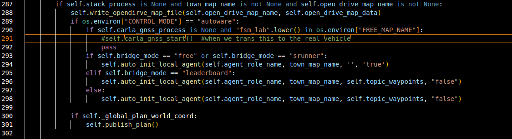
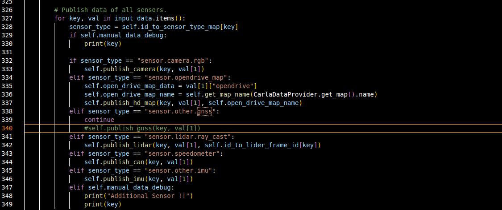
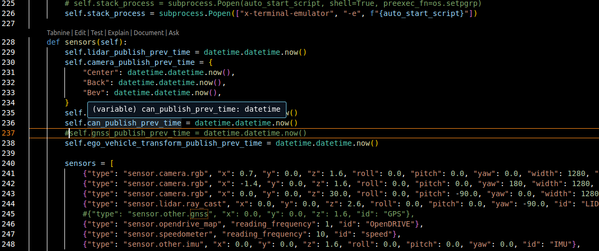

# this is the record of modify of file

1. if we have to use gnss

291--->#self.carla_gnss_start()  #when we trans this to the real vehicle

340--->#self.publish_gnss(key, val[1])

237---->#self.gnss_publish_prev_time = datetime.datetime.now()

