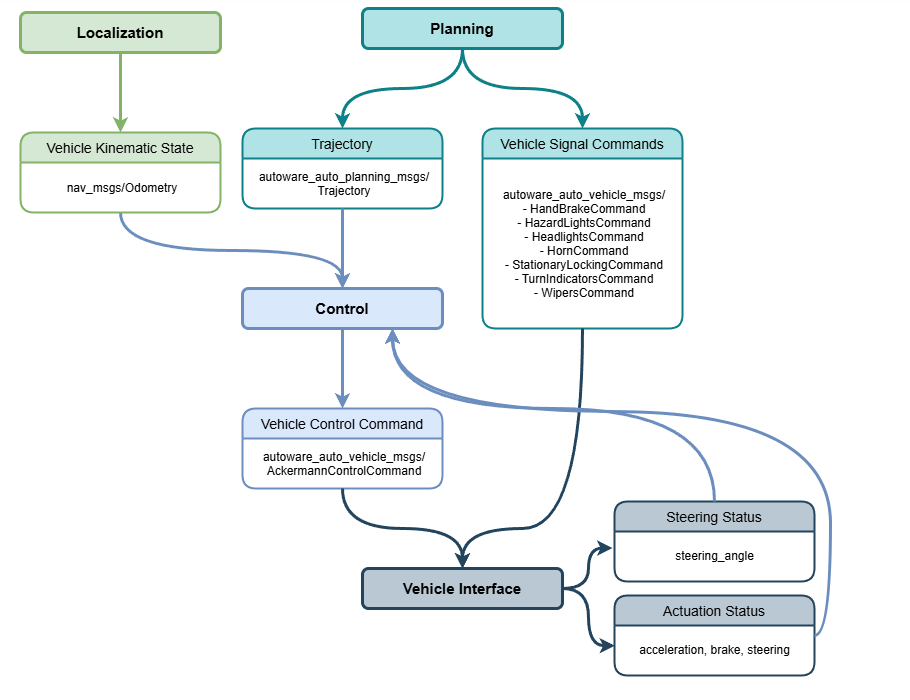
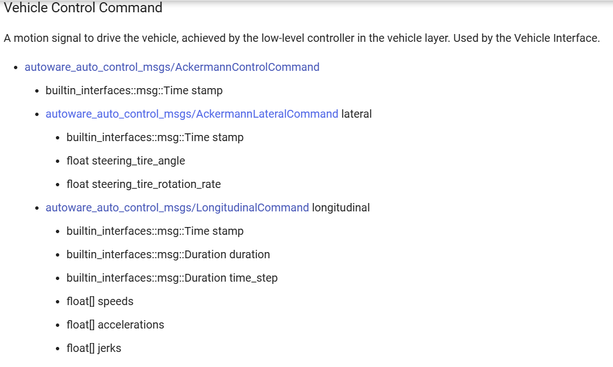

# this is the framework design for the autoware_commn

## AckermannControlCommand

from autoware_auto_control_msgs.msg import AckermannControlCommand

<https://autowarefoundation.github.io/autoware-documentation/main/design/autoware-interfaces/components/control/>

perhaps need Instruction Adjustment Mechanism

## source_code_framework

this is the framework of launching the autoware

## ego_vehicle_initializer.py

* fun_setup()  this is the initializer of the whole agent
* Load a series of startup files
* run_step()
* init_subscribers()
* call_backfunctions()
* init_publishers()
* publisher_handlers()
* other_handlers()

## start_ros2.sh

this bash include the following two files

### carla_simulation_fsm.launch

### carla_simulation_carla.launch

## run_carla_gnss_ros2.sh

gnss.launch.xml

## run_lidar_slam_ros2.sh

lidarslam.launch.py
