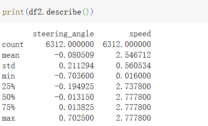
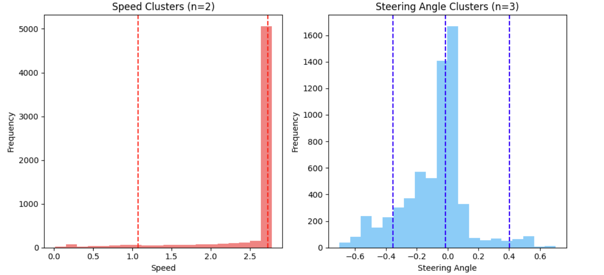
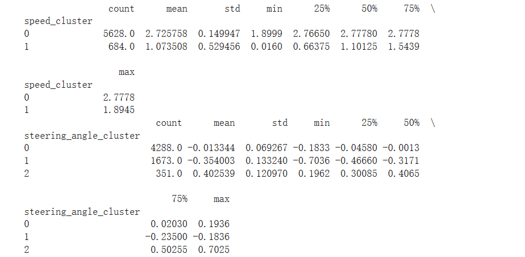
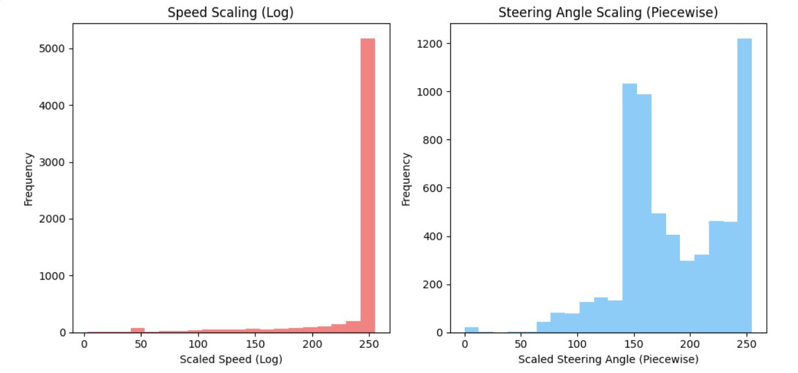
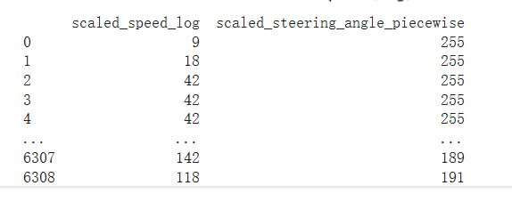

# this is showing the data_analysis of the cmd

## 去除掉0值并数据精度归一后的控制数据



## 分别对speed与steering_angle的数据进行频率分布分析，可见：



1. speed数据绝大多数情况下为满速
2. speed在0-2.5之间均有分布
3. steering-angle的数据在-0.6--0.6之间均有分布，其中绝大多数落于[-0.1,0.1]的区间

## 对上述数据进行聚类分析




## 对数据进行平滑及放缩

1. 测试 均放缩到0-255




2. 在传输的过程中，使用的是byte，存储8位无符号数据，也就是0-255的256个离散值。因此，一方面需要以128为界区分正负；另一方面需要借助算法使数据足够平滑

## RC_car控制数据采集

## RC_car控制数据测试

Autoware    |   arduino |   NRF |   RC  
--| --| --| --
2.7|128|256|128
x|a=fun(x)|n=128+a|r=-(128-n)
0.6|60|120|60
x|a=fun(x)|n=60+a|r=-(60-a)


speed_value| description
--|--

>40启动

max=100----400


steering_angle|after caculate|description
--|--|--
0|0|0
10|40|0
20|80|
30|120|
40|160|10
50|200|
60|240|15
70|280|
80|320|20
90|360|
100|400|
110|440|
120|480|
130|520|25
140|560|
150|600|30
160|640|
10|40|0
20|80|2
40|160|10
60|240|15
80|320|20
130|520|25
150|600|30

P angle
10 0
15 2
30 10
50 15
60 20
100 25
120 30


for fitting

```c
// 定义最大数据点数量
#define MAX_POINTS 10

class AngleToPInterpolator {
  private:
    float angle[MAX_POINTS];
    float p[MAX_POINTS];
    int size;

  public:
    AngleToPInterpolator() : size(0) {}

    // 添加数据点
    bool addPoint(float angleVal, float pVal) {
      if (size >= MAX_POINTS) return false;
      
      // 找到正确的插入位置
      int i;
      for (i = size - 1; (i >= 0 && angle[i] > angleVal); i--) {
        angle[i + 1] = angle[i];
        p[i + 1] = p[i];
      }
      
      // 插入新点
      angle[i + 1] = angleVal;
      p[i + 1] = pVal;
      size++;
      return true;
    }

    // 执行插值，输入角度a，获得p值
    float getP(float angleVal) {
      // 边界检查
      if (size == 0) return 0;
      if (angleVal <= angle[0]) return p[0];
      if (angleVal >= angle[size - 1]) return p[size - 1];

      // 找到正确的区间
      int i = 0;
      while (i < size - 1 && angle[i + 1] < angleVal) i++;

      // 线性插值
      float a0 = angle[i], a1 = angle[i + 1];
      float p0 = p[i], p1 = p[i + 1];
      return p0 + (p1 - p0) * (angleVal - a0) / (a1 - a0);
    }
};

// 全局插值器实例
AngleToPInterpolator interp;

void setup() {
  Serial.begin(9600);

  // 添加数据点 (角度, p值)
  interp.addPoint(0, 10);
  interp.addPoint(2, 15);
  interp.addPoint(10, 30);
  interp.addPoint(15, 50);
  interp.addPoint(20, 60);
  interp.addPoint(25, 100);
  interp.addPoint(30, 120);

  Serial.println("AngleToPInterpolator initialized");
}

void loop() {
  // 测试插值
  float testAngles[] = {0, 5, 12, 22, 28, 30};
  int testSize = sizeof(testAngles) / sizeof(testAngles[0]);

  for (int i = 0; i < testSize; i++) {
    float angle = testAngles[i];
    float p = interp.getP(angle);
    
    Serial.print("Angle: ");
    Serial.print(angle);
    Serial.print(", P: ");
    Serial.println(p);
  }

  delay(5000); // 等待5秒后重复
}
```

