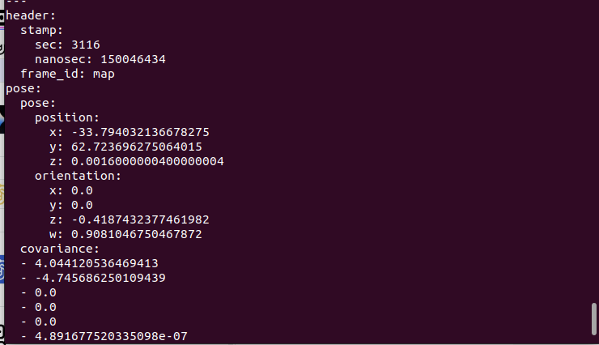

# description of how to launch the auto_test

## init

1. start carla

    ```sh
    cd $CARLA_ROOT
    make launch
    ```

    then have to click the button play

2. start steam vr
3. start vr transmit

    ```bash

    cd /home/cityu-fsm-lab-carla/lmx/Docs/packages/autoware_comm

    source initial_config.bash 

    ```

4. start autoware vehicle agent

    ```bash
    cd ./Workspace/Carla/op_carla/op_bridge/op_scripts/fsm_lab_simulation/
    ./test_run_vehicle_ros2.sh

    ```

## debug

ros2 topic info /localization/pose_estimator/pose_with_covariance is published by ndt and subscribed by ekf

this is the echo of topic /localization/pose_twist_fusion_filter/biased_pose_with_covariance


[transformed_SandBox_coordinate_publisher_node]:
 Transformed Published with covariance! [-33.79422926148789, 62.72506004639747, 0.0016000000400000006, 0.9080939452713015, 0.0, 0.0, -0.41876650601690013]

the same as the send msg

```py

    return carla.Transform(
        ros_point_to_carla_location(ros_pose.position),
        ros_quaternion_to_carla_rotation(ros_pose.orientation),
    )

def ros_point_to_carla_location(ros_point):
    ##########for tracker
    return carla.Location(ros_point.x, -ros_point.z, ros_point.y)
    #########################################################################################
    #return carla.Location(ros_point.x, -ros_point.y, ros_point.z)   

```

the set_frame of carla does not fellow the ekf