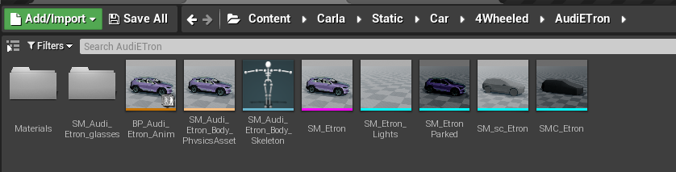
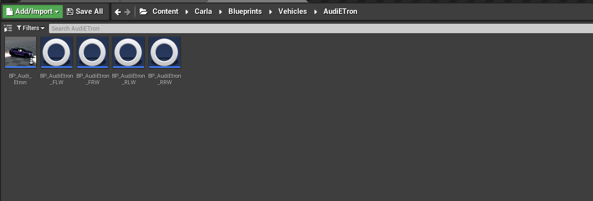
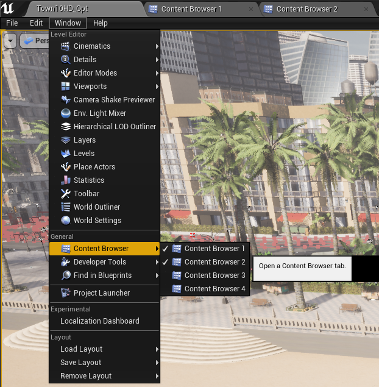
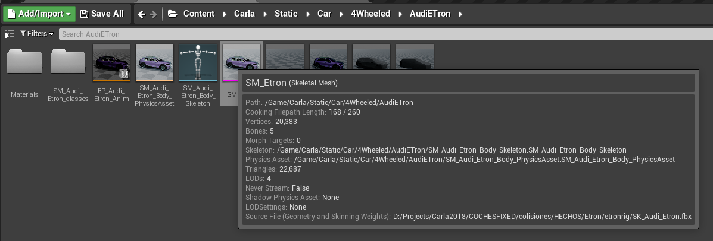
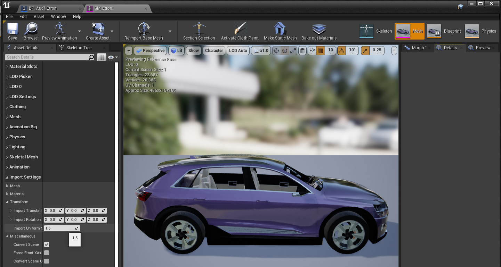
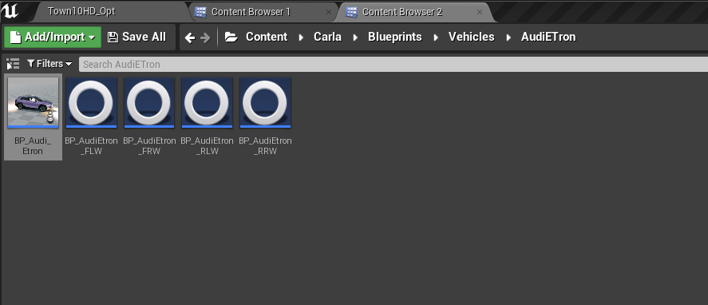
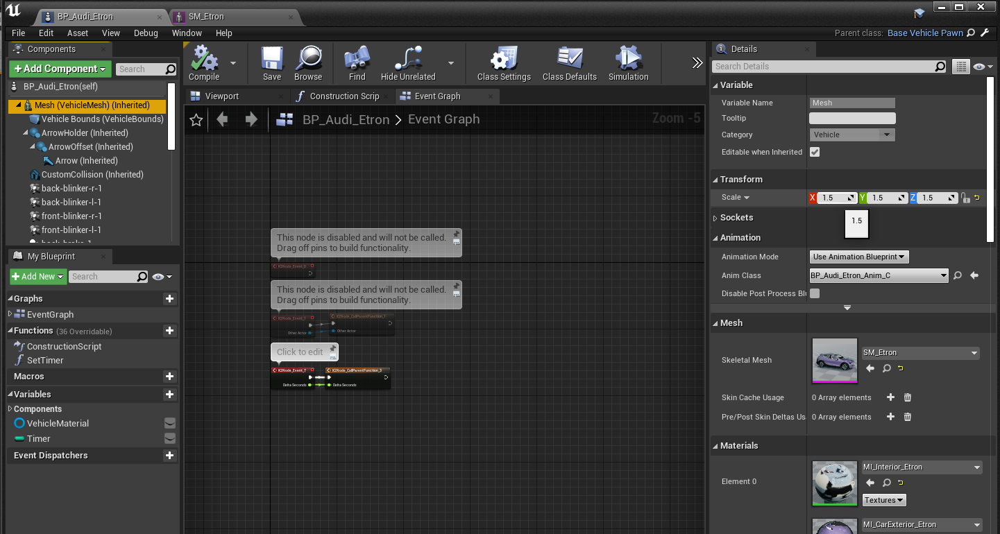
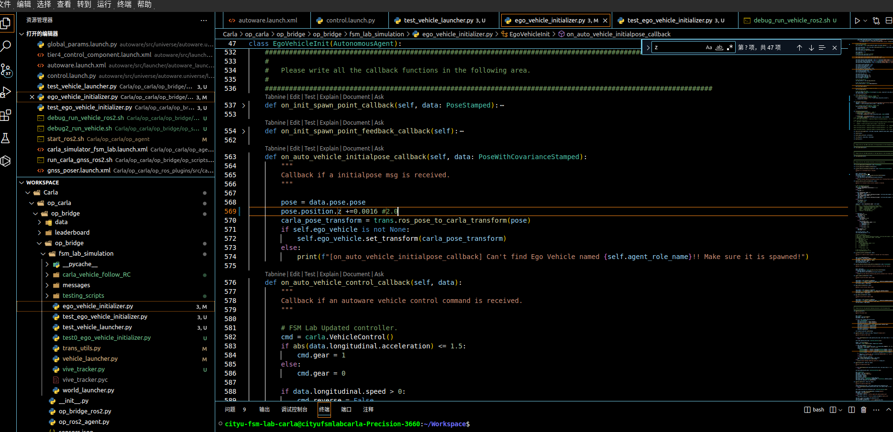

# this is the record for model_scaled

all this need to find from content Browser

this is for static models we chose 1. static mesh 2.BP

## 1. static mesh

change 'Import Uniform Scale'

## 2. BP_Audi_Etron

chose components of Mesh(VehicleMesh)
at right Transform Scale to 1.5

## else needed 

need to spawn at the right Transform