# this is the guidelines how to use vive_tracker and combine it with the sandbox

1. coordinate_system of the vive_tracker

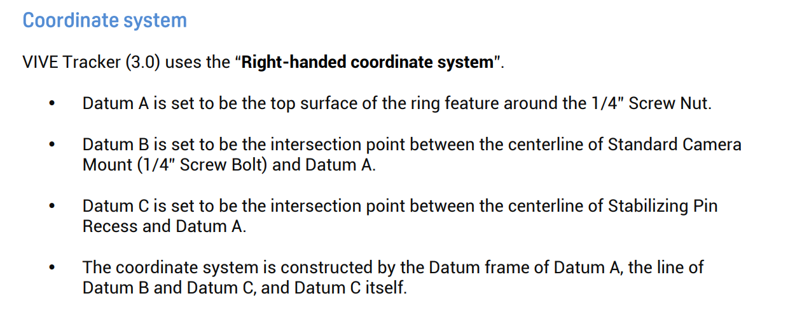

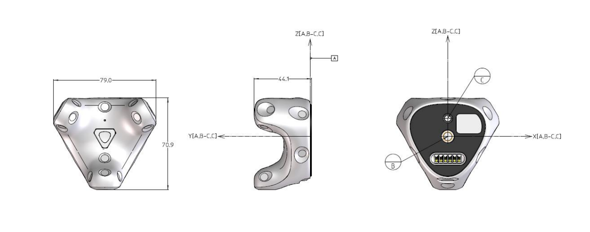

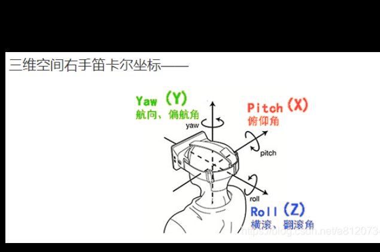

2. tracker_orientation

the changes of those three should be roll=90,pitch=90
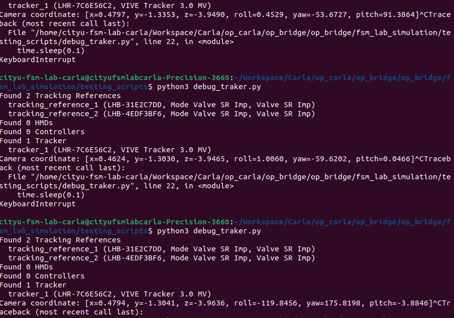

3. definition of the point_orientation

we need to define the coordinate_system of tracker and the orientation of how to turn it

the guidelines have given a defination of tracker_coordinate as the picture shows

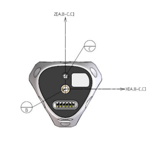

we may use this as the definition of the tracker_coordinate

then we define four derictions of the point_orientation

all the following disgree is describing the derictions of the the tracker_coordinate

3.1. y=0,p=0,r=0

the axis_orientation of the tracker_coordinate should be the same with the sandbox_coordinate
_orientation itself

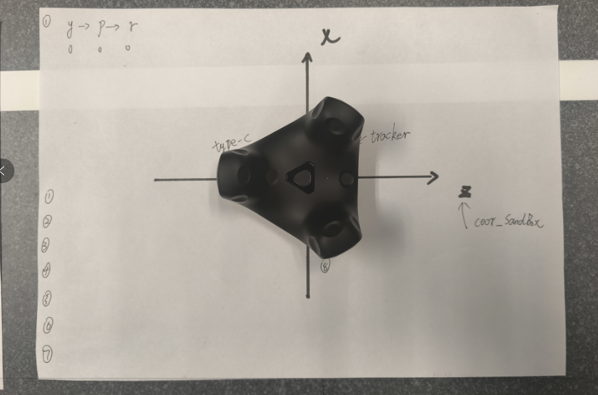

3.2. y=-90,p=30,r=0

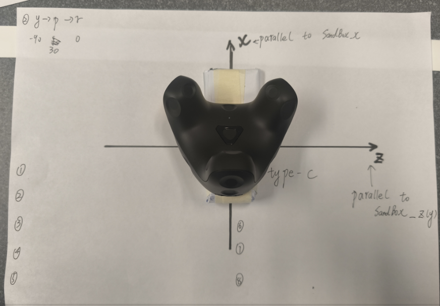

3.3. y=30,p=0,r=-20

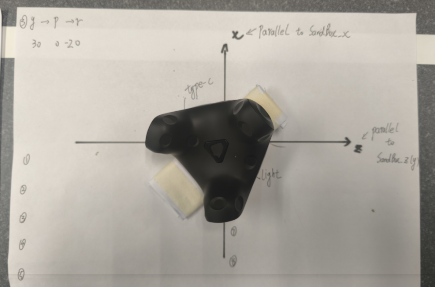

When choosing the direction, we should exclude the situation of pitch=90 as much as possible to avoid singular points.

At the same time, the azimuth angles obtained should be varied in all axes as much as possible, because the axes of the two coordinate systems are not parallel.

4. points in SandBox_coordinate

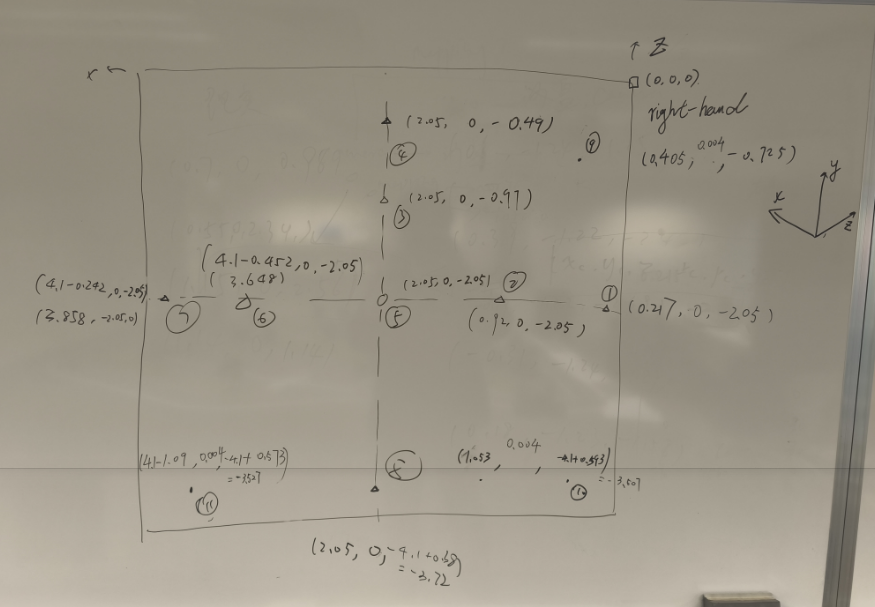

Note that the points 1-9 are used as fitting data, the points 10-11 are used as testing data.

5. tracker_cmd

```shell

# 1. we have to start steam vr at first: start a new terminal then type the command

steam steamvr

# 2. for get the pose of the tracker we need to open the python code

cd ./Workspace/Carla/op_carla/op_bridge/op_bridge/fsm_lab_simulation/testing_scripts/
python3 debug_tracker.py

```

the source code of the script is as follows:

```python
import sys
sys.path.append("/home/cityu-fsm-lab-carla/Workspace/Carla/op_carla/op_bridge/op_bridge/fsm_lab_simulation")
import time
import numpy as np
from vive_tracker import ViveTrackerModule


TRACKER_NAME = "tracker_1"


vtm = ViveTrackerModule()
vtm.print_discovered_objects()
tracker = vtm.devices[TRACKER_NAME]
while True:
    try:
        cam_coord = tracker.get_pose_euler()
       # print(cam_coord)
        print(f"\rCamera coordinate: [x={cam_coord[0]:.4f}, y={cam_coord[1]:.4f}, z={cam_coord[2]:.4f}, roll={cam_coord[3]:.4f}, yaw={cam_coord[4]:.4f}, pitch={cam_coord[5]:.4f}]", end='')
    except Exception:
        continue
    finally:
        time.sleep(0.1)
```

use the api of vive_tracker, and display the positions as x,y,z,roll,yaw and pitch; (Note that y is the height, which perpendicular to the horizontal plane.)

6. the collection of the points

the following pictures are the original recordings of the points:

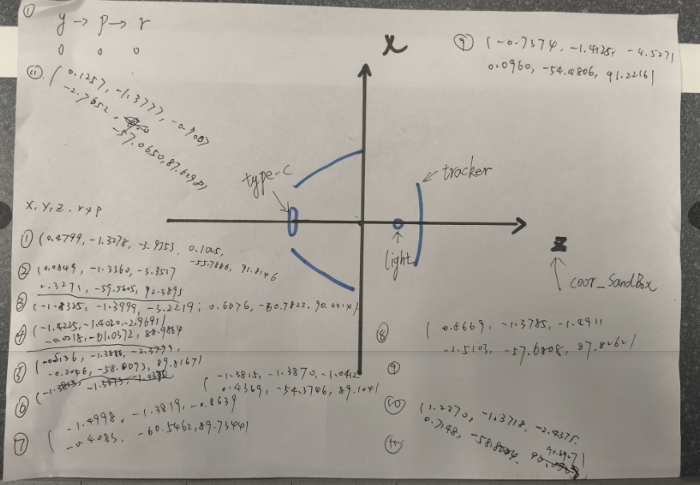

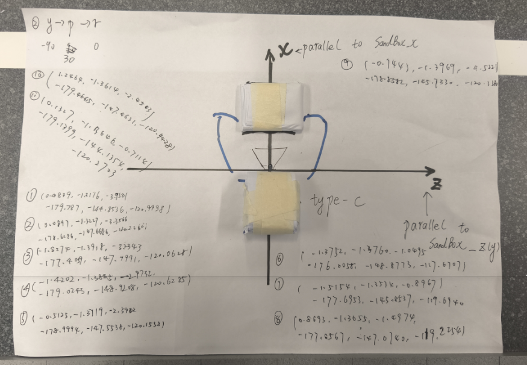

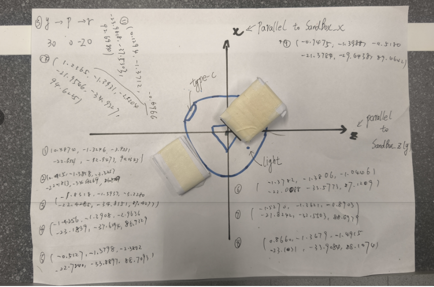

the data are as follows:

```python
points_A = [
{'position': [0.4799, -1.3278, -3.9353], 'orientation': [np.radians(0.1025), np.radians(-55.7886), np.radians(91.8146)]}, # 1
{'position': [0.4839, -1.3176, -3.9501], 'orientation': [np.radians(-179.7870), np.radians(-144.8536), np.radians(-120.9998)]}, # 1'
{'position': [0.4874, -1.3246, -3.9531], 'orientation': [np.radians(-22.6521), np.radians(-32.9473), np.radians(90.0343)]}, # 1''
{'position': [0.0849, -1.3360, -3.3517], 'orientation': [np.radians(2.3271), np.radians(-59.5605), np.radians(92.3895)]}, # 2
{'position': [0.0897, -1.3227, -3.3566], 'orientation': [np.radians(-178.6286), np.radians(-147.6686), np.radians(-120.2366)]}, # 2'
{'position': [0.0915, -1.3165, -3.3709], 'orientation': [np.radians(-22.1813), np.radians(-34.4269), np.radians(86.8067)]}, # 2''
{'position': [-1.8325, -1.3999, -3.2219], 'orientation': [np.radians(0.6676), np.radians(-60.7822), np.radians(90.0414)]}, # 3
{'position': [-1.8274, -1.3918, -3.2343], 'orientation': [np.radians(-177.4059), np.radians(-147.7991), np.radians(-120.0628)]},# 3'
{'position': [-1.8318, -1.3937, -3.2280], 'orientation': [np.radians(-22.4285), np.radians(-34.8151), np.radians(87.4277)]}, # 3''
{'position': [-1.4225, -1.4020, -2.9691], 'orientation': [np.radians(-0.0218), np.radians(-61.0372), np.radians(88.9864)]}, # 4
{'position': [-1.4202, -1.3885, -2.9732], 'orientation': [np.radians(-179.0243), np.radians(-148.9208), np.radians(-120.0628)]},# 4'
{'position': [-1.4256, -1.3908, -2.9636], 'orientation': [np.radians(-23.1839), np.radians(-37.6294), np.radians(86.9329)]}, # 4''
{'position': [-0.5136, -1.3886, -2.3799], 'orientation': [np.radians(-0.2046), np.radians(-58.0093), np.radians(89.8167)]}, # 5
{'position': [-0.5125, -1.3719, -2.3902], 'orientation': [np.radians(-178.9994), np.radians(-147.5538), np.radians(-120.1558)]},# 5'
{'position': [-0.5127, -1.3798, -2.3802], 'orientation': [np.radians(-22.7840), np.radians(-33.8897), np.radians(88.7093)]}, # 5''
{'position': [-1.3815, -1.3870, -1.0412], 'orientation': [np.radians(0.4369), np.radians(-54.3746), np.radians(89.1041)]}, # 6
{'position': [-1.3752, -1.3760, -1.0495], 'orientation': [np.radians(-176.0058), np.radians(-148.8773), np.radians(-117.6707)]},# 6'
{'position': [-1.3782, -1.3806, -1.0446], 'orientation': [np.radians(-22.0088), np.radians(-33.5773), np.radians(87.1209)]}, # 6''
{'position': [-1.4998, -1.3819, -0.8639], 'orientation': [np.radians(-0.4083), np.radians(-60.5462), np.radians(89.7344)]}, # 7
{'position': [-1.5154, -1.3534, -0.8967], 'orientation': [np.radians(-177.6953), np.radians(-145.8537), np.radians(-119.6940)]},# 7'
{'position': [-1.5270, -1.3621, -0.8903], 'orientation': [np.radians(-21.8242), np.radians(-32.5503), np.radians(88.6979)]}, # 7''
{'position': [0.8669, -1.3785, -1.4911], 'orientation': [np.radians(-2.5103), np.radians(-57.6808), np.radians(87.8262)]}, # 8
{'position': [0.8693, -1.3655, -1.4974], 'orientation': [np.radians(-177.6567), np.radians(-147.0740), np.radians(-119.2254)]}, # 8'
{'position': [0.8660, -1.3679, -1.4915], 'orientation': [np.radians(-23.1031), np.radians(-33.9084), np.radians(88.1074)]}, # 8''
{'position': [-0.7374, -1.4125, -4.5271], 'orientation': [np.radians(0.0960), np.radians(-54.4806), np.radians(91.2216)]}, # 9
{'position': [-0.7443, -1.3969, -4.5221], 'orientation': [np.radians(-178.8582), np.radians(-145.7330), np.radians(-120.3380)]},#9'
{'position': [-0.7475, -1.3988, -4.5180], 'orientation': [np.radians(-21.3784), np.radians(-29.6438), np.radians(89.6642)]}, #9''
{'position': [1.2270, -1.3718, -2.4375], 'orientation': [np.radians(0.7148), np.radians(-58.8044), np.radians(90.8907)]}, # 10
{'position': [1.2464, -1.3614, -2.4503], 'orientation': [np.radians(-179.4645), np.radians(-147.4631), np.radians(-120.9428)]}, #10'
{'position': [1.2365, -1.3931, -2.4204], 'orientation': [np.radians(-21.9546), np.radians(-34.9327), np.radians(94.6225)]}, #10''
{'position': [0.1257, -1.3777, -0.7007], 'orientation': [np.radians(-2.7652), np.radians(-57.0650), np.radians(87.6298)]}, # 11
{'position': [0.1327, -1.3646, -0.7114], 'orientation': [np.radians(-179.1399), np.radians(-144.1354), np.radians(-120.2723)]}, #11'
{'position': [0.1294, -1.3712, -0.6966], 'orientation': [np.radians(-23.9618), np.radians(-37.5303), np.radians(92.6984)]}, #11''
]

points_B = [
{'position': [0.217, 0, -2.05], 'orientation': [np.radians(0), np.radians(0), np.radians(0)]}, #1
{'position': [0.217, 0, -2.05], 'orientation': [np.radians(-90), np.radians(30), np.radians(0)]}, #1'
{'position': [0.217, 0, -2.05], 'orientation': [np.radians(30), np.radians(0), np.radians(-20)]}, #1''
{'position': [0.92, 0, -2.05], 'orientation': [np.radians(0), np.radians(0), np.radians(0)]}, #2
{'position': [0.92, 0, -2.05], 'orientation': [np.radians(-90), np.radians(30), np.radians(0)]}, #2'
{'position': [0.92, 0, -2.05], 'orientation': [np.radians(30), np.radians(0), np.radians(-20)]}, #2''
{'position': [2.05, 0, -0.97], 'orientation': [np.radians(0), np.radians(0), np.radians(0)]}, #3
{'position': [2.05, 0, -0.97], 'orientation': [np.radians(-90), np.radians(30), np.radians(0)]}, #3'
{'position': [2.05, 0, -0.97], 'orientation': [np.radians(30), np.radians(0), np.radians(-20)]}, #3''
{'position': [2.05, 0, -0.49], 'orientation': [np.radians(0), np.radians(0), np.radians(0)]}, #4
{'position': [2.05, 0, -0.49], 'orientation': [np.radians(-90), np.radians(30), np.radians(0)]}, #4'
{'position': [2.05, 0, -0.49], 'orientation': [np.radians(30), np.radians(0), np.radians(-20)]}, #4''
{'position': [2.05, 0, -2.05], 'orientation': [np.radians(0), np.radians(0), np.radians(0)]}, #5
{'position': [2.05, 0, -2.05], 'orientation': [np.radians(-90), np.radians(30), np.radians(0)]}, #5'
{'position': [2.05, 0, -2.05], 'orientation': [np.radians(30), np.radians(0), np.radians(-20)]}, #5''
{'position': [3.648, 0, -2.05], 'orientation': [np.radians(0), np.radians(0), np.radians(0)]}, #6
{'position': [3.648, 0, -2.05], 'orientation': [np.radians(-90), np.radians(30), np.radians(0)]}, #6'
{'position': [3.648, 0, -2.05], 'orientation': [np.radians(30), np.radians(0), np.radians(-20)]}, #6''
{'position': [3.858, 0, -2.05], 'orientation': [np.radians(0), np.radians(0), np.radians(0)]}, #7
{'position': [3.858, 0, -2.05], 'orientation': [np.radians(-90), np.radians(30), np.radians(0)]}, #7'
{'position': [3.858, 0, -2.05], 'orientation': [np.radians(30), np.radians(0), np.radians(-20)]}, #7''
{'position': [2.05, 0, -3.72], 'orientation': [np.radians(0), np.radians(0), np.radians(0)]}, #8
{'position': [2.05, 0, -3.72], 'orientation': [np.radians(-90), np.radians(30), np.radians(0)]}, #8'
{'position': [2.05, 0, -3.72], 'orientation': [np.radians(30), np.radians(0), np.radians(-20)]}, #8''
{'position': [0.405, 0.004,-1.725], 'orientation': [np.radians(0), np.radians(0), np.radians(0)]}, #9
{'position': [0.405, 0.004,-1.725], 'orientation': [np.radians(-90), np.radians(30), np.radians(0)]}, #9'
{'position': [0.405, 0.004,-1.725], 'orientation': [np.radians(30), np.radians(0), np.radians(-20)]}, #9''
{'position': [1.053, 0.004, -3.507], 'orientation': [np.radians(0), np.radians(0), np.radians(0)]}, #10
{'position': [1.053, 0.004, -3.507], 'orientation': [np.radians(-90), np.radians(30), np.radians(0)]}, #10'
{'position': [1.053, 0.004, -3.507], 'orientation': [np.radians(30), np.radians(0), np.radians(-20)]}, #10''
{'position': [3.01, 0.004, -3.527], 'orientation': [np.radians(0), np.radians(0), np.radians(0)]}, #11
{'position': [3.01, 0.004, -3.527], 'orientation': [np.radians(-90), np.radians(30), np.radians(0)]}, #11'
{'position': [3.01, 0.004, -3.527], 'orientation': [np.radians(30), np.radians(0), np.radians(-20)]}, #11''
]

```

the followings are the img of the points

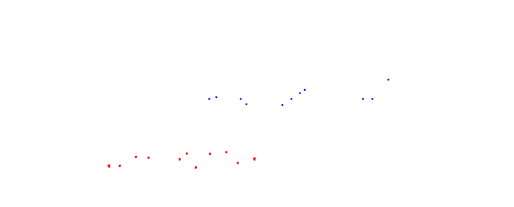

for red is tracker, blue is sandbox

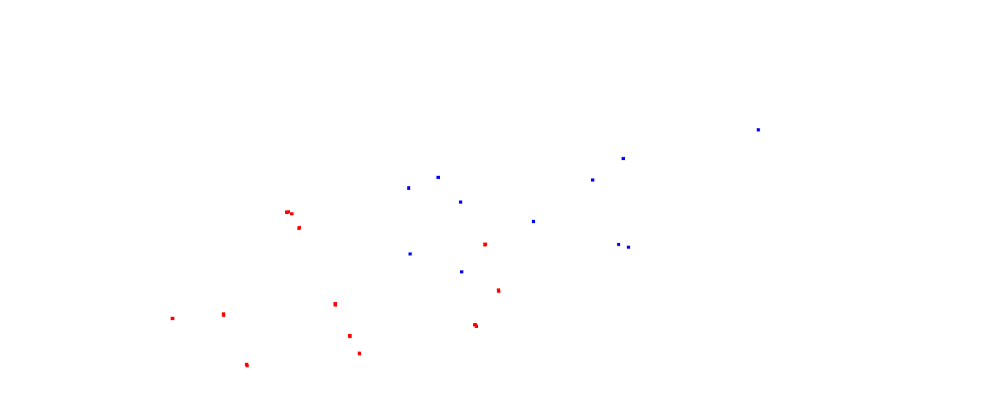

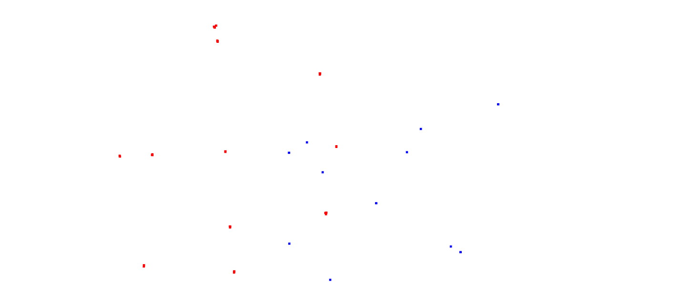

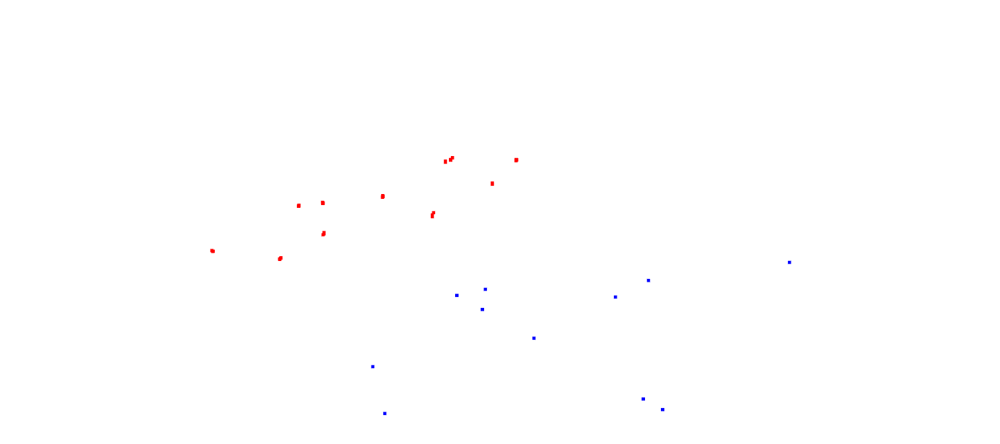

The following two pictures show what we observe when we make the viewing angle parallel to the xoz plane of the two Cartesian coordinate systems A (tracker) and B (sandbox) (so that the points of the point cloud fall on the same plane).

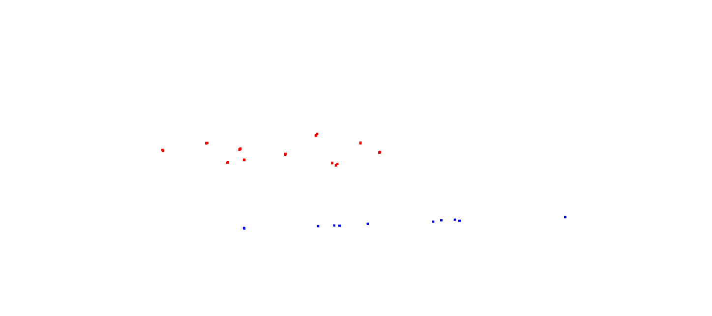

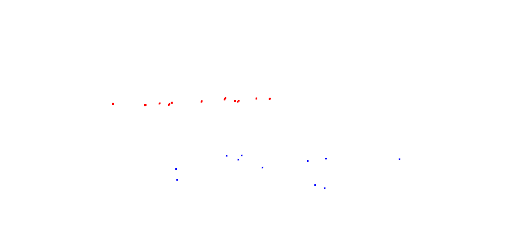

It can be seen that there is a complex rotation relationship between the two coordinate systems A and B.
