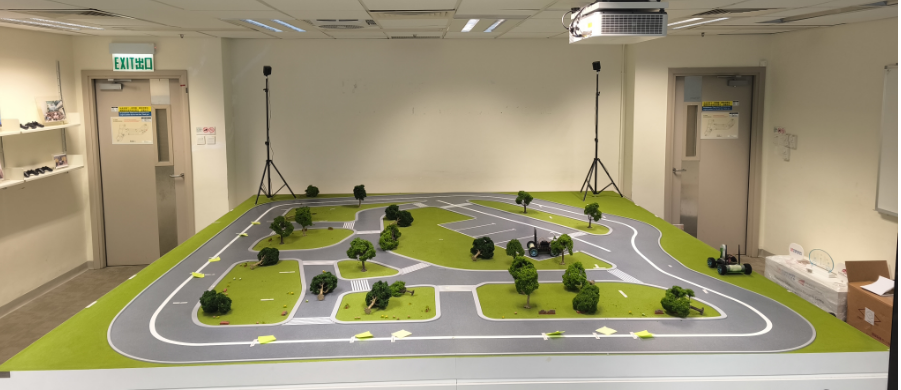
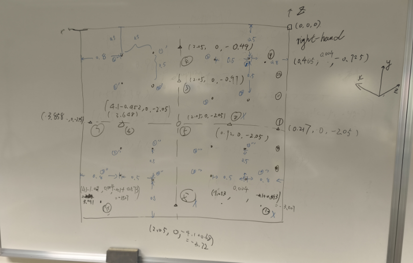

# this is the guidelines of how to use vive_tracker and transform it from steamvr to sandbox

## requirements

we need to transform the coordinates of tracker from steamvr to sandbox, so we have to know the following things:

1. how the tracker defines the coordinate itself?
2. what is the accuracy of the position and orientation of the tracker?
3. what the coordinates of the tracker in steamvr means?

## the tracker

1. coordinate_system of the vive_tracker

    it is a right-handed coordinate system.
    

    Use a Cartesian coordinate system with the y axis pointing upwardsthe up of the coordinate system is the y.
    

    the definition of the euler is the same as the usual one, which the yaw is the euler which turn around the upwards, and roll is the Barrel roll angle(z), pitch is the Rotation angle with respect to the horizontal plane(x)
    

    from the guidelines of the vive_tracker(provided by HTC)

2. Data Output

    The tracker's data output is a list of positions and directions.

    The unit of position is meter, and the accuracy of a single measurement is $\pm 0.002$ (Zero Drift); however, the accuracy of multiple measurements of the same point is $\pm 0.02$.

    the unit of direction is degrees, and the accuracy of a single measurement is $\pm 0.1$, and the accuracy of multiple measurements of the same point is $\pm 1 degree$.

    As the guidlines showing, we can get the data by

    ``` python
    from vive_tracker import ViveTrackerModule
    TRACKER_NAME = "tracker_1"


    vtm = ViveTrackerModule()
    vtm.print_discovered_objects()
    tracker = vtm.devices[TRACKER_NAME]
    while True:
        try:
            cam_coord = tracker.get_pose_euler()
        # print(cam_coord)
            print(f"\rCamera coordinate: [x={cam_coord[0]:.4f}, y={cam_coord[1]:.4f}, z={cam_coord[2]:.4f}, roll={cam_coord[3]:.4f}, yaw={cam_coord[4]:.4f}, pitch={cam_coord[5]:.4f}]", end='')
        except Exception:
            continue
        finally:
            time.sleep(0.1)
    ```

    the order of the cam_coord is **x, y, z, roll, yaw, pitch**

    the data of the euler actually defines how the tracker turn through the coordinates axis of the steamvr

3. Rotation Order of Euler

    The rotation order affects whether the synthesis of Euler angles is correct or not.
    we can test the correct rotation order through the code below:

    ```python
    import numpy as np
    from scipy.spatial.transform import Rotation as R

    #         r                   y                     p
    #np.radians(-179.4732), np.radians(-145.5065), np.radians(-90.4384)
    # 假设初始欧拉角为 (yaw1, pitch1, roll1)
        #6                                          r                       y                   p
    # Point([-1.3939, -1.3780, -1.0774], [np.radians(1.3633), np.radians(-55.5799), np.radians(90.2613)]),
    # Point([-1.3939, -1.3780, -1.0774], [np.radians(-178.4583), np.radians(-146.8788), np.radians(-89.9101)]),
    #roll=-178.4583，yaw=-146.8788，pitch=-89.9101
    # Point([-1.3939, -1.3780, -1.0774], [np.radians(1.5277), np.radians(34.5399), np.radians(89.8219)]),
    yaw_z1, pitch_y1, roll_x1 =  -55.5799,90.2613,1.3633

    # 假设要旋转的欧拉角为 (yaw2, pitch2, roll2)
    yaw_z2, pitch_y2, roll_x2 = 90,0,0

    # 假设tracker使用Z-Y-X的欧拉角合成顺序
    rotation1 = R.from_euler('yxz', [pitch_y1,roll_x1, yaw_z1], degrees=True)
    rotation2 = R.from_euler('yxz', [pitch_y2 ,roll_x2,yaw_z2], degrees=True)

    # 获取旋转矩阵
    matrix1 = rotation1.as_matrix()
    matrix2 = rotation2.as_matrix()

    # 将两个旋转矩阵相乘
    rotated_matrix = np.dot(matrix2, matrix1)

    # 从旋转矩阵创建一个新的 Rotation 对象
    rotated_rotation = R.from_matrix(rotated_matrix)

    # 将旋转后的矩阵转换回欧拉角
    rotated_euler = rotated_rotation.as_euler('yxz', degrees=True)

    # 打印旋转后的欧拉角
    print("Rotated Euler Angles (yaw, pitch, roll):", rotated_euler)
    #                                             pitch                 roll                   yaw

    #Rotated Euler Angles (yaw, pitch, roll): [90.2613  1.3633 34.4201]
    ```

    through this test we know that the rotation of the Euler is by the order of **pitch roll yaw**---yxz (while   pitch_y, roll_x ,yaw_z in func R.from_euler)
    Ensure that the correspondence between the Euler angles and the rotation axis is correct
    Meanwhile, we know that the tracker useing a coordinate while the y is the height, so we have to change the input order of the Euler numpy like the following codes:

    ```python
    def matrix_to_euler(matrix):
        """
        将旋转矩阵转换为欧拉角 (yxz)。
        返回: [yaw, pitch, roll] 顺序的欧拉角（弧度）。
        """
        euler = R.from_matrix(matrix).as_euler('yxz')
        return [euler[0], euler[2], euler[1]]

    def construct_transformation_matrix(rotation_matrix, translation):
        """
        根据旋转矩阵和平移向量构建变换矩阵。
        """
        T = np.eye(4)
        T[:3, :3] = rotation_matrix
        T[:3, 3] = translation
        return T
    ```

4. definition of the point_orientation

    we need to define the coordinate_system of tracker and the orientation of how to turn it.~~
    ~~The guidelines have given a defination of tracker_coordinate as the picture shows

    

    we may use this as the definition of the tracker_coordinate

    and define that :
    **The tracker's z-axis is parallel to the SandBox's z-axis, which is 0 degrees.**

## SandBox_coordinate

the coordinate of sandbox is also a right-handed system, however it been designed as use z as the upward.

For the sake of consistency, we swap the y and z of the sandbox, that is, use y to represent upward.




(Sandbox coordinate system sketch, which will be replaced by CAD drawing later)

## Benchmark

1. Test the coordinate correspondence of the tracker in the steamvr and SandBox coordinate systems

   all the following disgree is describing the derictions of the the tracker_coordinate

    1.1. y=0,p=0,r=0

    the axis_orientation of the tracker_coordinate should be the same with the sandbox_coordinate
    orientation itself

    
    

    1.2. y=-90,p=30,r=0

    
    

    1.3. y=30,p=0,r=-20

    
    

    When choosing the direction, we should exclude the situation of pitch=90 as much as possible to avoid singular points.

    At the same time, the azimuth angles obtained should be varied in all axes as much as possible, because the axes of the two coordinate systems are not parallel.

    The method mentioned above attempts to fit the overall conversion relationship between the two coordinate systems (x, y, z). However, after multiple tests, there is a measurement error of 0.05m in the y-axis direction, and the Sandbox itself is not flat and it is difficult to measure the height difference, so the above solution was abandoned.


    

    for red is tracker, blue is sandbox

    

    

    

    The following two pictures show what we observe when we make the viewing angle parallel to the xoz plane of the two Cartesian coordinate systems A (tracker) and B (sandbox) (so that the points of the point cloud fall on the same plane).

    

    

    It can be seen that there is a complex rotation relationship between the two coordinate systems A and B.

## transform function

The basic idea is to solve the least squares problem based on SVD. First, find the centroid of the collected points, then translate them, and then use SVD to calculate the rotation transformation matrix and translation matrix between the two groups of points.

After many experiments, we finally chose to separate the position and orientation problems and deal with them separately. Position only deals with the x and z axes (horizontal coordinates, height coordinates are set to 0), and orientation only deals with rotation around the y axis (horizontal rotation, yaw).

Only key function codes are included here. For test and deployment codes, please refer to the codes in the <./../source_code/tracker_transform> folder.

```python
    def calculate_position_transformation(self, positions_A=None, positions_B=None):
    """
    Calculate the position transformation matrix between two sets of points.
    Returns T_pos and R_pos
    """
    if positions_A is not None and positions_B is not None:
        self.__positions_A = positions_A
        self.__positions_B = positions_B
    elif self.__positions_A is None or self.__positions_B is None:
        print("Please provide location data first!")
        return

    # Perform calculations using stored data
    centroid_A = np.mean(self.__positions_A, axis=0)
    centroid_B = np.mean(self.__positions_B, axis=0)

    H = np.dot((self.__positions_A - centroid_A).T, (self.__positions_B - centroid_B))
    U, S, Vt = np.linalg.svd(H)
    R_pos = np.dot(Vt.T, U.T)
    if np.linalg.det(R_pos) < 0:
        Vt[-1, :] *= -1
        R_pos = np.dot(Vt.T, U.T)
    translation = centroid_B.T - np.dot(R_pos, centroid_A.T)
    self.T_pos = self.construct_transformation_matrix(R_pos, translation)
    return R_pos, translation

```

## Operation method record

1. debug_tracker

    Print the raw data obtained by the tracker.

    ```shell

    # 1. we have to start steam vr at first: start a new terminal then type the command

    steam steamvr

    # 2. for get the pose of the tracker we need to open the python code

    cd ./Workspace/Carla/op_carla/op_bridge/op_bridge/fsm_lab_simulation/testing_scripts/
    python3 debug_tracker.py

    ```

2. debug_transfome

    ```shell

    # 1. we have to start steam vr at first: start a new terminal then type the command

    steam steamvr

    # 2. for get the pose of the tracker we need to open the python code

    cd ./Workspace/Carla/op_carla/op_bridge/op_bridge/fsm_lab_simulation/testing_scripts/
    python3 debug_transform.py

    ```
 