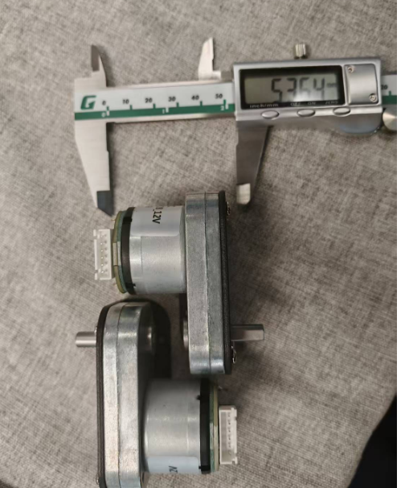

# LIMINGXI weekly_report in 2025/01/13--2025/01/17

## planned

1. 完成carla中放大车模后的测试
2. 将autoware与carla迁移到4090主机
3. 设计车宽在10cm以内的车模

## finished

车模测试

## Unexpected events

### 问题内容：

放大后的车模会在刷新位置时被还原比例

### 问题描述：

原计划，在carla中将车模的尺寸等比放大1.5倍，使其接近真实的车辆与路径的比例关系，以获得更好的控制效果（规划出更真实可行的路径）；经过测试发现，在车模被放大后，每次刷新位置都会将车模还原为原始尺寸，在这种情况下，只能通过carla中原生的点对点循迹来控制运动，无法使用autoware；因此，此方案搁置。

## Next work plan

1. 完成将autoware与carla迁移到4090主机
2. 初步设计车宽在10cm以内的车模
