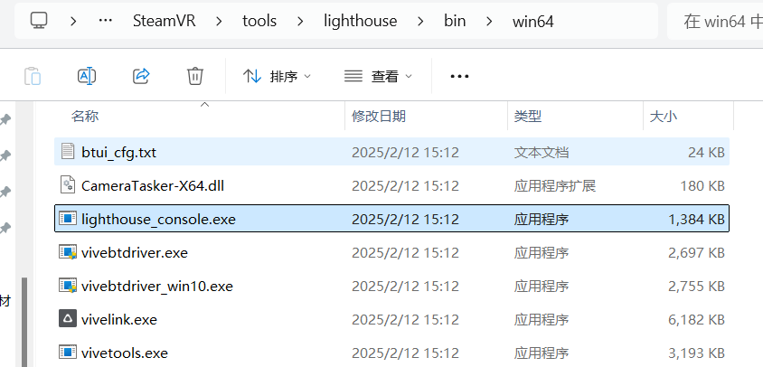
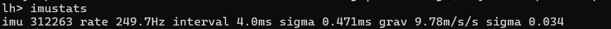

# This log is utilized to document the outcomes of the Lighthouse test.

## 0 help

    使用lighthouse提供的console进行调试
    
    C:\steam\steamapps\common\SteamVR\tools\lighthouse\bin\win64

    ```bash
    lighthouse_console.exe usage:

    associatecontroller     Associated the attached controller to the attached puck
    axis    Toggle VRC axis data dumping
    battery Print battery status
    button  Toggle button data dumping
    clear   Clear the record buffer and accumulated statistics.
    deviceinfo      Print information about all connected lighthouse_devices.
    dump    Toggle all dumping to the console. You must also turn on the individual { imu, sync, sample } flags.
    errors  Dump the lighthouse error/status structure.
    event   Toggle lighthouse aux event dumping
    eventmask       Select lighthouse aux events to report
    isp     Enable In-System Programming
    haptic [<duration_us>] [<interval_us>] [<repeat_count>] Trigger haptic pulse
    haptic2 [<frequency_hz>] [<duration_ms>] [<amplitude_percent>]  Trigger haptics
    identifycontroller      Trigger haptic pulses on the active serial number to identify it
    imu     Toggle IMU data packet dumping
    imustats        Print IMU statistics
    period  Print sync statistics
    dis [<type=auto>]       Toggle disambiguation. types={ auto, tdm, framer, synconbeam }
    syncd   Toggle sw sync detect
    pose    Toggle static pose solver. Is 'dis' is not active, it will enable it.
    poweroff        Turn off the active controller
    reboot  Reboot the connected watchman device.
    record  Toggle event recording. You must also turn on the individual { imu, sync, sample } flags.
    serial  Select a device to open by serial number substring
    sensorcheck     Print out hits (and widths) per sensor
    schedule [|enable|disable|test] Enable, disabled, test mode, or display state of sensor scheduling
    save [<filename="lighthouse_console_save.txt">] Save recorded events to a file on disk
    sync    Toggle sync dumping
    sample  Toggle sample dumping
    trackpadcalibrate       Trigger trackpad recalibration on the active controller
    uploadconfig [<filename>]       Upload the config file to the device
    downloadconfig [<filename>]     Download the config file
    reformatconfig <inputfilename> <outputfilename> Update the config to the latest json format
    version Prints the firmware and hardware version on the Watchman board
    usbstats        One-time dump of most recent USB packet rate stats
    usbcheck        Continuous once/sec print of USB packet rate stats
    userdata        Get a directory listing of the stored userdata
    userdatadownload <name> Download the specified named userdata
    userdatadownloadraw <addr> <size> [<filename>]  Download and store the user data at specified address
    userdataalloc   Display the size of the user data allocation (in bytes)
    ispdiv <divisor>        Set the camera ISP sync signal divisor
    sleep <milliseconds>    Really just sleep
    quit    Quit
    ```
这个 `lighthouse_console.exe` 是一个用于与 Valve 的 Lighthouse 追踪系统中的设备（比如 Vive Tracker、手柄等）进行交互的命令行工具。它提供了很多用于调试、配置和测试这些设备的功能。 下面是对每个命令的详细解读：

**通用命令:**

*   **`quit`**: 退出程序。
*   **`sleep <milliseconds>`**:  让程序休眠指定的毫秒数。主要用于脚本编写或调试时控制执行速度。

**设备选择:**

*   **`serial <serial number substring>`**:  通过序列号选择要操作的设备。 你只需要提供序列号的一部分（substring）即可。这很重要，因为很多命令只对*当前选中的*设备有效。

**数据输出控制:**

*   **`dump`**: 开启/关闭 所有类型的数据输出到控制台。  要让这个命令生效，你*必须* 同时开启 `imu`, `sync`, 和 `sample` 这些单独的标志。
*   **`imu`**: 开启/关闭 IMU (惯性测量单元，包含陀螺仪和加速度计) 数据包的输出。
*   **`sync`**: 开启/关闭 同步 (Lighthouse 基站同步信号) 数据的输出。
*   **`sample`**: 开启/关闭 传感器采样数据的输出。
*   **`axis`**: 开启/关闭 VRC (Valve Room Calibration) 轴数据的输出。
*   **`button`**: 开启/关闭 手柄按键数据的输出。
*   **`event`**: 开启/关闭 Lighthouse 辅助事件的输出。
*   **`eventmask <mask>`**: 选择要报告的 Lighthouse 辅助事件。  需要提供一个掩码值来指定要监听的事件类型。
*   **`usbstats`**:  一次性输出最近的 USB 数据包速率统计信息。
*   **`usbcheck`**:  每秒连续输出 USB 数据包速率统计信息。  用于监控 USB 连接的性能。

**数据记录:**

*   **`record`**: 开启/关闭 事件记录。 和 `dump` 类似，要记录数据，你必须同时开启 `imu`, `sync`, 和 `sample` 等标志。
*   **`clear`**: 清空记录缓冲区和累积的统计数据。
*   **`save [<filename="lighthouse_console_save.txt">]`**: 将记录的事件保存到磁盘上的文件中。  可以指定文件名，默认为 `lighthouse_console_save.txt`。

**设备信息:**

*   **`deviceinfo`**: 打印所有连接的 Lighthouse 设备的详细信息。
*   **`version`**: 打印 Watchman 板（通常是手柄或追踪器内部的主板）的固件和硬件版本。
*   **`errors`**: 输出 Lighthouse 错误/状态结构体的信息。 用于诊断设备问题。
*   **`imustats`**: 打印 IMU 统计信息。
*   **`period`**: 打印同步统计信息。
*   **`sensorcheck`**: 打印每个传感器的命中数（和宽度）。 用于检查传感器的状态和性能。
*   **`userdataalloc`**: 显示用户数据分配的大小（以字节为单位）。

**设备控制:**

*   **`poweroff`**: 关闭当前选定的手柄。
*   **`reboot`**: 重启连接的 Watchman 设备。
*   **`haptic [<duration_us>] [<interval_us>] [<repeat_count>]`**: 触发触觉脉冲。
    *   `duration_us`: 脉冲的持续时间，以微秒为单位。
    *   `interval_us`: 脉冲之间的间隔，以微秒为单位。
    *   `repeat_count`: 脉冲重复的次数。
*   **`haptic2 [<frequency_hz>] [<duration_ms>] [<amplitude_percent>]`**: 触发触觉反馈（更高级的控制）。
    *   `frequency_hz`: 频率，以赫兹为单位。
    *   `duration_ms`: 持续时间，以毫秒为单位。
    *   `amplitude_percent`: 振幅，以百分比表示。
*   **`identifycontroller`**: 在活动序列号上触发触觉脉冲以识别它。 用于在多个设备中快速找到特定设备。
*   **`trackpadcalibrate`**: 触发当前选定的手柄上的触控板重新校准。

**Lighthouse 追踪相关:**

*   **`dis [<type=auto>]`**: 开启/关闭 消歧义 (disambiguation)。  用于解决多个设备互相遮挡时追踪的问题。
    *   `type`: 消歧义的类型，可以是 `auto` (自动选择), `tdm` (时分复用), `framer`, 或 `synconbeam`。
*   **`syncd`**: 开启/关闭 软件同步检测。
*   **`pose`**: 开启/关闭 静态姿势解算器。 如果 `dis` 未激活，它将启用它。
*   **`ispdiv <divisor>`**: 设置相机 ISP 同步信号分频器。  ISP (Image Signal Processor) 是相机内部用于处理图像信号的组件。 这个命令用于调整 ISP 的同步信号。

**配置管理:**

*   **`uploadconfig [<filename>]`**: 将配置文件上传到设备。
*   **`downloadconfig [<filename>]`**: 从设备下载配置文件。
*   **`reformatconfig <inputfilename> <outputfilename>`**: 将配置文件更新为最新的 JSON 格式。

**用户数据管理:**

*   **`userdata`**: 获取存储的用户数据的目录列表。
*   **`userdatadownload <name>`**: 下载指定的命名用户数据。
*   **`userdatadownloadraw <addr> <size> [<filename>]`**: 下载并存储指定地址的用户数据。
    *   `addr`: 起始地址。
    *   `size`: 要下载的大小（以字节为单位）。
    *   `filename`: 保存的文件名（可选）。

**`associatecontroller`**: 将连接的控制器与连接的 puck 相关联。 "puck" 通常指的是 Vive Tracker。 这个命令用于将手柄绑定到特定的追踪器。

**命令行标志:**

程序还支持将许多选项作为命令行标志传递，例如 `/sync /sample /dump /imu /raw /serial /isp`。这允许你通过命令行直接配置程序的行为，而无需在程序运行时输入命令。

**总结:**

`lighthouse_console.exe` 是一个强大的工具，可以让你深入了解和控制 Lighthouse 追踪系统中的设备。 它可以用于调试、配置、测试和固件更新等多种用途。 理解这些命令对于开发 VR/AR 应用、进行硬件调试或深入研究 Lighthouse 追踪技术都非常有帮助。

## 1. imu test



rate 249.7Hz:
IMU 数据的采样速率为 249.7 Hz，即每秒采集约 249.7 次数据。这接近于常见 IMU 的 250 Hz 标准采样速率。

## 2. sample test

93.105374         sample   2.19
93.111140         sample   1.07
93.111150         sample   1.06
93.111155         sample   1.05
93.111179         sample   1.04
93.111180         sample   1.18
93.111187         sample   1.19
93.111191         sample   1.02
93.118675         sample   2.06
93.118693         sample   2.05
93.118707         sample   2.02
93.118713         sample   2.04
93.118722         sample   2.18
93.118730         sample   2.19
93.118732         sample   2.11
93.125181         sample   2.06
93.125182         sample   2.04
93.125187         sample   2.09
93.125190         sample   2.08
93.125192         sample   2.02
93.125203         sample   2.11
93.125205         sample   2.10
93.125225         sample   2.18
93.125228         sample   2.19
93.131087         sample   1.06
93.131092         sample   1.05
93.131116         sample   1.04
93.131118         sample   1.18
93.131121         sample   1.03
93.131128         sample   1.02
93.138529         sample   2.06
93.138534         sample   2.08
93.138546         sample   2.05
93.138561         sample   2.02
93.138567         sample   2.04
93.138576         sample   2.18
93.138579         sample   2.10
93.138584         sample   2.19
93.138586         sample   2.11
93.144087         sample   1.06

传感器采样测试，说明在0.1s内接收到13次数据

3. pose test


