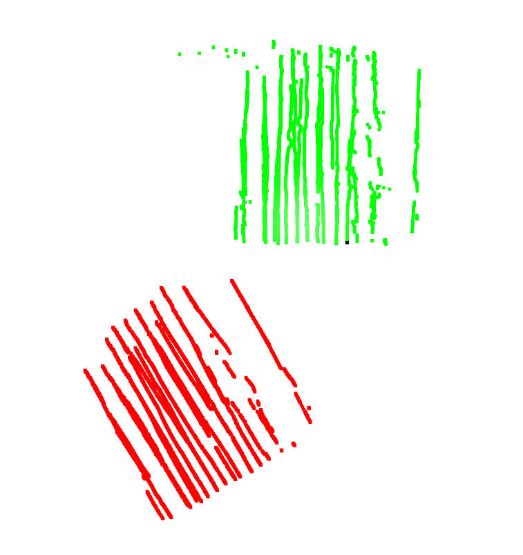
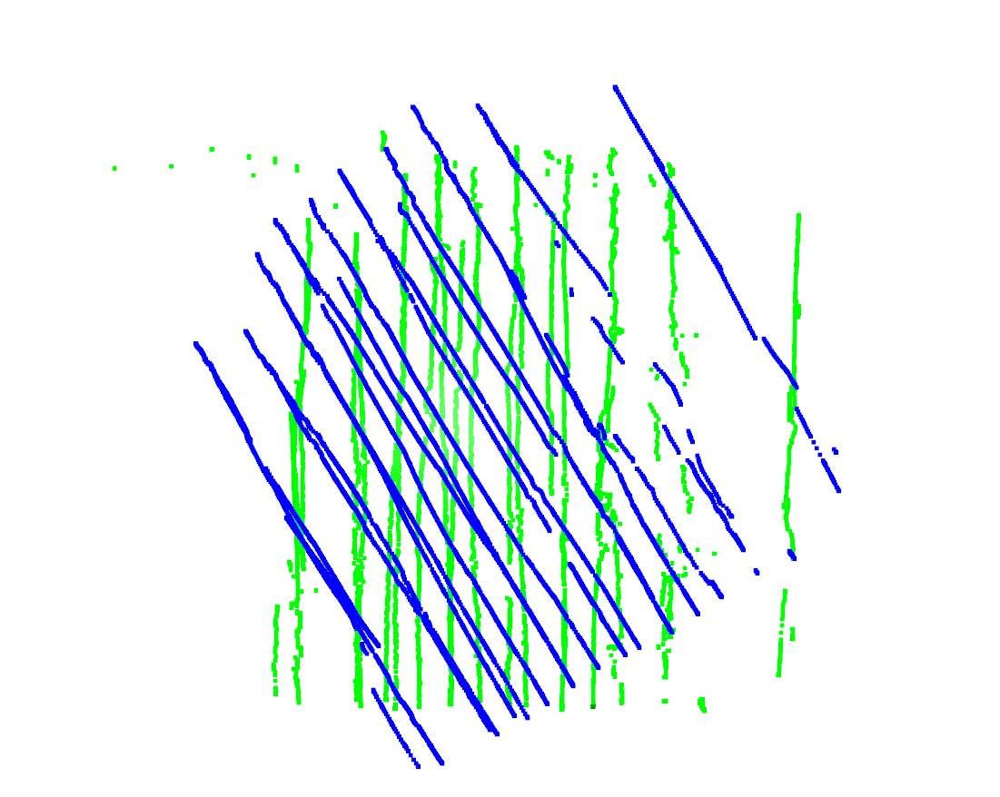
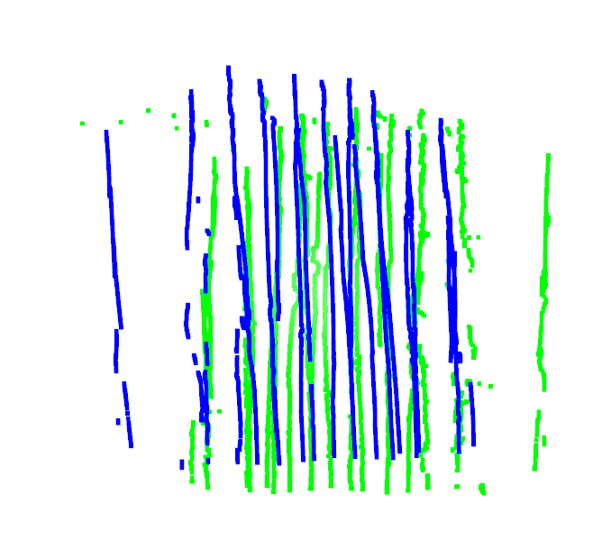
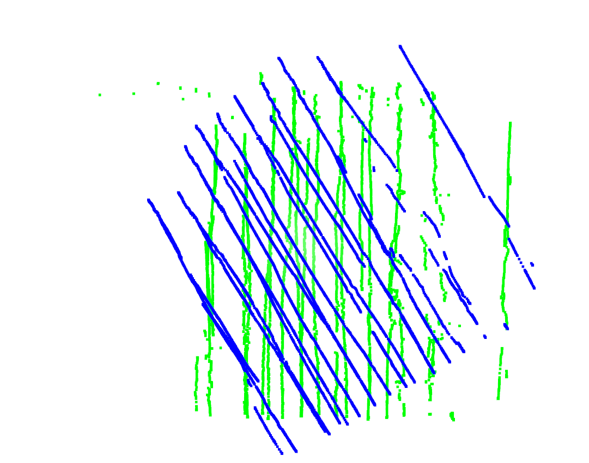
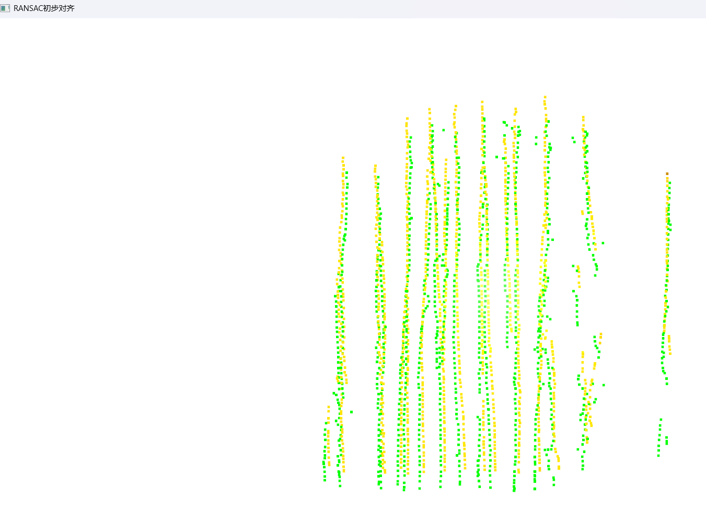
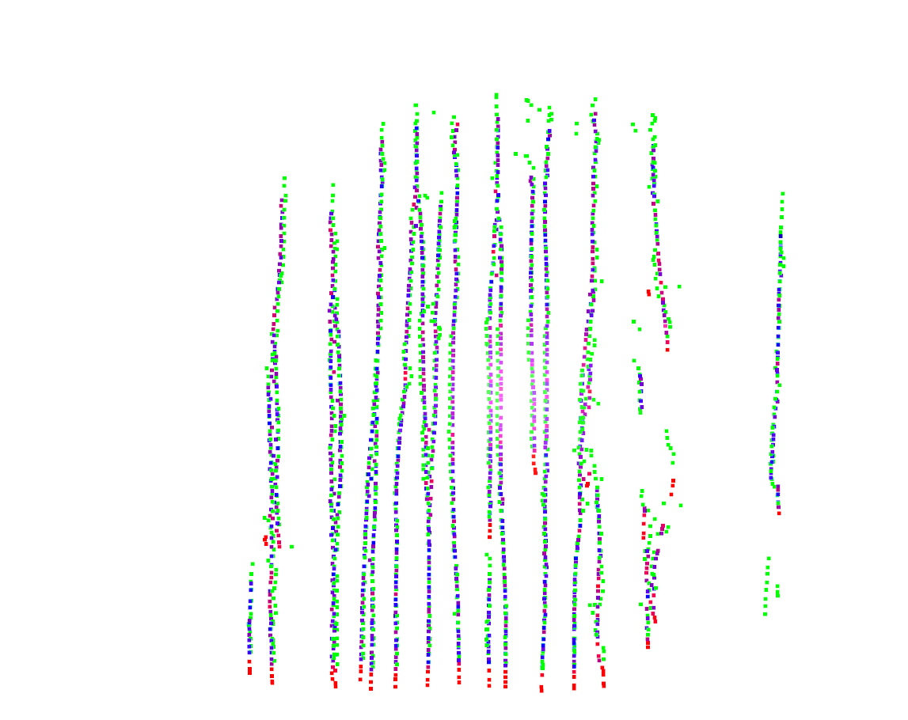
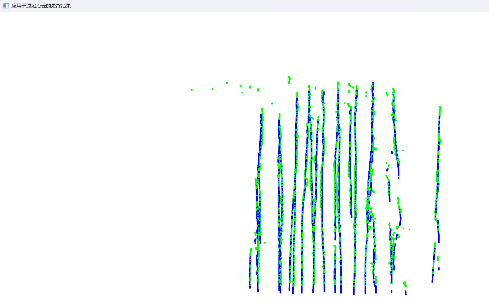

# why

这是一份收集数据的代码，他的数据记录了这样一个场景，一组互相垂直的墙面A于B，其中，垂直于A墙面并向其靠近的方向为X轴正向；垂直于B墙并向其靠近的方向为Z轴正向；distance_3与X对应，是测量工具与A墙的距离；distance_2与Z轴对应，是测量实体与B墙的距离。我希望你将这份数据处理代码融入到数据采集中，使其成为程序结束后生成的第三份代码；针对这份数据处理，需要注意的是：1.df["d_laser_x"] = df["d_laser_x"]+0.05
df["d_laser_z"] = df["d_laser_z"]+0.05这是对测量实体的雷达数据的固定补偿，维持其始终固定 2. # 计算修正后的垂直距离
def compute_corrected_distances(laser_x, laser_z, yaw):
if yaw <0:
theta = np.radians(yaw + 137.4)
else:
theta = np.radians(yaw - 40.7) # 计算偏移角度（转换为弧度）

复制
# 旋转变换，恢复 真实垂直距离
d_perp_x = laser_x * np.cos(theta)   # X 方向的修正距离
d_perp_z = laser_z * np.cos(theta)   # Z 方向的修正距离

return round(d_perp_x, 3), round(d_perp_z, 3)  # 保留 3 位小数
计算修正后的数据
corrected_data = [compute_corrected_distances(lx, lz, yaw)
for lx, lz, yaw in zip(df["d_laser_x"], df["d_laser_z"], df["Yaw"])] 这是对distance的修正，因为在测量工具移动的过程中，可能会产生旋转，获得distance的两个lidar传感器无法与墙面A，B垂直从而造成误差，因此我们使用theta来描述这个方向差，从而消除误差：首先计算与标准方向的差异theta，yaw是从可信赖的绝对参考系获得的值，因此我们可以通过这个yaw值来判断是否与墙体垂直（我会在开始测量时，保证测量实体的distance_3传感器与A墙体垂直，所以此时获得的yaw就是标准情况下的角度，在上述代码表述的测量过程中是-137.4，因此会有theta = np.radians(yaw + 137.4)，而经由测量得到的当反向移动时（旋转绝对坐标传感器，也就是获得yaw,X,Y,Z的传感器，这样可以保证获得一个相反的测量过程，而不需要移动lidar，也就是说lidar依旧垂直于墙面A，B） 的yaw值为40.7,才会有theta = np.radians(yaw - 40.7)但其实大多数情况下我不会将传感器反向，所以其实可以删去）。3.df["laser_x"], df["laser_z"] = zip(*corrected_data)

df["laser_x"] = 4.250-df["laser_x"]
df["laser_z"] = 1.660-df["laser_z"]这是将laserx和laserz的参考系进行补偿，将这两个补偿做成全局变量，以便在特殊情况下方便我修改（大多数情况下不需要修改）；4. # Filter rows based on Yaw value
condition1 = abs(df["Yaw"] + 137.4) <= 10 # 筛选yaw在 对应反向的 范围的数据
condition2 = abs(df["Yaw"] - 40.7) <= 10 # 筛选yaw在对应正对墙壁 范围的数据

df = df[condition1 | condition2]
这是筛选掉发生了过大的旋转的测量结果，因为过大的旋转一方面会影响修正准确度，另一方面可能本身采集到的数据就是错误的；5.# 仅保留需要的列，并按照要求的顺序排列
df = df[["Timestamp", "d_laser_x", "d_laser_z","laser_x", "laser_z", "X","Y","Z","Yaw", "Roll", "Pitch", ]]
df = df.round(4) # 所有数值列保留 4 位小数

保存修正后的数据为 CSV
output_file = "corrected_laser_tracker_1803.csv"
df.to_csv(output_file, index=False, encoding="utf-8")

print(f"修正后的数据已保存至 {output_file}") 这是对处理后的数据的整理；我希望你给我修改后的完整代码，并在理解我的逻辑后，给出一份程序说明与操作手册 （文档）

在这份代码的基础上，做如下修改： 0.修改原有的键位设置，改为：（1）按下T开始录制/Z轴校准；（2）按下P暂停记录/切换到X轴校准；（3）按下E开始Eular校准（具体的校准过程在下文2中陈述）；1. 使生成的log、txt和csv在代码同级的一个专门目录下,不在文件名上显示时间，而在这个存储的目录文件夹名中显示；2.增加一个这样的功能：在按下E后，要求用户分别在三个点位分别将传感器按90,-90,0,45,-45,135,-135这7个不同的角度摆放（将本点位需要的7个角度与本次角度以及已经记录的角度显示在terminal上），每次摆放完成后按下A进行记录（存储示例：Timestamp,X,Y,Z,Roll,Yaw,Pitch,DesiredAngle
1741950906.431,0.7607,-2.3279,5.7959,-179.7704,-153.6356,-0.7576,90.00），如果存在问题则按下D删除上一条记录（每按一下删除一次，直至完全删除），当完成全部21个记录后询问是否需要更改，若按下S则说明确认无误，将收集到的数据记录输出为euler.csv并退回到等待状态。

