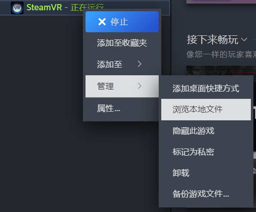
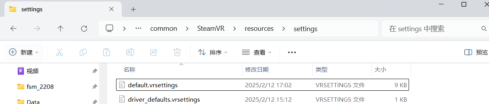
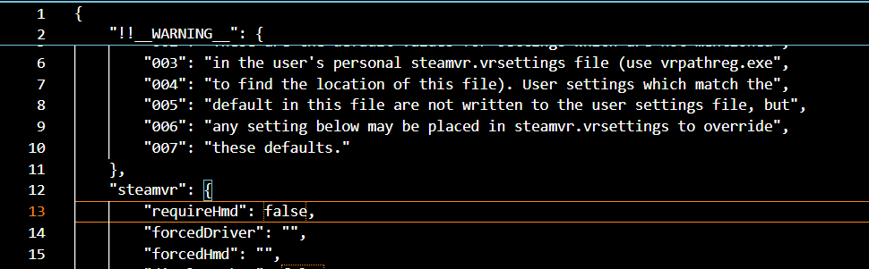

# settings of steamvr

1. 在Steam安装路径下找到：
   Steam\steamapps\common\SteamVR\resources\settings，进入该文件夹，找到default.vrsettings文件，用记事本打开

    

    

2. 找到对应的位置，修改成如下的样子：

    “requireHmd”: false,
    “forcedDriver”: null,
    “activateMultipleDrivers”: true,

    

3.test

    cd /home/cityu-fsm-lab-carla/lmx/packages/1_vive_tracker/scripts

    python3 test_multi_pose.py
