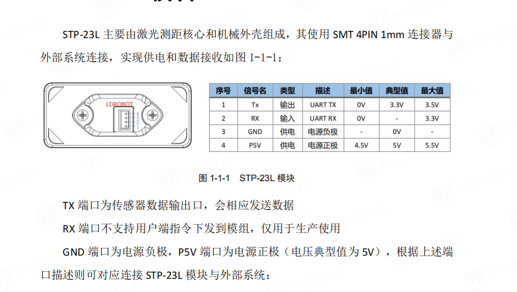
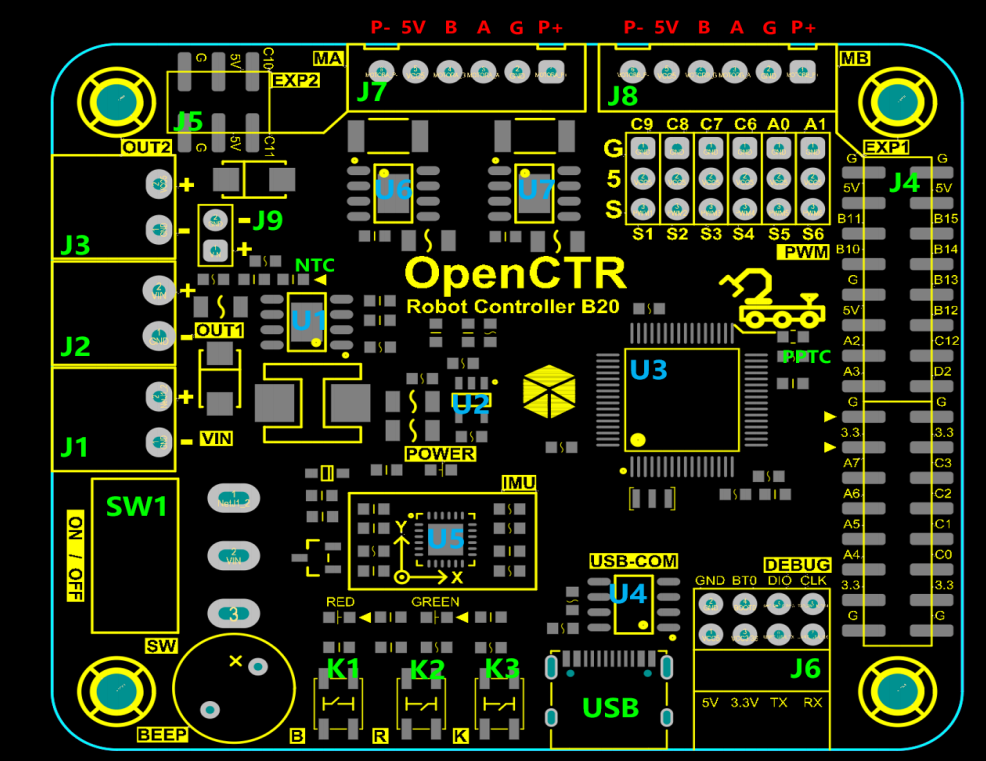
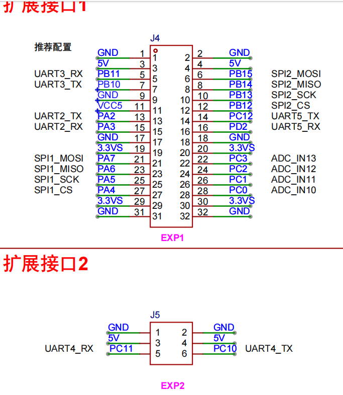

# this is about the install of stp23l

1. STP23L模块与单片机的接线如下：

    STP23L模块-------------F1单片机

    P5V-------------5V
    GND------------GND
    RX--------------不接
    Tx---------------B11
    

    因为STP上的RX仅供调试，故仅需寻找B20上的RX接受来自STP的TX数据

    
    

    选取PB11 和 PC11 

    toward|color|signal|B20|B20_description|stp23_description|
    |--|--|--|--|--|--|
    Forward|green|P5V|
    F|Black|GND|
    F|Red|RX|
    F|Yellow|TX|PC11|UART4_RX|distance_3
    Right|Green|P5V|
    R|Black|GND|
    R|Red|RX|
    R|Yellow|TX|PB11|UART3_RX|distance_2

2. 添加读取距离代码
    distance_2 ----> usart3
    distance_3 ----> usart4

    distance 是u16变量

    以中断进行处理