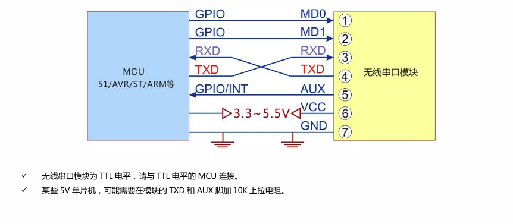
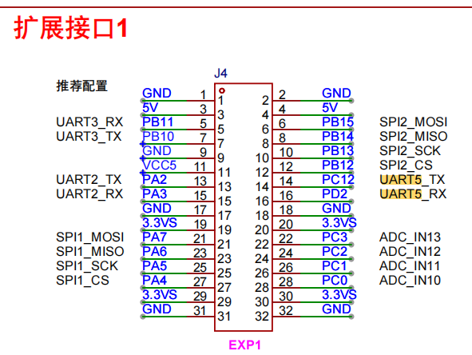
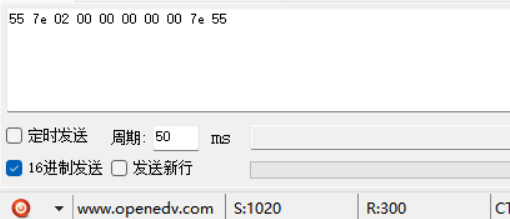
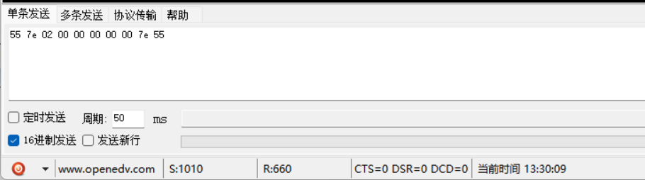
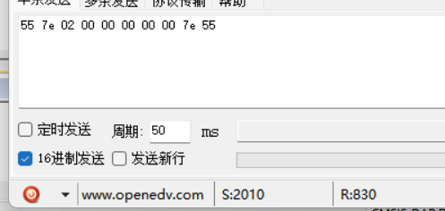
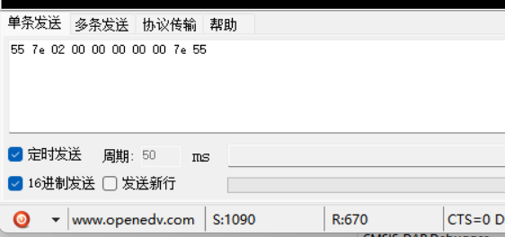

# this is the doc for how to use A69

## 1. wiring

index|A69|color|description|B20
--|--|--|--|--
1|MD0|blue|-|PB14
2|MD1|purple|-|PB13
3|RXD|green|-|PC12
4|TXD|yellow|-|PD2
5|AUX|white|-|PB12
6|VCC|red|5V|
7|GND|black|-|

