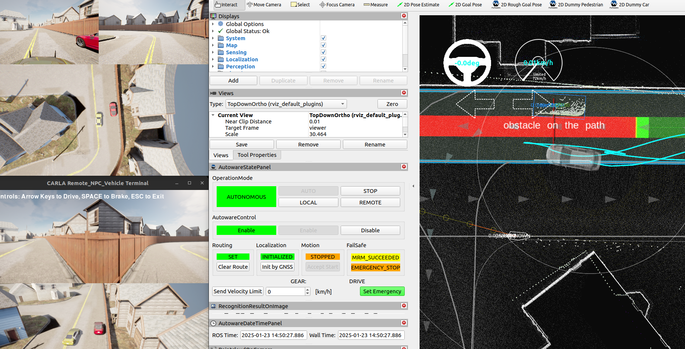
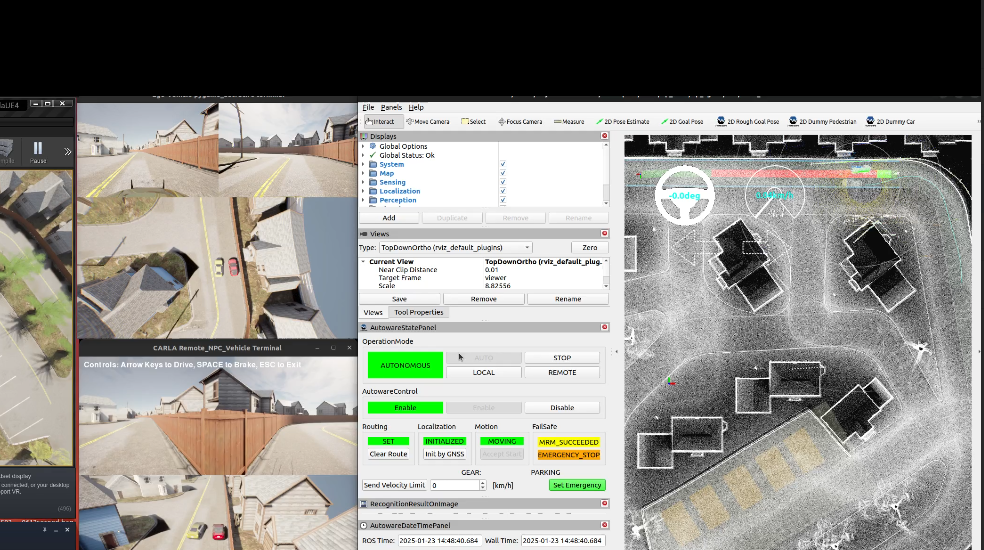
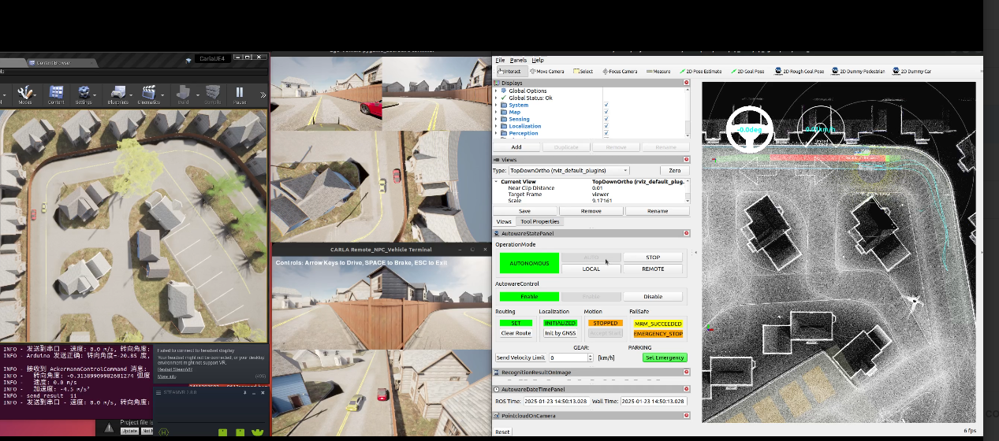
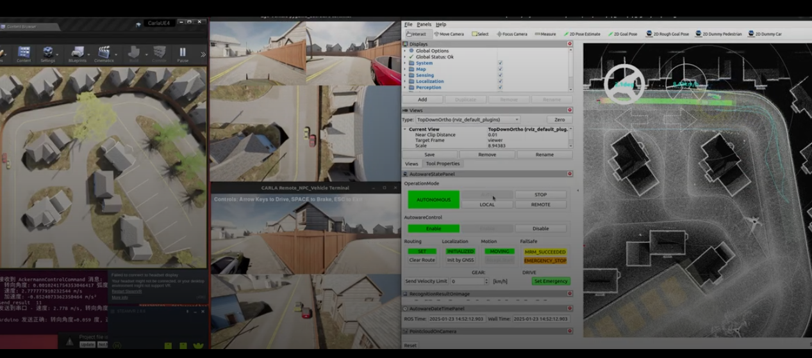

# this is the recorder of the test of obs_npc

## steps

### extral monitor

```sh

cd /home/cityu-fsm-lab-carla/lmx/packages/7_autoware_comm/scripts

python3 ./monitor/test_sys_monitor.py
```

### init car

1. start carla

    ```sh
    cd $CARLA_ROOT
    make launch
    ```

    then have to click the button play

2. init vr

    ```sh
    cd /home/cityu-fsm-lab-carla/lmx/packages/7_autoware_comm/bash

    source initial_config.bash

    cd /home/cityu-fsm-lab-carla/lmx/packages/8_positioning_compensation
    
    python3 test7.py
    ```

3. launch car

    ```sh

    cd /home/cityu-fsm-lab-carla/Workspace/Carla/op_carla/op_bridge/op_scripts/fsm_lab_simulation

    ./debug_run_vehicle_ros2.sh
    ```

4. init  trainsmit

    ```sh
    cd /home/cityu-fsm-lab-carla/lmx/packages/7_autoware_comm/bash

    source initial_config.bash

    cd /home/cityu-fsm-lab-carla/lmx/packages/7_autoware_comm/scripts/debug

    python3 debug5_serial.py 
    ```

5. init update car

    have to init this step as the final step, otherwise the autoware will fail to initialize

    ```sh
    cd /home/cityu-fsm-lab-carla/lmx/packages/7_autoware_comm/bash

    source initial_config.bash

    cd /home/cityu-fsm-lab-carla/lmx/packages/7_autoware_comm/scripts/debug

    python3 debug_update_vehicle_3.py 
    ```

## init npc

1. init npc car

    ```sh
    cd  /home/cityu-fsm-lab-carla/lmx/packages/9_npc_car/bash

    bash ./npc_car_init.bash
    ```

2. remove the car to a Preset Position

3. test


[2025.01.22-07.42.33:772][774]LogConsoleResponse: Tracing to; /home/cityu-fsm-lab-carla/Workspace/Carla/carla-0.9.15/Unreal/CarlaUE4/Saved/Profiling/20250122_154233.utrace








