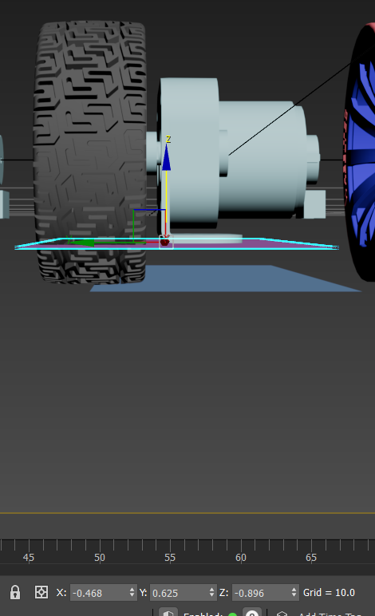
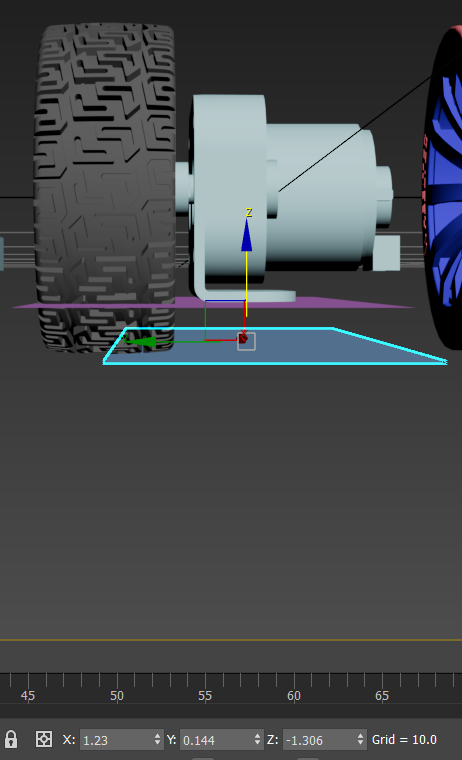
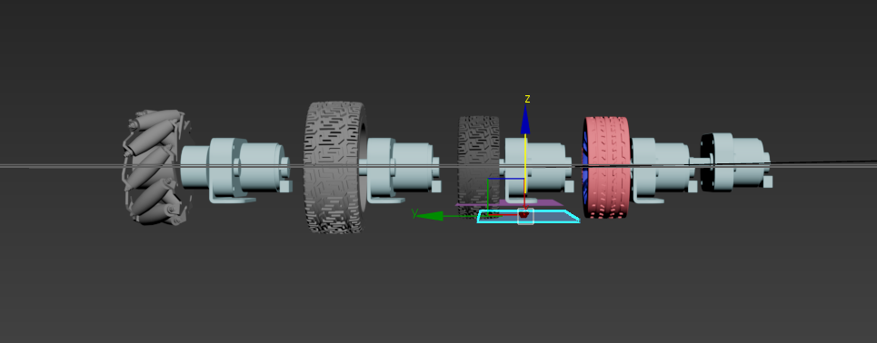
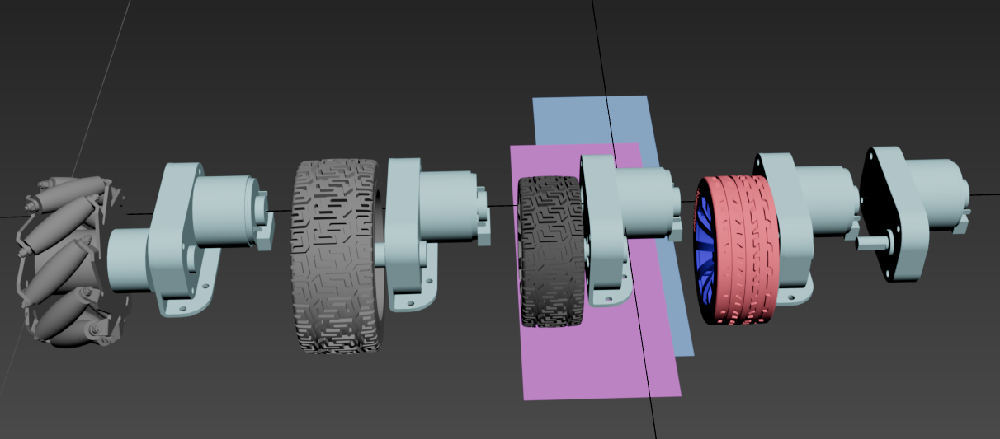

# this file is used to record some information about the wheel of WHEELTEC

## Size

From the diagrams, it's clear that placing the wheel on the chassis leaves only a 4 mm gap, which is too small for proper installation.

