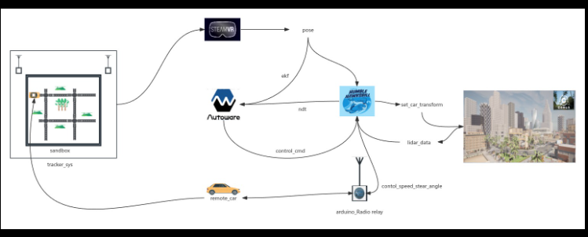
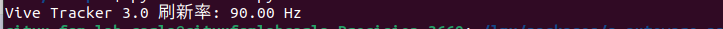
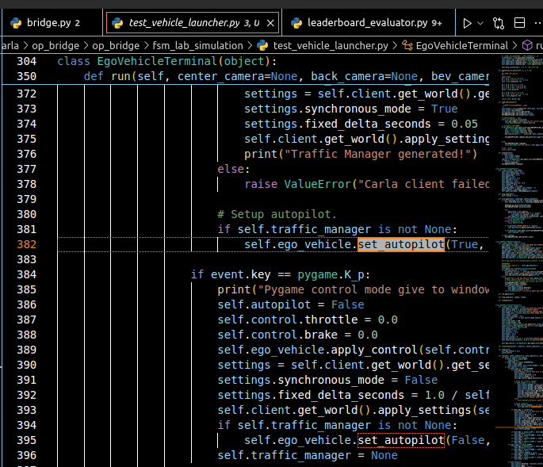

# this is used to record the state of logic of how to Dynamic obstacle avoidance, optimization and overall modeling

1. Summary of current situation

    

    1.定位相关的补充信息如下：
    （1）steamvr追踪器一个置于车辆模型顶部，通过两个基站对其进行追踪，基站位于定位视野上部，无遮挡；
    （2）未测量steamvr的刷新速率，官方文档以查询的方式进行位姿获取，目前的查询频率为30帧/s；
    （3）定位误差为0.01m，但由于通过相似变换矩阵的方式进行了tracker坐标系与车辆的地图坐标系的转换，加上steamvr投影的曲面特性存在0.02-0.04m的位置误差。
    （4）现实车模搭载轻量级imu但数据未使用，虚拟车模搭载lidar、camera、imu等多种传感器，定位时，以steamvr的追踪坐标作为输入融合lidar配准结果定位。
    2.控制系统的补充信息如下：
    （1）autoware的定位系统使用的是pid控制前后速度与mpc控制转向速度；实体车模使用pid控制，转向机构为pwm控制的三线舵机，该层级没有误差反馈机制（定位为运动状态反馈）
    （2）在ubuntu上监控autoware给出的控制指令，借助硬件nrf24L01发送给车模，通过自定义传输协议，32字节包，前11字节有效，包含速度和转动角速度两个关键参数，未进行延迟测量（请给出测量方案），粗估为50ms级别。
    （3）遥控车的转向、加速、制动等执行机构的响应时间未测量（请给出测量方案）。
    （4）控制数据的实时性未测量（请给出测量方案）
    3.状态估计与决策的补充信息如下：
    （1）steamvr的位姿数据通过autoware官方包的ekf算法融合了虚拟环境中获得的lidar信息进行定位，
    （2）车辆基于ackermann模型进行控制（autoware官方包）
    （3）基于autoware默认包进行规划，未进行其他优化
    （4）未测量整体数据处理时延（给出测量方案）

2. Delay measurement/System Testing

    (1) tracker time delay
    use win + steamvr to test the refresh rate of the tracker
     refresh rate of steamvr set by HMD is 90
    need to design

3. Optimization tasks

   (1). Positioning accuracy is stable to 0.01m
        using new Laser rangefinder to get accuracy coordinate
   (2). Delay is controllable or predictable/perceptible
        using win to test (question 2-1)
   (3). Overall mission modeling
   (4). Model reduction
        RC Mosquito Car
   (5). sync step of carla
        set as sync mode and set fixed_delta_seconds as 1.0/30
   (6). traffic controller
        vehilce has two kinds of controllers
     

4. Model Analysis
   Model and analyze the delay and control accuracy of the entire system to obtain a reasonable evaluation of the algorithm stability.
