# 这是一个简化版的操作手册

## 0.概述

在监控屏幕,可以看到以下几个terminal

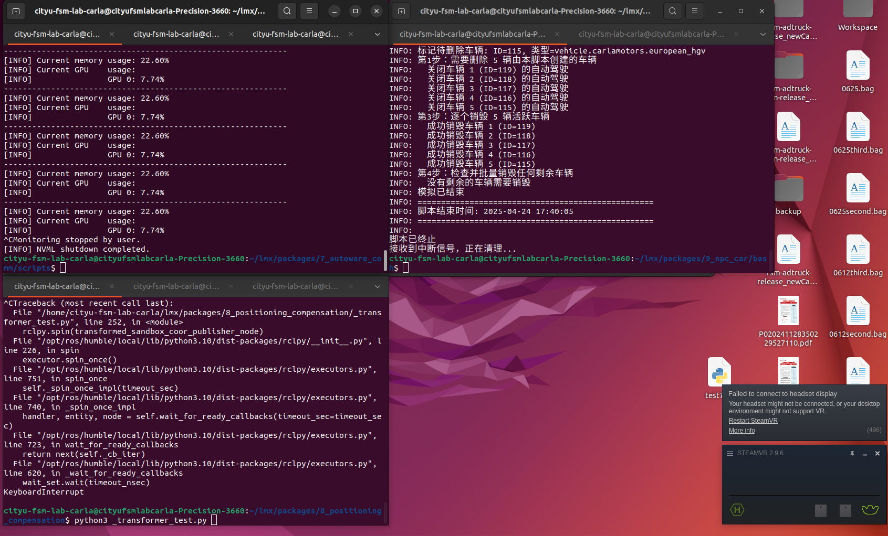

以下是六个主要terminal，每个terminal均处于按下enter即可启动的状态

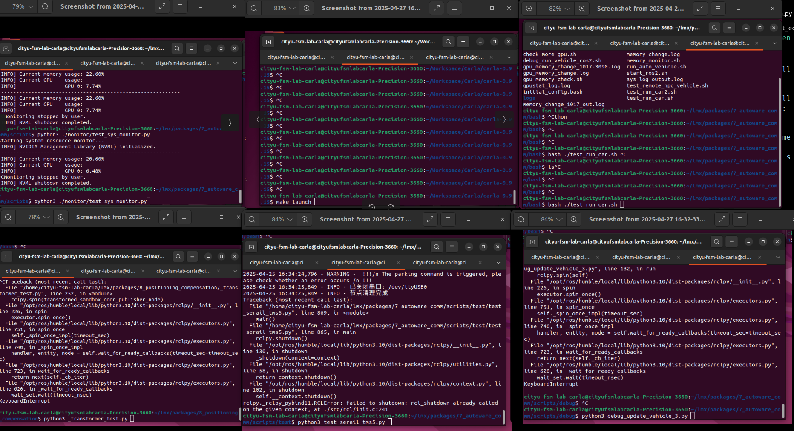

正常启动后的状态如下：

以下是系统启动顺序:

## 1. 启动系统资源监管器

在terminal的第一个tab，按下回车
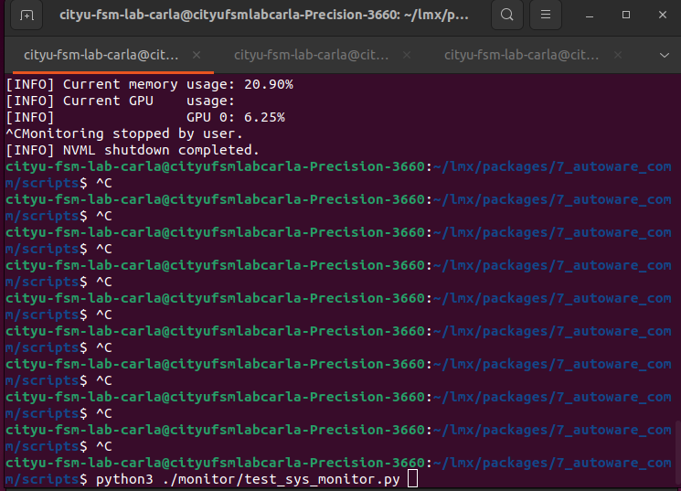
启动后状态如下:
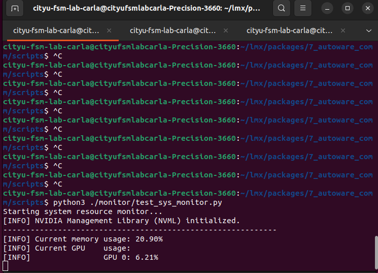

资源监管器可以在carla发生内存泄漏时将其自动强行杀死

## 2. 启动carla并激活模拟器

在左上第一个terminal的第二个tab按下回车，以启动carla
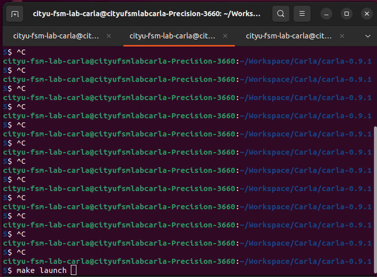
启动carla后的状态如下：
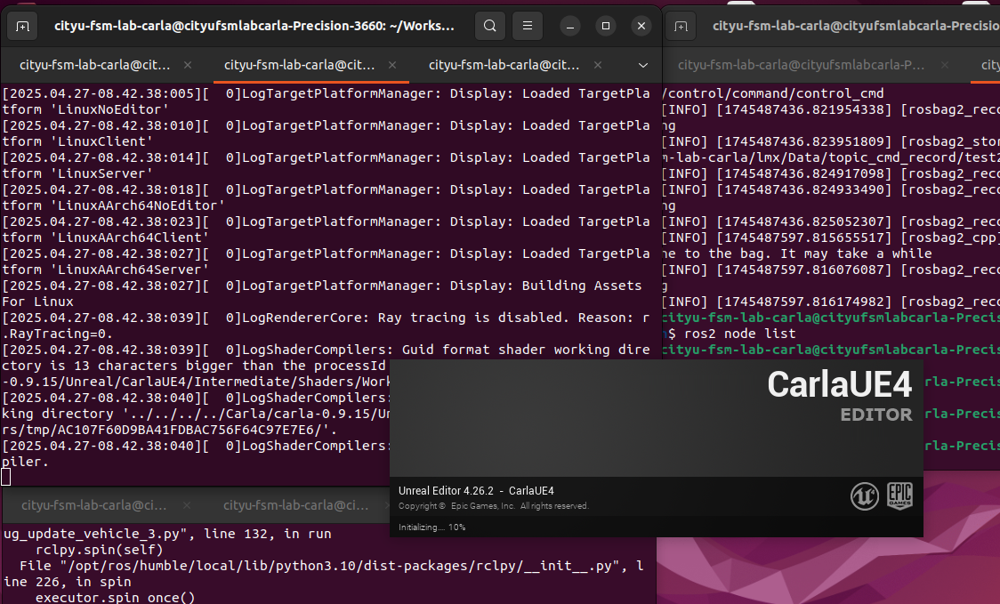
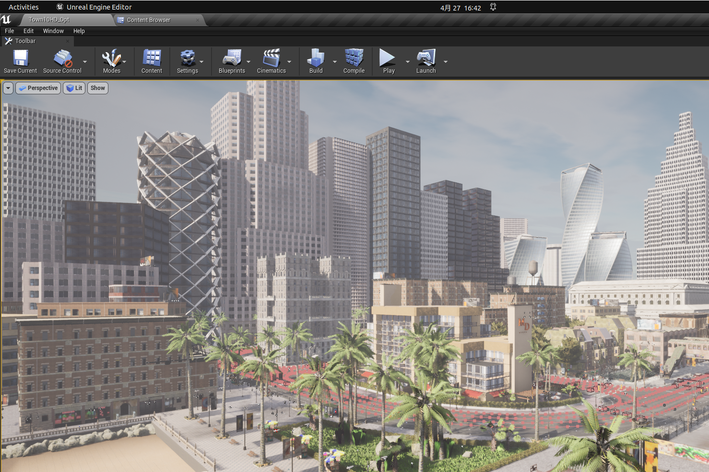
在carla正常启动后，按下屏幕上的三角paly键，等待激活服务器;
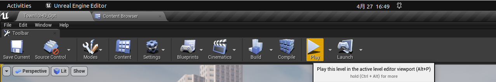
第一次激活需要很久，激活成功后的这次不可以使用（受限于carla的线程机制），需要关闭后二次激活。
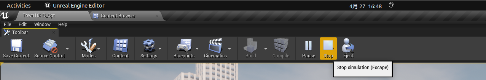

完成第二次激活后，在菜单栏处拖动carla将其移动到右侧屏幕（这样可以避免最小化，导致ubuntu将其进程级别降级）

## 3. 启动模拟

### 3.1 打开定位器

长按tracker中心直至其变绿,此时在屏幕右下角的steamr处应显示三个图表为绿色（可能会二绿一灰，此时移动一下tracker即可）

### 3.2 启动位姿转发

这是启动自动驾驶的关键,在左下这个terminal的第一个tab；按下回车，看到出现一条坐标消息，说明正常启动

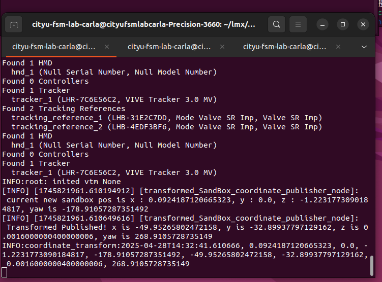

### 3.3 一键启动autoware与监控画面

在左上这个terminal的第三个tab，按下回车，会自动启动autoware，rviz与pygame;

会自动启动如下两个terminal，以启动autoware
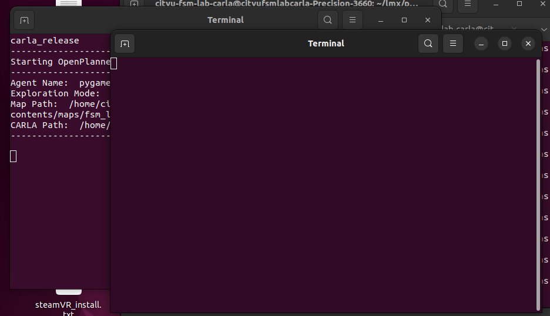

出现pygame窗口，说明小车在carla中初始化成功
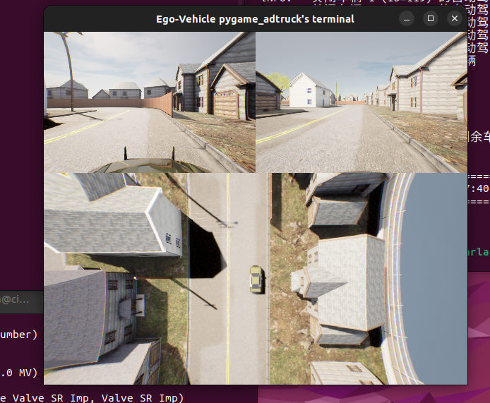

此过程需要等待较长的时间，等待出现如下图所示的状态则说明已经成功启动.
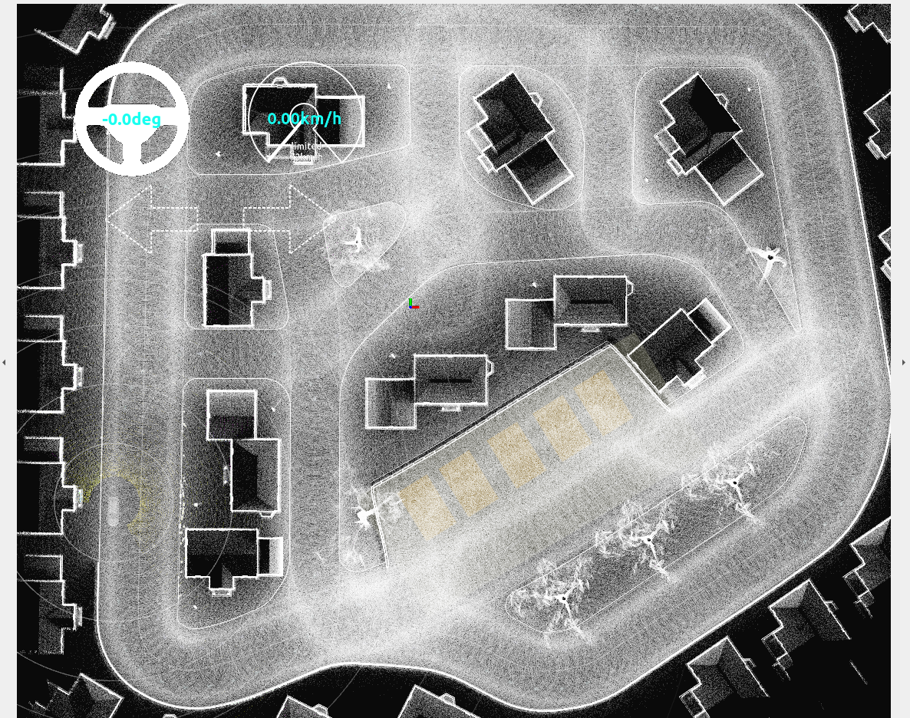

### 3.4 启动rc车

1. 启动rc小车（car上的显示器进入到 fsm autoware界面）
2. 连接cmd转发设备：将usb端口连接到com4口（第一个usb口）
3. 启动转发脚本(左下teminal的第二个tab)并等待成功连接 (rc车会发出di～~ 一声长蜂鸣)
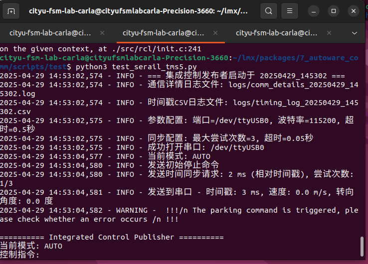
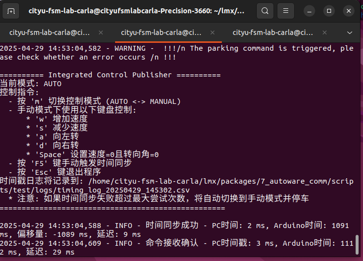

### 3.5 启动帧刷新

左下terminal的第三个tab

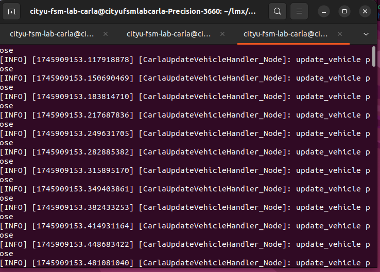

## 完成上述三步，即可成功启动系统

## 4. 一件启动npc仿真

在右上第一个tab按下回车，启动自动臂章测试脚本
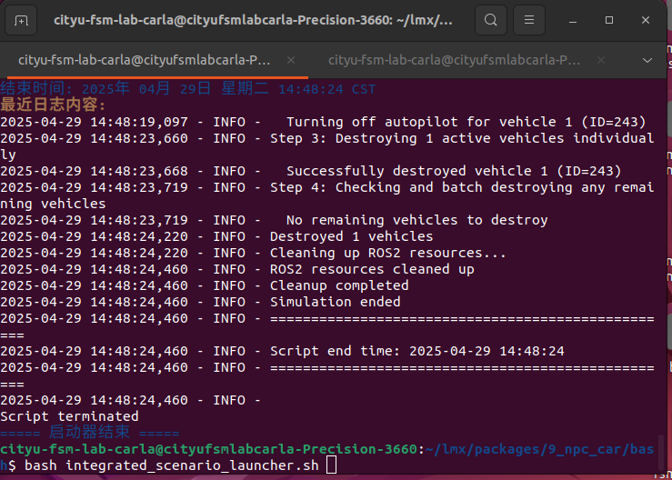
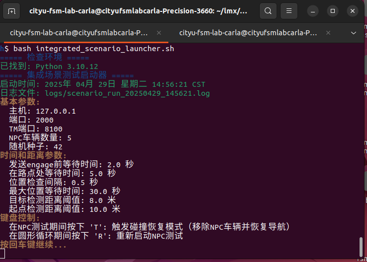
在此脚本中，按下回车即可启动npc_test；当结束npc_test结束后，会开始circle绕外圈循环
