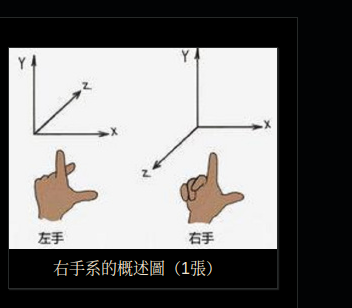
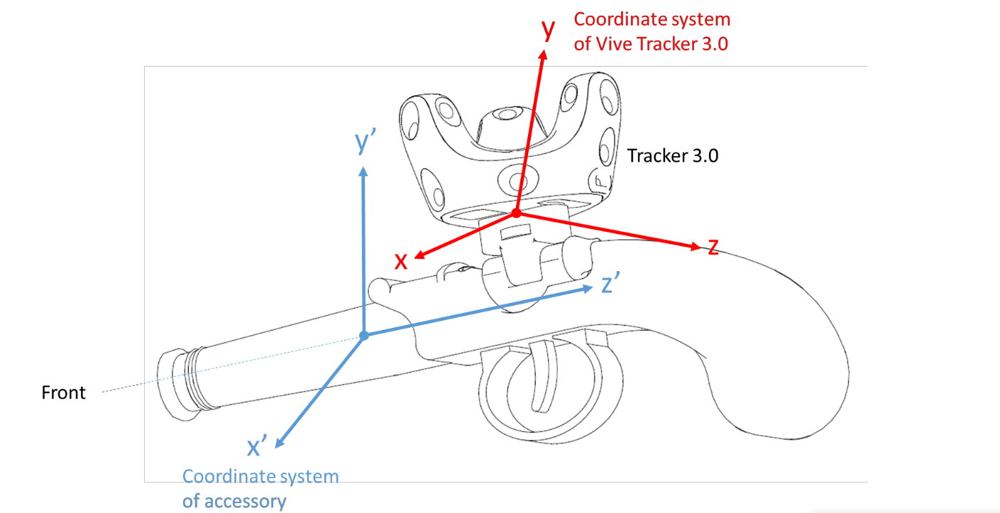

# this is the original version of transform of 3 coordinates

yaw      pitch       row

right-hand


left & right-hand



for vive



the front rotation should be the localrotationZ which means Roll

7 parameters helmert

x,y,z,pitch,roll,yaw,d

the least squares method

its non-linear (because of cos sin)


```python
import numpy as np
from scipy.spatial.transform import Rotation as R


def euler_to_matrix(euler):
    """
    将欧拉角 (roll, pitch, yaw) 转换为旋转矩阵。
    """
    return R.from_euler('xyz', euler).as_matrix()


def matrix_to_euler(matrix):
    """
    将旋转矩阵转换为欧拉角 (roll, pitch, yaw)。
    """
    return R.from_matrix(matrix).as_euler('xyz')


def construct_transformation_matrix(rotation_matrix, translation):
    """
    根据旋转矩阵和平移向量构建变换矩阵。
    """
    T = np.eye(4)
    T[:3, :3] = rotation_matrix
    T[:3, 3] = translation
    return T


def apply_position_transformation(transformation_matrix, points):
    """
    将位置变换矩阵应用于点列表。

    :param transformation_matrix: 4x4 位置变换矩阵
    :param points: 点列表，每个点包含 'position' 和 'orientation' (欧拉角)
    :return: 转换后的点列表
    """
    transformed_points = []
    for point in points:
        # 将位置转换为齐次坐标
        position_homogeneous = np.append(point['position'], 1)
        # 应用变换矩阵
        transformed_position_homogeneous = np.dot(transformation_matrix, position_homogeneous)
        transformed_position = transformed_position_homogeneous[:3]

        transformed_points.append({
            'position': transformed_position,
            'orientation': point['orientation']  # 保持原始的欧拉角
        })
    return transformed_points


def apply_orientation_transformation(rotation_matrix, points):
    """
    将旋转矩阵应用于点列表的欧拉角。

    :param rotation_matrix: 3x3 旋转矩阵
    :param points: 点列表，每个点包含 'position' 和 'orientation' (欧拉角)
    :return: 转换后的点列表
    """
    transformed_points = []
    for point in points:
        # 旋转部分
        R_point = euler_to_matrix(point['orientation'])
        R_transformed = np.dot(rotation_matrix, R_point)
        transformed_orientation = matrix_to_euler(R_transformed)

        transformed_points.append({
            'position': point['position'],  # 保持原始的位置
            'orientation': transformed_orientation
        })
    return transformed_points


# 定义坐标系A(vive )下的点的姿态 (roll, yaw, pitch) 和位置 (x, y, z)
points_A = [
    {'position': [0.488, -1.444, -3.911], 'orientation': [ np.radians(-89.12), np.radians(178.93), np.radians(-144.60)]},
    # 1
    {'position': [0.488, -1.444, -3.911], 'orientation': [np.radians(89.17), np.radians(-2.42), np.radians(-55.83)]},
    # 1'
    {'position': [0.488, -1.444, -3.911], 'orientation': [np.radians(89.26), np.radians(-0.91), np.radians(33.41)]},
    # 1
    {'position': [0.488, -1.444, -3.911], 'orientation': [np.radians(-88.21), np.radians(177.42), np.radians(125.21)]},
    # 1
    {'position': [0.0995, -1.426, -3.322], 'orientation': [np.radians(-89.23), np.radians(178.91), np.radians(-146.53)]},
    # 2'
    {'position': [-1.431,-1.396,-2.982], 'orientation': [ np.radians(-89.47), np.radians(179.01), np.radians(-147.25)]},
    # 3
    {'position': [-1.835, -1.391, -3.247], 'orientation': [np.radians(-88.50), np.radians(179.74), np.radians(-143.67)]},
    # 4
    {'position': [-1.835, -1.391, -3.247], 'orientation': [np.radians(88.54), np.radians(-2.36), np.radians(-57.01) ]},
    # 4
    {'position': [-1.835, -1.391, -3.247], 'orientation': [np.radians(89.37), np.radians(-0.52), np.radians(33.16)]},
    # 4
    {'position': [-1.835, -1.391, -3.247], 'orientation': [np.radians(-88.84), np.radians(178.15), np.radians(123.45)]},
    # 4
    {'position': [-0.534, -1.399, -2.382], 'orientation': [np.radians(-88.29), np.radians(179.32), np.radians(-145.39)]},
    # 5
    {'position': [-1.426, -1.363, -1.053], 'orientation': [np.radians(-88.29),np.radians(-179.78), np.radians(-138.69)]},
    # 6'
    {'position': [-1.547, -1.354, -0.883], 'orientation': [np.radians(-88.09), np.radians(-179.89), np.radians(-143.52)]},
    # 7''
    {'position': [0.856, -1.416, -1.45], 'orientation': [np.radians(-88.07), np.radians(179.67), np.radians(-147.85)]},
    # 8'''
    {'position': [0.856, -1.416, -1.45], 'orientation': [np.radians(88.67), np.radians(-2.16), np.radians(-55.84)]},
    # 8
    {'position': [0.856, -1.416, -1.45], 'orientation': [np.radians(88.34), np.radians(-0.17), np.radians(33.04)]},
    # 8'
    {'position': [0.856, -1.416, -1.45], 'orientation': [np.radians(-87.15), np.radians(176.23), np.radians(124.54) ]},
    # 8
]

'''
# 定义坐标系B下的对应点的姿态 (roll, yaw, pitch) 和位置 (x, y, z)
points_B = [
    {'position': [0.455, -0.755, 0], 'orientation': [np.radians(0), np.radians(0), np.radians(0)]},         # 1
    {'position': [0.455, -0.755, 0], 'orientation': [np.radians(180), np.radians(0), np.radians(0)]},       # 1`
    {'position': [1.738, -0.283, 0], 'orientation': [np.radians(0), np.radians(0), np.radians(0)]},         # 2
    {'position': [3.198, -0.532, 0], 'orientation': [np.radians(90), np.radians(0), np.radians(0)]},        # 3
    {'position': [3.198, -0.532, 0], 'orientation': [-np.radians(90), np.radians(0), np.radians(0)]},       # 3`
    {'position': [1.335, -0.966, 0], 'orientation': [np.radians(0), np.radians(0), np.radians(0)]},         # 4
    {'position': [2.336, -0.68, 0], 'orientation': [np.radians(0), np.radians(0), np.radians(0)]},          # 5
    {'position': [2.960, -1.11, 0], 'orientation': [np.radians(0), np.radians(0), np.radians(0)]},          # 6
    {'position': [0.935, -1.725, 0], 'orientation': [np.radians(0), np.radians(0), np.radians(0)]},         # 7
    {'position': [0.467, -2.47, 0], 'orientation': [np.radians(0), np.radians(0), np.radians(0)]},          # 8
    {'position': [1.425, -2.426, 0], 'orientation': [np.radians(0), np.radians(0), np.radians(0)]},         # 9
    {'position': [1.425, -2.426, 0], 'orientation': [np.radians(90), np.radians(0), np.radians(0)]},        # 9`
    {'position': [1.425, -2.426, 0], 'orientation': [np.radians(180), np.radians(0), np.radians(0)]},       # 9``
    {'position': [1.425, -2.426, 0], 'orientation': [-np.radians(90), np.radians(0), np.radians(0)]},       # 9```
    {'position': [0.471, -3.175, 0], 'orientation': [np.radians(90), np.radians(0), np.radians(0)]},        # 10
    {'position': [0.471, -3.175, 0], 'orientation': [-np.radians(90), np.radians(0), np.radians(0)]},       # 10`
    {'position': [1.380, -3.461, 0], 'orientation': [np.radians(0), np.radians(0), np.radians(0)]},         # 11
    {'position': [2.238, -2.927, 0], 'orientation': [np.radians(0), np.radians(0), np.radians(0)]},         # 12
    {'position': [2.805, -3.299, 0], 'orientation': [np.radians(0), np.radians(0), np.radians(0)]},         # 13
    {'position': [2.805, -3.299, 0], 'orientation': [np.radians(180), np.radians(0), np.radians(0)]},       # 13`
]

# 定义坐标系B(Sandbox)下的对应点的姿态 (roll, yaw, pitch) 和位置 (x, y, z)
'''
points_B = [
    {'position': [0.217, -2.05, 0], 'orientation': [np.radians(0), np.radians(0), np.radians(0)]},        # 1        0
    {'position': [0.217, -2.05, 0], 'orientation': [np.radians(0), np.radians(90), np.radians(0)]},       # 1`       1
    {'position': [0.217, -2.05, 0], 'orientation': [np.radians(0), np.radians(180), np.radians(0)]},      # 1``      2
    {'position': [0.217, -2.05, 0], 'orientation': [np.radians(0), np.radians(270), np.radians(0)]},      # 1 ```    3
    {'position': [0.92, -2.05, 0], 'orientation': [np.radians(0), np.radians(0), np.radians(0)]},               # 2`       4
    {'position': [2.05, -0.97, 0], 'orientation': [np.radians(0), np.radians(0), np.radians(0)]},               # 3        5
    {'position': [2.05, -0.49, 0], 'orientation': [np.radians(0), np.radians(0), np.radians(0)]},               # 4        6
    {'position': [2.05, -0.49, 0], 'orientation': [np.radians(0), np.radians(90), np.radians(0)]},              # 4`       7
    {'position': [2.05, -0.49, 0], 'orientation': [np.radians(0), np.radians(180), np.radians(0)]},             # 4``      8
    {'position': [2.05, -0.49, 0], 'orientation': [np.radians(0), np.radians(270), np.radians(0)]},             # 4```     9
    {'position': [2.05, -2.05, 0], 'orientation': [np.radians(0), np.radians(0), np.radians(0)]},               # 5        10
    {'position': [3.648, -2.05, 0], 'orientation': [np.radians(0), np.radians(0), np.radians(0)]},        # 6        11
    {'position': [3.858, -2.05, 0], 'orientation': [np.radians(0), np.radians(0), np.radians(0)]},        # 7        12
    {'position': [2.05, -3.72, 0], 'orientation': [np.radians(0), np.radians(0), np.radians(0)]},               # 8        13
    {'position': [2.05, -3.72, 0], 'orientation': [np.radians(0), np.radians(90), np.radians(0)]},              # 8`       14
    {'position': [2.05, -3.72, 0], 'orientation': [np.radians(0), np.radians(180), np.radians(0)]},             # 8``      15
    {'position': [2.05, -3.72, 0], 'orientation': [np.radians(0), np.radians(270), np.radians(0)]},             # 8```     16
]


def switch_right_to_left(points):
    return [{'position': point['position'], 'orientation': np.array(point['orientation']) * np.array([-1, -1, 1])} for
            point in points]


# left_points_A = switch_right_to_left(points_A)
# print(left_points_A)
# print("\n")
# print(points_A)

def switch_hand(points):
    return [{'position': np.array(point['position']) * np.array([1, -1, 1]), 'orientation': point['orientation']} for
            point in points]


# points_B = switch_hand(points_B)

# 提取位置
positions_A = np.array([point['position'] for point in points_A])
positions_B = np.array([point['position'] for point in points_B])

# 计算位置变换矩阵
centroid_A = np.mean(positions_A, axis=0)
centroid_B = np.mean(positions_B, axis=0)
H = np.dot((positions_A - centroid_A).T, (positions_B - centroid_B))
U, S, Vt = np.linalg.svd(H)
R_pos = np.dot(Vt.T, U.T)
if np.linalg.det(R_pos) < 0:
    Vt[-1, :] *= -1
    R_pos = np.dot(Vt.T, U.T)
translation = centroid_B.T - np.dot(R_pos, centroid_A.T)
T_pos = construct_transformation_matrix(R_pos, translation)

print("位置变换矩阵:")
print(T_pos)

# 提取方向
orientations_A = np.array([point['orientation'] for point in points_A])
orientations_B = np.array([point['orientation'] for point in points_B])

import numpy as np
from scipy.spatial.transform import Rotation as R


def euler_to_quaternion(euler):
    """
    将欧拉角 (roll, pitch, yaw) 转换为四元数。
    """
    return R.from_euler('xyz', euler).as_quat()


def quaternion_to_euler(quaternion):
    """
    将四元数转换为欧拉角 (roll, pitch, yaw)。
    """
    return R.from_quat(quaternion).as_euler('xyz')


def quaternion_mean(quaternions):
    """
    计算四元数的平均值。
    """
    A = np.zeros((4, 4))
    for q in quaternions:
        A += np.outer(q, q)
    A /= len(quaternions)
    eigenvalues, eigenvectors = np.linalg.eigh(A)
    return eigenvectors[:, np.argmax(eigenvalues)]


def calculate_orientation_transformation(orientations_A, orientations_B):
    """
    计算方向变换矩阵，使用四元数表示旋转。
    """
    Q_A = [euler_to_quaternion(orientation) for orientation in orientations_A]
    Q_B = [euler_to_quaternion(orientation) for orientation in orientations_B]

    Q_diff = [R.from_quat(Q_B[i]) * R.from_quat(Q_A[i]).inv() for i in range(len(Q_A))]
    Q_diff_quats = [q.as_quat() for q in Q_diff]

    mean_Q_diff = quaternion_mean(Q_diff_quats)
    mean_R_diff = R.from_quat(mean_Q_diff).as_matrix()

    return mean_R_diff


# 计算方向变换矩阵
R_euler = calculate_orientation_transformation(orientations_A, orientations_B)

print("方向变换矩阵:")
print(R_euler)

# 应用位置变换
transformed_positions_B = apply_position_transformation(T_pos, points_A)

# 应用方向变换
transformed_orientations_B = apply_orientation_transformation(R_euler, transformed_positions_B)

# 验证转换结果
print("验证转换结果:")
for i, point in enumerate(transformed_orientations_B):
    print(f"点 {i} 在坐标系B中的实际位置: {points_B[i]['position']}")
    print(f"点 {i} 在坐标系B中的转换位置: {point['position']}")
    print(f"点 {i} 在坐标系B中的实际欧拉角: {points_B[i]['orientation']}")
    print(f"点 {i} 在坐标系B中的转换欧拉角: {point['orientation']}")
    print()

```

``` java

public class Accessory: MonoBehaviour 
{
    const Vector3 AxisY_Tracker = new Vectors(AxisY_Tracker_X,AxisY_Tracker_Y, AxisY_Tracker_Z);
    const Vector3 AxisZ_Tracker = new Vectors(AxisZ_Tracker_X,AxisZ_Tracker_Y, AxisZ_Tracker_Z);
    const Vector3 AxisY_Accessory = new Vectors(AxisY_Accessory_X, AxisY_Accessory_Y, AxisY_Accessory_Z);
    const Vector3 AxisZ_Accessory = new Vectors(AxisZ_Accessory_X, AxisZ_Accessory_Y, AxisZ_Accessory_Z);
    void Update () 
    {

        //Calculate delta rotation by comparing vectors parallel to Y axes of Tracker and the accessory
        Quaternion delta_rotY = Quaternion.FromToRotation(AxisY_Tracker,AxisY_Accessory);

        AxisZ_Tracker = delta_rotY * AxisZ_Tracker;

        Quaternion delta_rotZ = Quaternion.FromToRotation(AxisZ_Tracker,AxisZ_Accessory);

        //Collect delta rotation and displacement between Tracker and Accessory

        Vector3 delta_displacement = new Vector3(dX, dY, dZ);

        Quaternion delta_rotation = delta_rotZ * delta_rotY;

        //Get current Tracker pose
        Vector3 tracker_position = SteamVR_Controller.Input(3).transform.pos;

        Quaternion tracker_rotation = SteamVR_Controller.Input(3).transform.rot;

        //Transform current Tracker pose to Accessory pose

        GameObject.Find("Accessory").transform.rotation = delta_rotation * tracker_rotation;
        GameObject.Find("Accessory").transform.position = tracker_position + (delta_rotation * tracker_rotation) * delta_displacement;
    }
}

```
